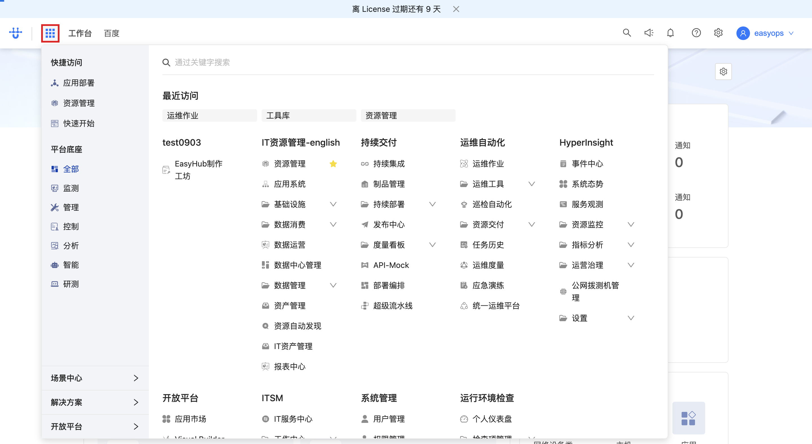
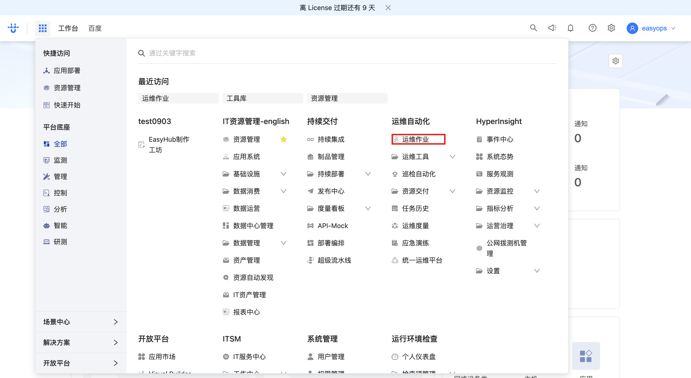
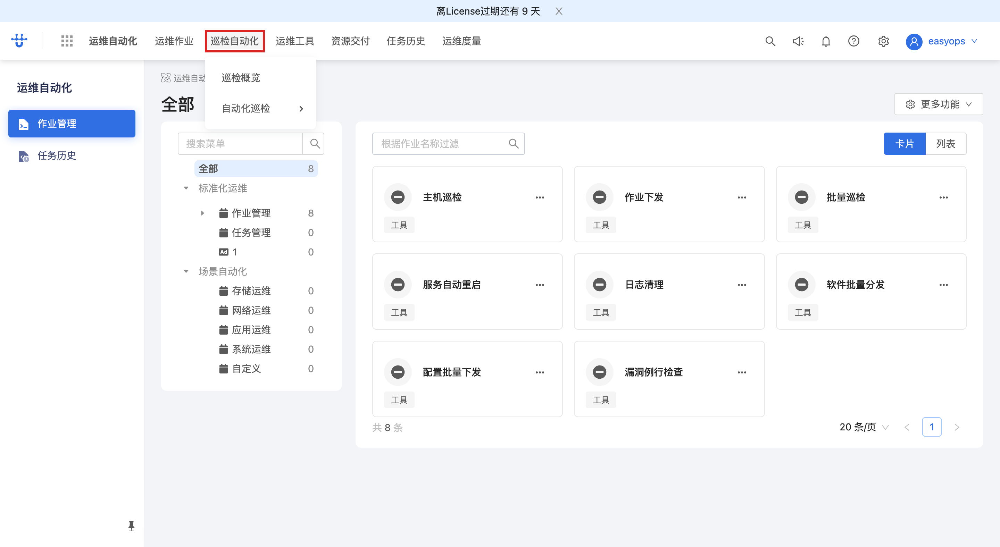
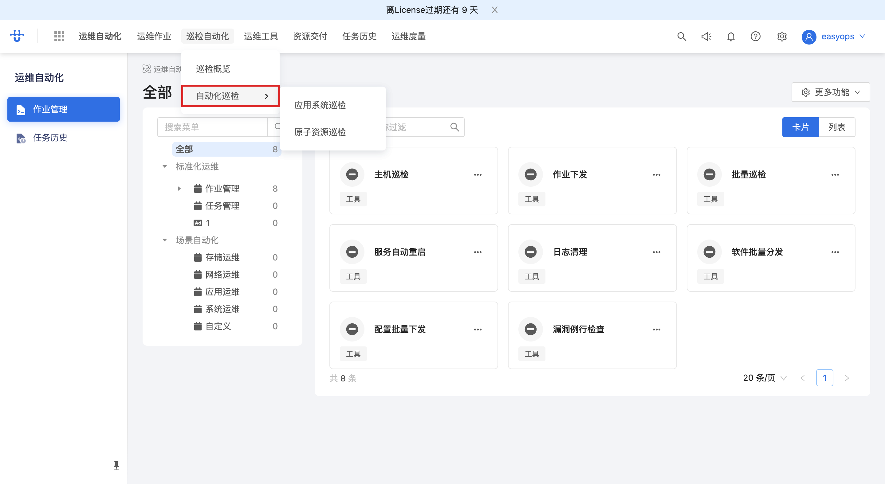
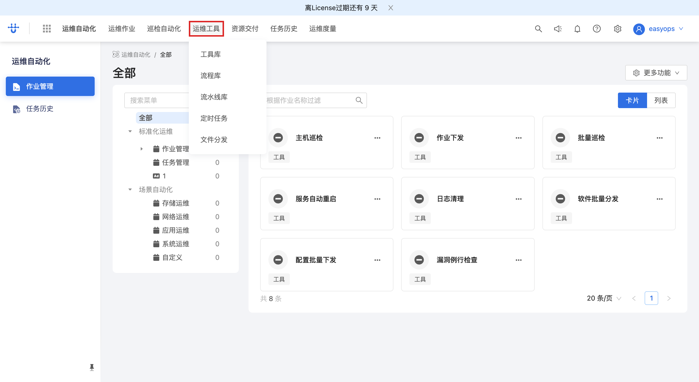
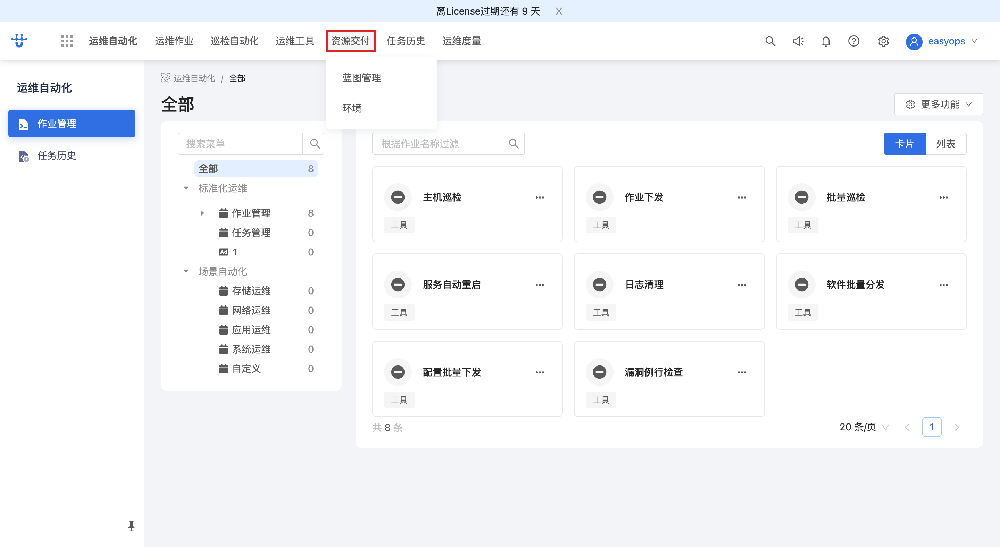
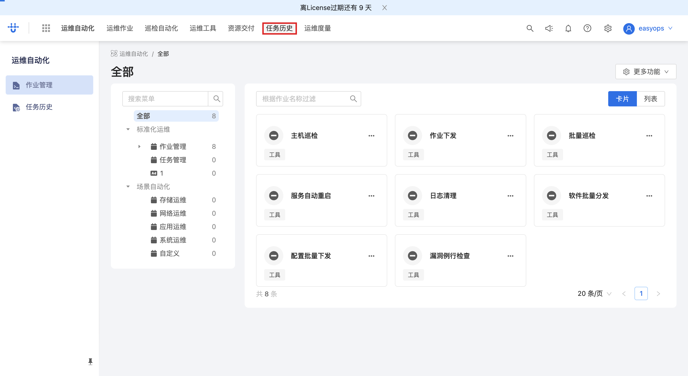
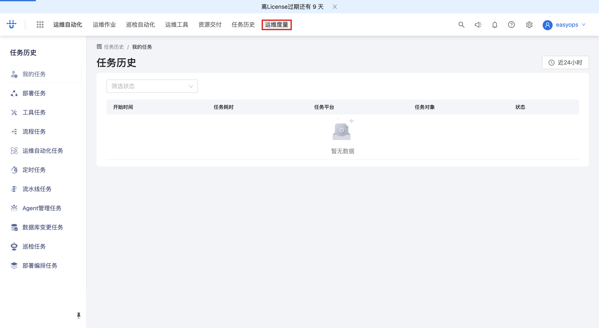
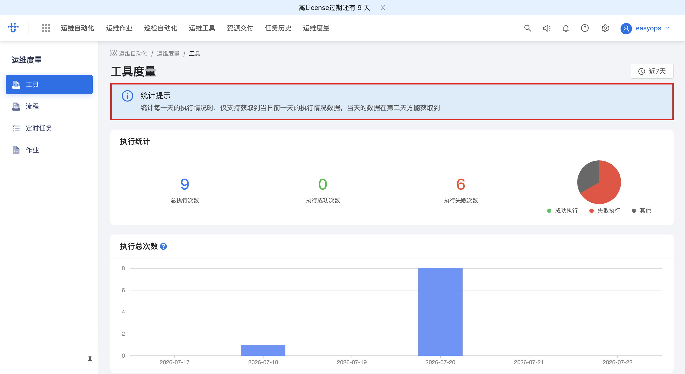

# AutoOps 入口与功能预览 — 操作指引

> 适用场景：从 EasyOps 门户进入 AutoOps（运维自动化）工作台，预览其主要功能菜单（巡检自动化/自动化巡检/运维工具/资源交付/任务历史），并查看任务历史与运维度量。
> 配套接口见同目录 [`AutoOps-入口与功能预览-openapi.yaml`](./AutoOps-入口与功能预览-openapi.yaml)

## 目录

- [一、从门户进入 AutoOps](#一从门户进入-autoops)
- [二、功能菜单预览](#二功能菜单预览)
- [三、任务历史与运维度量](#三任务历史与运维度量)
- [附：本流程接口速查](#附本流程接口速查)

<!-- deep-links: 本流程关键页面直达(SPA 路径,去掉 host 前缀,参数化)
  门户:           portal
  AutoOps菜单:    ops-automation/menu/all
  我的任务:       task-history/my_task
  度量工具:       ops-automation/measurement/tool
-->

---

## 一、从门户进入 AutoOps

### 步骤 1：门户首页找到 AutoOps 入口

登录后在门户首页（`/next/portal`），在应用卡片网格中找到 **AutoOps / 运维自动化** 入口。

<!-- url: portal | step_id: 1 -->

### 步骤 2：点击进入 AutoOps

点击 AutoOps 卡片，进入运维自动化工作台。页面加载时拉取 AutoOps 菜单、作业分类与作业清单。

<!-- url: portal | api: GET /next/api/gateway/ops_automation.menu.ListMenus/api/ops_automation/v1/menus | tag: AutoOps 菜单与作业 | step_id: 2 -->

> 🔗 本步调用：GET `.../ops_automation.menu.ListMenus/.../menus`（菜单）、GET `.../ops_automation.jobs.ListJobs/.../jobs`（作业）、GET `.../ops_automation.jobs.GetJobCategories/.../jobCategories`（作业分类）、GET `.../logic.ops_automation/api/ops_automation/v1/job_all`（全部作业）

---

## 二、功能菜单预览

进入 AutoOps 菜单总览页（`/next/ops-automation/menu/all`），按功能分组列出所有入口。依次点击预览各功能。

### 步骤 1：巡检自动化

点击 **「巡检自动化」** 菜单项，预览巡检类任务入口。

<!-- url: ops-automation/menu/all | step_id: 3 -->

### 步骤 2：自动化巡检

点击 **「自动化巡检」** 菜单项。

<!-- step_id: 4 -->

### 步骤 3：运维工具

点击 **「运维工具」** 菜单项，预览运维工具类任务。

<!-- step_id: 5 -->

### 步骤 4：资源交付

点击 **「资源交付」** 菜单项。

<!-- step_id: 6 -->

### 步骤 5：任务历史

点击 **「任务历史」** 菜单项，进入任务历史页（见第三节）。

<!-- step_id: 7 -->

> 🔗 本步调用：GET `.../logic.notify/operation/log`（任务执行历史日志）

---

## 三、任务历史与运维度量

### 步骤 1：查看我的任务

进入任务历史页（`/next/task-history/my_task`），查看 **「我的任务」**（按类型分为部署任务 / 工具任务 / 流程任务）。页面顶部可继续进入运维度量。

<!-- url: task-history/my_task | step_id: 8 -->

### 步骤 2：运维度量

点击 **「运维度量」** 进入度量工具页（`/next/ops-automation/measurement/tool`），查看任务执行统计（按天聚合的执行总次数等）。页面调用 OLAP 数据查询接口拉取度量数据。

💡 顶部有统计提示：「统计每一天的执行情况时，仅支持获取到当日前…」。

<!-- url: ops-automation/measurement/tool | api: POST /next/api/gateway/logic.data_exchange/api/v2/data_exchange/olap | tag: 运维度量 | step_id: 9 -->

> 🔗 本步调用：POST `.../logic.data_exchange/api/v2/data_exchange/olap`（body 含 `model`/`dims`/`metrics`，查询 `easyops.TASK_COLLECTOR_METRIC@EASYOPS` 等度量模型）

---

## 附：本流程接口速查

| tag | 方法 | 路径(简) | 用途 | 步骤 |
| --- | --- | --- | --- | --- |
| AutoOps 菜单与作业 | GET | `.../ops_automation.menu.ListMenus/.../menus` | AutoOps 菜单 | 一-2 |
| AutoOps 菜单与作业 | GET | `.../ops_automation.jobs.ListJobs/.../jobs` | 作业列表 | 一-2 |
| AutoOps 菜单与作业 | GET | `.../ops_automation.jobs.GetJobCategories/.../jobCategories` | 作业分类 | 一-2 |
| AutoOps 菜单与作业 | GET | `.../logic.ops_automation/api/ops_automation/v1/job_all` | 全部作业 | 一-2 |
| 任务历史 | GET | `.../logic.notify/operation/log` | 任务执行历史日志 | 二-5 |
| 运维度量 | POST | `.../logic.data_exchange/api/v2/data_exchange/olap` | OLAP 度量查询 | 三-2 |
