# AutoOps 工具库管理 — 操作指引

> 适用场景：在 EasyOps AutoOps 中管理「工具库」（运维工具/脚本）的全生命周期——列表查询、全局配置、新建/编辑/调试/执行工具、导入导出、版本与审批、删除，以及任务历史查看。
> 配套接口见同目录 [`AutoOps-工具库管理-openapi.yaml`](./AutoOps-工具库管理-openapi.yaml)

## 目录

- [一、进入工具库](#一进入工具库)
- [二、工具列表与筛选](#二工具列表与筛选)
- [三、全局配置 — 基础设置](#三全局配置--基础设置)
- [四、全局配置 — 高危命令](#四全局配置--高危命令)
- [五、全局配置 — 执行时间窗口](#五全局配置--执行时间窗口)
- [六、新建工具](#六新建工具)
- [七、执行工具](#七执行工具)
- [八、编辑 / 审批 / 导出](#八编辑--审批--导出)
- [九、导入工具](#九导入工具)
- [十、版本管理与删除](#十版本管理与删除)
- [十一、任务历史](#十一任务历史)
- [附：本流程接口速查](#附本流程接口速查)

<!-- deep-links: 本流程关键页面直达(SPA 路径,去掉 host 前缀,参数化)
  工具列表:      tool/management
  全局配置-基础: tool/management/globalConfig/basicSetting
  全局配置-高危: tool/management/globalConfig/highRiskSetting
  全局配置-窗口: tool/management/globalConfig/executionTime
  新建工具:      tool/management/create
  工具详情:      tool/management/{toolId}/detail
  执行工具:      tool/management/execute/instance/{toolId}
  编辑工具:      tool/management/{toolId}/edit
  导入工具:      tool/management/import
  工具版本:      tool/management/{toolId}/versions
  任务历史:      tool/task
  任务详情:      tool/task/{taskId}
-->

---

## 一、进入工具库

### 步骤 1：从 AutoOps 菜单进入工具库

在 AutoOps 菜单总览页（`/next/ops-automation/menu/all`），点击 **「工具库」** 入口。

<!-- url: ops-automation/menu/all | step_id: 5 -->
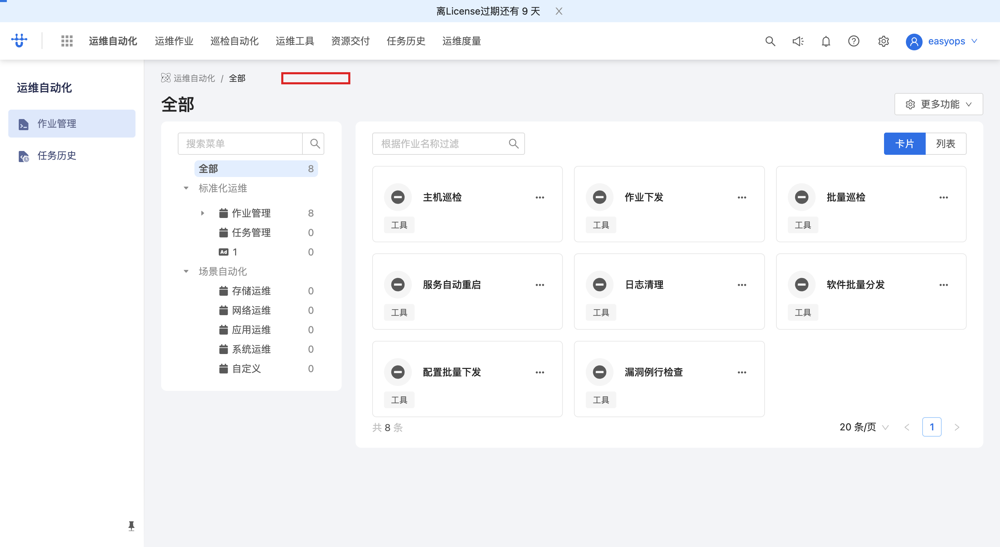

### 步骤 2：查看工具列表

进入工具库管理页（`/next/tool/management`），默认卡片视图展示所有工具，左侧/顶部有分类（默认、ITSM 等）与搜索框。

<!-- url: tool/management | api: GET /next/api/gateway/tool.basic.ListTool/tools | tag: 工具列表与详情 | step_id: 6 -->
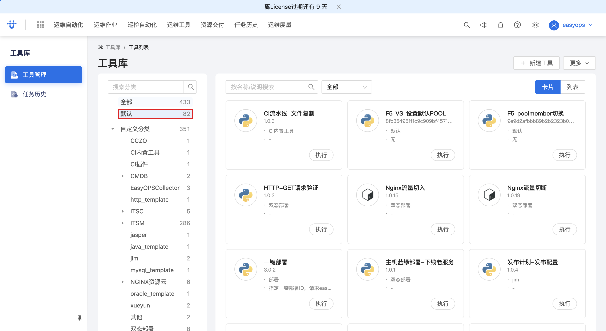

> 🔗 本步调用：GET `.../tool.basic.ListTool/tools`（`page`/`pageSize` 分页，返回 `list` + `total`）

---

## 二、工具列表与筛选

### 步骤 1：按名称搜索

在搜索框输入关键字（如 `itsm`、`表单`），实时过滤工具列表。

⚠️ 文本输入过程不单独截图，下图是搜索结果态。

<!-- api: GET /next/api/gateway/tool.basic.ListTool/tools?name=xxx | tag: 工具列表与详情 | step_id: 9 -->
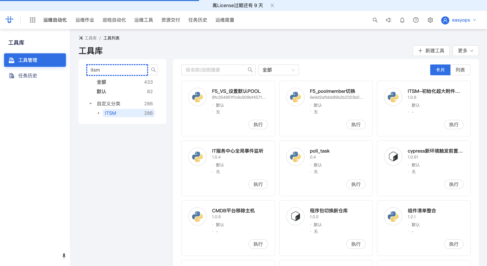

### 步骤 2：按分类筛选

点击分类标签（如 **全部** / ITSM / 默认）筛选对应分类的工具。

<!-- api: GET /next/api/gateway/tool.basic.ListTool/tools?category=xxx | tag: 工具列表与详情 | step_id: 13 -->
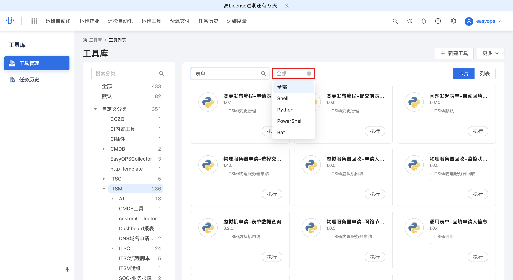

### 步骤 3：按脚本类型筛选

也可按脚本类型筛选（如 **Python**），查看特定语言编写的工具。

<!-- api: GET /next/api/gateway/tool.basic.ListTool/tools | tag: 工具列表与详情 | step_id: 14 -->
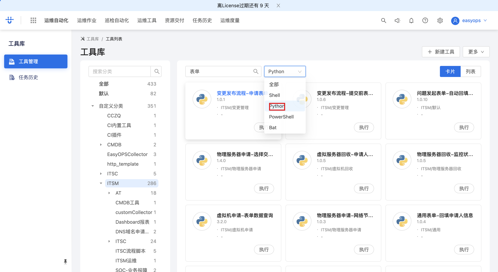

💡 列表右上角 **「更多」→「全局配置」** 可进入全局配置（见第三~五节）。

---

## 三、全局配置 — 基础设置

进入全局配置-基础设置页（`globalConfig/basicSetting`），配置各脚本类型的默认执行用户、执行超时时间等。支持 **Shell / Python / PowerShell / Bat** 多种脚本类型，分别配置。

### 步骤 1：打开基础设置

点击 **「工具配置信息」** 展开，可见默认执行用户、执行超时时间等字段。

<!-- url: globalConfig/basicSetting | step_id: 17 -->
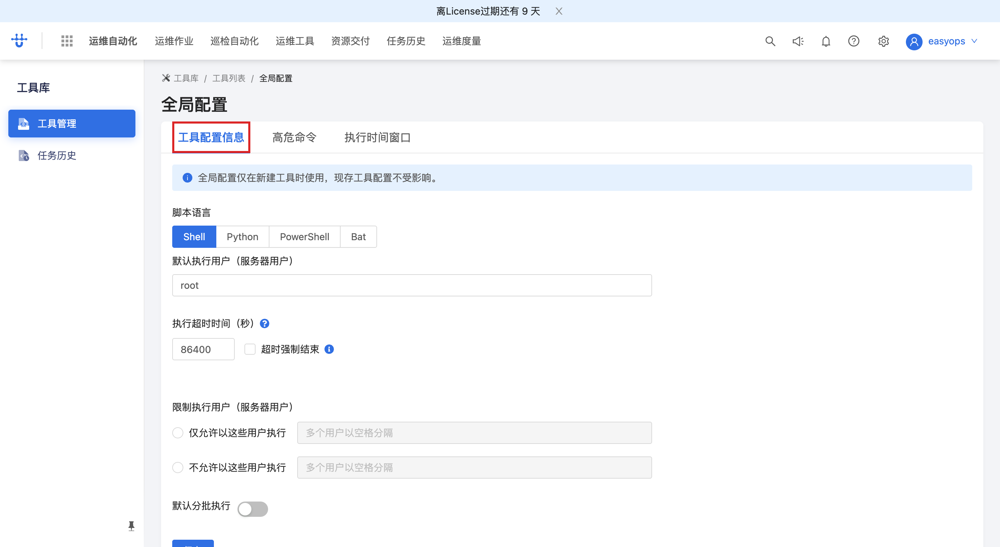

### 步骤 2：修改配置并保存

修改默认执行用户、超时时间等，切换开关后点击 **「保存」**，系统更新工具全局配置实例。

<!-- api: PUT /next/api/gateway/cmdb.instance.UpdateInstance/object/_TOOLS_CONFIG_GLOBAL/instance/{id} | tag: 工具全局配置 | step_id: 24 -->
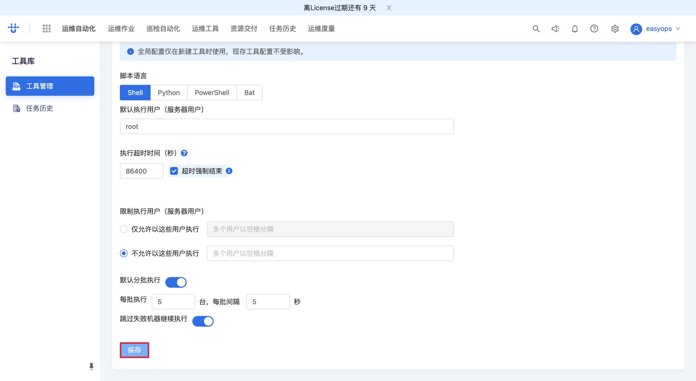

> 🔗 本步调用：PUT `.../cmdb.instance.UpdateInstance/object/_TOOLS_CONFIG_GLOBAL/instance/{id}`（每种脚本类型各一次）

### 步骤 3：切换脚本类型配置

点击 **Python / PowerShell / Bat** 标签切换脚本类型，分别保存各自配置。

<!-- step_id: 26 -->
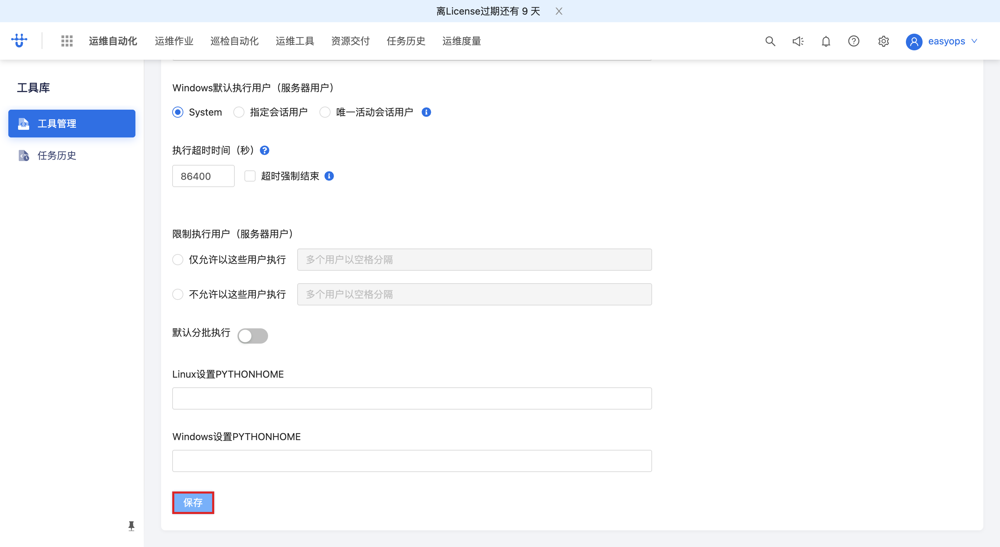

---

## 四、全局配置 — 高危命令

进入高危命令设置页（`globalConfig/highRiskSetting`），配置高危命令识别规则（执行高危命令时拦截/告警）。

### 步骤 1：新建高危命令

点击 **「新建」**，添加高危命令识别规则。

<!-- url: globalConfig/highRiskSetting | step_id: 32 -->
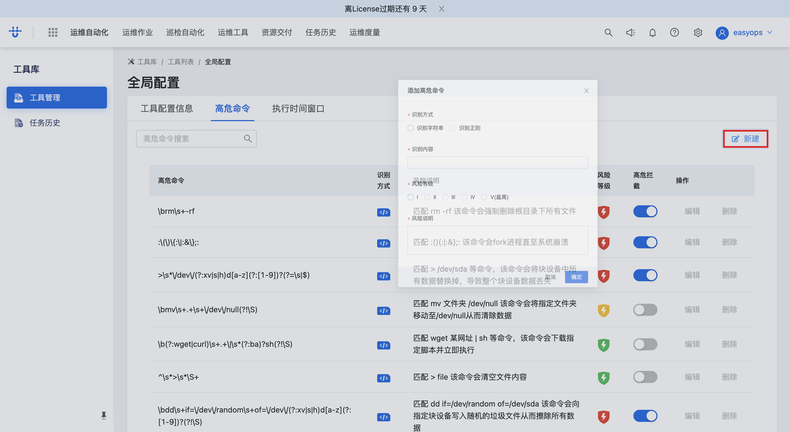

### 步骤 2：填写识别规则

填写 **识别字符串 / 识别正则**（如 `rm\s+-rf`）与说明（如 `彻底删除`），选择识别方式。

⚠️ 文本输入过程不单独截图，下图是填写完成态。

<!-- step_id: 48 -->
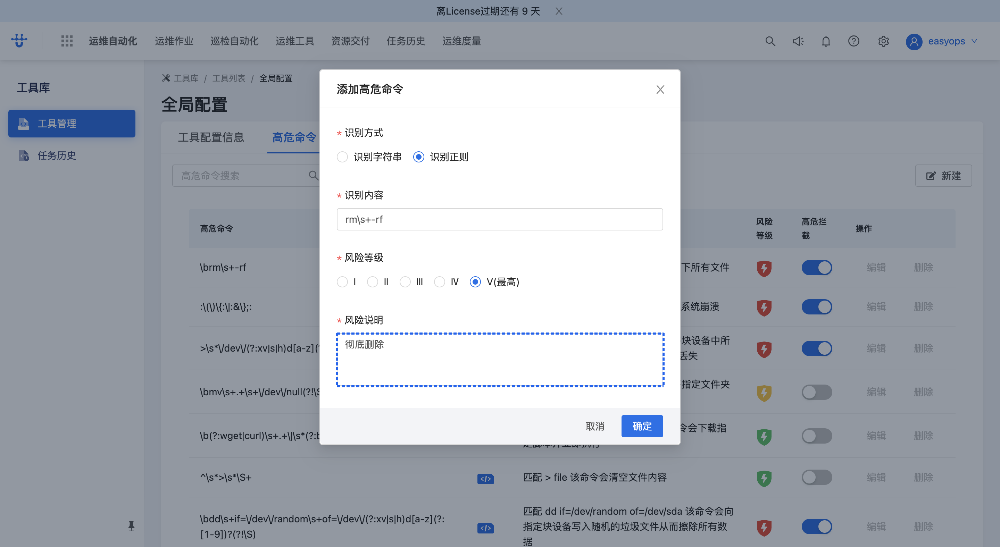

### 步骤 3：确定保存

点击 **「确定」**，系统创建高危命令实例。

<!-- api: POST /next/api/gateway/cmdb.instance.CreateInstance/v2/object/_TOOL_HIGH_RISK_COMMAND@EASYOPS | tag: 高危命令管理 | step_id: 50 -->
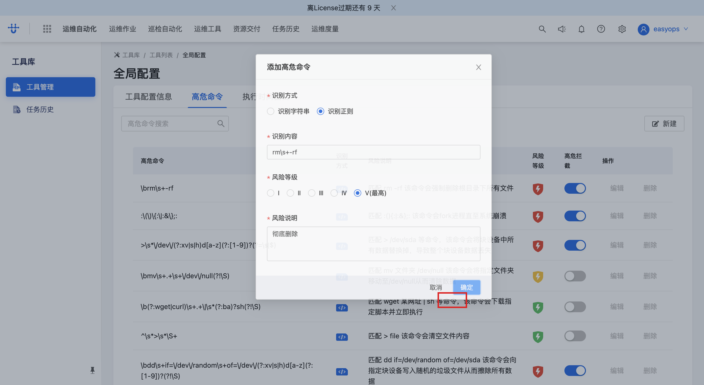

> 🔗 本步调用：POST `.../cmdb.instance.CreateInstance/v2/object/_TOOL_HIGH_RISK_COMMAND@EASYOPS`

---

## 五、全局配置 — 执行时间窗口

进入执行时间窗口页（`globalConfig/executionTime`），配置工具允许执行的时间段。

### 步骤 1：添加执行时间窗口

点击 **「添加执行时间窗口」**，选择起止时间（如 08:00 起）。

<!-- url: globalConfig/executionTime | step_id: 52 -->
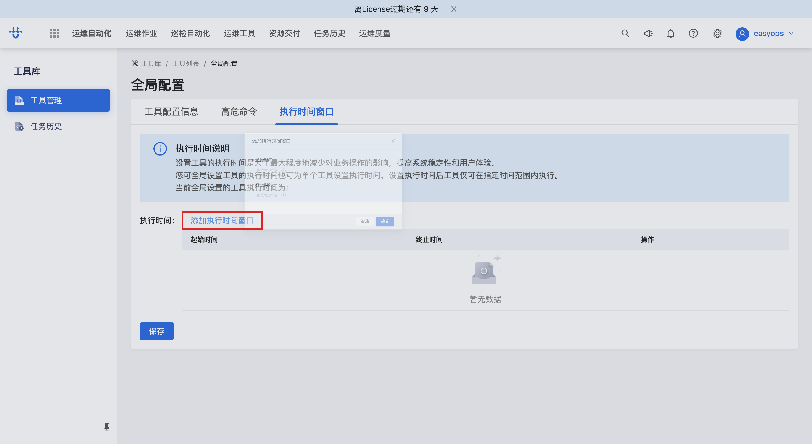

### 步骤 2：确定时间段

选择结束时间（如 23:00），点击 **「确定」**。

<!-- step_id: 57 -->
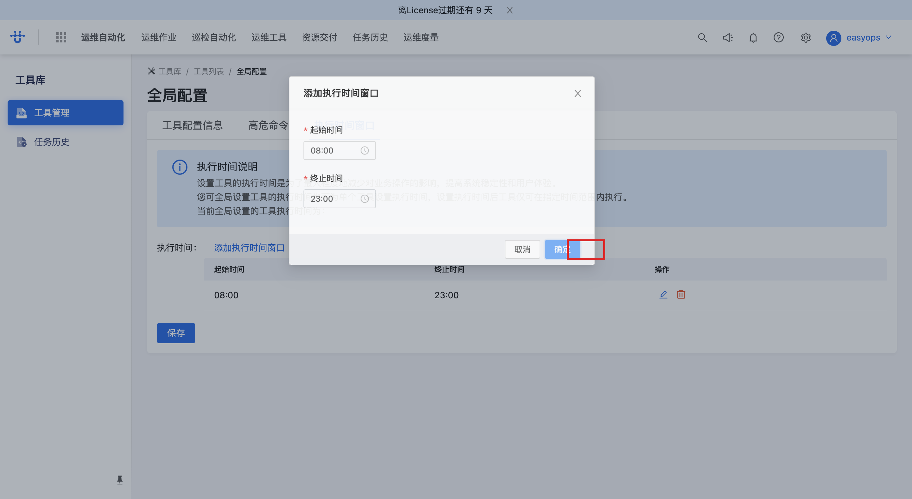

### 步骤 3：保存窗口配置

点击 **「保存」** 提交执行时间窗口配置。

<!-- api: PUT /next/api/gateway/logic.tool_service/api/tool_service/v1/globalConfigs/timeWindow | tag: 执行时间窗口 | step_id: 58 -->
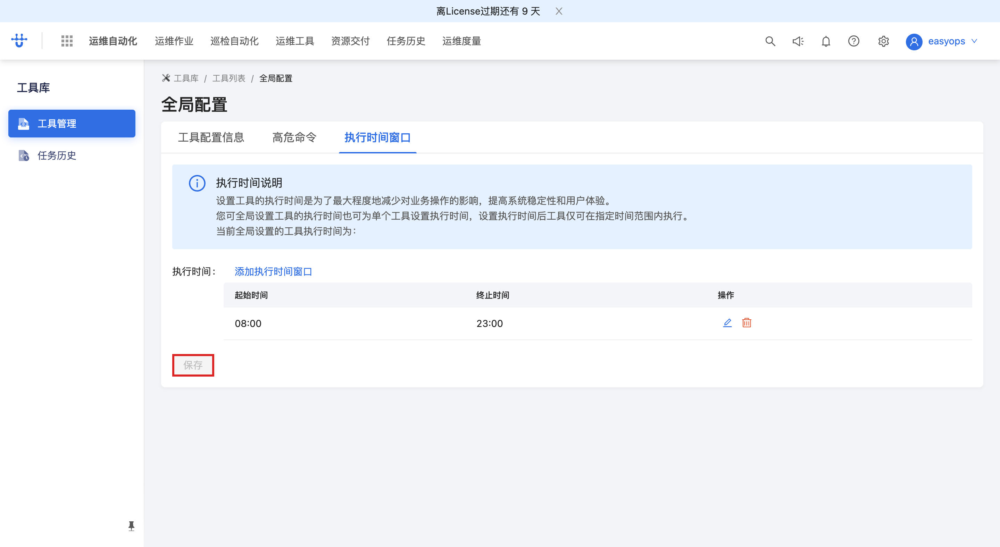

> 🔗 本步调用：PUT `.../logic.tool_service/api/tool_service/v1/globalConfigs/timeWindow`

---

## 六、新建工具

回到工具列表，点击 **「新建工具」** 进入创建页（`tool/management/create`）。

### 步骤 1：点击新建工具

<!-- step_id: 60 -->
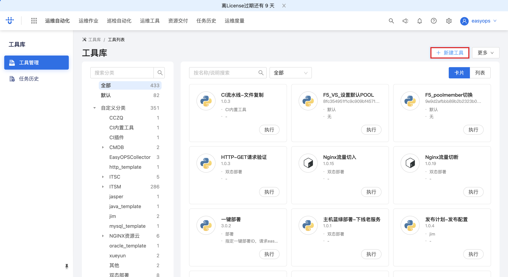

### 步骤 2：填写基本信息

填写工具名称、选择脚本类型（如 **Python**），编写脚本内容。

⚠️ 脚本输入过程不单独截图，下图是输入态。

<!-- step_id: 61 -->
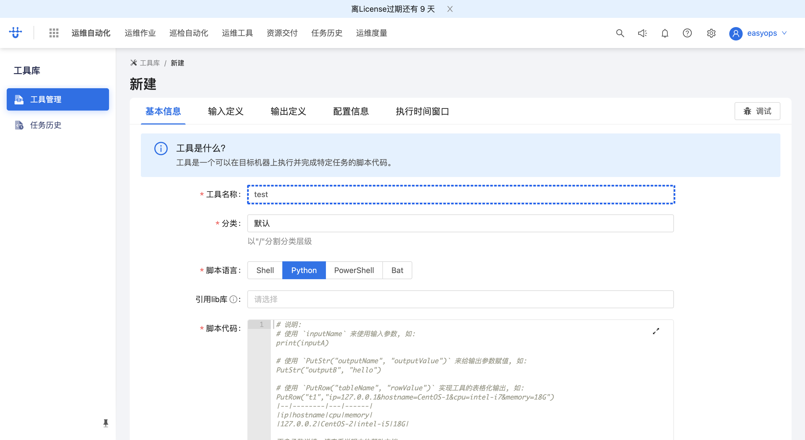

### 步骤 3：配置输入参数

切换到 **「输入定义」** tab，点击 **「添加输入参数」**，填写参数名（如 `arg1`）并确认。

<!-- step_id: 65 -->
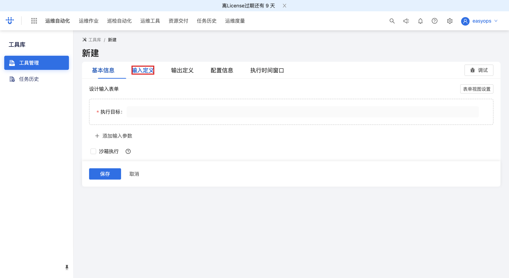

### 步骤 4：调试工具

填写输入参数值后点击 **「调试」**，系统调用调试接口在目标主机上试运行。

<!-- api: POST /next/api/gateway/tool.execute.ExecuteDebugTool/tools/debug | tag: 工具调试与执行 | step_id: 69 -->
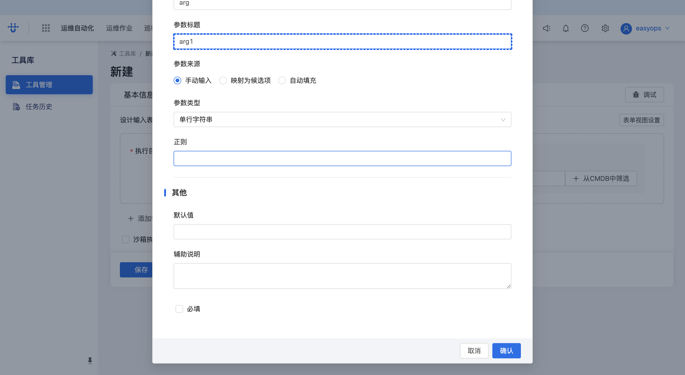

> 🔗 本步调用：POST `.../tool.execute.ExecuteDebugTool/tools/debug`

### 步骤 5：保存工具

调试通过后点击 **「保存」**，系统创建工具。

<!-- api: POST /next/api/gateway/tool.basic.CreateTool/tools | tag: 工具创建与编辑 | step_id: 101 -->
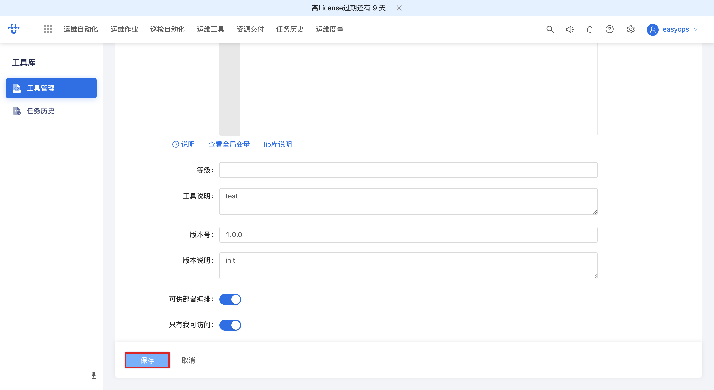

> 🔗 本步调用：POST `.../tool.basic.CreateTool/tools`

---

## 七、执行工具

在工具详情页点击 **「执行」**，对目标主机执行该工具。

### 步骤 1：点击执行

进入执行实例页（`execute/instance/{toolId}`），选择 **Linux/Windows 执行用户**。

<!-- url: execute/instance/{toolId} | step_id: 102 -->
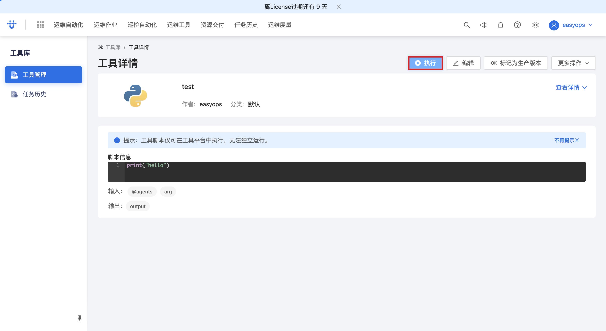

### 步骤 2：选择目标并开始执行

点击 **「从 CMDB 中筛选」** 选择目标主机，确定后点击 **「开始执行」**，系统调用执行接口。

<!-- api: POST /next/api/gateway/tool.execute.ExecuteTool/tools/execution | tag: 工具调试与执行 | step_id: 106 -->
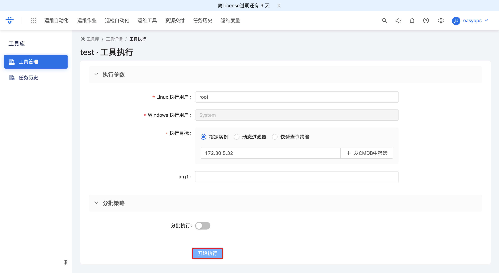

> 🔗 本步调用：POST `.../tool.execute.ExecuteTool/tools/execution`

---

## 八、编辑 / 审批 / 导出

### 步骤 1：编辑工具

在工具详情页点击 **「编辑」**，修改工具内容后保存。

<!-- url: {toolId}/edit | api: PUT /next/api/gateway/tool.basic.UpdateTool/tools/{toolId} | tag: 工具创建与编辑 | step_id: 107 -->
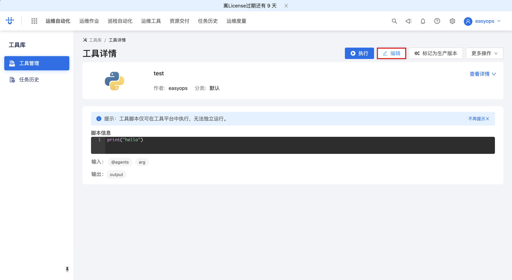

### 步骤 2：保存编辑

修改完成后点击 **「保存」**，生成新版本。

<!-- step_id: 109 -->
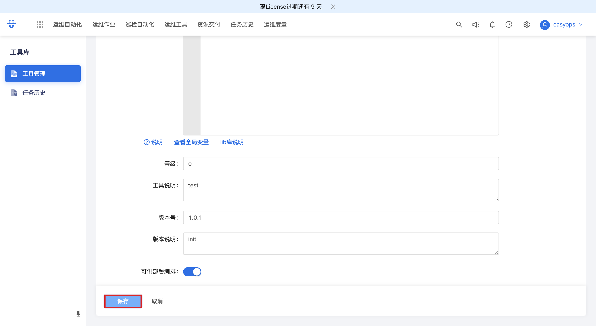

> 🔗 本步调用：PUT `.../tool.basic.UpdateTool/tools/{toolId}`

### 步骤 3：标记为生产版本

点击 **「标记为生产版本」** 并确定，将该版本设为生产可用（需审批）。

<!-- api: POST /next/api/gateway/tool.basic.ToolApproval/tools/{toolId} | tag: 工具版本与审批 | step_id: 110 -->

> 🔗 本步调用：POST `.../tool.basic.ToolApproval/tools/{toolId}`

### 步骤 4：导出版本

点击 **「更多操作」→「导出版本」**，将工具版本导出为文件。

<!-- api: POST /next/api/gateway/logic.tool_service/tools/{toolId}/export | tag: 工具导入导出 | step_id: 113 -->
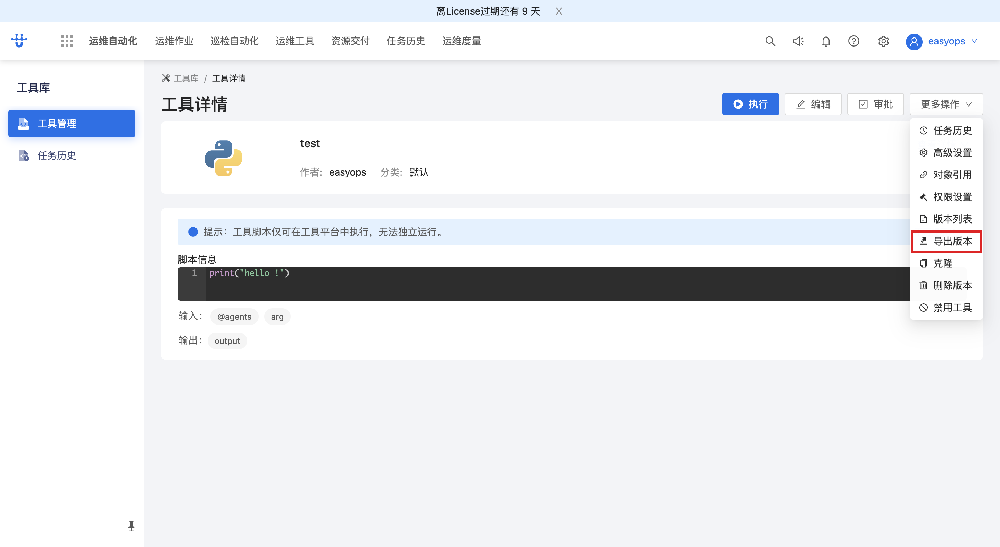

> 🔗 本步调用：POST `.../logic.tool_service/tools/{toolId}/export`

---

## 九、导入工具

在工具列表点击 **「更多」→「导入」**，进入导入页（`tool/management/import`）。

### 步骤 1：上传工具包

点击/拖拽工具包（`.tar` 格式）到上传区域。

<!-- url: tool/management/import | step_id: 116 -->
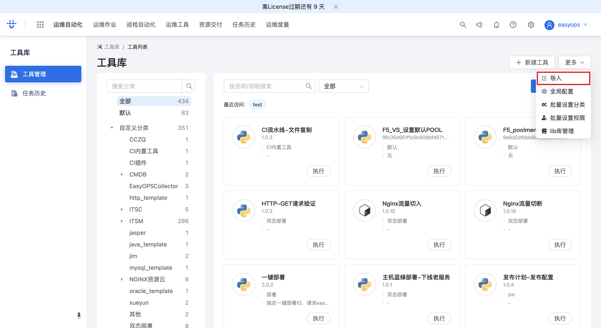

### 步骤 2：导入校验

点击 **「导入」**，系统校验工具包（版本号等）。

<!-- api: POST /next/api/gateway/logic.tool_service/api/tool_service/v1/batch/import/pkg/check | tag: 工具导入导出 | step_id: 118 -->
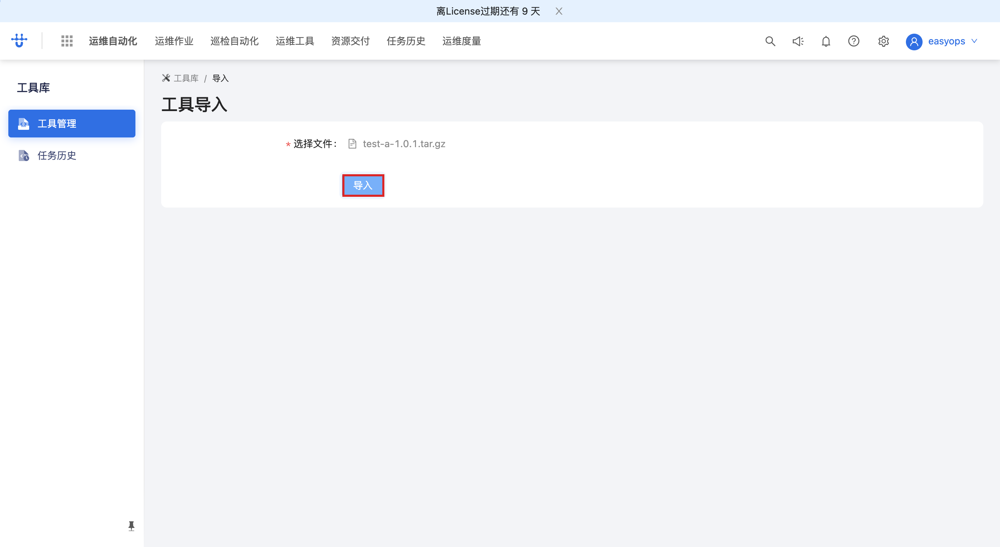

### 步骤 3：确定导入

校验通过后点击 **「确定导入」**，正式导入工具。

<!-- api: POST /next/api/gateway/logic.tool_service/tools/import | tag: 工具导入导出 | step_id: 121 -->
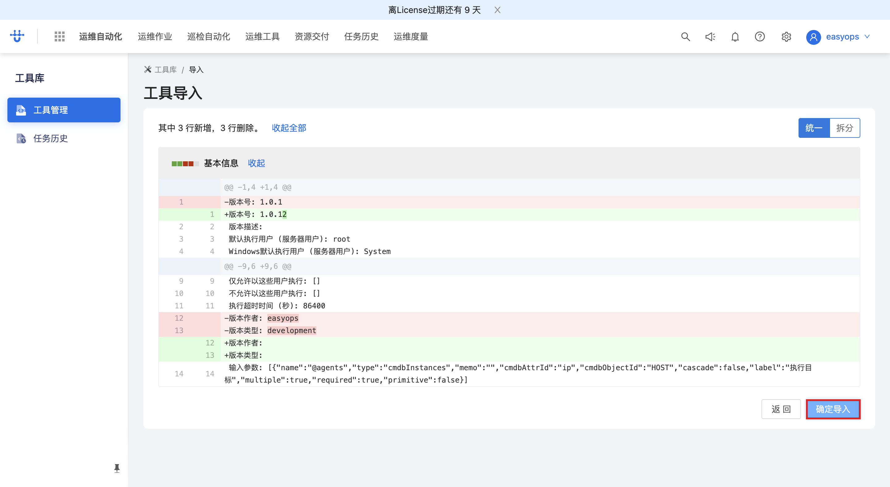

> 🔗 本步调用：POST `.../logic.tool_service/tools/import`

---

## 十、版本管理与删除

### 步骤 1：查看版本列表

在工具详情点击 **「更多操作」→「版本列表」**，进入版本管理页（`{toolId}/versions`）。

<!-- url: {toolId}/versions | step_id: 123 -->
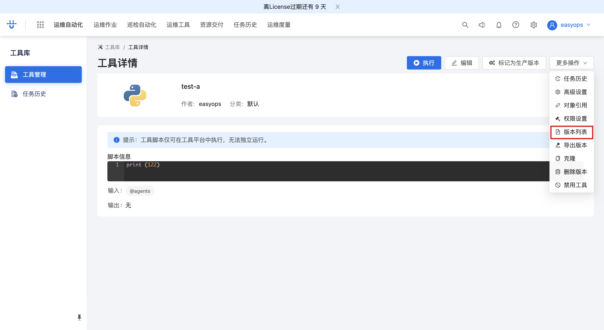

### 步骤 2：删除工具

在版本列表 **「更多操作」→「删除工具」**。

<!-- step_id: 127 -->
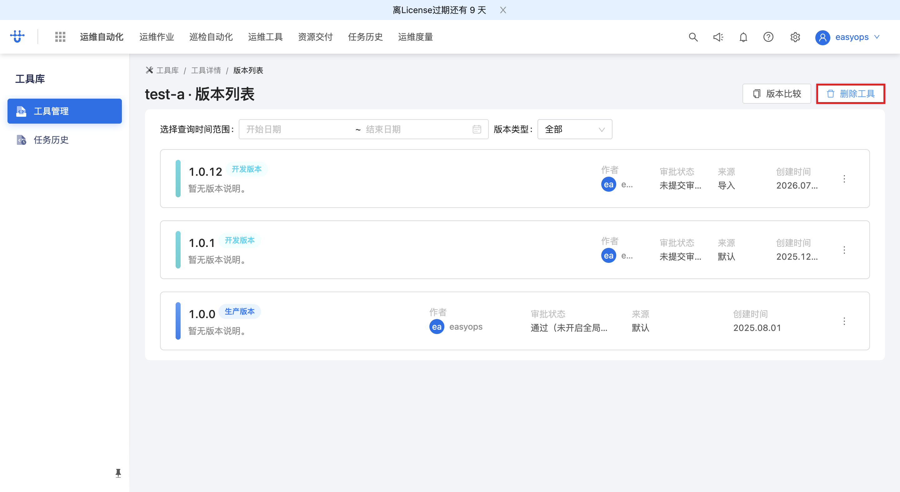

### 步骤 3：确认删除

点击 **「删除」** 确认，系统删除该工具。

<!-- api: DELETE /next/api/gateway/tool.basic.DeleteTool/tools/{toolId} | tag: 工具删除 | step_id: 128 -->
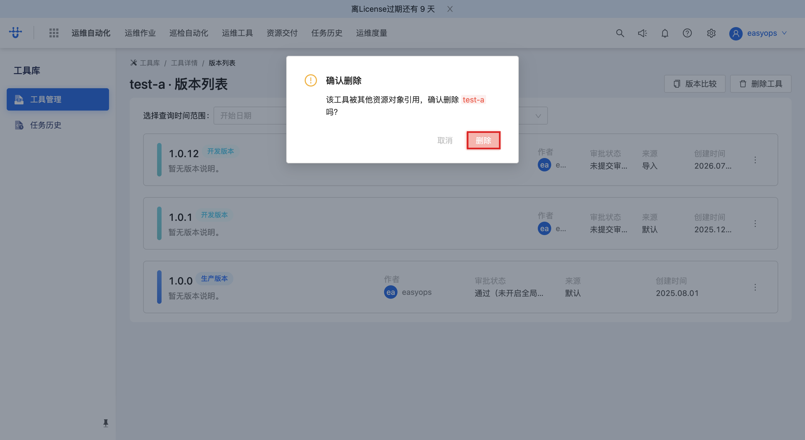

> 🔗 本步调用：DELETE `.../tool.basic.DeleteTool/tools/{toolId}`

---

## 十一、任务历史

工具库左上角点击 **「任务历史」** 进入任务页（`tool/task`），查看工具执行任务记录。

### 步骤 1：进入任务历史

点击 **「任务历史」** 进入任务列表。

<!-- step_id: 129 -->
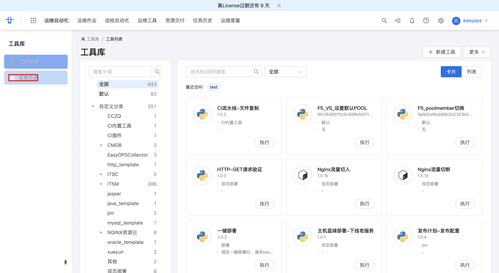

### 步骤 2：筛选任务

按 **状态**（如失败）、**操作人**（如 easyops）、**触发方式**（如定时任务）、**时间范围**（近 24 小时/近 30 天）等条件筛选任务。

<!-- step_id: 130 -->
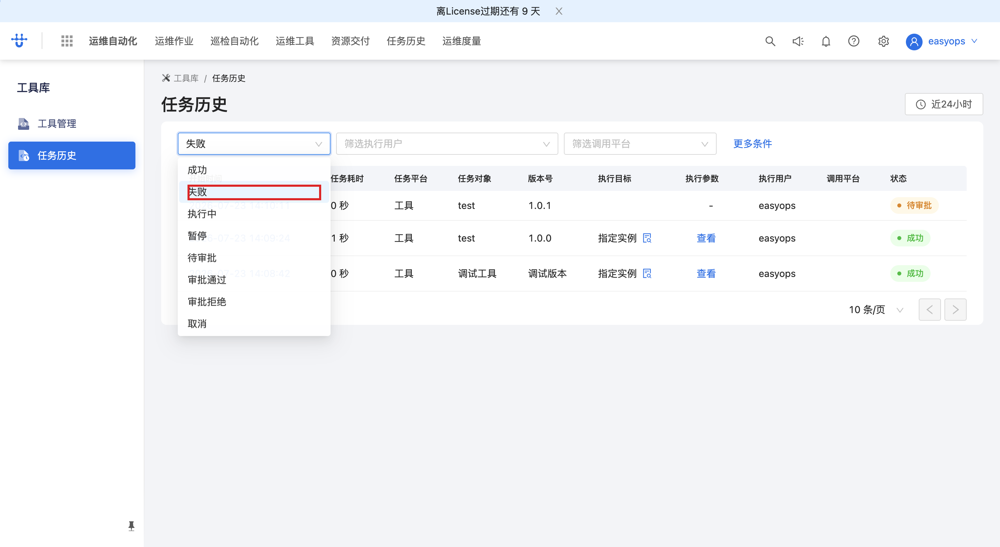

### 步骤 3：查看任务详情

点击某条任务（如目标主机 `172.30.5.204`）进入任务详情页，查看执行日志与结果。

<!-- url: tool/task/{taskId} | step_id: 137 -->
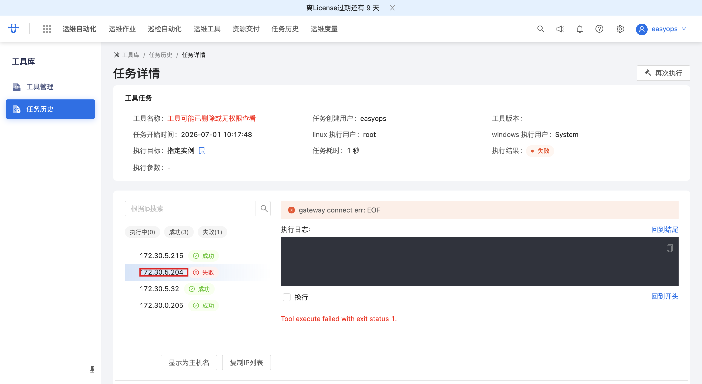

---

## 附：本流程接口速查

| tag | 方法 | 路径(简) | 用途 | 步骤 |
| --- | --- | --- | --- | --- |
| 工具列表与详情 | GET | `.../tool.basic.ListTool/tools` | 工具列表查询（业务工具，返回 list+total） | 一-2 |
| 工具列表与详情 | POST | `.../cmdb.instance.PostSearch/object/_TOOL_LIB@EASYOPS/instance/_search` | lib 包搜索（可被工具引用的公共依赖） | — |
| 工具全局配置 | PUT | `.../cmdb.instance.UpdateInstance/object/_TOOLS_CONFIG_GLOBAL/instance/{id}` | 基础设置保存 | 三-2 |
| 高危命令管理 | POST | `.../cmdb.instance.CreateInstance/v2/object/_TOOL_HIGH_RISK_COMMAND@EASYOPS` | 新建高危命令 | 四-3 |
| 执行时间窗口 | PUT | `.../logic.tool_service/api/tool_service/v1/globalConfigs/timeWindow` | 执行窗口保存 | 五-3 |
| 工具创建与编辑 | POST | `.../tool.basic.CreateTool/tools` | 新建工具 | 六-5 |
| 工具创建与编辑 | PUT | `.../tool.basic.UpdateTool/tools/{toolId}` | 编辑工具 | 八-2 |
| 工具调试与执行 | POST | `.../tool.execute.ExecuteDebugTool/tools/debug` | 调试工具 | 六-4 |
| 工具调试与执行 | POST | `.../tool.execute.ExecuteTool/tools/execution` | 执行工具 | 七-2 |
| 工具版本与审批 | POST | `.../tool.basic.ToolApproval/tools/{toolId}` | 标记生产版本 | 八-3 |
| 工具导入导出 | POST | `.../logic.tool_service/tools/{toolId}/export` | 导出版本 | 八-4 |
| 工具导入导出 | POST | `.../logic.tool_service/tools/import` | 导入工具 | 九-3 |
| 工具删除 | DELETE | `.../tool.basic.DeleteTool/tools/{toolId}` | 删除工具 | 十-3 |
