# AutoOps 文件分发管理 — 操作指引

> 适用场景：在 EasyOps AutoOps「文件分发」中管理文件包的全生命周期——列表查询/搜索、新建文件包、上传文件并提交版本、下载/删除版本、编辑与删除文件包、批量设置权限。
> 配套接口：见同目录 [`AutoOps-文件分发管理-openapi.yaml`](../../openapi/AutoOps-文件分发管理-openapi.yaml)。

## 目录

- [一、浏览与搜索文件包](#一浏览与搜索文件包)
- [二、新建文件包](#二新建文件包)
- [三、上传文件并提交版本](#三上传文件并提交版本)
- [四、下载与删除版本](#四下载与删除版本)
- [五、编辑文件包](#五编辑文件包)
- [六、删除文件包](#六删除文件包)
- [七、批量设置权限](#七批量设置权限)
- [附：本流程接口速查](#附本流程接口速查)

<!-- deep-links: 本流程关键页面直达(SPA 路径,去掉 host 前缀,参数化)
  文件包列表:   file-distrubute/file-pkg/list
  新建文件包:   file-distrubute/file-pkg/create
  文件包详情:   file-distrubute/file-pkg/{packageId}/index
  编辑文件包:   file-distrubute/file-pkg/{packageId}/edit
  版本工作区:   file-distrubute/file-pkg/{packageId}/version/workspace/file-tree?path=/
  新建版本:     file-distrubute/file-pkg/{packageId}/create
-->

> 图例：🔴红框=点击 / 🔵蓝虚线框=输入 / 🟠橙框+▾=下拉 / 🟣紫圈=单复选 / 🟢绿粗框=提交。

## 一、浏览与搜索文件包

### 步骤 1：输入关键字搜索文件包
<!-- step_id: 6 -->
在「根据文件包名称搜索」输入框中输入关键字（如 `test`），列表实时过滤。

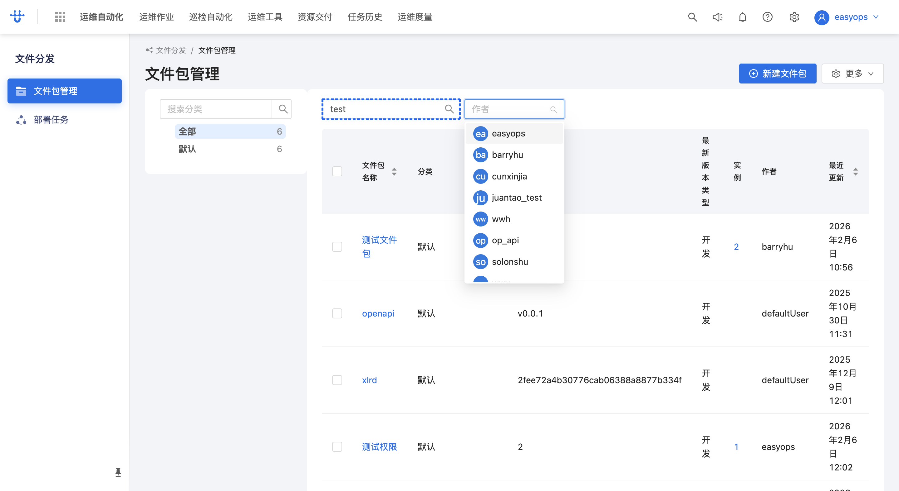

> 💡 提示：文本输入过程不截图，截图为输入完成后的画面；左侧「搜索分类」可配合分类（全部/默认）进一步过滤。

### 步骤 2：按作者筛选
<!-- step_id: 7 -->
点击「作者」下拉，选择作者（如 `easyops`），列表只显示该作者创建的文件包。

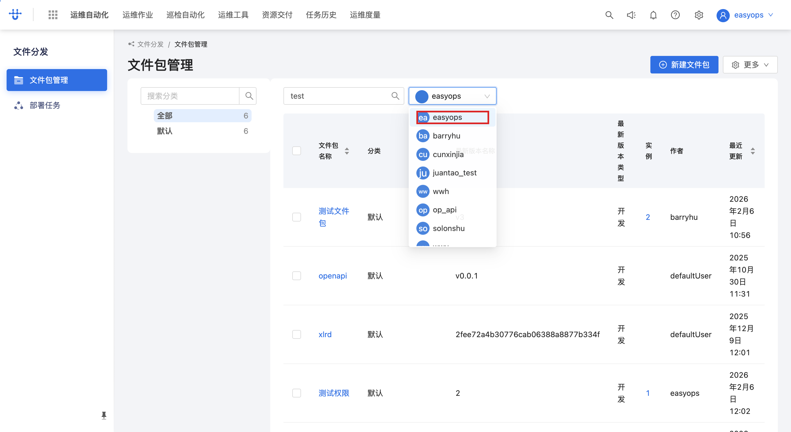

> 🔗 本步调用：GET `/next/api/gateway/artifact.pkgservice.Search/package/search`（详见 openapi.yaml 的「文件包列表与分类」）

## 二、新建文件包

### 步骤 1：点击「新建文件包」
<!-- url: file-distrubute/file-pkg/create | step_id: 9 -->
在文件包列表页右上角点击「新建文件包」，进入新建表单页。

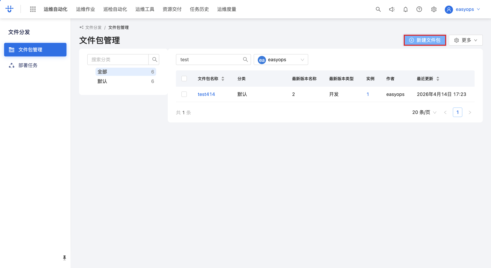

### 步骤 2：填写文件包名称
<!-- step_id: 11 -->
在「文件包名称」输入框填写名称（如 `tmp-llm`）。

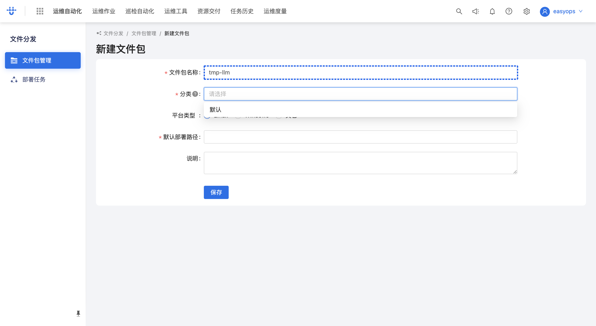

### 步骤 3：选择分类
<!-- step_id: 12 -->
点击「分类」下拉，选择分类（如 `默认`）。

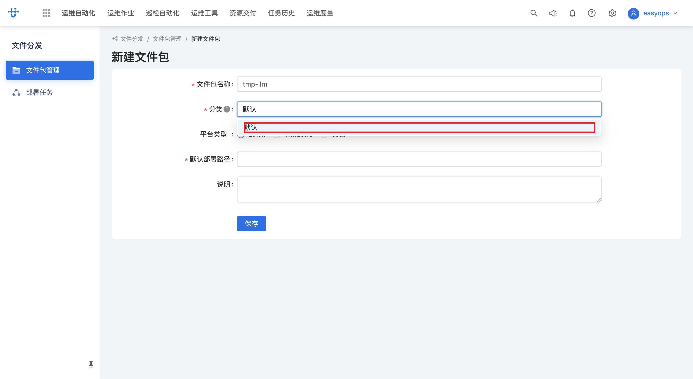

### 步骤 4：填写默认部署路径
<!-- step_id: 14 -->
在「默认部署路径」输入框填写目标主机上的部署路径（如 `/tmp/llm`）。

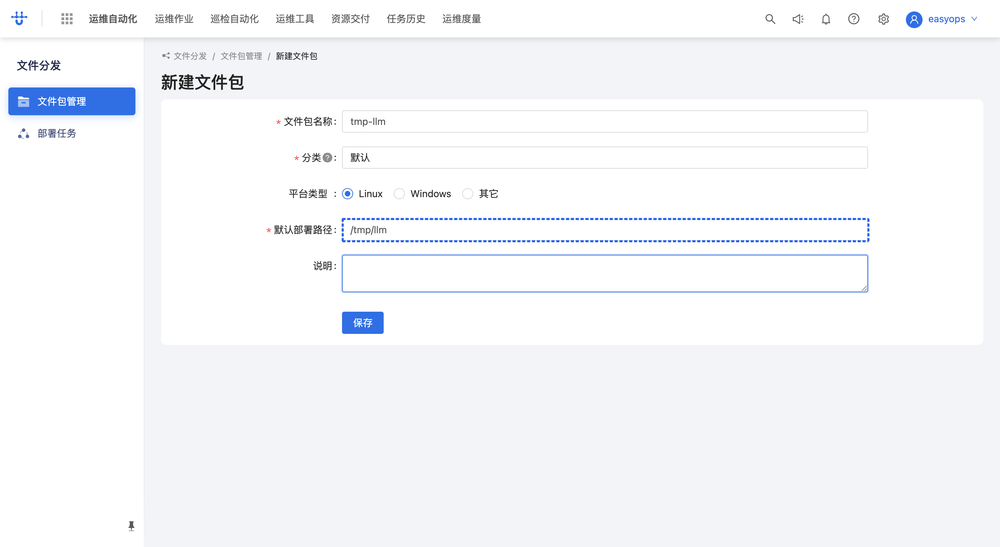

> 💡 提示：「平台类型」按需选择 Linux / Windows / 其它，本例保持默认 Linux。

### 步骤 5：填写说明并保存
<!-- api: POST /next/api/gateway/artifact.pkgservice.Create/package | tag: 文件包创建与编辑 | step_id: 30 -->
在「说明」输入框填写备注（如 `测试用`），点击「保存」完成创建，自动跳转到文件包详情页。

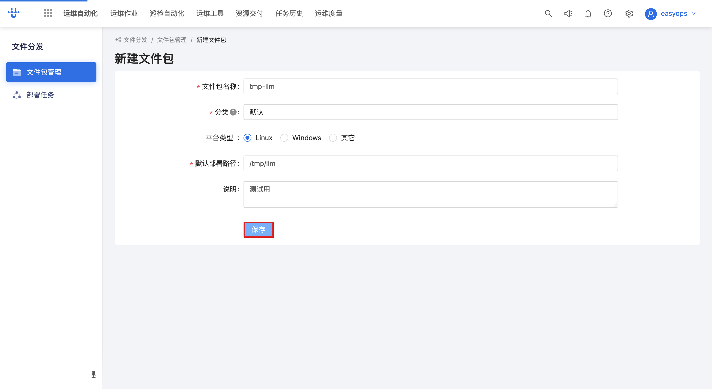

> 🔗 本步调用：POST `/next/api/gateway/artifact.pkgservice.Create/package`（详见 openapi.yaml 的「文件包创建与编辑」）

## 三、上传文件并提交版本

### 步骤 1：点击「新建版本」
<!-- url: file-distrubute/file-pkg/{packageId}/version/workspace/file-tree?path=/ | api: GET /next/api/gateway/artifact.version.ListVersion/version/list | tag: 版本管理 | step_id: 31 -->
在文件包详情页点击右上角「新建版本」，进入版本工作区（文件管理）。

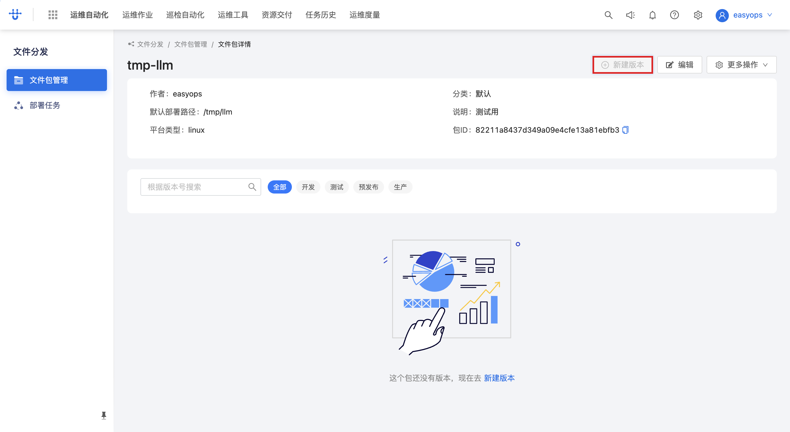

### 步骤 2：打开上传文件弹窗
<!-- step_id: 32 -->
在工作区文件列表右上方点击「上传文件」图标，弹出上传对话框。

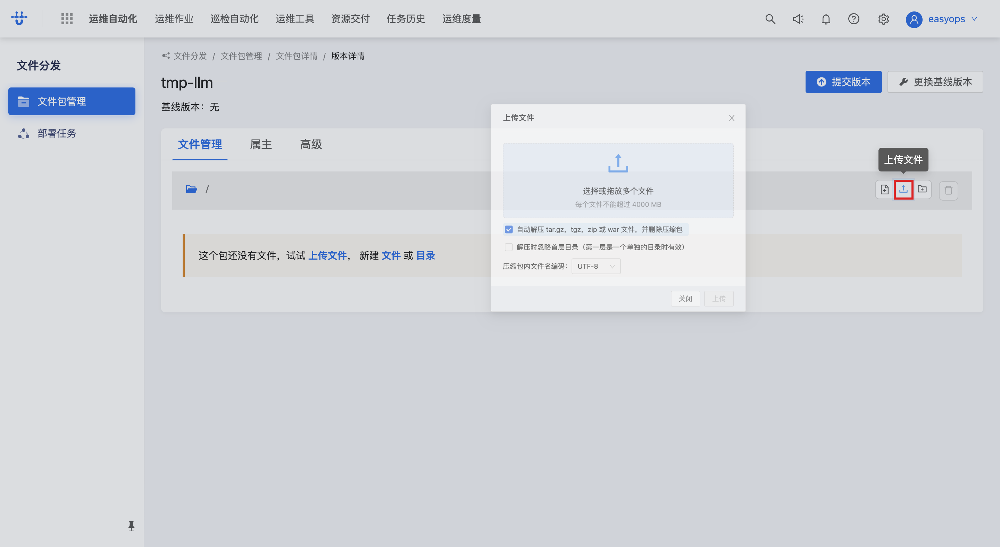

### 步骤 3：选择是否自动解压
<!-- step_id: 33 -->
按需勾选「自动解压 tar.gz，tgz，zip 或 war 文件，并删除压缩包」。

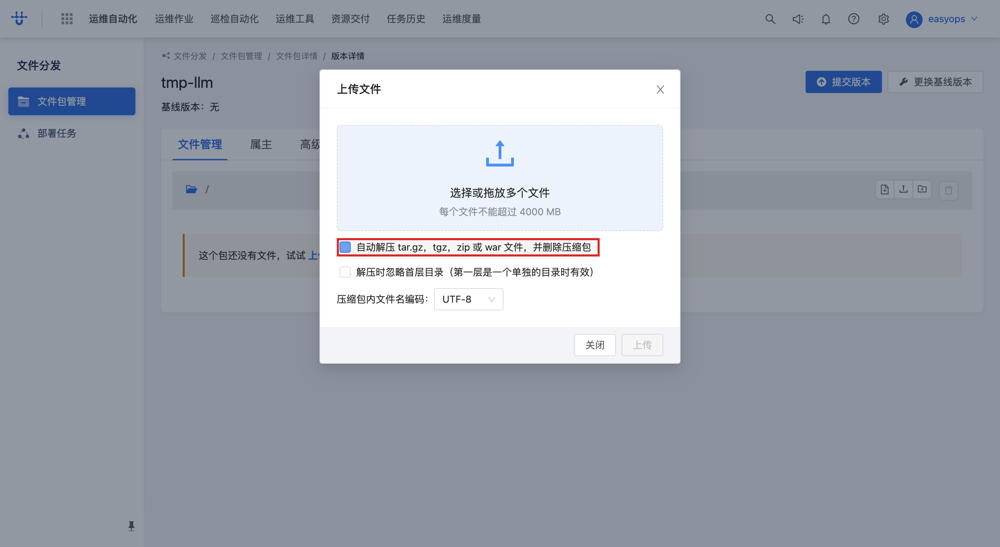

> 💡 提示：勾选后还可选「解压时忽略首层目录」与压缩包内文件名编码（默认 UTF-8）。

### 步骤 4：选择文件并上传
<!-- api: POST /next/api/gateway/file_repository.workspace.UploadFile/workspace/{packageId}/upload | tag: 文件上传与提交 | step_id: 35 -->
点击「选择或拖放多个文件」选择本地文件（单个文件不超过 4000 MB），然后点击「上传」。

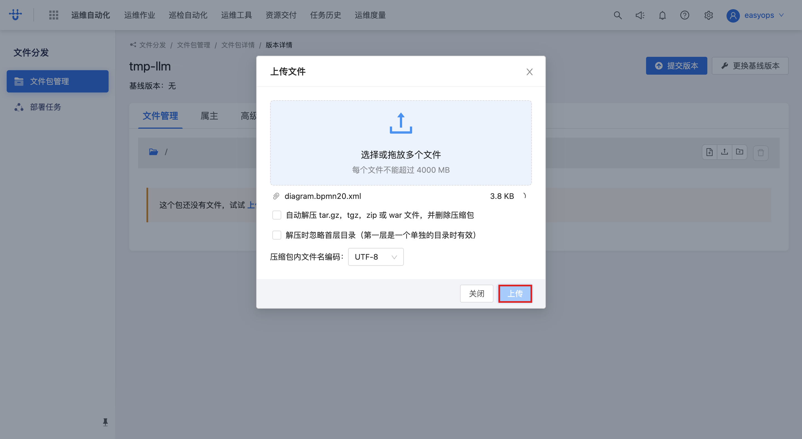

> 🔗 本步调用：POST `/next/api/gateway/file_repository.workspace.UploadFile/workspace/{packageId}/upload`（详见 openapi.yaml 的「文件上传与提交」）

### 步骤 5：点击「提交版本」
<!-- url: file-distrubute/file-pkg/{packageId}/create | step_id: 36 -->
文件上传完成后，点击页面右上角「提交版本」，进入版本信息填写页。

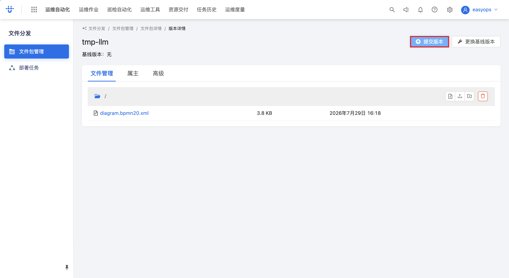

### 步骤 6：填写版本号与备注并提交
<!-- api: POST /next/api/gateway/file_repository.workspace.CommitWorkspaceV2/v2/workspace/{packageId} | tag: 文件上传与提交 | step_id: 43 -->
填写「版本名称」（如 `1.0.0`）、选择「版本类型」（开发/测试/预发布/生产）、填写「备注」（如 `init`），右侧可核对文件变更列表，点击「提交版本」。

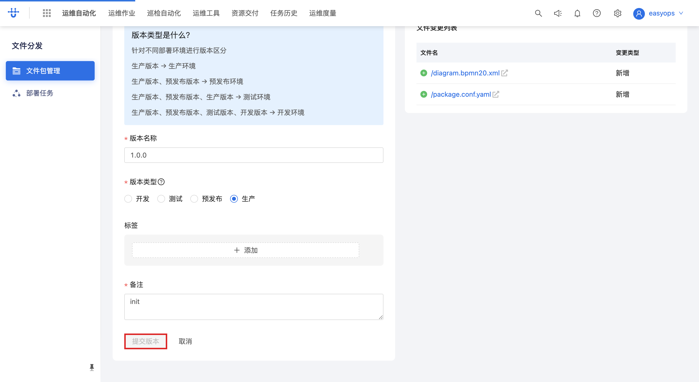

> 🔗 本步调用：POST `/next/api/gateway/file_repository.workspace.CommitWorkspaceV2/v2/workspace/{packageId}`（详见 openapi.yaml 的「文件上传与提交」）
> 💡 提示：输入版本号时会实时校验重名（GET `.../version/check_name/{packageId}?name=...`）。

## 四、下载与删除版本

### 步骤 1：打开版本操作菜单
<!-- step_id: 44 -->
在文件包详情页的版本列表中，点击目标版本行尾「…」按钮展开操作菜单。

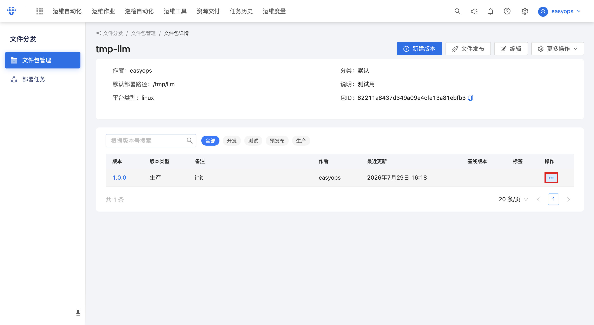

### 步骤 2：下载版本
<!-- api: GET /next/api/gateway/file_repository.archive.DownloadArchive/archive/{packageId}/{versionId} | tag: 版本管理 | step_id: 45 -->
在菜单中点击「下载版本」，浏览器开始下载该版本的归档包。

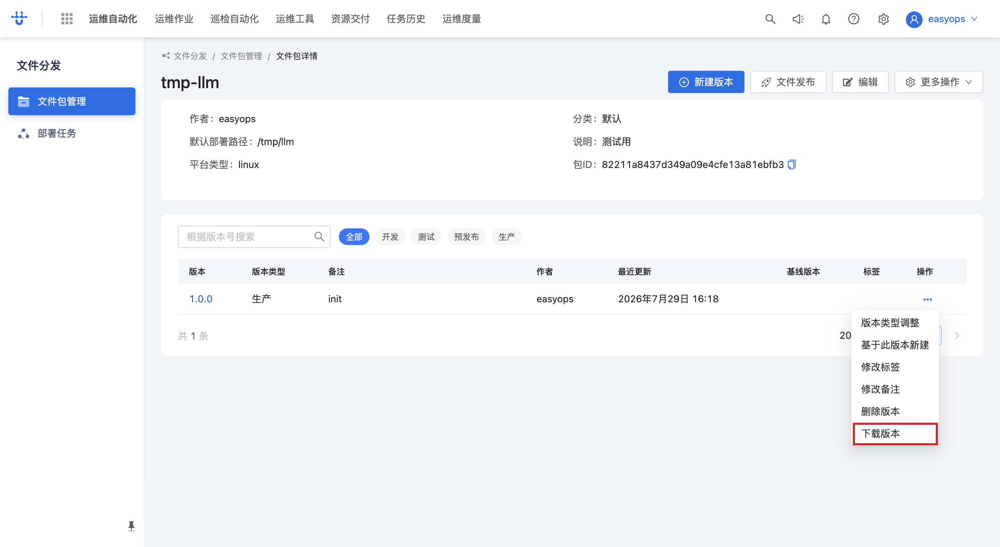

> 🔗 本步调用：GET `/next/api/gateway/file_repository.archive.DownloadArchive/archive/{packageId}/{versionId}?redirect=false`（详见 openapi.yaml 的「版本管理」）

### 步骤 3：删除版本并确认
<!-- api: DELETE /next/api/gateway/artifact.version.DeleteVersionV1/version/{packageId}/{versionId} | tag: 版本管理 | step_id: 49 -->
再次打开版本操作菜单点击「删除版本」，在确认弹窗中按需勾选「彻底删除（同时删除备份文件）」，点击「确认」。

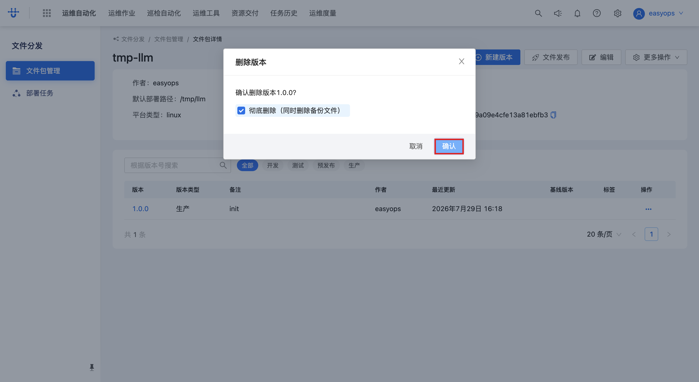

> 🔗 本步调用：DELETE `/next/api/gateway/artifact.version.DeleteVersionV1/version/{packageId}/{versionId}?deleteRepoFlag=true`（详见 openapi.yaml 的「版本管理」）
> ⚠️ 注意：勾选「彻底删除」后备份文件一并清除，不可恢复。

## 五、编辑文件包

### 步骤 1：点击「编辑」
<!-- url: file-distrubute/file-pkg/{packageId}/edit | step_id: 50 -->
在文件包详情页点击右上角「编辑」，进入编辑表单页（名称/分类不可改时可改部署路径与说明）。

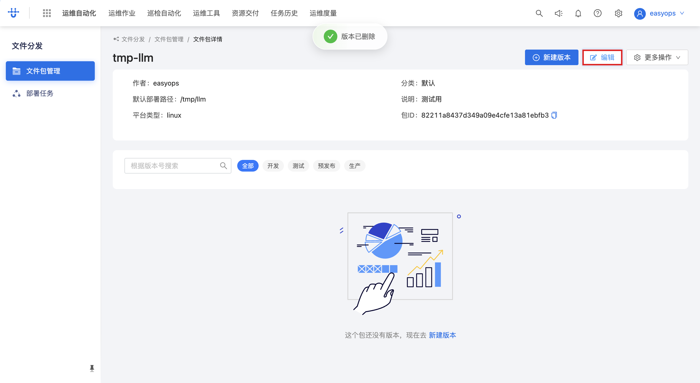

### 步骤 2：修改说明并保存
<!-- api: PUT /next/api/gateway/artifact.pkgservice.Update/package/{packageId} | tag: 文件包创建与编辑 | step_id: 67 -->
修改「说明」等内容（如改为 `测试用,更改`），点击「保存」。

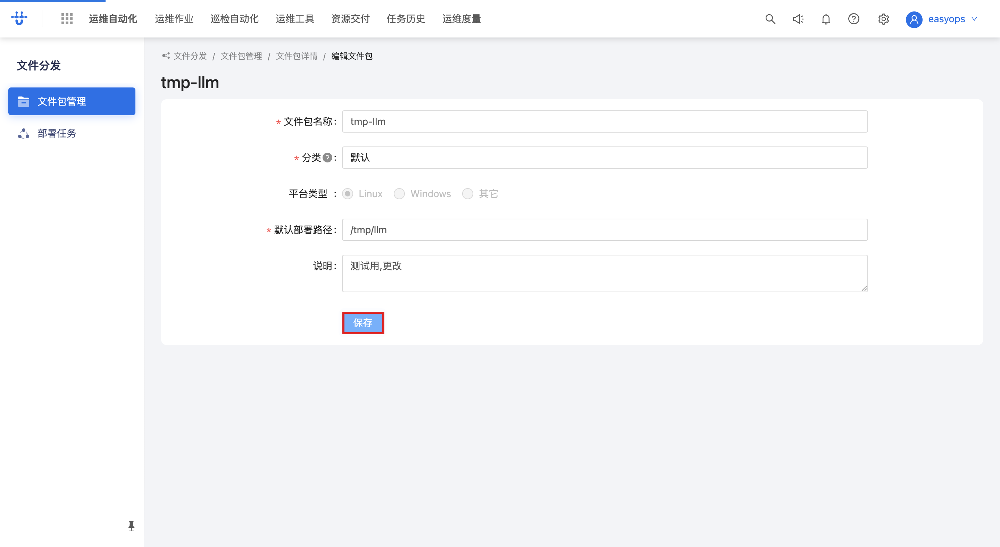

> 🔗 本步调用：PUT `/next/api/gateway/artifact.pkgservice.Update/package/{packageId}`（详见 openapi.yaml 的「文件包创建与编辑」）

## 六、删除文件包

### 步骤 1：更多操作 → 删除
<!-- step_id: 69 -->
在文件包详情页点击右上角「更多操作」，在菜单中点击「删除」。

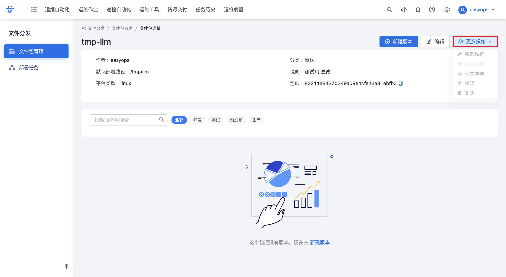

### 步骤 2：确认删除
<!-- api: DELETE /next/api/gateway/artifact.pkgservice.DeletePackage/package/package/{packageId} | tag: 文件包删除 | step_id: 70 -->
在「删除确认」弹窗中点击「确定」，文件包被删除并返回列表页。

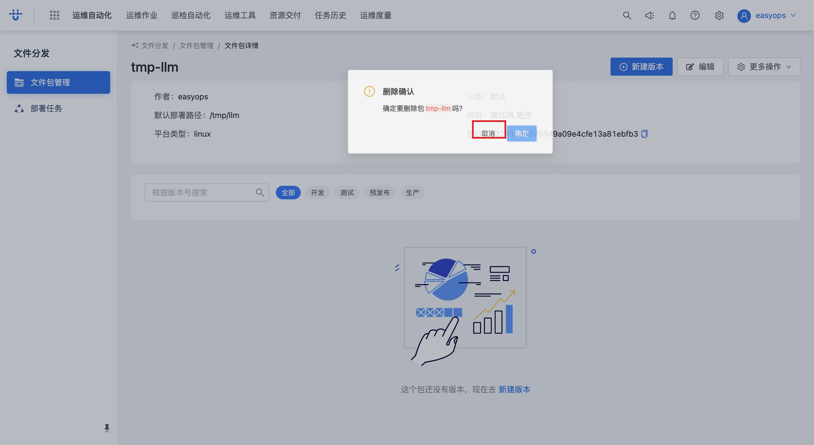

> 🔗 本步调用：DELETE `/next/api/gateway/artifact.pkgservice.DeletePackage/package/package/{packageId}`（详见 openapi.yaml 的「文件包删除」）
> ⚠️ 注意：删除文件包会一并删除其下所有版本，操作不可恢复。

## 七、批量设置权限

### 步骤 1：勾选文件包并进入批量设置
<!-- step_id: 73 -->
在文件包列表页勾选多个文件包，点击右上角「更多」→「批量设置权限」。

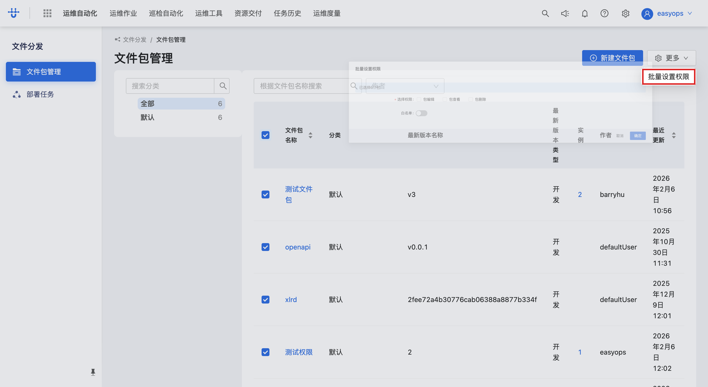

### 步骤 2：配置权限与白名单
<!-- step_id: 74 -->
在「批量设置权限」弹窗中勾选要授予的权限（包编辑/包查看/包删除），按需开启「白名单」开关。

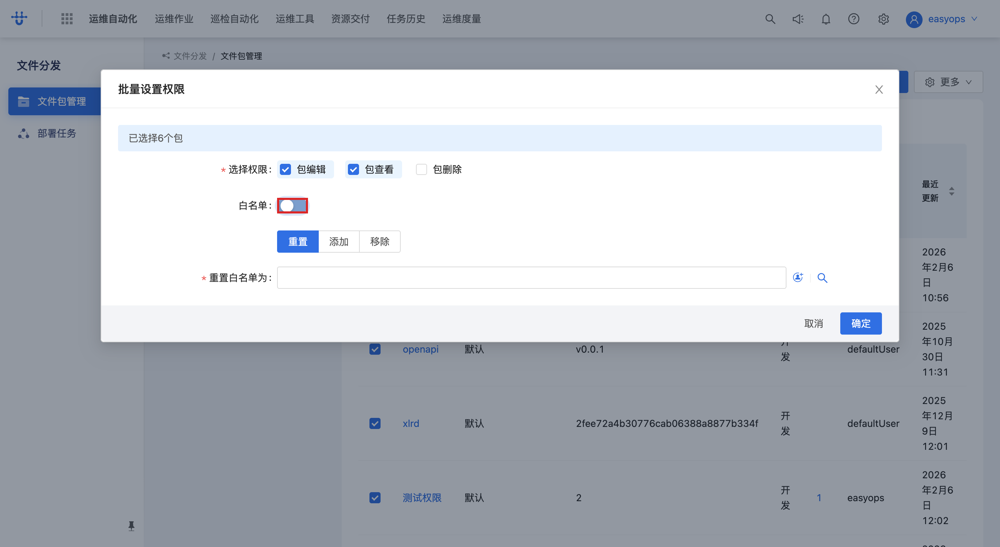

### 步骤 3：选择授权对象并确定
<!-- api: POST /next/api/gateway/artifact.permission.BatchUpdatePackagePermission/permission/packages | tag: 权限管理 | step_id: 77 -->
在「重置白名单为」中选择用户/用户组（如 `easyops`），点击「确定」完成批量授权。

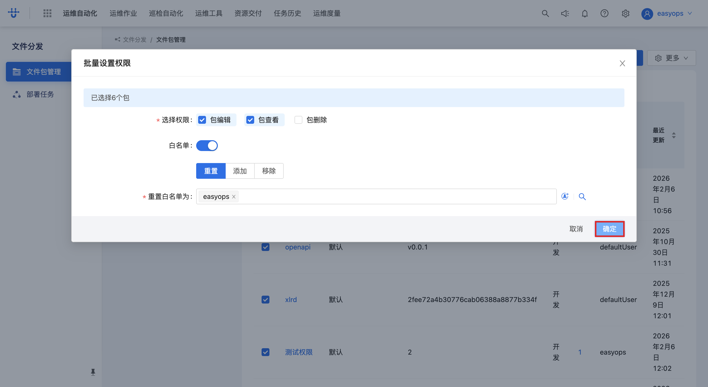

> 🔗 本步调用：POST `/next/api/gateway/artifact.permission.BatchUpdatePackagePermission/permission/packages`（详见 openapi.yaml 的「权限管理」）

## 附：本流程接口速查

| tag | 方法 | 路径(简) | 用途 | 步骤 |
| --- | --- | --- | --- | --- |
| 文件包列表与分类 | GET | `.../artifact.pkgservice.Search/package/search` | 列表/搜索/按作者筛选 | 一-2 |
| 文件包列表与分类 | GET | `.../logic.artifact/package/categories_and_count` | 分类及数量 | 一（页面加载） |
| 文件包创建与编辑 | POST | `.../artifact.pkgservice.Create/package` | 新建文件包 | 二-5 |
| 文件包创建与编辑 | PUT | `.../artifact.pkgservice.Update/package/{packageId}` | 编辑文件包 | 五-2 |
| 文件包创建与编辑 | GET | `.../artifact.pkgservice.GetPackageDetail/package/package/{packageId}` | 文件包详情 | 二/三/五（页面加载） |
| 文件包删除 | DELETE | `.../artifact.pkgservice.DeletePackage/package/package/{packageId}` | 删除文件包 | 六-2 |
| 版本管理 | GET | `.../artifact.version.ListVersion/version/list` | 版本列表 | 三-1 |
| 版本管理 | GET | `.../artifact.version_extends.CheckVersionName/api/artifact/v1/version/check_name/{packageId}` | 版本名重名校验 | 三-6 |
| 版本管理 | GET | `.../file_repository.archive.DownloadArchive/archive/{packageId}/{versionId}` | 下载版本 | 四-2 |
| 版本管理 | DELETE | `.../artifact.version.DeleteVersionV1/version/{packageId}/{versionId}` | 删除版本 | 四-3 |
| 文件上传与提交 | POST | `.../file_repository.workspace.UploadFile/workspace/{packageId}/upload` | 上传文件到工作区 | 三-4 |
| 文件上传与提交 | POST | `.../file_repository.workspace.CommitWorkspaceV2/v2/workspace/{packageId}` | 提交为新版本 | 三-6 |
| 权限管理 | GET | `.../artifact.permission.GetPackagePermission/permission/package/{packageId}` | 查询包权限 | 详情页加载 |
| 权限管理 | POST | `.../artifact.permission.BatchUpdatePackagePermission/permission/packages` | 批量设置权限 | 七-3 |
