# CMDB-实例管理 — 操作指引

> 适用场景：在 EasyOps CMDB 中对资源实例做日常运维——按模型定位实例列表、关键词/高级搜索、导出导入、批量编辑删除、查看详情与管理关系、单实例编辑与删除。
> 配套接口：见同目录 `CMDB-实例管理-openapi.yaml`。
> 截图图例：🔴红框=点击 / 🔵蓝虚线框=输入 / 🟠橙框+▾=下拉 / 🟣紫圈=单复选 / 🟢绿粗框=提交。

## 目录

- [一、进入实例管理并定位模型](#一进入实例管理并定位模型)
- [二、搜索实例（关键词 + 高级搜索）](#二搜索实例关键词--高级搜索)
- [三、导出实例](#三导出实例)
- [四、手工导入实例](#四手工导入实例)
- [五、批量编辑实例](#五批量编辑实例)
- [六、批量删除实例](#六批量删除实例)
- [七、查看实例详情与管理关系](#七查看实例详情与管理关系)
- [八、编辑单个实例](#八编辑单个实例)
- [九、删除单个实例](#九删除单个实例)

<!-- deep-links: 本流程关键页面直达(SPA 路径,去掉 host 前缀,参数化)
  实例管理首页: next-cmdb-instance-management
  某模型实例列表: next-cmdb-instance-management/next/{objectId}/list
  某模型实例列表(带搜索): next-cmdb-instance-management/next/{objectId}/list?q={keyword}
  实例详情:      next-cmdb-instance-management/next/{objectId}/instance/{instanceId}
  实例详情-关系: next-cmdb-instance-management/next/{objectId}/instance/{instanceId}?type=relation&name={relationName}
  实例编辑:      next-cmdb-instance-management/next/{objectId}/instance/{instanceId}/edit
-->

## 一、进入实例管理并定位模型

进入「资源管理 → 实例管理」首页，通过模型搜索定位到目标模型（本例以 `HOST` 主机模型为例），进入该模型的实例列表。

### 步骤 1：打开「资源管理」入口
<!-- url: next-cmdb-instance-management | step_id: 1 -->
进入实例管理首页，左侧展示「资源管理」的资源分类树（应用资源、部署资源、NGINX 等）。
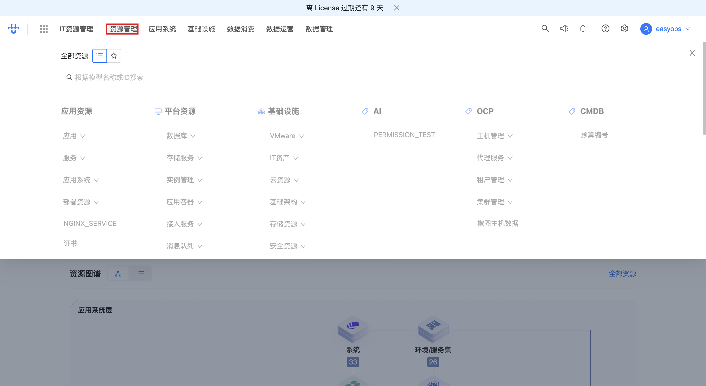

### 步骤 2：在模型搜索框中输入模型 ID
<!-- step_id: 3 -->
在页面顶部「根据模型名称或ID搜索」输入框中输入目标模型 ID，如 `HOST`。
> 💡 提示：纯输入过程不截图，输入完成后会在下拉中看到匹配的模型。

### 步骤 3：从下拉中选择「主机」模型
<!-- api: GET .../cmdb.cmdb_object.GetDetail/object/HOST | tag: 模型与视图配置 | step_id: 5 -->
在搜索下拉中点击「主机」，进入 HOST 模型的实例列表，并加载模型字段定义。
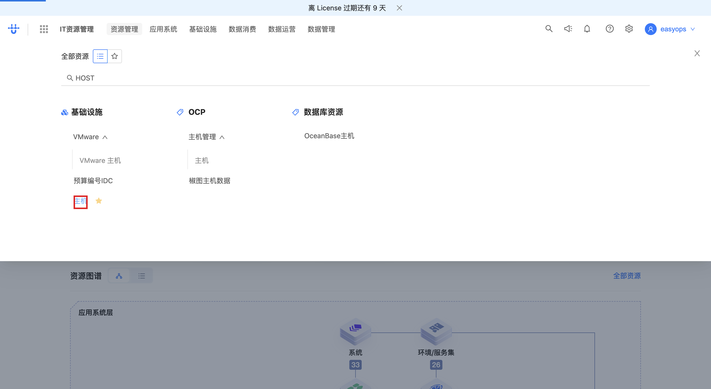
> 🔗 本步调用：GET `/next/api/gateway/cmdb.cmdb_object.GetDetail/object/HOST`（详见 openapi.yaml 的「模型与视图配置」）

## 二、搜索实例（关键词 + 高级搜索）

进入实例列表后，可用顶部搜索框做关键词搜索，也可用「高级搜索」按字段条件过滤。

### 步骤 1：关键词搜索实例
<!-- url: next-cmdb-instance-management/next/HOST/list?q=172.30 | api: POST .../cmdb.instance.PostSearchV3/v3/object/HOST/instance/_search | tag: 实例查询 | step_id: 8 -->
在搜索框输入关键词（如 `172.30`），列表实时按关键词过滤主机实例。
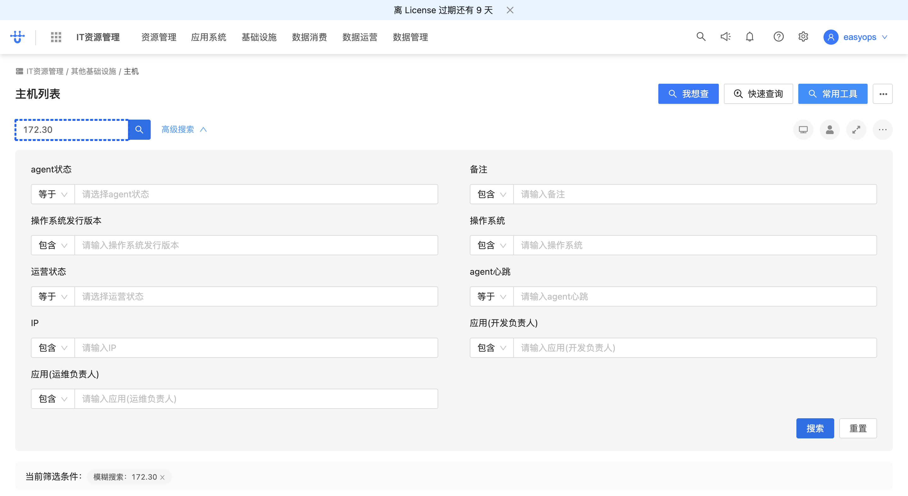
> 🔗 本步调用：POST `/next/api/gateway/cmdb.instance.PostSearchV3/v3/object/HOST/instance/_search`（详见 openapi.yaml 的「实例查询」）

### 步骤 2：展开「高级搜索」
<!-- step_id: 9 -->
点击列表上方「高级搜索」，展开条件构造区。
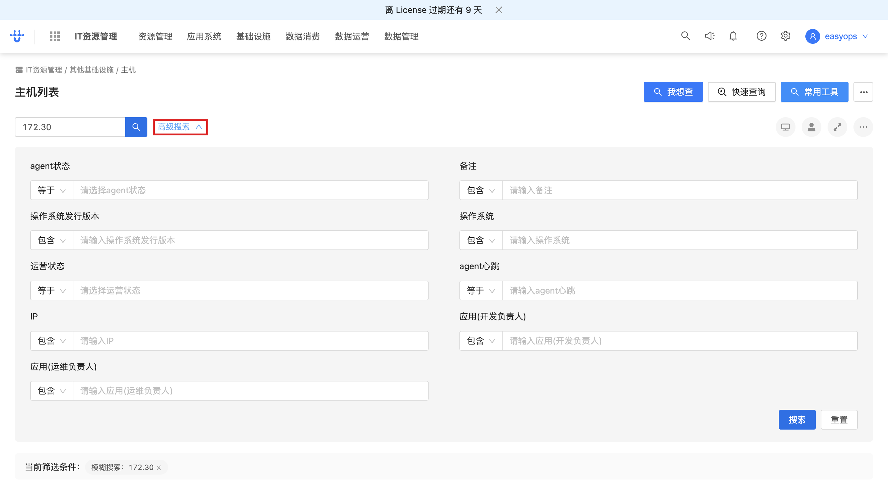

### 步骤 3：添加过滤条件（字段 + 操作符 + 值）
<!-- step_id: 11 -->
依次选择过滤字段（如 `agent状态`）、操作符（`等于`）。
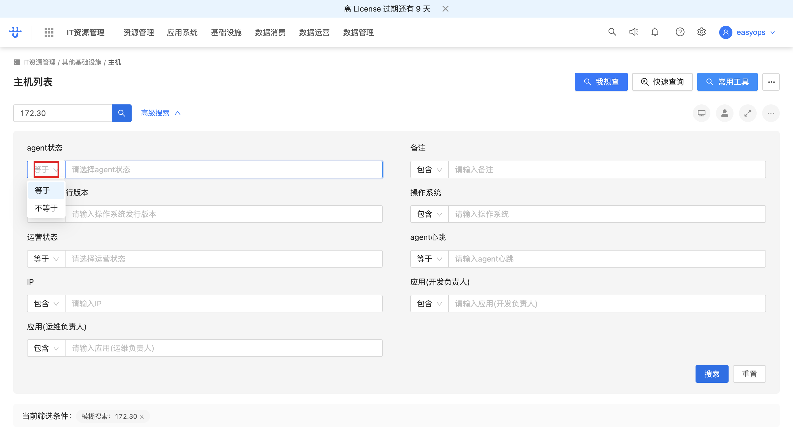

### 步骤 4：选择条件值
<!-- step_id: 13 -->
在值下拉中选择目标值（如 `异常`），完成一条过滤条件。
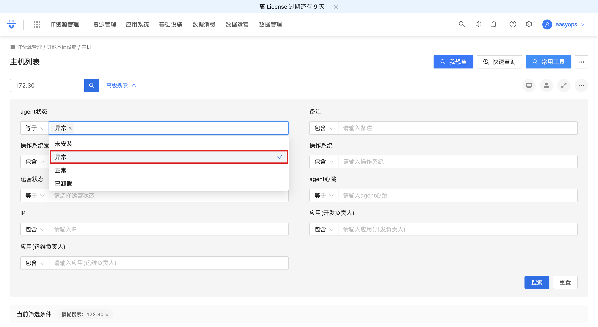

### 步骤 5：点击「搜索」并查看结果
<!-- api: POST .../cmdb.instance.PostSearchV3/v3/object/HOST/instance/_search | tag: 实例查询 | step_id: 14 -->
点击「搜索」按钮，列表按条件（agent状态 等于 异常）刷新结果。
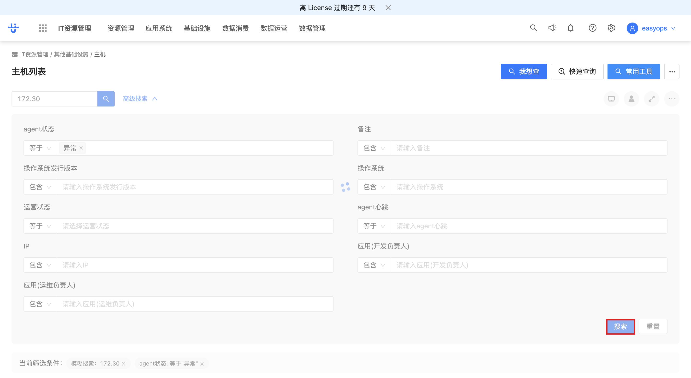
> 🔗 本步调用：POST `/next/api/gateway/cmdb.instance.PostSearchV3/v3/object/HOST/instance/_search`（详见 openapi.yaml 的「实例查询」）
> 💡 提示：高级搜索条件会同步写入 URL 的 `aq` 参数，便于分享/收藏当前筛选视图。

## 三、导出实例

将当前列表（含搜索条件）的实例导出为 Excel。

### 步骤 1：打开「更多操作」下拉
<!-- api: GET .../resource_manage.cmdb_approve.ListRuleConfig/api/v1/rule/config | tag: 实例审批 | step_id: 22 -->
点击列表上方的下拉触发器（dropdown-trigger），打开操作菜单；此时会查询该模型是否配置了导出审批规则。
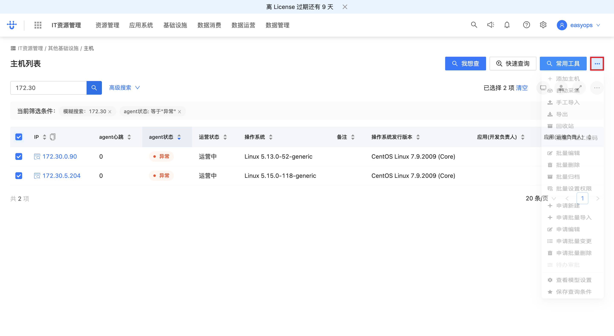
> 🔗 本步调用：GET `/next/api/gateway/resource_manage.cmdb_approve.ListRuleConfig/api/v1/rule/config`（详见 openapi.yaml 的「实例审批」）

### 步骤 2：点击「导出」
<!-- api: POST .../cmdb.instance.ExportInstanceExcel/export/object/HOST/instance/excel | tag: 实例导出 | step_id: 24 -->
在菜单中点击「导出」，触发 Excel 导出。
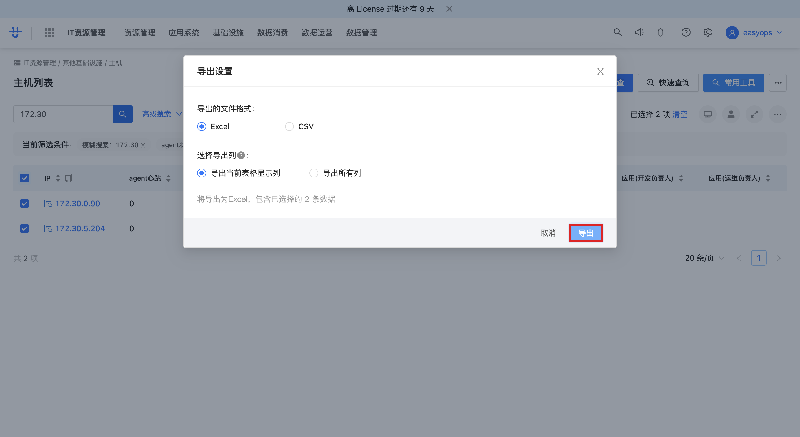
> 🔗 本步调用：POST `/next/api/gateway/cmdb.instance.ExportInstanceExcel/export/object/HOST/instance/excel`（详见 openapi.yaml 的「实例导出」）

## 四、手工导入实例

通过 Excel 批量导入/更新实例，支持先上传解析校验、再确认提交。

### 步骤 1：打开下拉并选择「手工导入」
<!-- step_id: 26 -->
点击列表上方下拉触发器，在菜单中选择「手工导入」，打开导入面板。
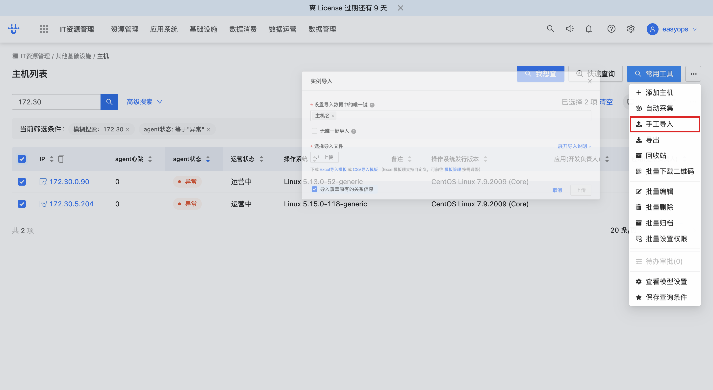

### 步骤 2：选择匹配字段并上传文件
<!-- api: POST .../cmdb.instance.ImportInstanceWithExcel/import/object/HOST/instance/excel | tag: 实例导入 | step_id: 33 -->
在「上传」前选择用于匹配实例的字段（如 `外网ip`/`IP`），再点击「上传」选择 Excel 文件；上传后服务端解析并返回新增/更新计数。
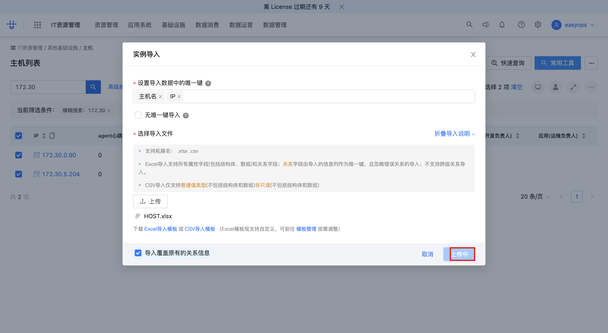
> 🔗 本步调用：POST `/next/api/gateway/cmdb.instance.ImportInstanceWithExcel/import/object/HOST/instance/excel`（详见 openapi.yaml 的「实例导入」）

### 步骤 3：查看导入说明（可选）
<!-- step_id: 32 -->
点击「展开导入说明」可查看字段填写规则与注意事项。
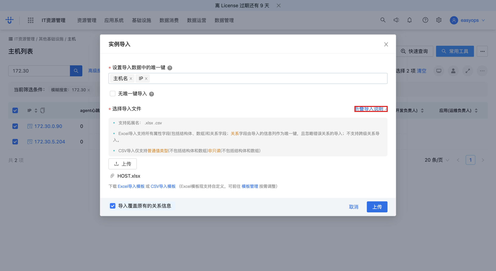

### 步骤 4：处理校验失败项
<!-- step_id: 34 -->
若存在校验失败，点击 `checkFailedDetail` 查看失败明细。
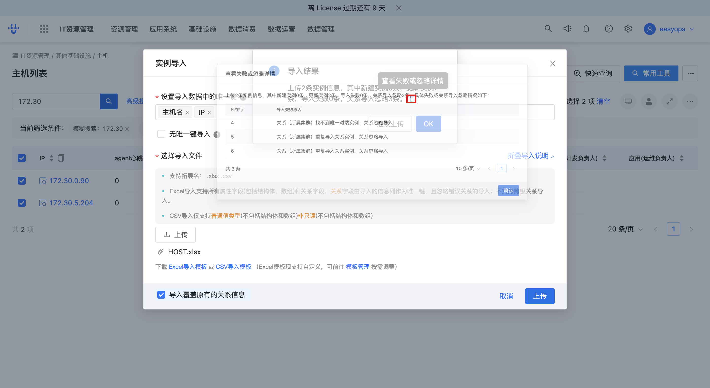

### 步骤 5：确认导入结果
<!-- step_id: 35 -->
确认无误后点击「确认」→「OK」完成本次导入流程。
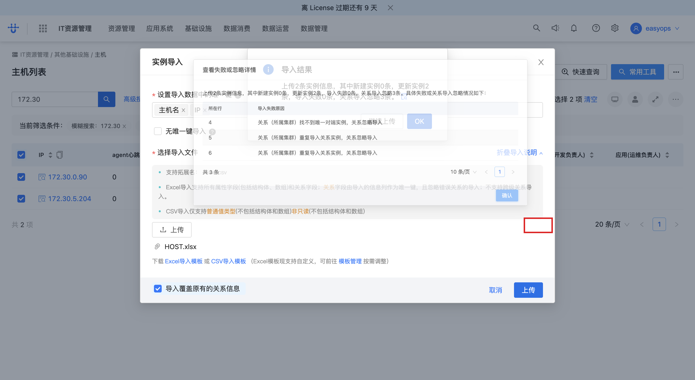

## 五、批量编辑实例

对列表中选中的多个实例批量修改某个字段值。

### 步骤 1：打开下拉并选择「批量编辑」
<!-- api: GET .../permission.permission... | tag: 实例审批 | step_id: 38 -->
点击下拉触发器，选择「批量编辑」，打开批量编辑弹窗。
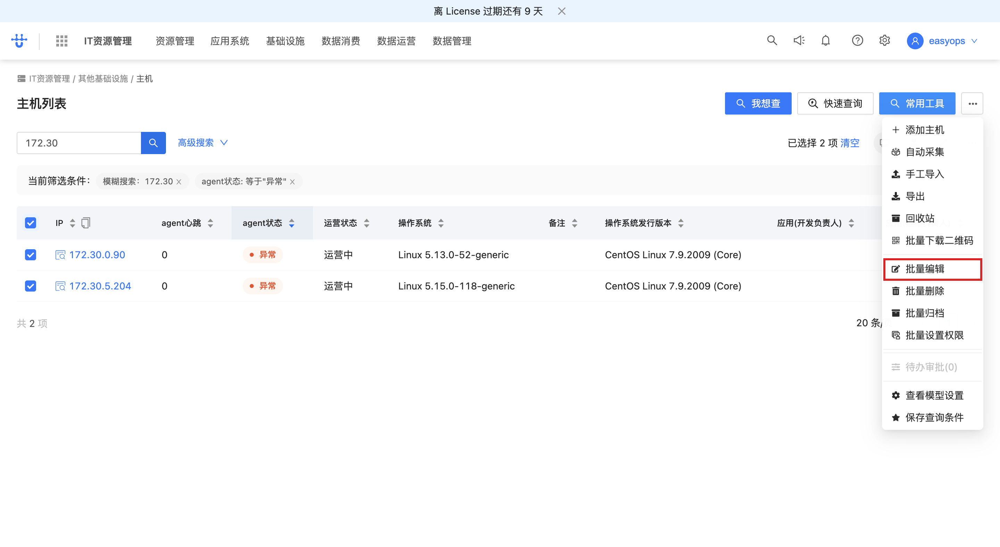

### 步骤 2：选择目标字段并填入新值
<!-- step_id: 40 -->
选择要修改的字段（如「用途」），在输入框中填入新值（如 `备机`）。
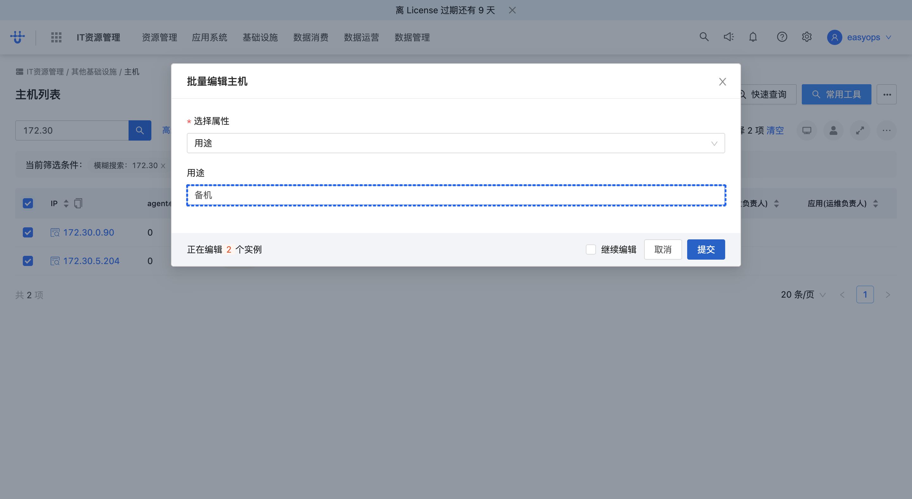

### 步骤 3：提交批量更新
<!-- api: POST .../cmdb.instance.ImportInstance/object/HOST/instance/_import | tag: 实例导入 | step_id: 41 -->
点击「提交」，批量更新选中的实例（底层复用 `_import` 批量接口，按 `instanceId` 更新）。
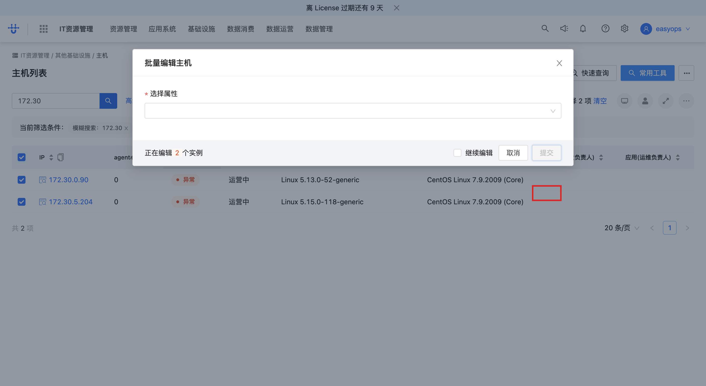
> 🔗 本步调用：POST `/next/api/gateway/cmdb.instance.ImportInstance/object/HOST/instance/_import`（详见 openapi.yaml 的「实例导入」）
> ⚠️ 注意：批量编辑与手工导入共用 `_import` 接口，靠请求体中的 `keys`（匹配键）和 `datas` 区分新增/更新。

## 六、批量删除实例

将列表中选中的多个实例批量归档删除。

### 步骤 1：打开下拉并选择「批量删除」
<!-- step_id: 43 -->
点击下拉触发器，选择「批量删除」，打开确认弹窗。
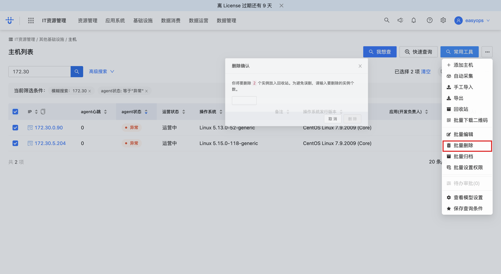

### 步骤 2：输入确认数量
<!-- step_id: 44 -->
在确认框中输入选中实例的数量（如 `2`）以二次确认。
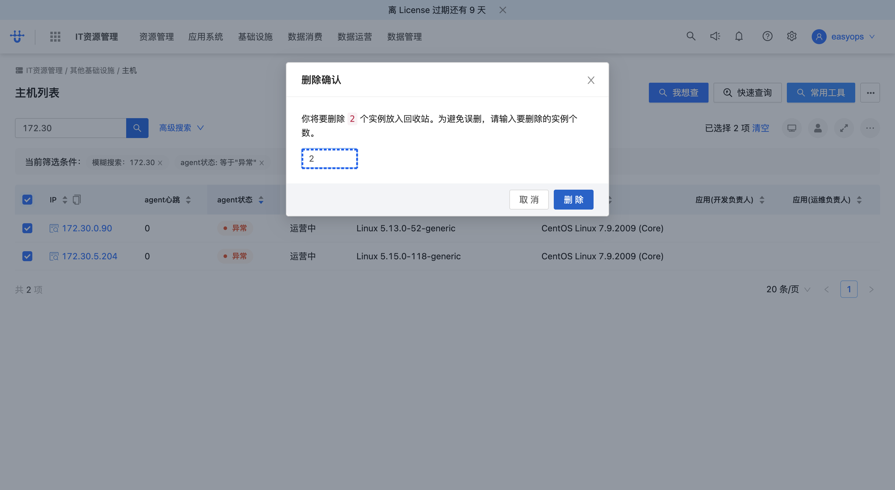

### 步骤 3：点击「删除」并关闭
<!-- api: POST .../cmdb.instance_archive.BatchArchiveInstance/object/HOST/instance_archive_instances | tag: 实例批量删除 | step_id: 45 -->
点击「删 除」执行批量归档，完成后关闭弹窗。
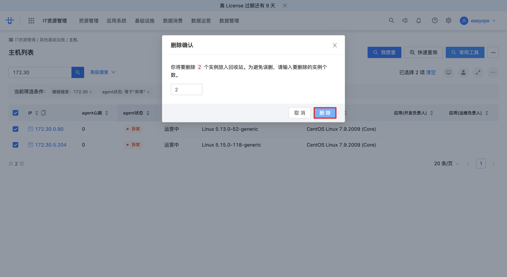
> 🔗 本步调用：POST `/next/api/gateway/cmdb.instance_archive.BatchArchiveInstance/object/HOST/instance_archive_instances`（详见 openapi.yaml 的「实例批量删除」）

## 七、查看实例详情与管理关系

点击单个实例进入详情页，查看实例各字段与关联关系，并可在关系页添加/移除关联（如所属应用）。

### 步骤 1：点击实例进入详情
<!-- url: next-cmdb-instance-management/next/HOST/instance/{instanceId} | api: GET .../cmdb.instance.GetDetail/object/HOST/instance/{instanceId} | tag: 实例查询 | step_id: 49 -->
在列表中点击某个实例（如 `172.16.108.108`），进入实例详情页，加载实例完整字段。
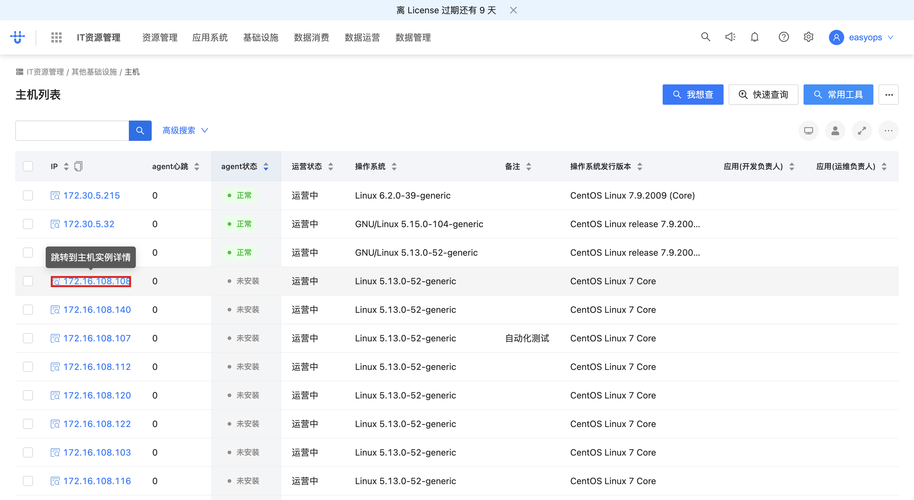
> 🔗 本步调用：GET `/next/api/gateway/cmdb.instance.GetDetail/object/HOST/instance/{instanceId}`（详见 openapi.yaml 的「实例查询」）

### 步骤 2：查看实例关系 Tab
<!-- url: next-cmdb-instance-management/next/HOST/instance/{instanceId}?type=relation&name={relationName} | step_id: 52 -->
切换到「实例关系」，查看该实例的其它关联资源（资产、所属集群、所属应用、部署记录等）。
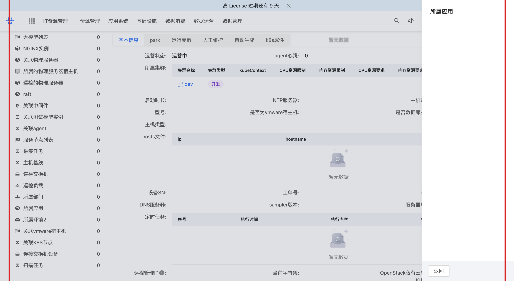

### 步骤 3：添加所属应用
<!-- api: POST .../cmdb.instance_relation.Append/object/HOST/relation/HOST_APP/append | tag: 实例关系 | step_id: 55 -->
点击「管理」→「添加所属应用」，在弹窗中勾选要关联的应用并「确定」，建立 HOST↔APP 关联。
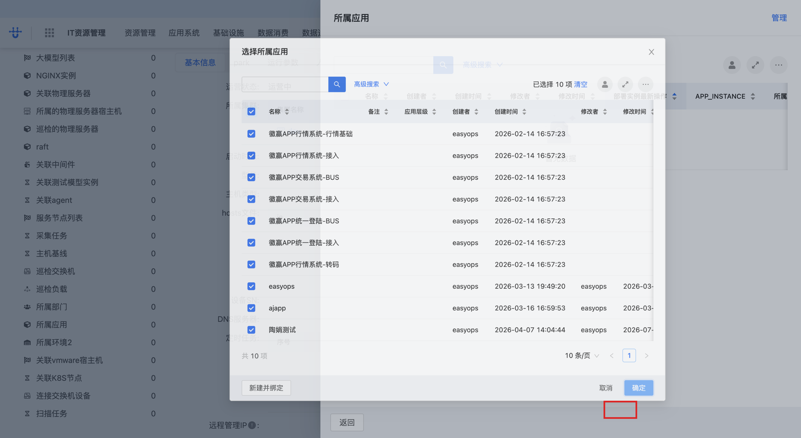
> 🔗 本步调用：POST `/next/api/gateway/cmdb.instance_relation.Append/object/HOST/relation/HOST_APP/append`（详见 openapi.yaml 的「实例关系」）

### 步骤 4：移除所属应用
<!-- api: POST .../cmdb.instance_relation.Remove/object/HOST/relation/HOST_APP/remove | tag: 实例关系 | step_id: 58 -->
点击「管理」→「移除所属应用」，选择要解除关联的应用并「确定」。
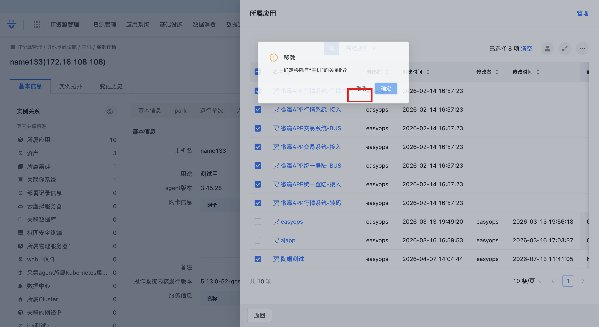
> 🔗 本步调用：POST `/next/api/gateway/cmdb.instance_relation.Remove/object/HOST/relation/HOST_APP/remove`（详见 openapi.yaml 的「实例关系」）

## 八、编辑单个实例

修改单个实例的字段值并保存。

### 步骤 1：进入编辑页
<!-- url: next-cmdb-instance-management/next/HOST/instance/{instanceId}/edit | step_id: 59 -->
在详情页点击「编辑」，进入实例编辑表单。
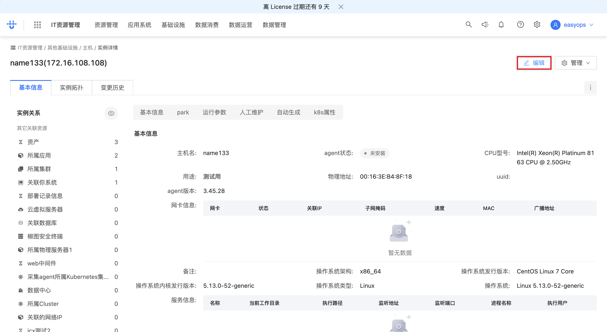

### 步骤 2：修改字段值
<!-- step_id: 60 -->
在表单中修改目标字段（如「用途」改为 `测试用11`）。
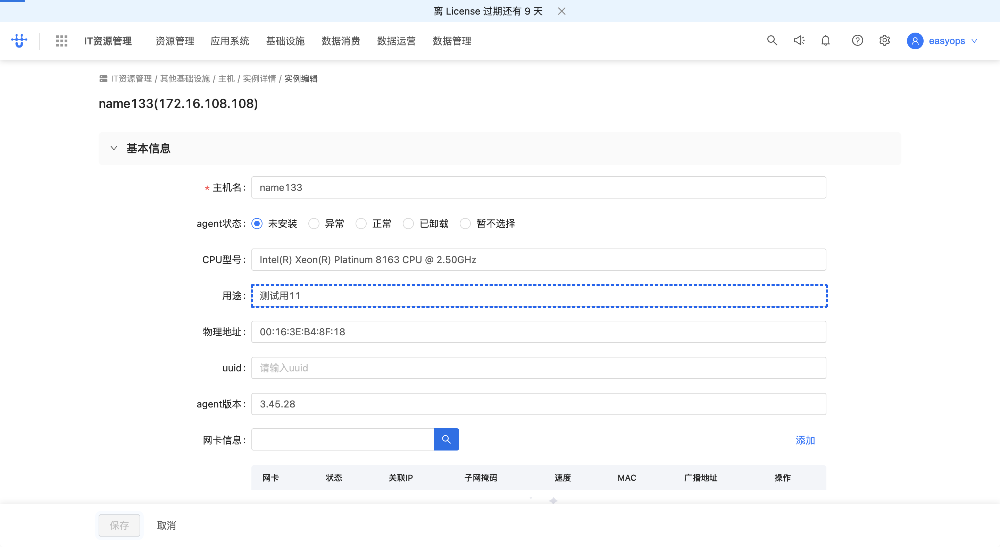

### 步骤 3：保存
<!-- api: PUT .../cmdb.instance.UpdateInstance/object/HOST/instance/{instanceId} | tag: 实例编辑 | step_id: 61 -->
点击「保存」，提交实例更新。
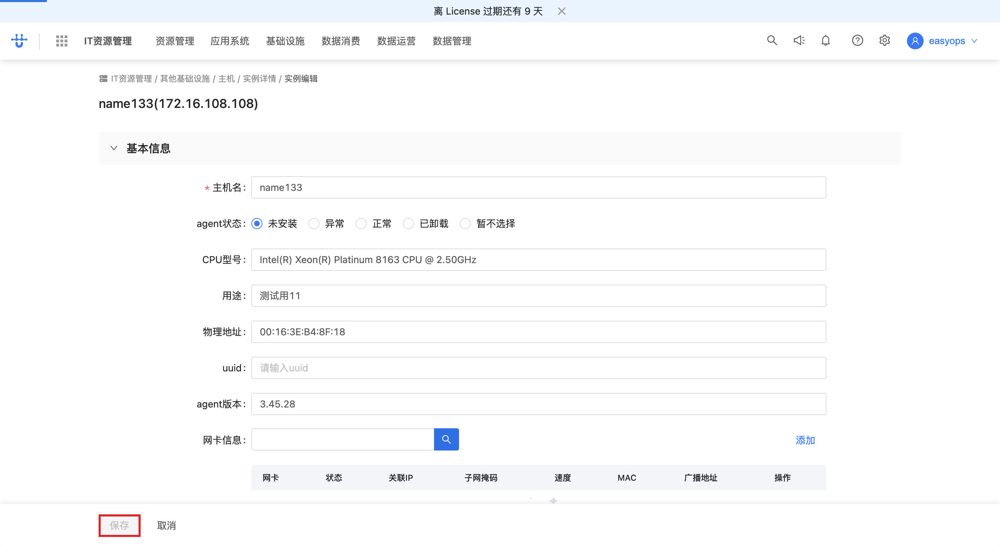
> 🔗 本步调用：PUT `/next/api/gateway/cmdb.instance.UpdateInstance/object/HOST/instance/{instanceId}`（详见 openapi.yaml 的「实例编辑」）

## 九、删除单个实例

将单个实例归档删除。

### 步骤 1：打开「管理」菜单
<!-- step_id: 62 -->
在详情页点击「管理」，展开操作菜单。
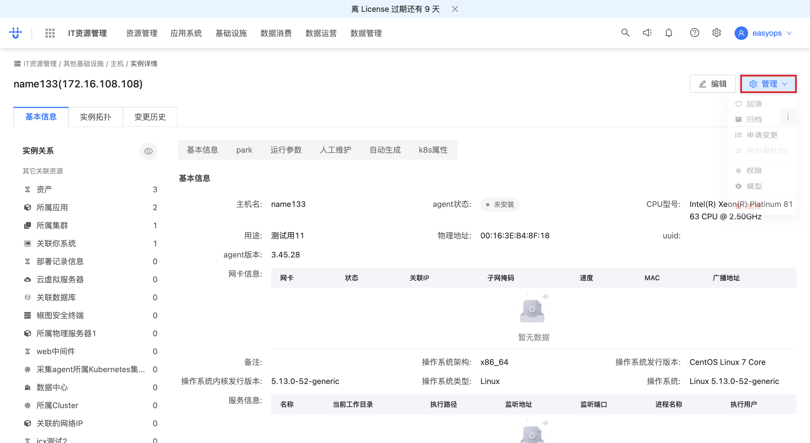

### 步骤 2：点击「删除」并确认
<!-- api: POST .../cmdb.instance_archive.ArchiveInstance/object/HOST/instance_archive/{instanceId} | tag: 实例删除 | step_id: 64 -->
在菜单中点击「删除」，二次确认后归档该实例。
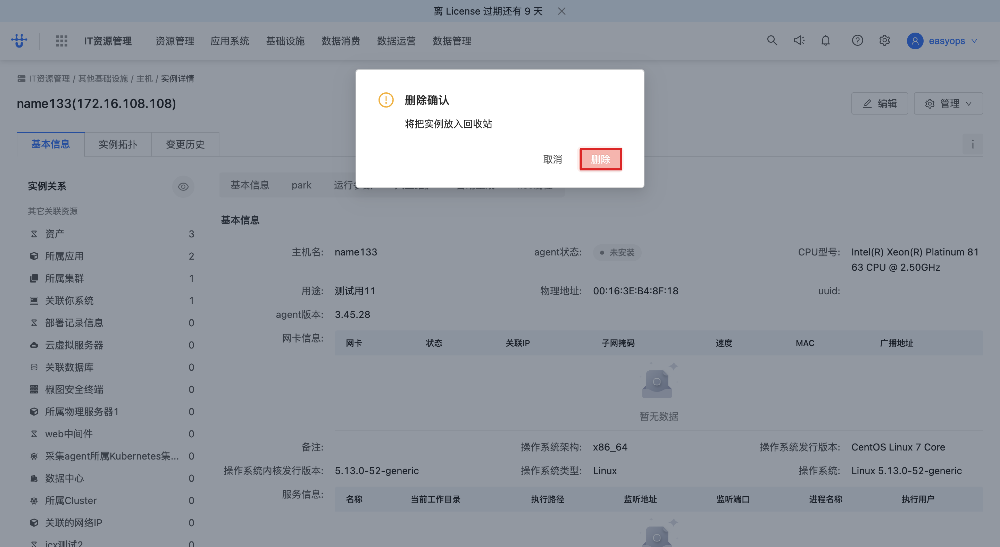
> 🔗 本步调用：POST `/next/api/gateway/cmdb.instance_archive.ArchiveInstance/object/HOST/instance_archive/{instanceId}`（详见 openapi.yaml 的「实例删除」）

## 附：本流程接口速查

| tag | 方法 | 路径(简) | 用途 | 步骤 |
| --- | --- | --- | --- | --- |
| 实例查询 | POST | `.../v3/object/{objectId}/instance/_search` | 列表/关键词/高级搜索 | 二·1、二·5 |
| 实例查询 | POST | `.../object/{objectId}/instance/validate` | 实例校验 | 一·3 |
| 实例查询 | GET | `.../object/{objectId}/instance/{instanceId}` | 实例详情 | 七·1 |
| 实例导出 | POST | `.../export/object/{objectId}/instance/excel` | 导出 Excel | 三·2 |
| 实例导入 | POST | `.../import/object/{objectId}/instance/excel` | 上传解析 | 四·2 |
| 实例导入 | POST | `.../object/{objectId}/instance/_import` | 提交导入/批量更新 | 五·3 |
| 实例批量删除 | POST | `.../object/{objectId}/instance_archive_instances` | 批量归档删除 | 六·3 |
| 实例关系 | POST | `.../object/{objectId}/relation/{relationId}/append` | 添加关联（如所属应用） | 七·3 |
| 实例关系 | POST | `.../object/{objectId}/relation/{relationId}/remove` | 移除关联 | 七·4 |
| 实例编辑 | PUT | `.../object/{objectId}/instance/{instanceId}` | 更新单个实例 | 八·3 |
| 实例删除 | POST | `.../object/{objectId}/instance_archive/{instanceId}` | 单个归档删除 | 九·2 |
| 模型与视图配置 | GET | `.../cmdb_object.GetDetail/object/{objectId}` | 模型字段定义 | 一·3 |
| 模型与视图配置 | GET | `.../instance.GetListDisplayView/object/{objectId}/list/view` | 列表展示视图 | 一·3 |
| 模型与视图配置 | GET | `.../cmdb_object.GetObjectRef/object_ref` | 关系引用定义 | 七·2 |
| 实例审批 | GET | `.../cmdb_approve.ListRuleConfig/api/v1/rule/config` | 操作审批规则 | 三·1 |
| 实例审批 | GET | `.../cmdb_approve.GetApproveCount/api/v1/approve/count` | 待审批计数 | 三·1 |
