# CMDB 模型管理 — 操作指引

> 适用场景：在 EasyOps CMDB 中管理「模型」（对象/Object）的全生命周期——列表查询、导入导出、新建模型、配置字段与关系、视图与高级设置、编辑与删除。
> 示例模型：`LLM_TEST`（演示用）。配套接口见同目录 [`CMDB-模型管理-openapi.yaml`](./CMDB-模型管理-openapi.yaml)

## 目录

- [一、进入模型管理](#一进入模型管理)
- [二、搜索与导出模型](#二搜索与导出模型)
- [三、导入模型](#三导入模型)
- [四、新建模型](#四新建模型)
- [五、字段（属性）管理](#五字段属性管理)
- [六、关系管理](#六关系管理)
- [七、模型视图配置](#七模型视图配置)
- [八、高级设置](#八高级设置)
- [九、字段编辑与删除](#九字段编辑与删除)
- [十、删除模型](#十删除模型)
- [附：本流程接口速查](#附本流程接口速查)

<!-- deep-links: 本流程关键页面直达(SPA 路径,去掉 host 前缀,参数化)
  模型列表:    cmdb-model-management
  模型导入:    cmdb-model-management/import
  模型详情:    cmdb-model-management/object/{objectId}/detail
  模型视图:    cmdb-model-management/object/{objectId}/view
  高级设置:    cmdb-model-management/object/{objectId}/advanced-setting
-->

---

## 一、进入模型管理

从 CMDB 资源管理页进入模型管理。模型管理用于维护模型（对象）的定义、字段、关系，区别于「资源管理」维护模型实例。

### 步骤 1：从资源管理进入模型管理

在资源管理页顶部导航，点击 **「数据管理」** 等资源域后会展开功能入口，找到 **模型管理** 进入（`/next/cmdb-model-management`）。

<!-- url: next-cmdb-instance-management | step_id: 1 -->
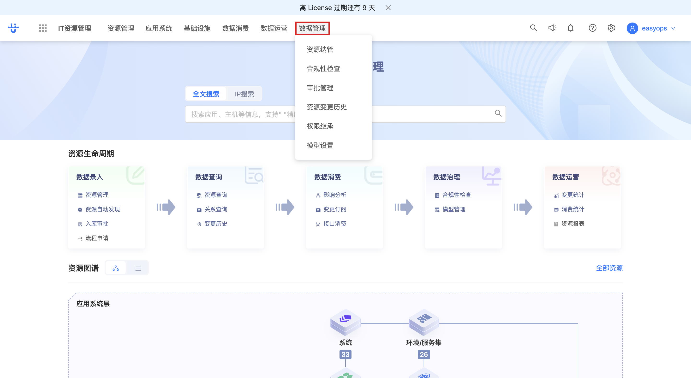

### 步骤 2：查看模型列表

进入模型管理后，默认显示模型列表（卡片/表格形式），顶部有分类标签（如 IT 资源管理、应用资源）与搜索框。页面加载时拉取模型基础信息与模型分类。

<!-- url: cmdb-model-management | api: GET /next/api/gateway/cmdb.cmdb_object.ListObjectBasic/object_basic | tag: 模型列表与详情 | step_id: 2 -->
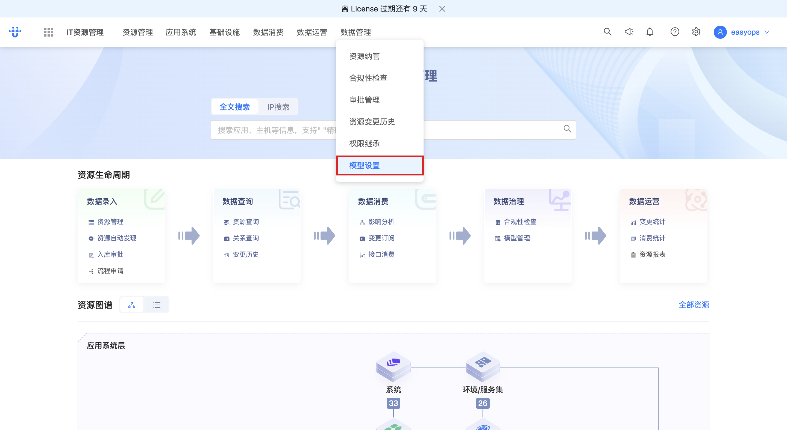

> 🔗 本步调用：GET `.../cmdb_object.ListObjectBasic/object_basic`、GET `.../cmdb_object.ListObjectCategoryV2/v2/object_category`（详见 openapi.yaml 的「模型列表与详情」）

### 步骤 3：按分类筛选

点击顶部分类标签（如 **应用资源**）筛选该分类下的模型。

<!-- step_id: 3 -->
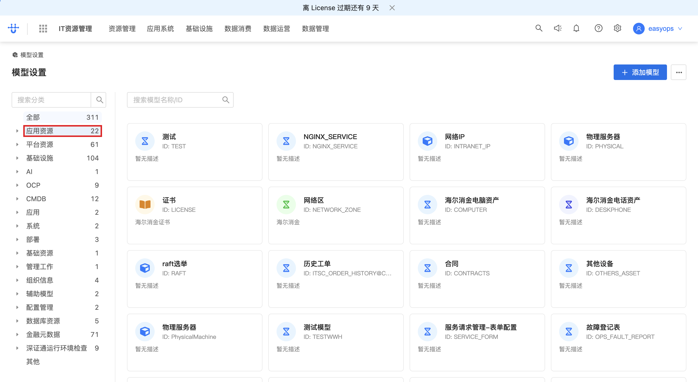

### 步骤 4：查看全部模型

点击 **「全部」** 清除筛选，查看所有模型。

<!-- step_id: 4 -->
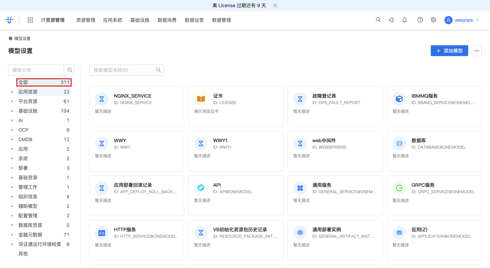

---

## 二、搜索与导出模型

### 步骤 1：搜索模型

在搜索框 **「搜索模型名称/ID」** 输入关键字（如 `TEST`、`测试`），实时过滤模型列表。

⚠️ 文本输入过程不单独截图，下图是输入后的结果态。

<!-- step_id: 6 -->
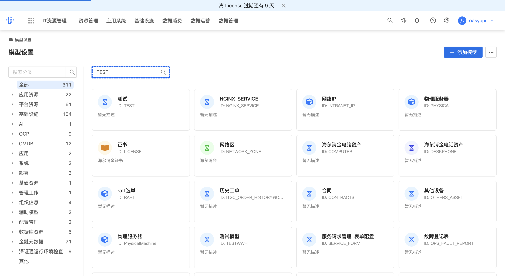

### 步骤 2：导出模型

点击列表中的 **下拉菜单（dropdown-trigger）**，选择 **「导出模型」**，将选中模型导出为文件。

<!-- api: POST /next/api/gateway/cmdb.cmdb_object.ExportObjectV2/v2/object_export | tag: 模型导入导出 | step_id: 10 -->
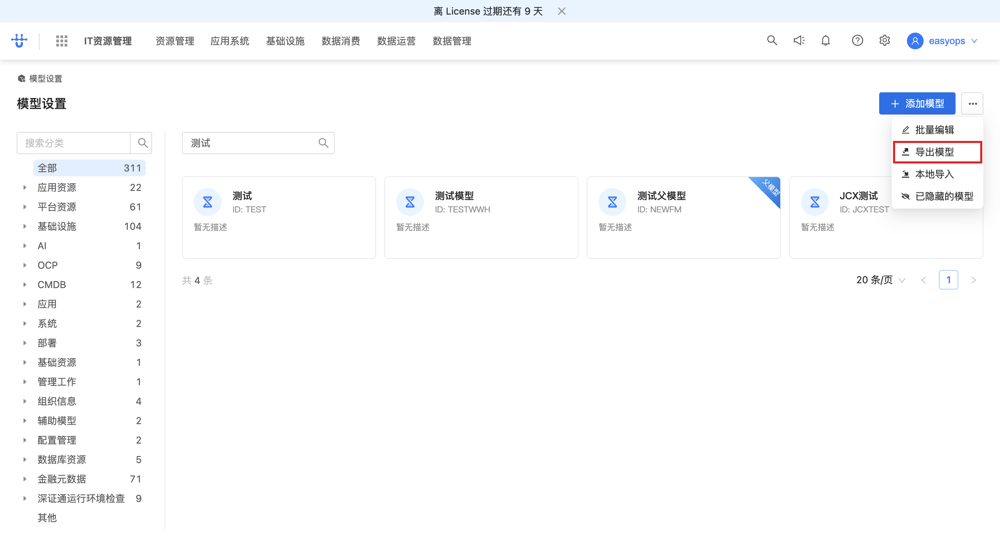

> 🔗 本步调用：POST `.../cmdb_object.ExportObjectV2/v2/object_export`（body: `{ objectIds: [...] }`，详见 openapi.yaml 的「模型导入导出」）

### 步骤 3：勾选并批量导出

也可在列表中**勾选多个模型**（含全选），再点击 **「导出」** 批量导出。

<!-- step_id: 14 -->
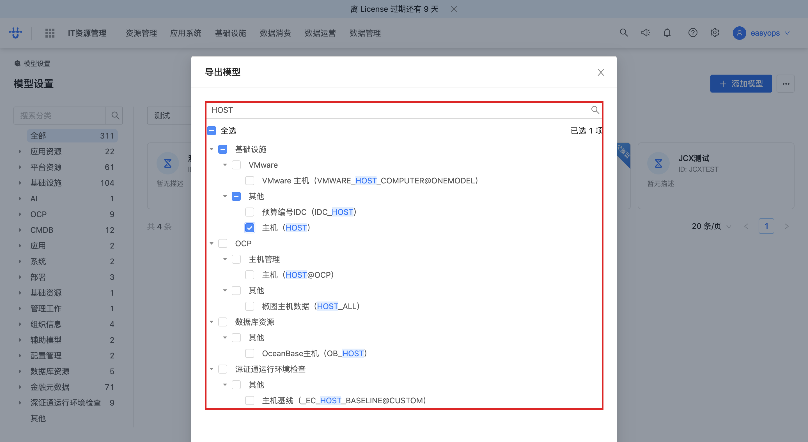

### 步骤 4：本地导入入口

同样在下拉菜单中选择 **「本地导入」**，进入导入页面（见第三节）。

<!-- step_id: 17 -->
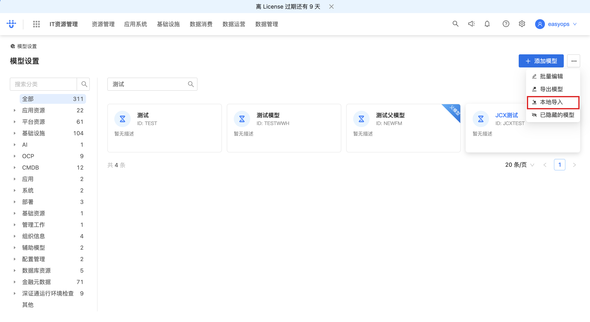

---

## 三、导入模型

进入 `cmdb-model-management/import` 页面，通过上传文件批量导入模型定义。

### 步骤 1：上传文件

在导入页点击/拖拽文件到 **「请点击或拖拽文件到此区域」**（文件 ≤10M）。上传后系统调用导入校验接口。

<!-- url: cmdb-model-management/import | api: POST /next/api/gateway/cmdb.cmdb_object.ImportCheckV2/v2/object_import_check | tag: 模型导入导出 | step_id: 18 -->
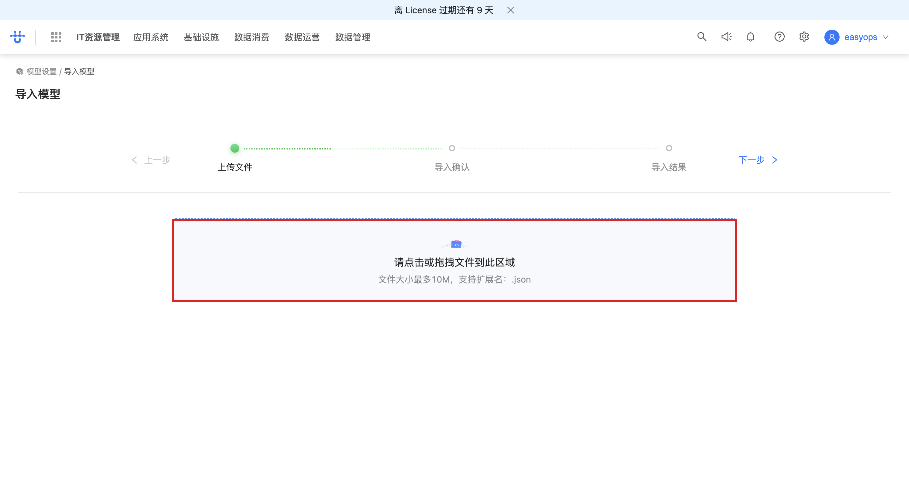

> 🔗 本步调用：POST `.../cmdb_object.ImportCheckV2/v2/object_import_check`（校验）、POST `.../custom.GetObjectUploadData/api/abjectGetUploadData`（取上传参数）

### 步骤 2：下一步（校验通过）

校验通过后点击 **「下一步」**，预览待导入内容。

<!-- step_id: 19 -->
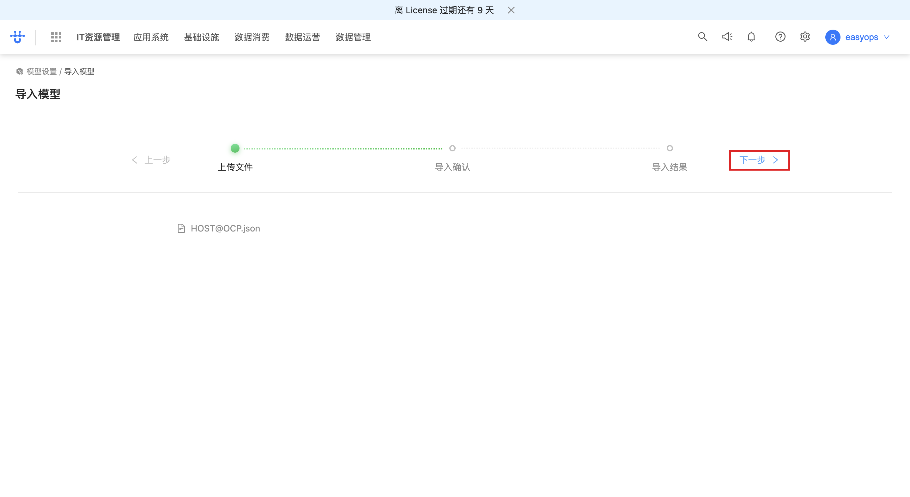

### 步骤 3：确认导入

再次点击 **「下一步」** 执行导入，系统调用导入接口写入模型。

<!-- api: POST /next/api/gateway/cmdb.cmdb_object.ImportV2/v2/object_import | tag: 模型导入导出 | step_id: 20 -->
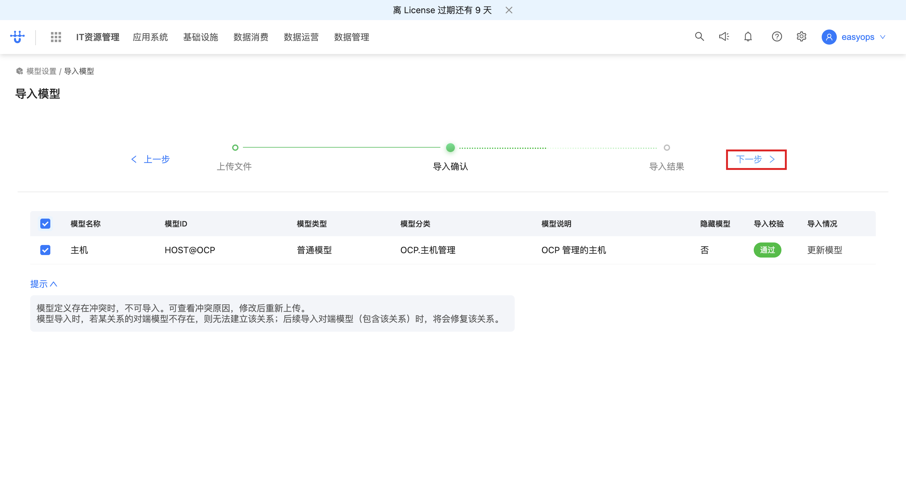

> 🔗 本步调用：POST `.../cmdb_object.ImportV2/v2/object_import`（body: `{ object_list: [...], ignore_dst_relation: true }`）

### 步骤 4：返回模型列表

导入完成后点击 **「返回模型列表」** 回到列表页。

<!-- step_id: 21 -->
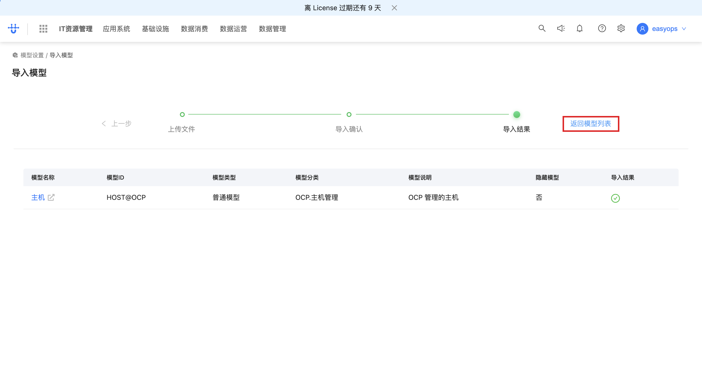

---

## 四、新建模型

### 步骤 1：点击「添加模型」

在模型列表页点击 **下拉菜单 →「添加模型」**，弹出新建模型表单。

<!-- step_id: 29 -->
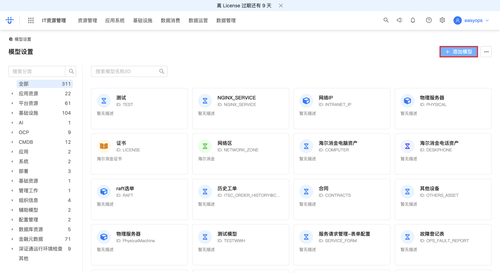

### 步骤 2：填写模型 ID 与名称

- **模型 ID**（objectId）：1-47 个字符，以大写字母开头，只能包含大写字母、数字、下划线，如 `LLM_TEST`
- **资源名称**（name）：模型的显示名称，如 `测试`

⚠️ 文本输入过程不单独截图，下图是输入后的表单态。

<!-- step_id: 31 -->
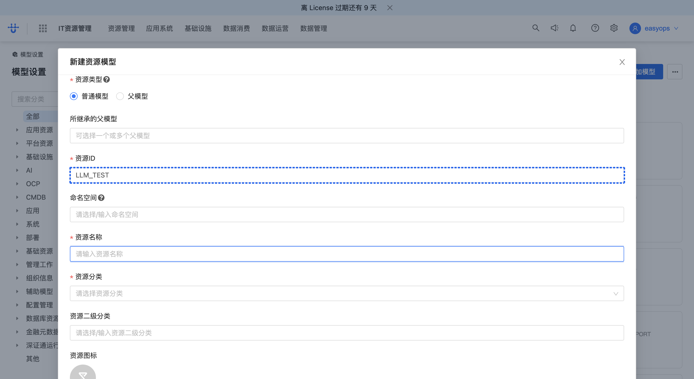

### 步骤 3：选择分类与高级选项

- **分类**（category）：选择模型所属资源域，如 **AI**
- 可展开 **「高级设置」** 配置更多选项（开关类）

<!-- step_id: 34 -->
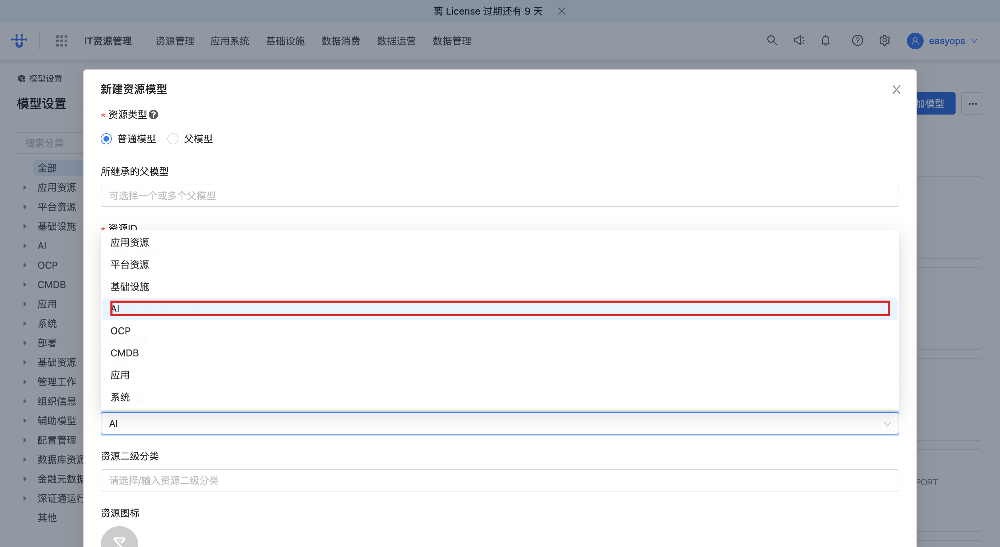

### 步骤 4：保存创建

点击 **「保存」** 创建模型。系统调用创建接口，成功后可在列表中看到新模型 `LLM_TEST`，并自动加载其详情。

<!-- api: POST /next/api/gateway/cmdb.cmdb_object.Create/object | tag: 模型创建与更新 | step_id: 43 -->
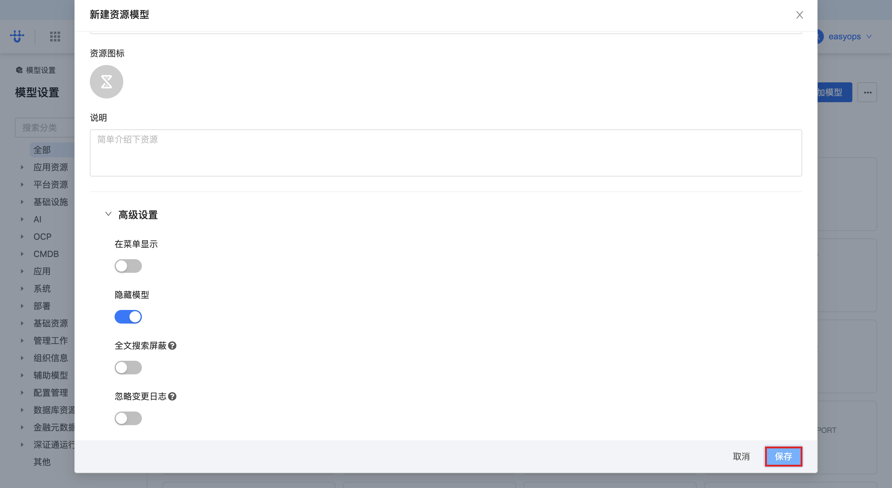

> 🔗 本步调用：POST `.../cmdb_object.Create/object`（body 含 `objectId`/`name`/`category`/`system` 等，详见 openapi.yaml 的「模型创建与更新」）

---

## 五、字段（属性）管理

进入模型详情页（`/object/LLM_TEST/detail`），管理模型的属性字段。本节演示新建不同类型的属性。

### 步骤 1：进入字段 tab 并新建属性

在模型详情页 **「字段」** tab 下点击 **新建属性按钮**，弹出属性表单。

<!-- url: object/{objectId}/detail | step_id: 47 -->
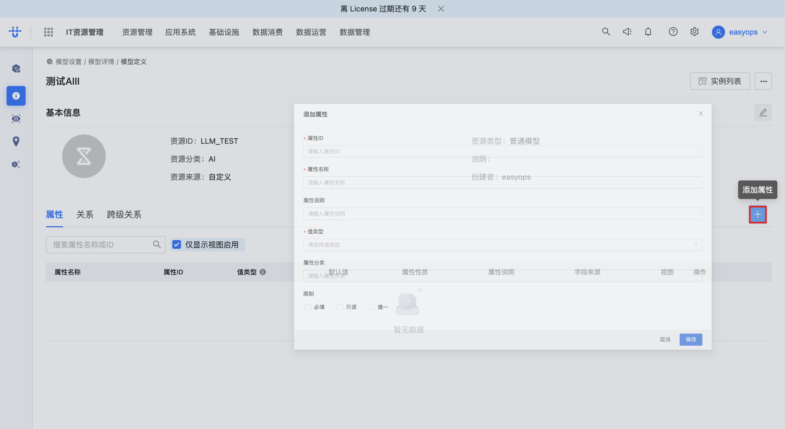

### 步骤 2：填写属性 ID 与名称

- **属性 ID**（id）：如 `attr1`
- **属性名称**（name）：如 `属性1`

<!-- step_id: 48 -->
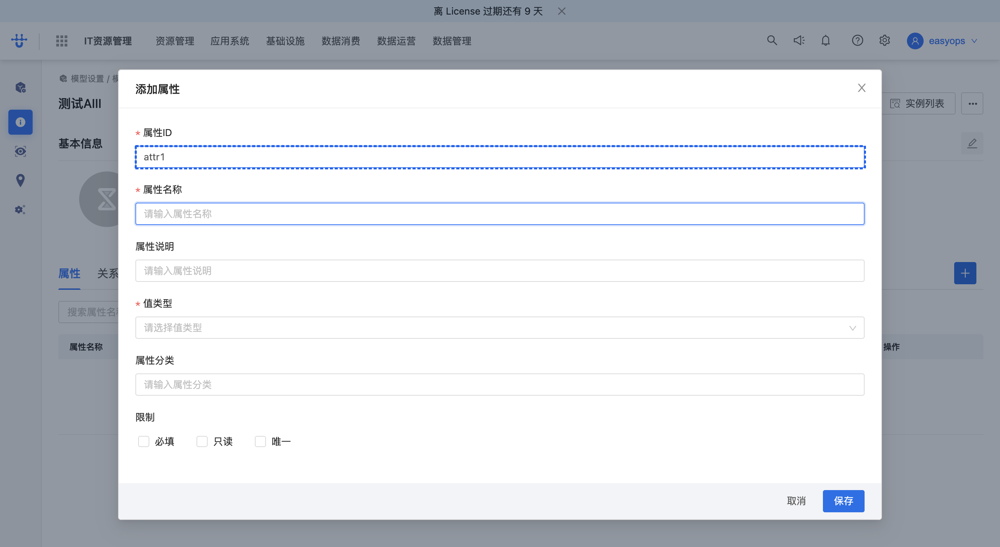

### 步骤 3：选择类型与标签

- **值类型**（value.type）：如 **浮点型**（float）/ 字符型（string）/ 时间（datetime）
- **标签**（tag）：**基础** / **扩展**（决定字段归属分组）
- 可勾选 **「必填」**

<!-- step_id: 52 -->
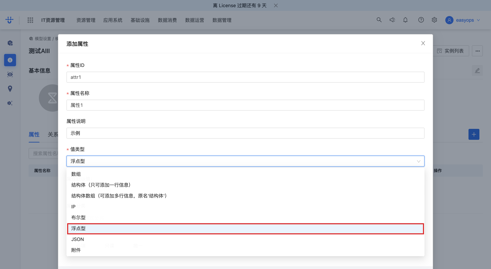

### 步骤 4：保存属性

点击 **「保存」** 创建属性，系统调用属性创建接口。

<!-- api: POST /next/api/gateway/cmdb.object_attribute.Create/object/LLM_TEST/attr | tag: 字段管理 | step_id: 55 -->
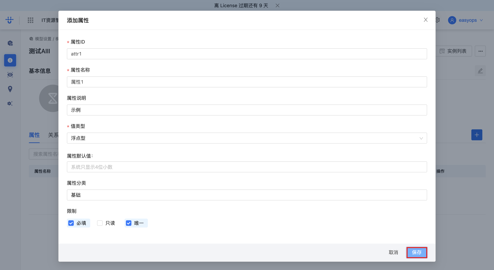

> 🔗 本步调用：POST `.../object_attribute.Create/object/{objectId}/attr`（body 含 `id`/`name`/`value{type}`/`tag`/`required` 等）

💡 重复上述步骤可继续添加字符型（`attr2`）、时间型（`attr3`）等不同类型属性。

---

## 六、关系管理

在模型详情页 **「关系」** tab 下，配置本模型与其他模型的关联关系。

### 步骤 1：新建关系

点击 **「关系」** tab → 新建关系按钮，选择关联的目标模型（如 **智能体 `AGENT@AI`**）。

<!-- step_id: 71 -->
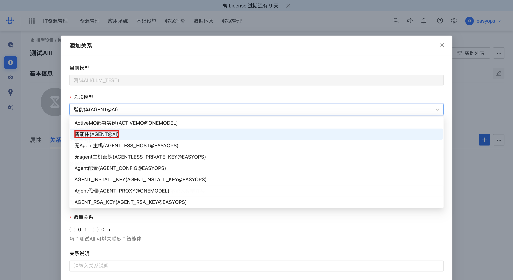

### 步骤 2：填写关系名称与 ID

- **关系名称**（如 `关联智能体`）
- **关系 ID**：1-32 个字符，仅字母/数字/下划线，如 `AGENT`/`TEST_AIII`

<!-- step_id: 73 -->
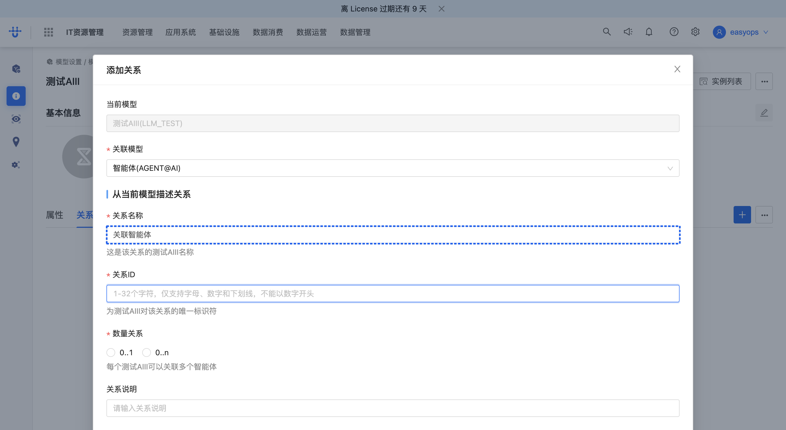

### 步骤 3：确定创建

点击 **「确定」** 创建关系，系统调用关系创建接口。

<!-- api: POST /next/api/gateway/cmdb.object_relation.Create/object_relation | tag: 关系管理 | step_id: 78 -->
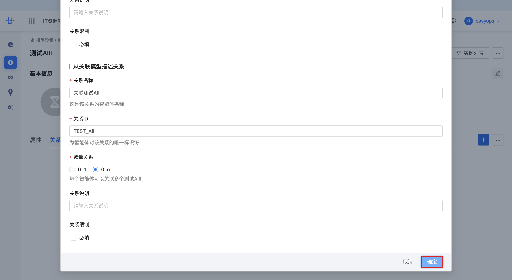

> 🔗 本步调用：POST `.../object_relation.Create/object_relation`（body 含 `left_object_id`/`right_object_id`/`left_id`/`right_description` 等）

---

## 七、模型视图配置

进入模型视图页（`/object/LLM_TEST/view`），配置字段的分组排序与展示。

### 步骤 1：调整字段排序与分组

在视图页可拖动调整 **字段排序**、配置 **字段启用** 与分组顺序（如「扩展」「基础」分组顺序）。

<!-- url: object/{objectId}/view | step_id: 82 -->
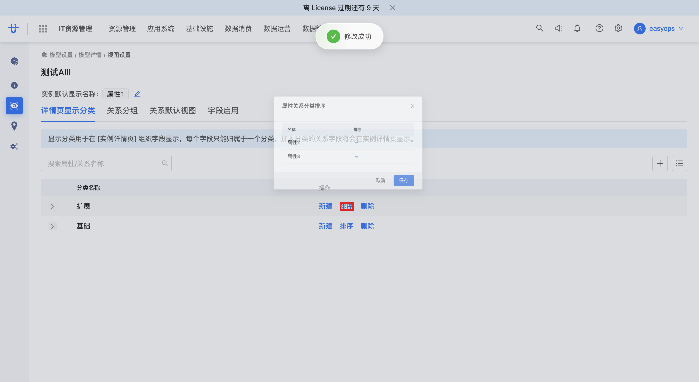

### 步骤 2：保存视图

点击 **「保存」** 提交视图配置。

<!-- api: PUT /next/api/gateway/logic.cmdb.service/object_view/LLM_TEST | tag: 模型视图 | step_id: 86 -->
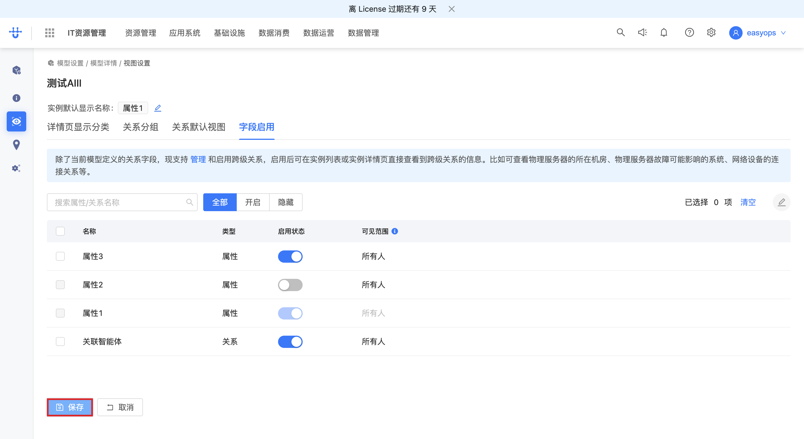

> 🔗 本步调用：PUT `.../cmdb.service/object_view/{objectId}`（body: `{ view: { attr_category_order: [...] } }`）

---

## 八、高级设置

进入高级设置页（`/object/LLM_TEST/advanced-setting`），配置全文搜索屏蔽与变更日志屏蔽。

### 步骤 1：全文搜索屏蔽

在 **「全文搜索屏蔽」** 区域，选择 **屏蔽当前模型** 或 **屏蔽指定字段**（勾选要屏蔽的字段，如属性1/属性2）。

<!-- url: object/{objectId}/advanced-setting | step_id: 89 -->
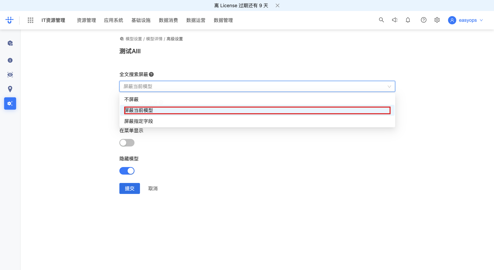

### 步骤 2：实例变更日志屏蔽

在 **「实例变更日志屏蔽」** 区域，同样选择屏蔽当前模型或指定字段。

<!-- step_id: 94 -->
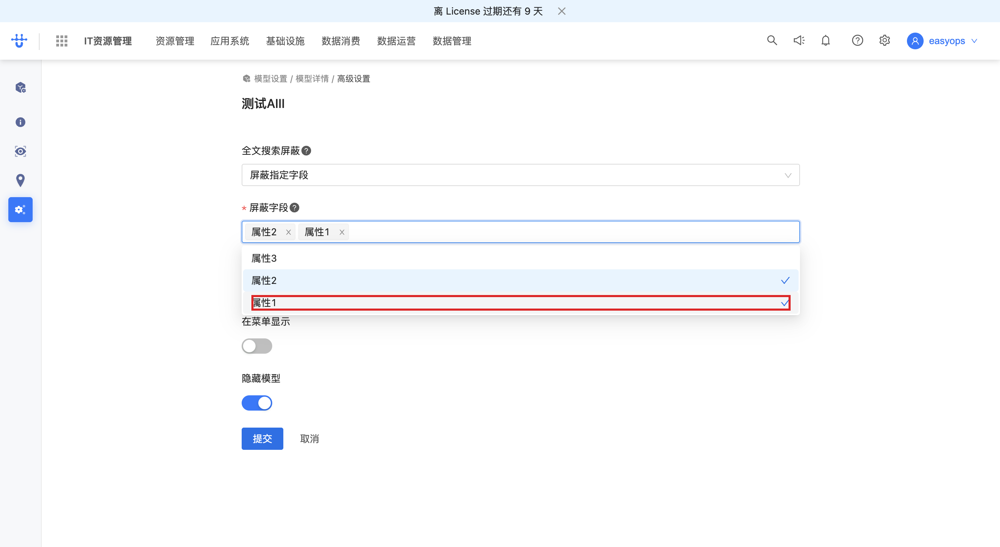

### 步骤 3：提交高级设置

点击 **「提交」** 保存高级设置，系统会依次更新全文索引屏蔽、通知屏蔽，并整体更新模型。

<!-- api: PUT /next/api/gateway/cmdb.cmdb_object.UpdateV2/v2/object/LLM_TEST | tag: 高级设置 | step_id: 104 -->
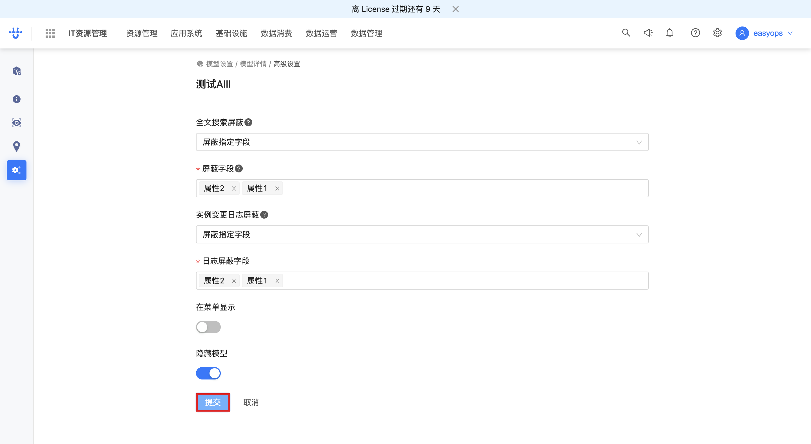

> 🔗 本步调用：POST `.../cmdb_object.AlertWordIndex/object_word_index/{objectId}`、PUT `.../cmdb_object.AlertNotifyDenied/object_notify_denied/{objectId}`、PUT `.../cmdb_object.UpdateV2/v2/object/{objectId}`（详见 openapi.yaml 的「高级设置」）

---

## 九、字段编辑与删除

回到模型详情字段 tab，对已存在的属性进行编辑或删除。

### 步骤 1：编辑属性

点击属性行的 **「编辑」**，修改属性名称（如改为 `属性32`），保存。

<!-- url: object/{objectId}/detail | api: PUT /next/api/gateway/cmdb.cmdb_object.UpdateProperty/object/LLM_TEST/attr/attr3 | tag: 字段管理 | step_id: 106 -->
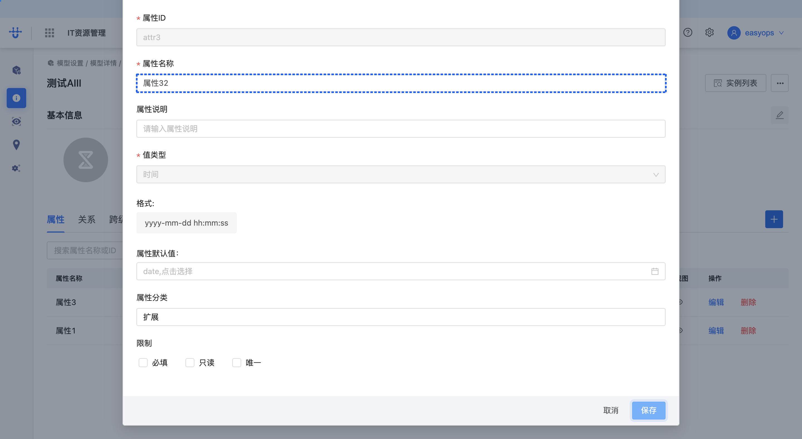

> 🔗 本步调用：PUT `.../cmdb_object.UpdateProperty/object/{objectId}/attr/{attrId}`（body 含 `name`/`value{...}`）

### 步骤 2：删除属性

点击属性行的 **「删除」** 并确认，删除该字段。

<!-- api: DELETE /next/api/gateway/cmdb.cmdb_object.DeleteProperty/object/LLM_TEST/attr/attr3 | tag: 模型与字段删除 | step_id: 111 -->
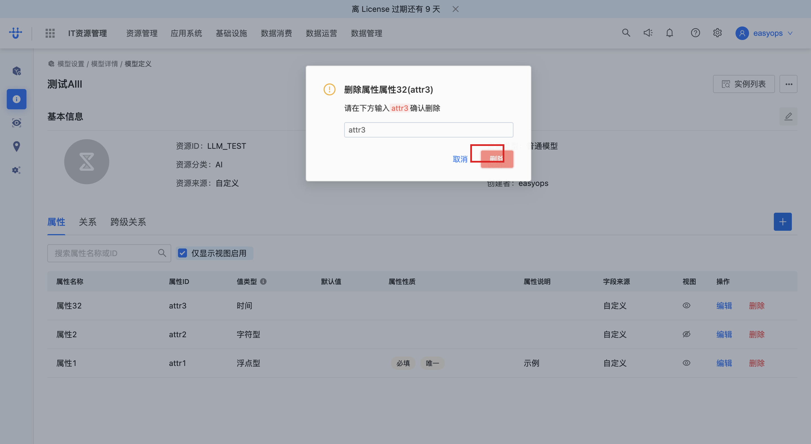

> 🔗 本步调用：DELETE `.../cmdb_object.DeleteProperty/object/{objectId}/attr/{attrId}`

---

## 十、删除模型

确认模型不再需要时，可删除整个模型（含其关系）。

### 步骤 1：删除关系（可选）

在关系 tab 选择关系 → **「删除」** 确认，删除指定关系。

<!-- api: DELETE /next/api/gateway/cmdb.object_relation.DeleteRelation/object_relation/{relationId} | tag: 模型与字段删除 | step_id: 118 -->
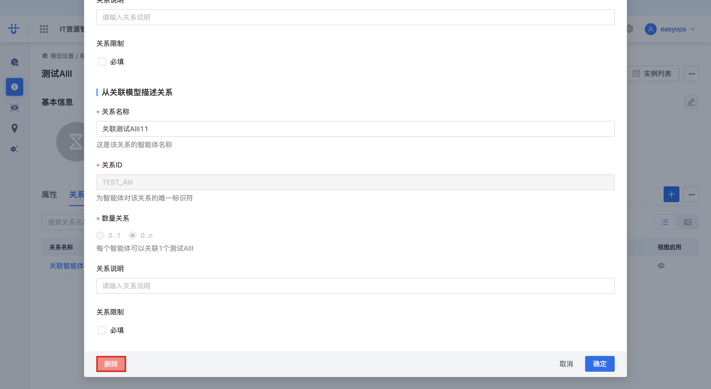

> 🔗 本步调用：DELETE `.../object_relation.DeleteRelation/object_relation/{relationId}`

### 步骤 2：删除模型

在模型详情页点击 **下拉菜单 →「删除资源」**，弹出二次确认；输入模型 ID（如 `LLM_TEST`）确认后点击 **「删除」**。

<!-- api: DELETE /next/api/gateway/cmdb.cmdb_object.DeleteObject/object/LLM_TEST | tag: 模型与字段删除 | step_id: 123 -->
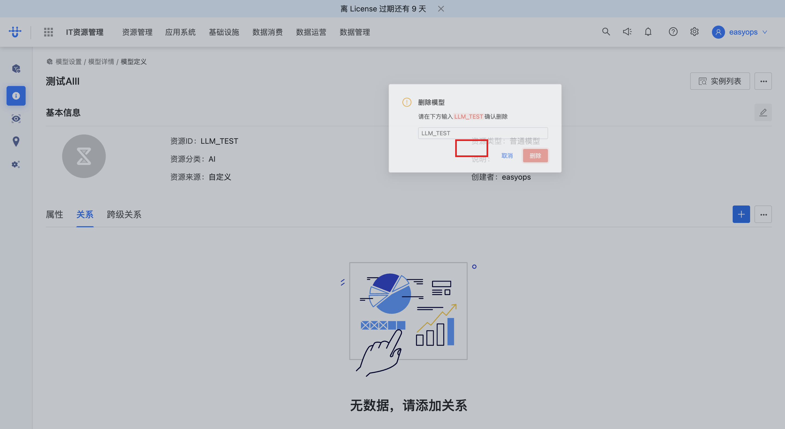

> 🔗 本步调用：DELETE `.../cmdb_object.DeleteObject/object/{objectId}`

⚠️ 删除模型不可恢复，会一并清除其所有字段、关系与实例，请谨慎操作。

---

## 附：本流程接口速查

| tag | 方法 | 路径(简) | 用途 | 步骤 |
| --- | --- | --- | --- | --- |
| 模型列表与详情 | GET | `.../cmdb_object.ListObjectBasic/object_basic` | 模型基础列表 | 一-2 |
| 模型列表与详情 | GET | `.../cmdb_object.ListObjectCategoryV2/v2/object_category` | 模型分类 | 一-2 |
| 模型列表与详情 | GET | `.../cmdb_object.GetDetail/object/{objectId}` | 模型详情 | 四-4 |
| 模型导入导出 | POST | `.../cmdb_object.ExportObjectV2/v2/object_export` | 导出模型 | 二-2 |
| 模型导入导出 | POST | `.../cmdb_object.ImportCheckV2/v2/object_import_check` | 导入校验 | 三-1 |
| 模型导入导出 | POST | `.../cmdb_object.ImportV2/v2/object_import` | 执行导入 | 三-3 |
| 模型创建与更新 | POST | `.../cmdb_object.Create/object` | 新建模型 | 四-4 |
| 模型创建与更新 | PUT | `.../cmdb_object.UpdateV2/v2/object/{objectId}` | 更新模型（含高级设置） | 八-3 |
| 字段管理 | POST | `.../object_attribute.Create/object/{objectId}/attr` | 新建属性 | 五-4 |
| 字段管理 | PUT | `.../cmdb_object.UpdateProperty/object/{objectId}/attr/{attrId}` | 编辑属性 | 九-1 |
| 关系管理 | POST | `.../object_relation.Create/object_relation` | 新建关系 | 六-3 |
| 模型视图 | PUT | `.../cmdb.service/object_view/{objectId}` | 保存视图 | 七-2 |
| 高级设置 | POST | `.../cmdb_object.AlertWordIndex/object_word_index/{objectId}` | 全文搜索屏蔽 | 八-3 |
| 模型与字段删除 | DELETE | `.../cmdb_object.DeleteProperty/object/{objectId}/attr/{attrId}` | 删除属性 | 九-2 |
| 模型与字段删除 | DELETE | `.../cmdb_object.DeleteObject/object/{objectId}` | 删除模型 | 十-2 |
