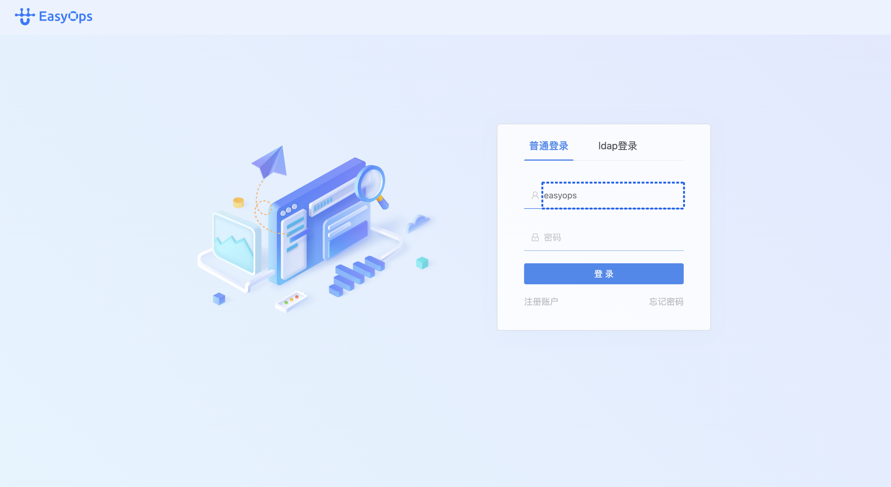
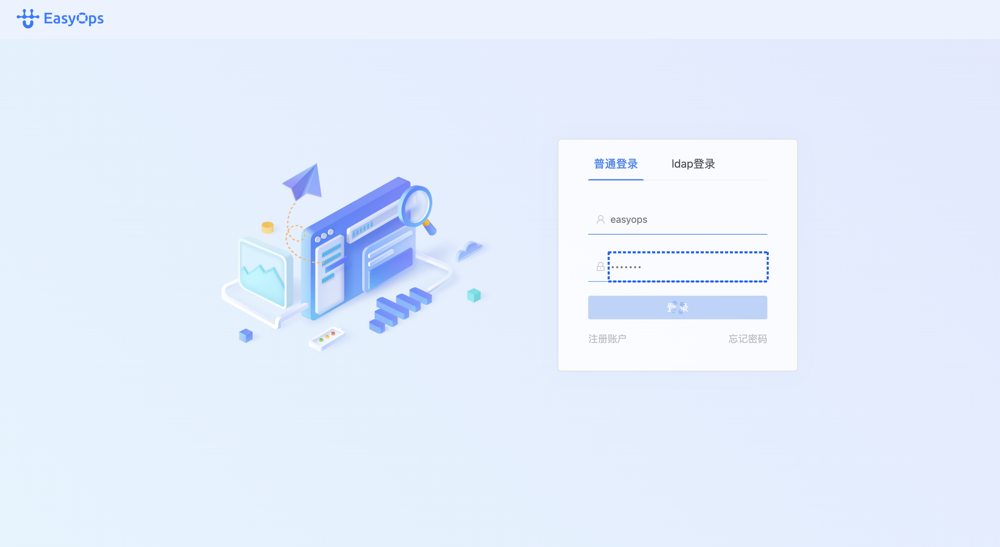
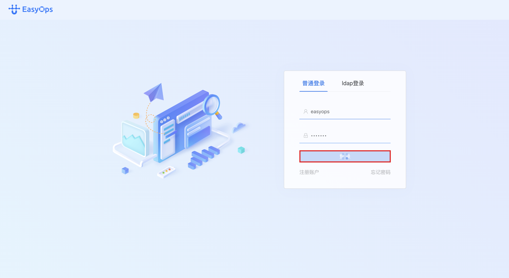
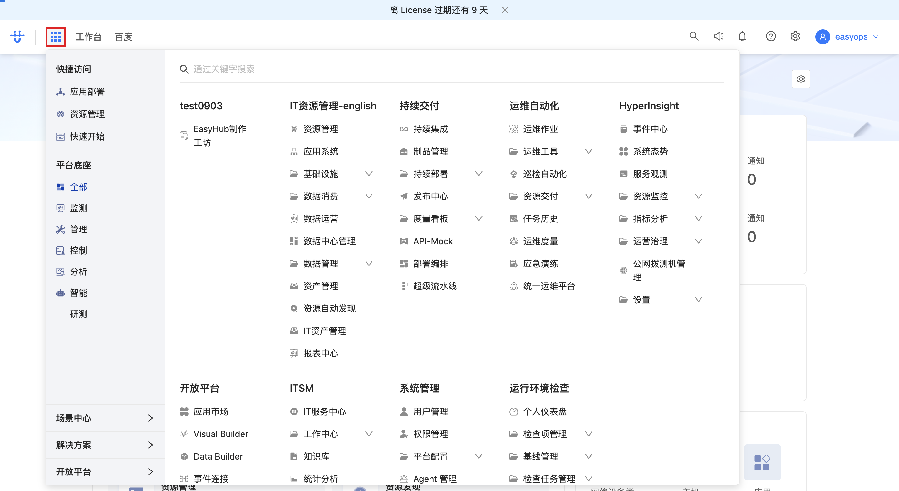
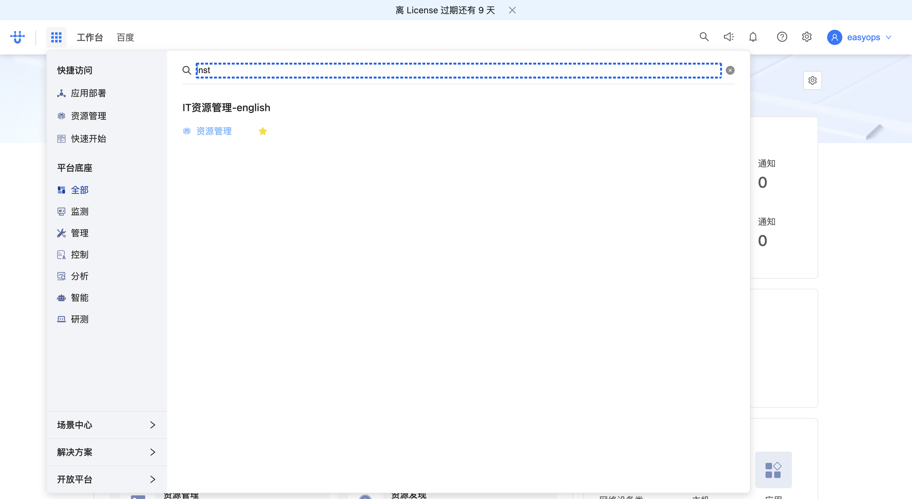
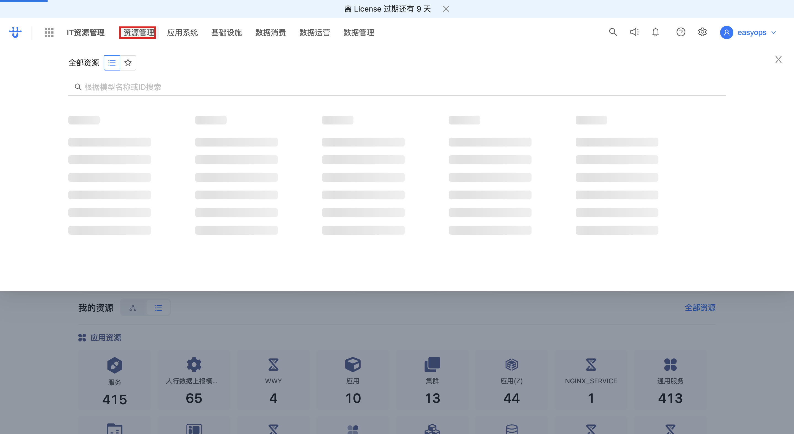
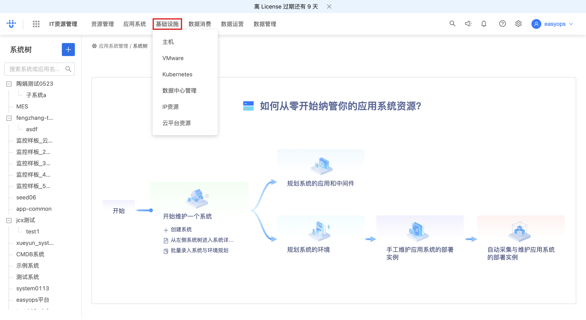
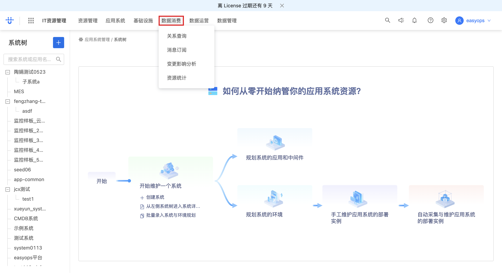
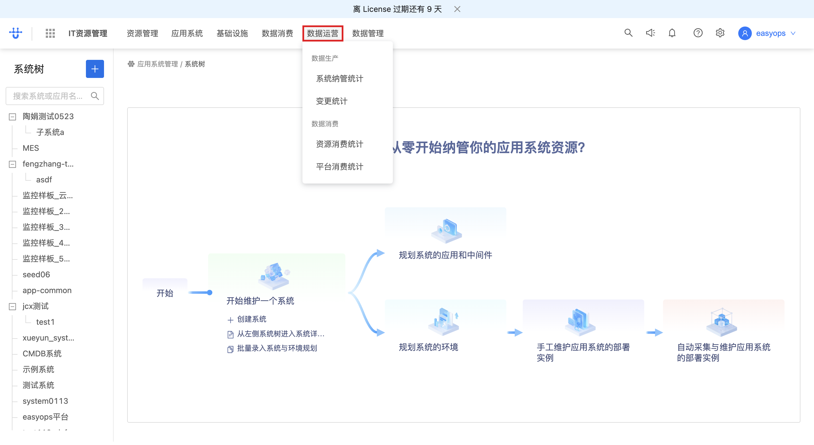
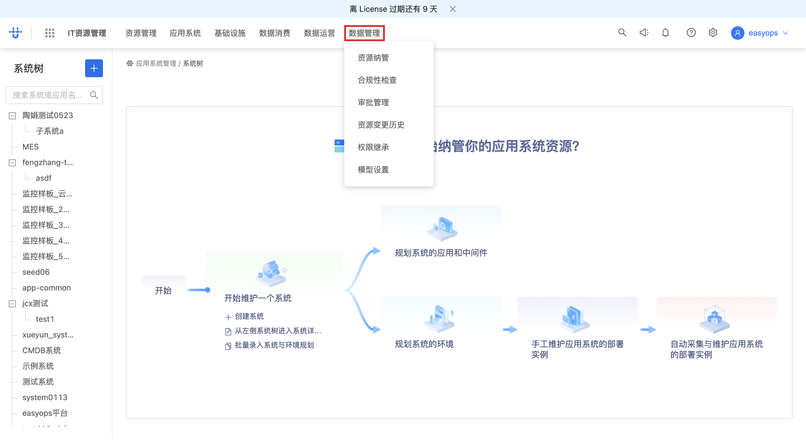

# CMDB 登录与功能入口 — 操作指引

> 适用场景：首次登录 EasyOps 平台，从门户进入 CMDB 资源管理，并浏览「应用系统」架构树的各资源分类。
> 配套接口：见同目录 [`CMDB-登录与功能入口-openapi.yaml`](./CMDB-登录与功能入口-openapi.yaml)

## 目录

- [一、登录系统](#一登录系统)
  - [步骤 1：输入用户名](#步骤-1输入用户名)
  - [步骤 2：输入密码](#步骤-2输入密码)
  - [步骤 3：点击「登录」](#步骤-3点击登录)
  - [步骤 4：提交并跳转门户](#步骤-4提交并跳转门户)
- [二、进入 CMDB 资源管理](#二进入-cmdb-资源管理)
  - [步骤 1：确认进入门户首页](#步骤-1确认进入门户首页)
  - [步骤 2：搜索资源管理应用](#步骤-2搜索资源管理应用)
  - [步骤 3：进入「资源管理」](#步骤-3进入资源管理)
  - [步骤 4：查看「全部资源」](#步骤-4查看全部资源)
- [三、浏览应用系统架构树](#三浏览应用系统架构树)
  - [步骤 1：进入「应用系统」架构树](#步骤-1进入应用系统架构树)
  - [步骤 2：切换「基础设施」分类](#步骤-2切换基础设施分类)
  - [步骤 3：切换「数据消费」分类](#步骤-3切换数据消费分类)
  - [步骤 4：切换「数据运营」分类](#步骤-4切换数据运营分类)
  - [步骤 5：切换「数据管理」分类](#步骤-5切换数据管理分类)
- [附：本流程接口速查](#附本流程接口速查)
- [附：后续免登录说明](#附后续免登录说明)

<!-- deep-links: 本流程关键页面直达(SPA 路径,去掉 host 前缀,参数化)
  登录页:          auth/login
  门户首页:        portal
  CMDB 资源管理:   next-cmdb-instance-management?resourceType=list
  应用系统架构树:  app-system/system/tree/architecture
-->

---

## 一、登录系统

打开 http://172.30.0.90/ 会自动跳转到登录页（`/next/auth/login`）。默认是「普通登录」标签页。

### 步骤 1：输入用户名

在登录卡片的**第一个输入框**（用户名）输入账号，示例账号为 `easyops`。

💡 输入框下方出现蓝色高亮边框表示已聚焦。

<!-- url: auth/login | step_id: 1 -->

### 步骤 2：输入密码

在**第二个输入框**（密码，左侧有眼睛图标可切换明文）输入密码。

⚠️ 密码不会显示明文，确认输入无误后再继续。

<!-- step_id: 2 -->

### 步骤 3：点击「登录」

点击输入框下方的蓝色 **「登 录」** 按钮。

<!-- step_id: 3 -->

### 步骤 4：提交并跳转门户

点击登录后，前端调用登录接口完成认证；登录成功后**自动跳转到门户首页**（`/next/portal`），并加载工作台设置、用户信息、启动台、已安装微应用等数据。

<!-- url: portal | api: POST /next/api/auth/login/v2 | tag: 认证 | step_id: 4 -->

> 🔗 本步调用：POST `/next/api/auth/login/v2`（详见 openapi.yaml 的「认证」）

---

## 二、进入 CMDB 资源管理

登录后默认进入门户首页（Portal），这是所有微应用/工作台的统一入口。CMDB 资源管理需要在首页搜索后进入。

### 步骤 1：确认进入门户首页

门户首页布局：**左上角是「EasyOps 工作台」logo / 首页按钮**，顶部有「请输入关键字搜索」的搜索框；下方是**应用卡片网格**，按分组排列（如快捷访问、平台集成、IT 资源管理等）。

💡 如果登录后没有直接停在首页，点击左上角 **首页 / EasyOps logo** 即可回到门户。

<!-- url: portal | step_id: 5 -->

### 步骤 2：搜索资源管理应用

在顶部**搜索框**输入 `inst`（instance management，资源/实例管理的缩写），系统实时检索匹配的微应用卡片。

⚠️ 文本输入过程不单独截图，下图是输入完成后的聚焦态。

<!-- step_id: 7（步骤 6 为输入过程，未单独截图） -->

### 步骤 3：进入「资源管理」

在搜索结果中点击 **资源管理** 卡片，进入 CMDB 资源管理页（`/next/next-cmdb-instance-management`）。页面顶部导航出现「资源管理」，主区域显示资源列表/树，并加载资源管理微应用运行态与 CMDB 模型基础信息。

<!-- url: next-cmdb-instance-management | api: GET /next/api/gateway/logic.micro_app_standalone_service/api/v1/micro_app_standalone/runtime/next-cmdb | tag: CMDB 资源管理初始化 | step_id: 8 -->

> 🔗 本步调用：GET `.../micro_app_standalone/runtime/next-cmdb`、POST `.../micro_app_standalone/search`（详见 openapi.yaml 的「CMDB 资源管理初始化」）

### 步骤 4：查看「全部资源」

在资源管理页点击 **「全部资源」**，查看全量 CMDB 资源。此时拉取所有模型的基础信息（`object_basic_all`）与模型分类（`object_category`）。

<!-- api: GET /next/api/gateway/cmdb.cmdb_object.GetObjectBasicAll/object_basic_all | tag: CMDB 资源管理初始化 | step_id: 9 -->

> 🔗 本步调用：GET `.../cmdb_object.GetObjectBasicAll/object_basic_all`、GET `.../cmdb_object.ListObjectCategory/object_category`（详见 openapi.yaml 的「CMDB 资源管理初始化」）

---

## 三、浏览应用系统架构树

资源管理页顶部有一排资源域分类标签：**IT 资源管理 / 资源管理 / 应用系统 / 基础设施 / 数据消费 / 数据运营 / 数据管理**。点击「应用系统」进入架构树视图（`/next/app-system/system/tree/architecture`），随后可在各分类间切换浏览。

### 步骤 1：进入「应用系统」架构树

点击顶部 **「应用系统」** 分类，进入应用系统架构树页面。主区域显示「开始维护一个系统」等资源接入流程示意，同时加载实例树（`instance_tree/full`）、应用/服务/DNS 等模型实例搜索。

<!-- url: app-system/system/tree/architecture | api: POST /next/api/gateway/logic.cmdb.service/instance_tree/full | tag: 应用系统架构树 | step_id: 10 -->

> 🔗 本步调用：POST `.../cmdb.service/instance_tree/full`、POST `.../object/APPLICATION@ONEMODEL/instance/_search` 等（详见 openapi.yaml 的「应用系统架构树」）

### 步骤 2：切换「基础设施」分类

点击顶部 **「基础设施」** 标签，切换到基础设施资源域的分类视图。

<!-- step_id: 11 -->

### 步骤 3：切换「数据消费」分类

点击顶部 **「数据消费」** 标签，切换到数据消费资源域。

<!-- step_id: 12 -->

### 步骤 4：切换「数据运营」分类

点击顶部 **「数据运营」** 标签，切换到数据运营资源域。

<!-- step_id: 13 -->

### 步骤 5：切换「数据管理」分类

点击顶部 **「数据管理」** 标签，切换到数据管理资源域。

<!-- step_id: 14 -->

---

## 附：本流程接口速查

| tag | 方法 | 路径(简) | 用途 | 步骤 |
| --- | --- | --- | --- | --- |
| 认证 | POST | `/api/auth/login/v2` | 登录认证 | 一-4 |
| 门户启动台 | GET | `.../launchpad_info` | 启动台信息 | 一-4 |
| 门户启动台 | GET | `.../users/detail/{username}` | 当前用户详情 | 一-4 |
| CMDB 资源管理初始化 | GET | `.../micro_app_standalone/runtime/next-cmdb` | 资源管理运行态 | 二-3 |
| CMDB 资源管理初始化 | GET | `.../cmdb_object.GetObjectBasicAll/object_basic_all` | 全部模型基础信息 | 二-4 |
| CMDB 资源管理初始化 | GET | `.../cmdb_object.ListObjectCategory/object_category` | 模型分类 | 二-4 |
| 应用系统架构树 | POST | `.../cmdb.service/instance_tree/full` | 实例树（架构树） | 三-1 |
| 应用系统架构树 | POST | `.../object/APPLICATION@ONEMODEL/instance/_search` | 应用实例搜索 | 三-1 |

---

## 附：后续免登录说明

首次登录后，登录态会保存在浏览器 profile 中（按 host `172.30.0.90` 共享）。下次打开同一地址**无需重复登录**，可直接进入门户；同平台的其他子模块（ITSM、监控等）也共享该登录态。
