# HyperInsight 入口与功能预览 — 操作指引

> 适用场景：从 EasyOps 门户进入 HyperInsight（超融合监控）工作台，预览其七大功能模块（事件中心 / 系统态势 / 服务观测 / 资源监控 / 指标分析 / 运营治理 / 设置），了解监控系统的整体能力布局。
> 配套接口见同目录 [`HyperInsight-入口与功能预览-openapi.yaml`](./HyperInsight-入口与功能预览-openapi.yaml)

## 目录

- [一、从门户进入 HyperInsight](#一从门户进入-hyperinsight)
- [二、功能模块预览](#二功能模块预览)
- [附：本流程接口速查](#附本流程接口速查)

<!-- deep-links: 本流程关键页面直达(SPA 路径,去掉 host 前缀,参数化)
  门户工作台:    portal
  HyperInsight:  infra-monitor/guide
-->

> 截图标注图例：🔴红框=点击 / 🔵蓝虚线框=输入 / 🟠橙框+▾=下拉 / 🟣紫圈=单复选 / 🟢绿粗框=提交。

---

## 一、从门户进入 HyperInsight

### 步骤 1：登录并停留在门户工作台

登录 EasyOps 后默认进入门户工作台（`/next/portal`），页面展示 ITSM 工单统计、公告、最近访问、告警等级分布等卡片。

<!-- url: portal | step_id: 1 -->
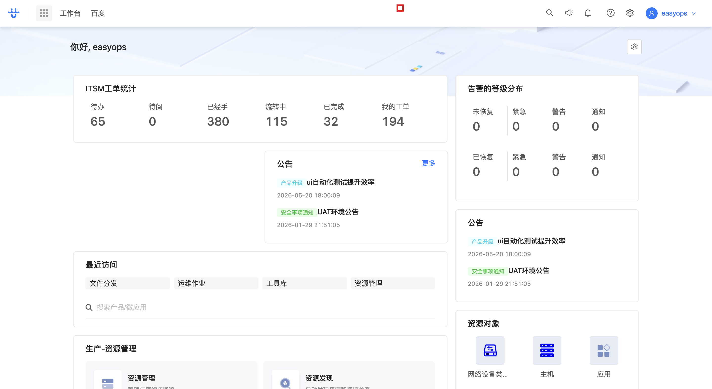

### 步骤 2：定位顶部搜索入口

点击页面左上角（或顶部栏）准备通过搜索进入目标应用。

<!-- step_id: 2 -->
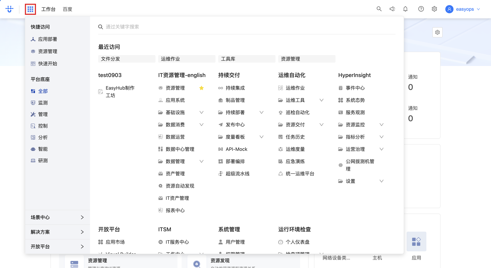

### 步骤 3：在搜索框输入「monitor」

在顶部「通过关键字搜索」输入框中输入 `monitor`，用于检索监控类应用。

<!-- step_id: 3 -->
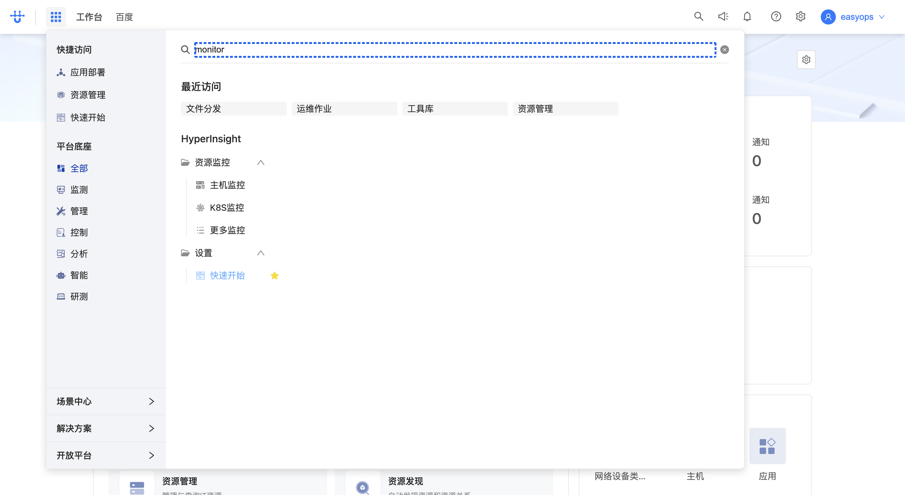

> 💡 提示：搜索框支持按应用名/关键字模糊匹配，输入 `monitor` 可快速定位 HyperInsight（超融合监控）应用。

### 步骤 4：点击进入 HyperInsight

在搜索结果中点击 **HyperInsight / 监控** 应用入口，进入监控系统引导页。进入时浏览器会一次性拉取 HyperInsight 的微应用运行时（菜单注入）、监控套件资源包状态、权限校验，以及事件中心 / 资源监控 / 服务观测各模块的预加载数据。

<!-- url: infra-monitor/guide | api: GET .../runtime/infra-monitor | tag: 入口与运行时 | step_id: 4 -->
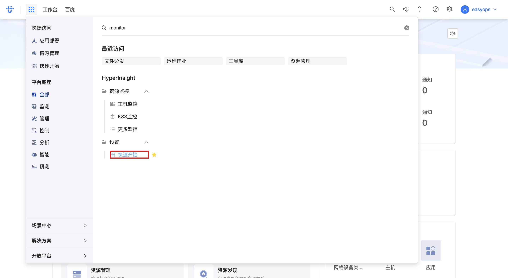

> 🔗 本步调用（进入监控系统时批量预加载）：
> - GET `.../logic.micro_app_standalone_service/.../runtime/infra-monitor`（微应用运行时/菜单注入，详见「入口与运行时」）
> - POST `.../micro_app_standalone/search`（搜索 monitor-kit / collect-platform 等监控类微应用）
> - GET `.../resource-package/monitor-kits-R`（监控套件资源包状态）
> - POST `.../micro_app.permission.ValidatePermissions/.../permission/validate`（校验 `monitor:configuration_access` 权限）
> - GET `.../alert_portal.alert_portal.ListSource/.../alert/source/list`（告警源，详见「事件中心」）
> - POST `.../collector_service_v2.job.GetResourceConfig/.../list-resource-config`（资源采集配置，详见「资源监控与采集」）
> - GET `.../collector_service.job.ListCollectorKitInfo/.../collector/kit/info/list`（采集器套件信息）
> - GET `.../collector_service.job.GetTraceKitByName/.../get-trace-kit-by-name`（链路追踪套件，详见「服务观测」）
> - GET `.../service_observe...ListSkywalkingAuthToken/.../skywalking/list-token`（SkyWalking Token）
> - GET `.../cmdb_extend/agent/install_key`、`.../agent/download/key`（Agent 安装/下载 Key）
> - POST `.../logic.cmdb.service/instance_tree/full`（CMDB 实例树）

---

## 二、功能模块预览

进入 HyperInsight 引导页（`/next/infra-monitor/guide`）后，左侧导航列出七大功能模块。依次点击各模块名称即可在主内容区切换预览（URL 不变，前端面板切换）。各模块的数据多在步骤 4 进入时已预加载，点击切换一般不触发新的 XHR。

### 步骤 1：预览「事件中心」

点击左侧导航 **「事件中心」**，主内容区展示通用监控（Ping、Telnet 等）与资源监控分类。事件中心用于查看告警事件、最近告警计数与事件查询视图。

<!-- step_id: 5 -->
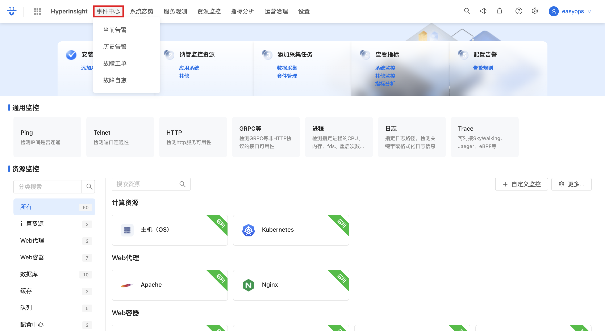

> 🔗 本模块调用：GET `.../alert_portal.alert_portal.ListSource/.../alert/source/list`（告警源列表）、GET `.../event_center.event_overview.CountRecentlyAlert/.../count/alert/recently`（近 24h 告警计数）、GET `.../event_center.event_overview.ListEventQueryView/.../event-query-view`（事件查询视图，详见「事件中心」）
> ⚠️ 注意：本次录制时事件中心两个 `event_center` 接口返回 **500**（`failed to get authorization token`），属后端鉴权临时异常，非操作问题。

### 步骤 2：预览「系统态势」

点击 **「系统态势」**，切换至系统整体运行态势视图。

<!-- step_id: 6 -->
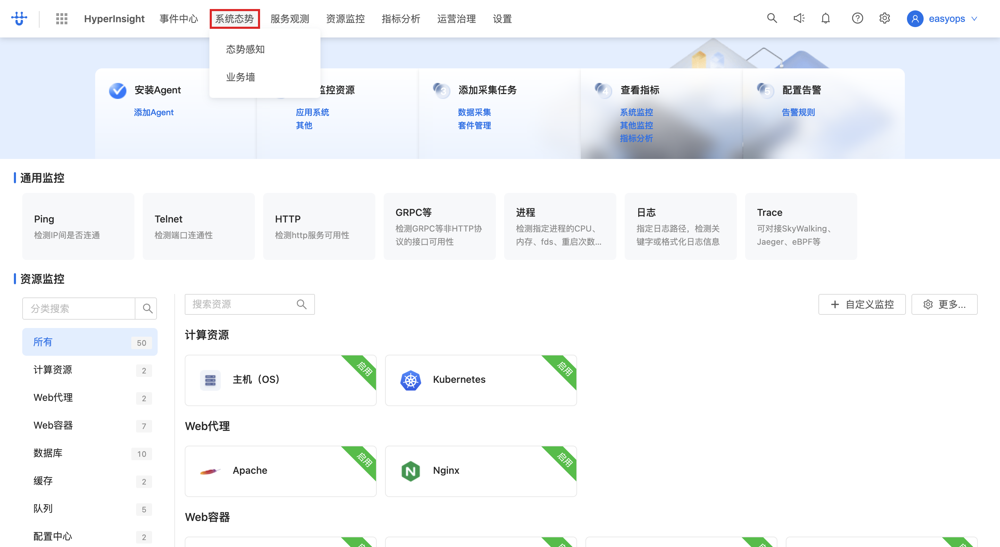

### 步骤 3：预览「服务观测」

点击 **「服务观测」**，预览应用性能与链路追踪（APM / SkyWalking）相关能力。

<!-- step_id: 7 -->
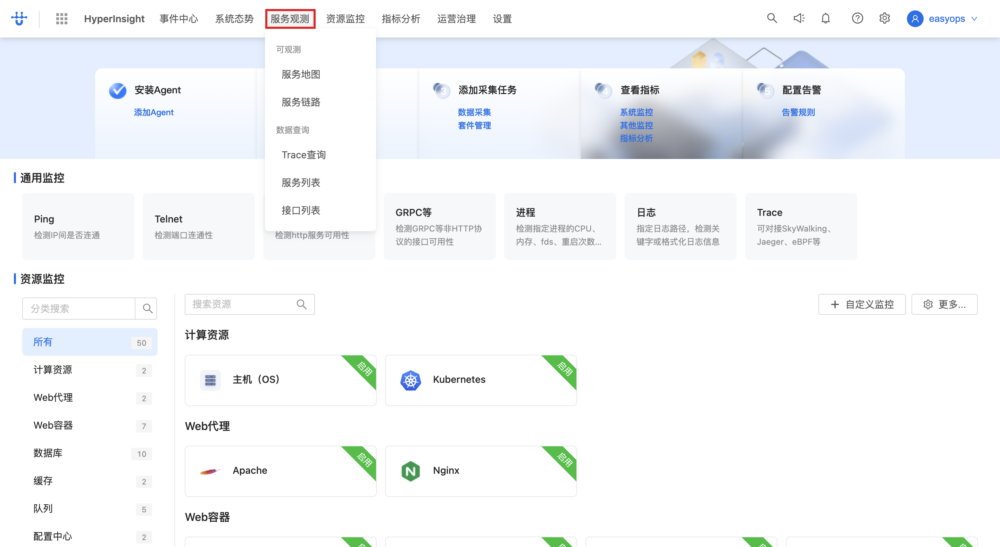

> 🔗 本模块调用：GET `.../collector_service.job.GetTraceKitByName/.../get-trace-kit-by-name`（按名取链路套件，如 `APM-eBPF`）、GET `.../service_observe...ListSkywalkingAuthToken/.../skywalking/list-token`（SkyWalking 鉴权 Token，详见「服务观测」）

### 步骤 4：预览「资源监控」

点击 **「资源监控」**，预览主机 / 网络 / 平台等资源的监控采集与指标。

<!-- step_id: 8 -->
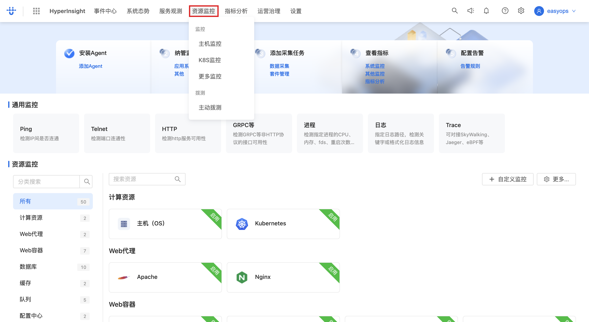

> 🔗 本模块调用：POST `.../collector_service_v2.job.GetResourceConfig/.../list-resource-config`（资源采集配置）、GET `.../collector_service.job.ListCollectorKitInfo/.../collector/kit/info/list`（采集器套件）、GET `.../collector_service.collector_job.ListCollectorLogJob/.../collector_log_job`（日志采集任务）、GET `.../cmdb_extend/agent/install_key`（Agent Key）、GET `.../logic.cmdb.service/object/search_collect`（可采集对象）、POST `.../logic.cmdb.service/instance_tree/full`（实例树，详见「资源监控与采集」）

### 步骤 5：预览「指标分析」

点击 **「指标分析」**，切换至指标查询与分析视图。

<!-- step_id: 9 -->
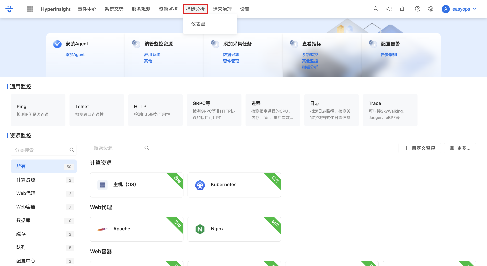

### 步骤 6：预览「运营治理」

点击 **「运营治理」**，切换至监控运营治理视图。

<!-- step_id: 10 -->
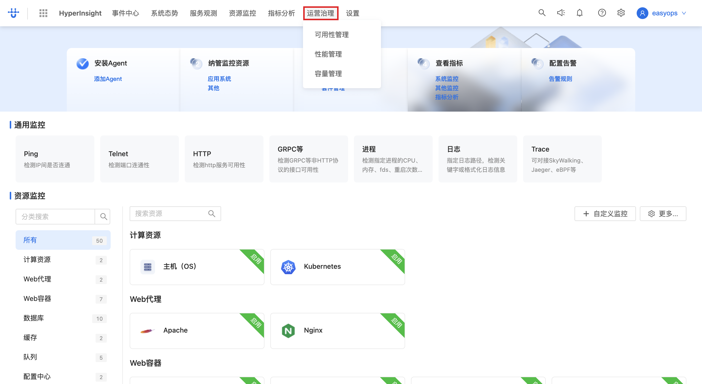

### 步骤 7：预览「设置」

点击 **「设置」**，进入监控系统的配置入口（步骤 4 进入时已校验 `monitor:configuration_access` 权限，授权后方可进入）。

<!-- step_id: 11 -->
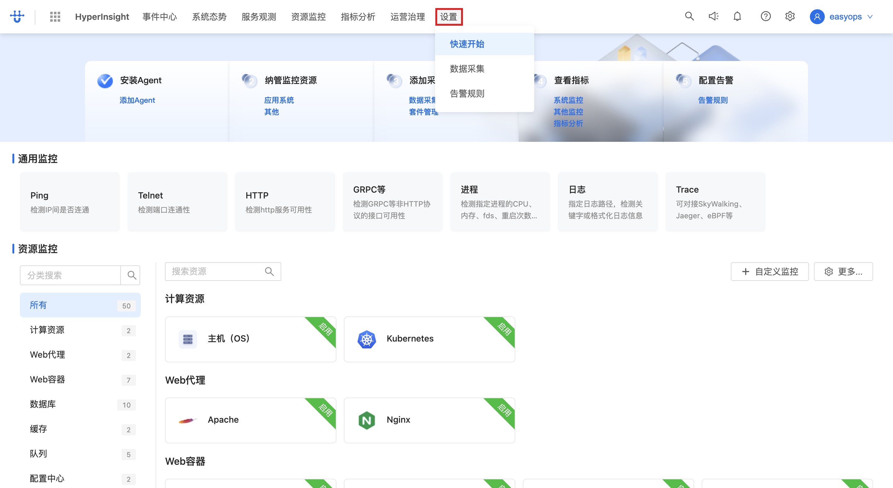

> 🔗 进入设置需权限：POST `.../micro_app.permission.ValidatePermissions/.../permission/validate`（body `actions: ["monitor:configuration_access"]`，详见「入口与运行时」）

---

## 附：本流程接口速查

> 路径简写：`...` = `/next/api/gateway`。完整路径见 openapi.yaml。
> 通用响应包装：`{ code, codeExplain, error, data }`（部分 cmdb 系列为 `{ code, error, message, data }`），`code === 0` 表示成功。

| tag | 方法 | 路径(简) | 用途 | 步骤 |
| --- | --- | --- | --- | --- |
| 入口与运行时 | GET | `.../logic.micro_app_standalone_service/.../runtime/infra-monitor` | HyperInsight 微应用运行时/菜单注入 | 一-4 |
| 入口与运行时 | POST | `.../logic.micro_app_standalone_service/.../micro_app_standalone/search` | 搜索监控类微应用（monitor-kit/collect-platform） | 一-4 |
| 入口与运行时 | GET | `.../logic.resource_package_service/.../resource-package/monitor-kits-R` | 监控套件资源包状态 | 一-4 |
| 入口与运行时 | POST | `.../micro_app.permission.ValidatePermissions/.../permission/validate` | 监控配置权限校验 | 一-4、二-7 |
| 事件中心 | GET | `.../alert_portal.alert_portal.ListSource/.../alert/source/list` | 告警源列表 | 一-4、二-1 |
| 事件中心 | GET | `.../event_center.event_overview.CountRecentlyAlert/.../count/alert/recently` | 近 24h 告警计数（录制时 500） | 一-4、二-1 |
| 事件中心 | GET | `.../event_center.event_overview.ListEventQueryView/.../event-query-view` | 事件查询视图（录制时 500） | 一-4、二-1 |
| 资源监控与采集 | POST | `.../collector_service_v2.job.GetResourceConfig/.../list-resource-config` | 资源采集配置列表 | 一-4、二-4 |
| 资源监控与采集 | GET | `.../collector_service.job.ListCollectorKitInfo/.../collector/kit/info/list` | 采集器套件信息 | 一-4、二-4 |
| 资源监控与采集 | GET | `.../collector_service.collector_job.ListCollectorLogJob/.../collector_log_job` | 日志采集任务 | 一-4、二-4 |
| 资源监控与采集 | GET | `.../logic.cmdb_extend/agent/install_key` | Agent 安装 Key | 一-4、二-4 |
| 资源监控与采集 | GET | `.../logic.cmdb_extend/agent/download/key` | Agent 下载 Key | 一-4、二-4 |
| 资源监控与采集 | GET | `.../logic.cmdb.service/object/search_collect` | 可采集对象 ID 列表 | 一-4、二-4 |
| 资源监控与采集 | POST | `.../logic.cmdb.service/instance_tree/full` | CMDB 实例树 | 一-4、二-4 |
| 服务观测 | GET | `.../collector_service.job.GetTraceKitByName/.../get-trace-kit-by-name` | 按名取链路追踪套件 | 一-4、二-3 |
| 服务观测 | GET | `.../service_observe...ListSkywalkingAuthToken/.../skywalking/list-token` | SkyWalking 鉴权 Token | 一-4、二-3 |
