# HyperInsight 监控资源管理 — 操作指引

> 适用场景：在 EasyOps HyperInsight 的「监控资源管理」页面对资源进行监控采集配置——搜索资源、新建/编辑/删除监控资源配置、调整采集间隔与采集器套件。看完能独立完成监控资源的全生命周期配置。
> 配套接口见同目录 [`HyperInsight-监控资源管理-openapi.yaml`](./HyperInsight-监控资源管理-openapi.yaml)

## 目录

- [一、进入监控资源管理](#一进入监控资源管理)
- [二、搜索资源](#二搜索资源)
- [三、配置监控采集（新建）](#三配置监控采集新建)
- [四、搜索并进入资源详情](#四搜索并进入资源详情)
- [五、编辑资源配置](#五编辑资源配置)
- [六、删除资源配置](#六删除资源配置)
- [附：本流程接口速查](#附本流程接口速查)

<!-- deep-links: 本流程关键页面直达(SPA 路径,去掉 host 前缀,参数化)
  监控资源管理(全部):  /next/infra-monitor/guide?category=all
  按分类筛选:           /next/infra-monitor/guide?category={category}
  搜索资源:             /next/infra-monitor/guide?category=all&resourceQuery={keyword}
  资源详情(锚点定位):   /next/infra-monitor/guide?resourceQuery={keyword}#{objectId}
-->

> 截图标注图例：🔴红框=点击 / 🔵蓝虚线框=输入 / 🟠橙框+▾=下拉 / 🟣紫圈=单复选 / 🟢绿粗框=提交。

## 一、进入监控资源管理

### 步骤 1：进入「计算资源」分类
<!-- url: /next/infra-monitor/guide?category=计算资源 | step_id: 1 -->
打开监控资源管理引导页后，在分类筛选区点击「计算资源」，按资源大类筛选要配置监控的资源。
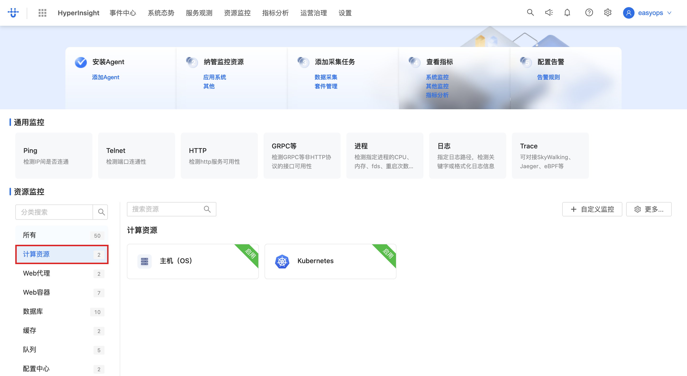

### 步骤 2：切换到「所有」分类
<!-- url: /next/infra-monitor/guide?category=all | step_id: 2 -->
点击「所有」可查看全部资源（含已配置与未配置监控的），不局限于单一分类。
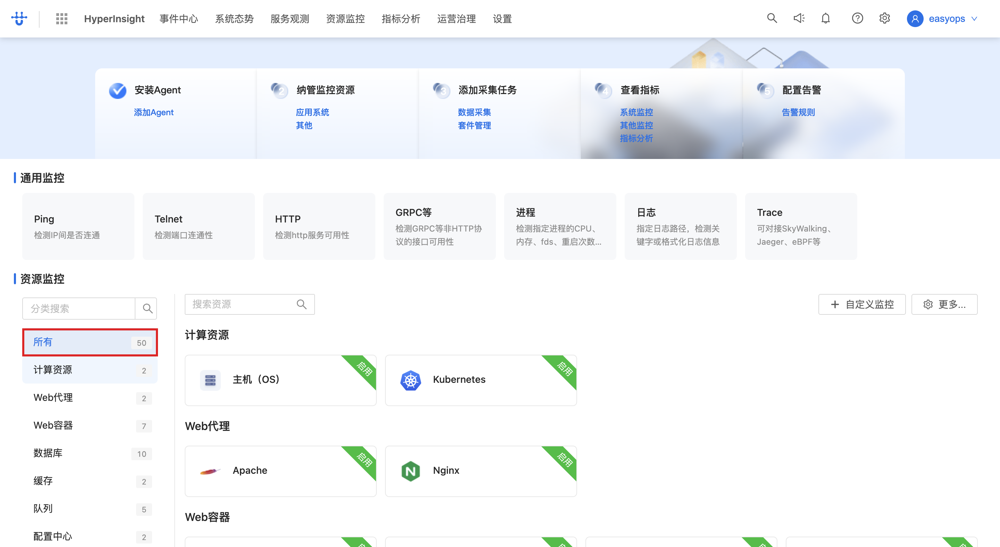
> 💡 提示：分类筛选与关键词搜索可叠加使用——先选分类再用关键词缩小范围。

## 二、搜索资源

> 文本输入过程不逐字截图，仅记录最终输入值；失焦或点击后才会截图。

### 步骤 1：在搜索框输入关键词
<!-- step_id: 3 -->
在页面顶部「搜索资源」输入框中输入资源关键词（本例输入 `mysql`），列表会随输入实时过滤。
> ⚠️ 未截图：本步为纯文本输入过程（最终值 `mysql`）。

### 步骤 2：点击搜索框触发查询
<!-- step_id: 8 -->
输入完成后点击「搜索资源」输入框，确认并触发搜索，下方资源列表展示匹配结果。
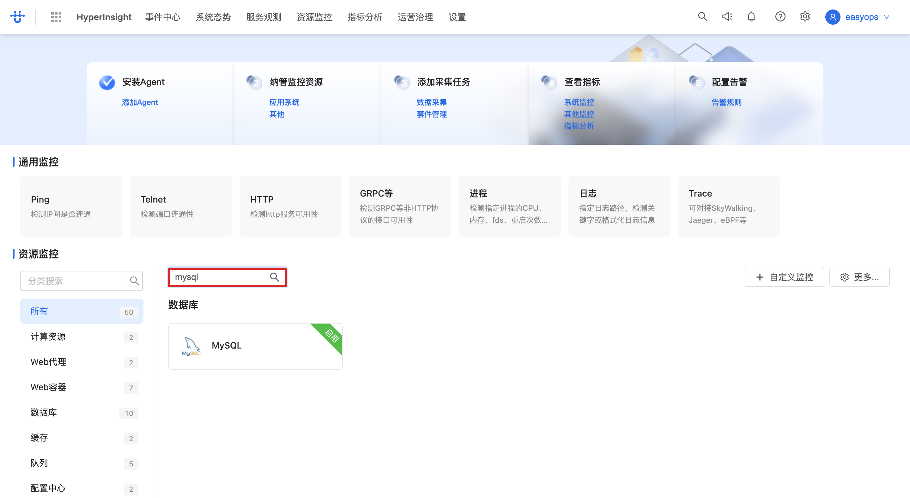

### 步骤 3：在结果列表中确认目标资源
<!-- step_id: 9 -->
搜索结果展示后，即可在列表中定位到目标资源（如 `mysql` 相关资源），准备进入配置。
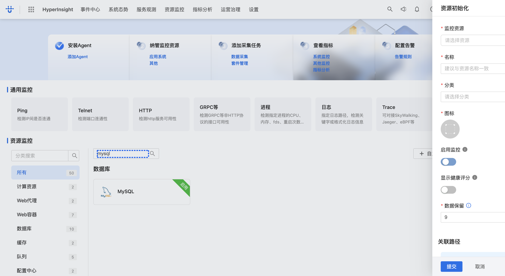

## 三、配置监控采集（新建）

> 对尚未配置监控的资源进行首次采集配置：选择资源 → 配置采集器套件/分类/图标 → 保存，后端会创建一条资源监控配置。

### 步骤 1：选择目标资源
<!-- step_id: 10 -->
在搜索结果列表中点击目标资源行，进入该资源的采集配置入口。
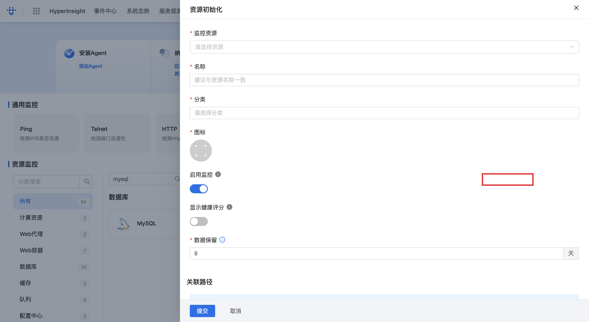

### 步骤 2：在资源标识输入框确认/输入
<!-- step_id: 11 -->
> ⚠️ 未截图：本步为纯文本输入过程（值 `wwh`）。

### 步骤 3：展开采集设置级联选择
<!-- step_id: 12 -->
点击「采集设置」级联选择器（`setting-init-cascader`），展开采集器套件与分类选项。
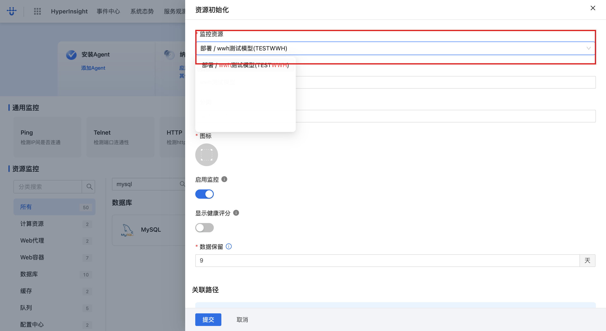

### 步骤 4：选择资源分类
<!-- step_id: 13 -->
在分类选择器（`category-selector`）中选择资源所属分类（如「计算资源」）。
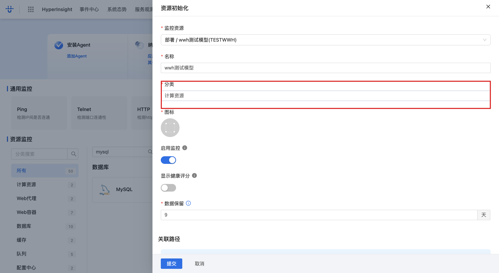
> 🔗 本步调用：GET `.../collector/kit/info/list`（详见 openapi.yaml 的「采集套件与Agent」）

### 步骤 5：选择资源图标
<!-- step_id: 14 -->
在图标选择器（`eo-icon-select`）中选择资源展示图标（如 `agent`）。
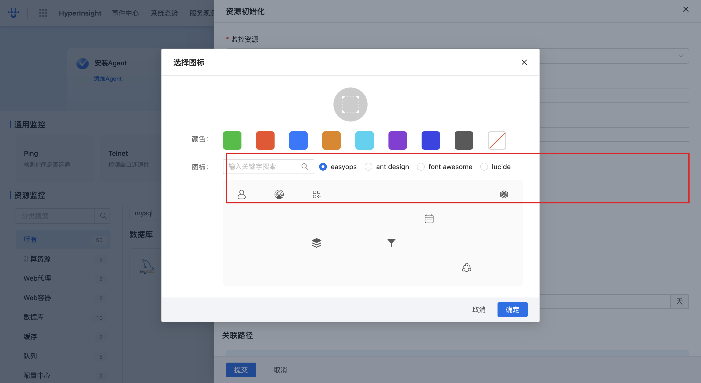

### 步骤 6：选择采集器套件
<!-- step_id: 15 -->
选择用于该资源的采集器套件（agent 类型），决定监控数据的采集方式。
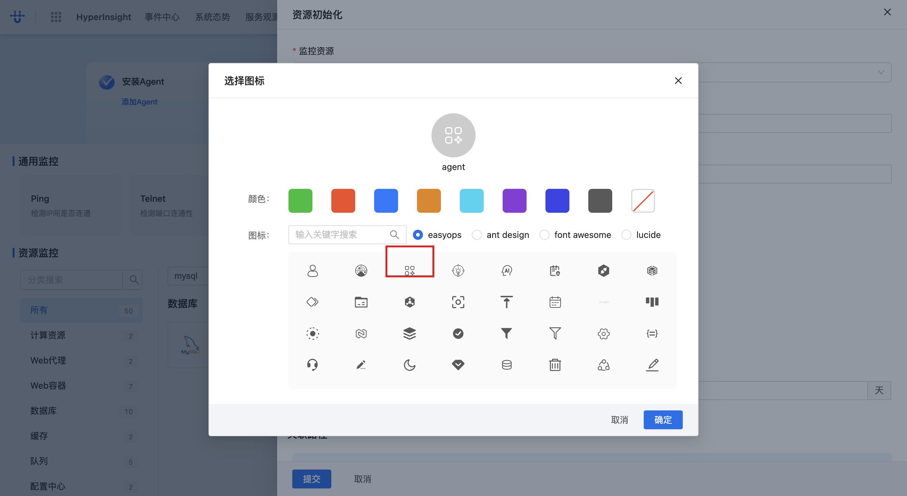

### 步骤 7：确认采集配置
<!-- step_id: 16 -->
确认各项采集参数（分类、图标、采集套件）无误。
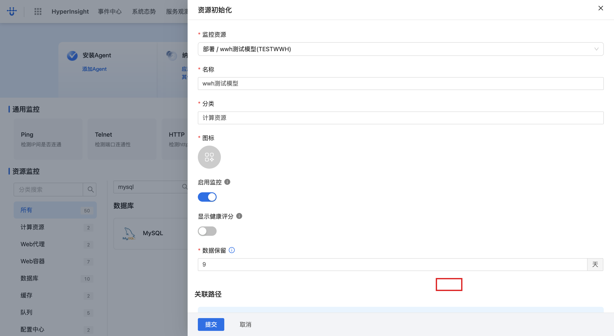

### 步骤 8：保存，创建监控配置
<!-- step_id: 17 -->
点击保存按钮，后端创建该资源的监控采集配置。
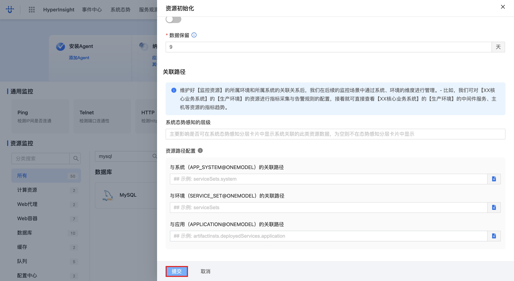
> 🔗 本步调用：POST `.../create_resource_monitor_config`（详见 openapi.yaml 的「资源配置增删改」）
> 💡 提示：保存成功后，该资源即纳入监控，可在「资源监控」中查看采集数据。

## 四、搜索并进入资源详情

> 配置完成后，重新搜索该资源（本例关键词 `wwh`）并进入其详情，查看/修改配置。

### 步骤 1：搜索资源（输入 `wwh`）
<!-- step_id: 21 -->
在搜索框输入资源关键词（本例 `wwh`），实时过滤资源列表。
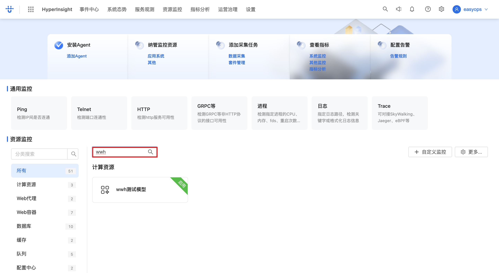
> 🔗 本步调用：GET `.../resource-monitor-config/{objectId}`（详见 openapi.yaml 的「资源查询与搜索」）

### 步骤 2：在结果中点击目标资源
<!-- step_id: 23 -->
> ⚠️ 未截图：本步点击无独立截图，可参照「步骤 1」搜索结果列表操作。

### 步骤 3：进入资源编辑
<!-- step_id: 24 -->
点击资源行的「编辑」按钮（`resource-editor-button`），进入资源监控配置编辑界面。
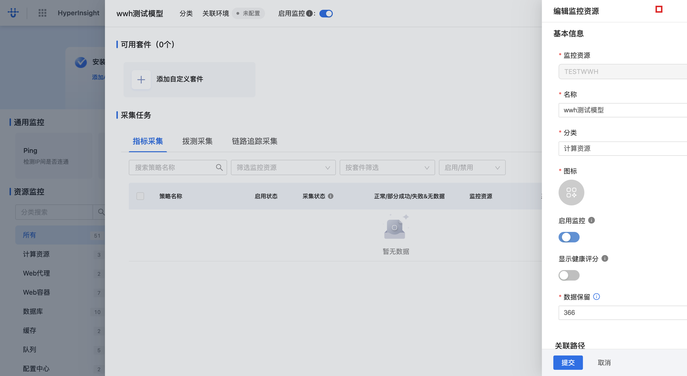

## 五、编辑资源配置

> 修改资源监控配置：可重命名资源（建议与资源名称一致）、调整数据保留时长/采集间隔、切换启用状态等。

### 步骤 1：重命名资源
<!-- step_id: 26 -->
在「资源名称」输入框（提示「建议与资源名称一致」）中修改资源名称，本例改为 `wwh测试模型rename`。
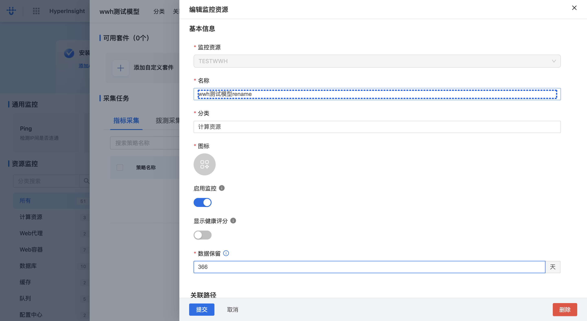

### 步骤 2：确认名称修改
<!-- step_id: 27 -->
确认新名称已填入。
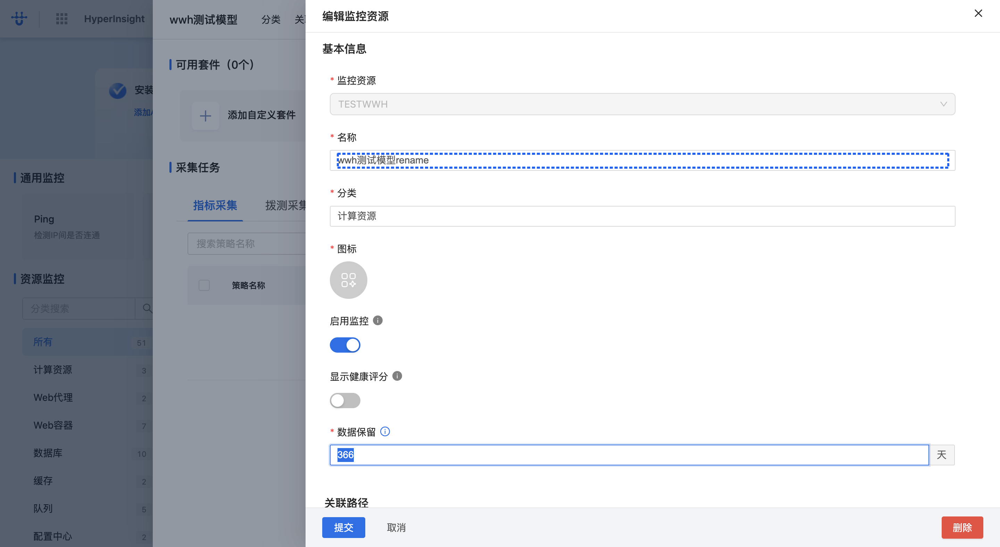

### 步骤 3：调整数据保留时长（采集间隔）
<!-- step_id: 28 -->
在「数据保留时长 / 采集间隔」输入框中填入数值，本例设为 `20`。
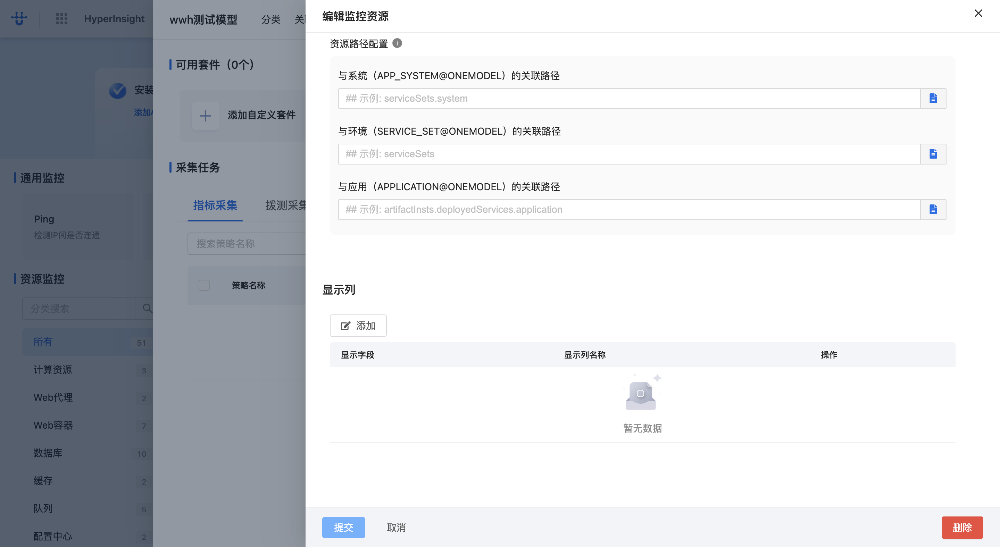
> 🔗 本步调用：POST `.../update_resource_monitor_config/{objectId}`（详见 openapi.yaml 的「资源配置增删改」）

### 步骤 4：保存修改
<!-- step_id: 29 -->
点击保存按钮，后端更新该资源的监控配置（含新名称、采集间隔等）。
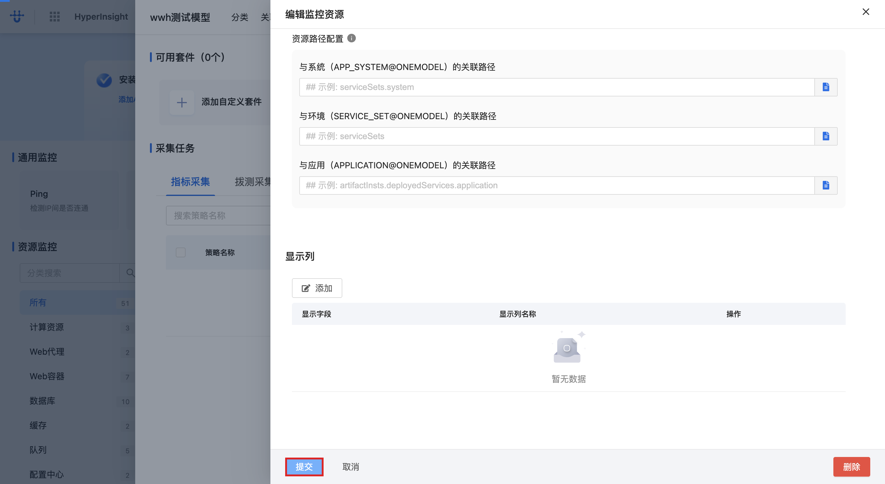
> 💡 提示：更新接口为 `update_resource_monitor_config`，按 `objectId` 定位资源，传完整配置体覆盖更新。

## 六、删除资源配置

> 删除某资源的监控配置：搜索资源 → 进入编辑 → 删除 → 输入资源名称解锁确认按钮 → 确认删除。

### 步骤 1：搜索资源（输入 `wwh`）
<!-- step_id: 33 -->
在搜索框输入资源关键词（本例 `wwh`），定位要删除的资源。
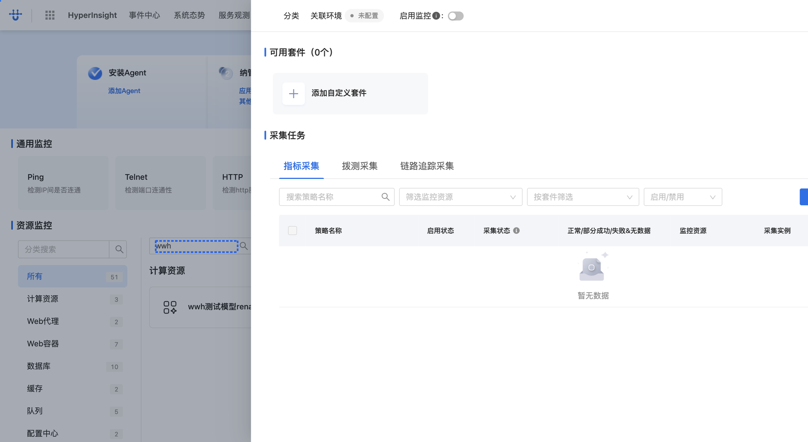
> 🔗 本步调用：POST `.../list-resource-config`（详见 openapi.yaml 的「资源查询与搜索」）

### 步骤 2：在结果中点击目标资源
<!-- step_id: 34 -->
> ⚠️ 未截图：本步点击无独立截图，可参照「步骤 1」搜索结果列表操作。

### 步骤 3：进入资源编辑
<!-- step_id: 36 -->
点击资源行的「编辑」按钮（`resource-editor-button`），进入资源监控配置界面。
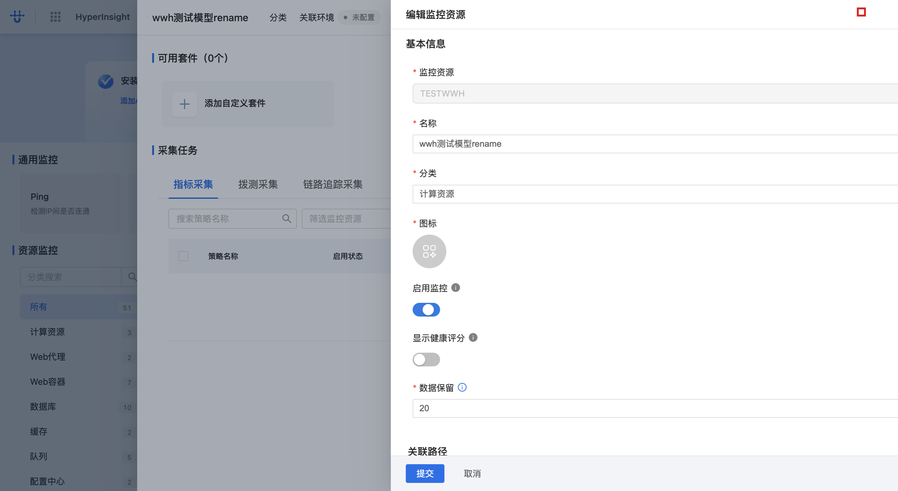

### 步骤 4：点击「删除」
<!-- step_id: 37 -->
在编辑界面点击「删除」按钮，弹出删除确认框。
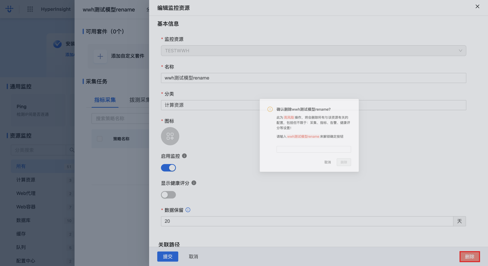

### 步骤 5：输入资源名称解锁确认按钮
<!-- step_id: 38 -->
为防误删，确认框要求输入完整资源名称以解锁「确定」按钮，本例输入 `wwh测试模型rename`。
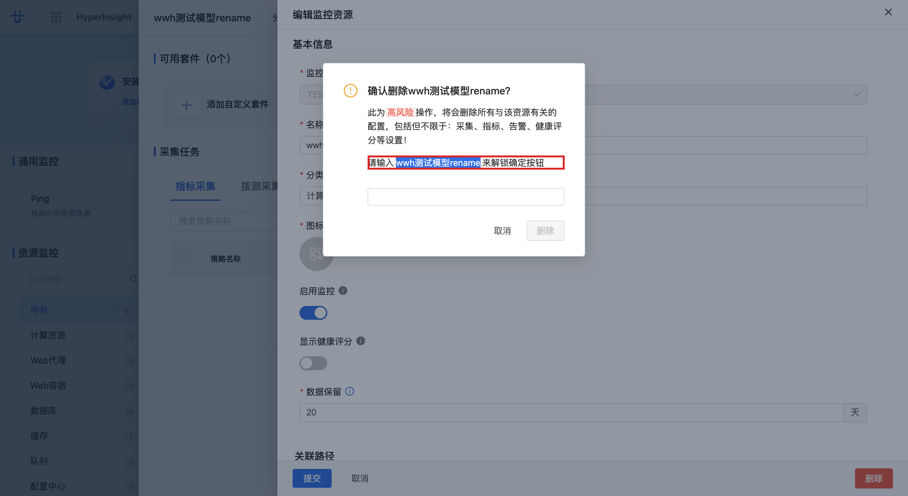
> ⚠️ 注意：名称必须与资源完全一致（含大小写），否则确认按钮不可点击。

### 步骤 6：输入名称
<!-- step_id: 39 -->
在确认框输入框中输入资源名称（`wwh测试模型rename`）。
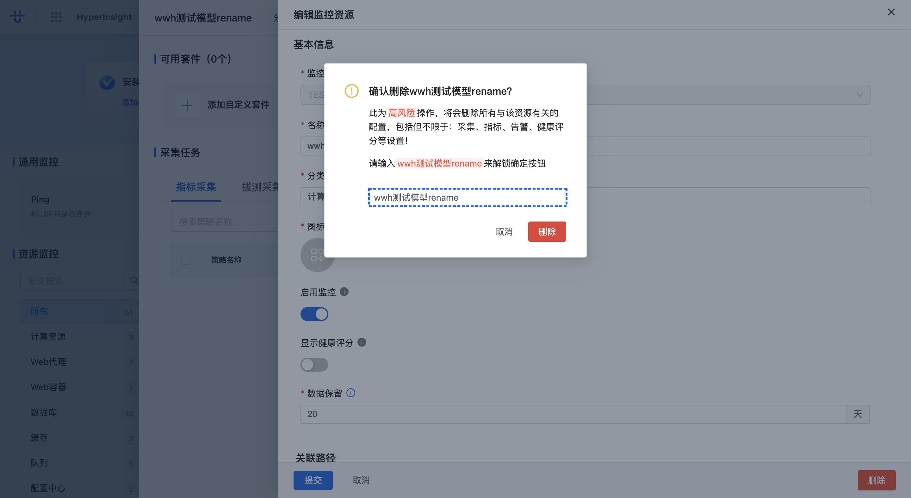
> 🔗 本步调用：DELETE `.../resource-monitor-config/{objectId}`（详见 openapi.yaml 的「资源配置增删改」）

### 步骤 7：点击「删除」确认
<!-- step_id: 40 -->
名称输入正确后，「删除」按钮变为可点击，点击它确认删除，后端删除该资源的监控配置。
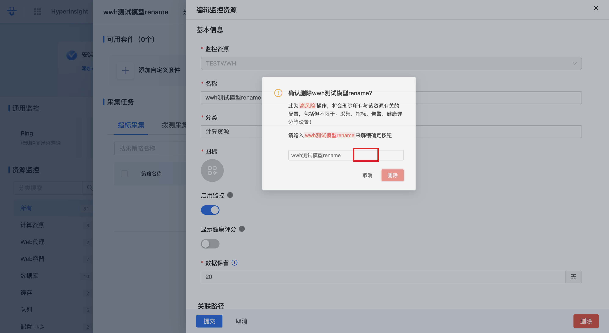

### 步骤 8：返回列表确认已删除
<!-- step_id: 41 -->
删除成功后，资源从监控配置列表中消失（或变为未配置状态），搜索框可继续查询验证。
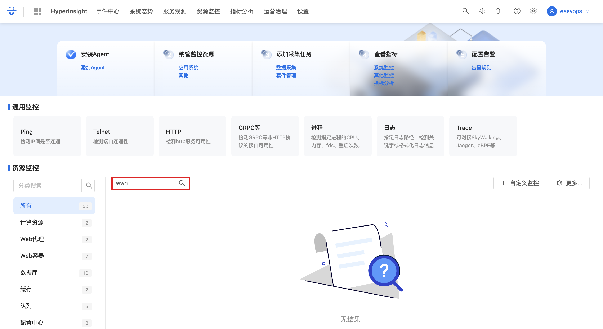

## 附：本流程接口速查

| tag | 方法 | 路径(简) | 用途 | 步骤 |
| --- | --- | --- | --- | --- |
| 资源配置增删改 | POST | `.../create_resource_monitor_config` | 新建资源监控配置 | 三-8 |
| 资源配置增删改 | POST | `.../update_resource_monitor_config/{objectId}` | 更新资源监控配置（改名/采集间隔等） | 五-3、五-4 |
| 资源配置增删改 | DELETE | `.../resource-monitor-config/{objectId}` | 删除资源监控配置 | 六-6、六-7 |
| 资源查询与搜索 | POST | `.../list-resource-config` | 资源配置列表/搜索 | 六-1 |
| 资源查询与搜索 | GET | `.../resource-monitor-config/{objectId}` | 查询单个资源监控配置详情 | 四-1 |
| 资源查询与搜索 | GET | `.../list-resource-monitor-job` | 列表资源监控任务（按 objectId） | — |
| 资源查询与搜索 | GET | `.../collector_detect_job` | 采集探测任务列表 | — |
| 采集套件与Agent | GET | `.../collector/kit/info/list` | 采集器套件列表 | 三-4 |
| 采集套件与Agent | GET | `.../resource-package/monitor-kits-R` | 监控采集资源包状态 | — |
| 采集套件与Agent | GET | `.../get-trace-kit-by-name` | 按名称查链路追踪套件 | — |
| 采集套件与Agent | GET | `.../collector_log_job` | 采集日志任务列表 | — |
| 采集套件与Agent | GET | `.../agent/download/key` | 获取 Agent 下载 Key | — |
| 采集套件与Agent | GET | `.../agent/install_key` | 获取 Agent 安装 Key | — |

> 说明：通用响应包装为 `{ code, codeExplain, error, data }`，`code === 0` 表示成功；`agent` 相关接口为 `{ code, error, message, data, serverAddress }`。网关接口前缀 `/next/api/gateway/<service>/...`。
