# HyperInsight-自定义监控套件 — 操作指引

> 适用场景：为某个 CMDB 资源（本文档以防火墙 FIREWALL 为例）创建「自定义监控套件」，选择 EasyOps 采集方式，填写套件信息与采集参数，最终激活套件并导入采集指标。
> 配套接口：见同目录 `HyperInsight-自定义监控套件-openapi.yaml`。

## 目录
- [一、搜索并选择监控资源](#一搜索并选择监控资源)
- [二、选择 EasyOps 采集并确认关联资源](#二选择-easyops-采集并确认关联资源)
- [三、填写套件信息](#三填写套件信息)
- [四、配置采集参数](#四配置采集参数)

<!-- deep-links: 本流程关键页面直达(SPA 路径,去掉 host 前缀,参数化)
  监控资源首页:   infra-monitor/guide
  资源搜索:       infra-monitor/guide?resourceQuery={关键词}
  创建套件:       monitor-kit/kit/easyops/create?relateObjectId={对象ID}
-->

## 一、搜索并选择监控资源

### 步骤 1：打开监控资源首页，点击搜索框
<!-- url: infra-monitor/guide | step_id: 1 -->
从工作台进入「HyperInsight 智能监控」，在监控资源首页的「搜索资源」输入框中点击，准备输入资源关键词。
> 💡 提示：本流程以防火墙（FIREWALL）为例，可按需搜索任意已纳管的监控资源。

### 步骤 2：输入资源关键词「fi」
<!-- url: infra-monitor/guide?resourceQuery=f | step_id: 2 -->
在搜索框中输入资源关键词（如 `fi`），页面会实时按关键词过滤可用的监控资源。
> 🔗 本步调用：GET /next/api/gateway/logic.resource_monitor/api/v1/resource-monitor-config/FIREWALL@ONEMODEL（详见 openapi.yaml 的「套件搜索与资源关联」）

### 步骤 3：补全关键词，等待资源列表加载
<!-- url: infra-monitor/guide?resourceQuery=fi | step_id: 3 -->
继续输入关键词（如 `fi`），页面加载匹配的监控资源列表与相关监控任务。
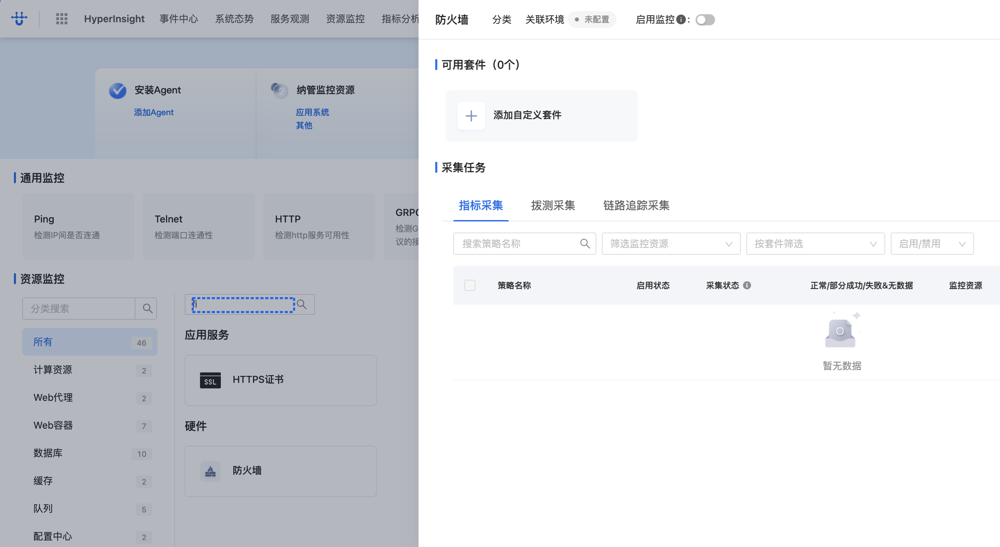
> 🔗 本步调用：GET 套件列表 / 采集探测任务 / 资源监控任务（详见 openapi.yaml 的「套件搜索与资源关联」）

## 二、选择 EasyOps 采集并确认关联资源

### 步骤 1：点击搜索结果中的资源项
<!-- url: infra-monitor/guide?resourceQuery=fi | step_id: 4 -->
在资源搜索结果中点击目标资源（如防火墙 FIREWALL），展开该资源的操作选项。
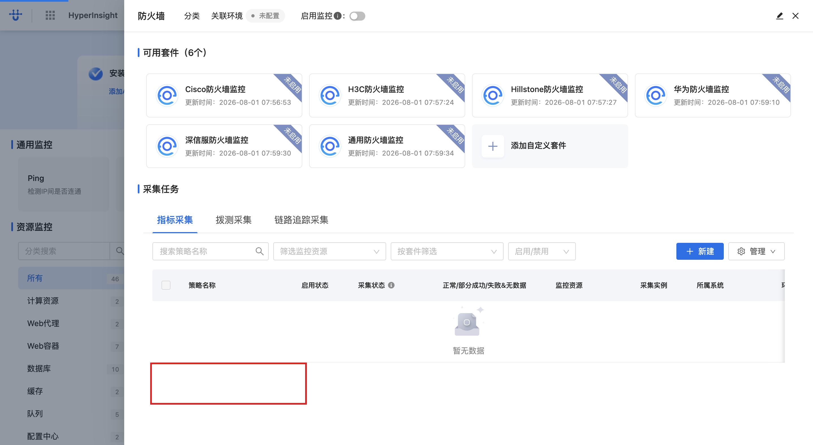

### 步骤 2：再次点击资源项，进入套件创建入口
<!-- url: infra-monitor/guide?resourceQuery=fi#FIREWALL@ONEMODEL | step_id: 5 -->
点击资源条目，页面定位到该资源详情（URL 携带资源标识 `#FIREWALL@ONEMODEL`），显示可选择的采集套件类型。
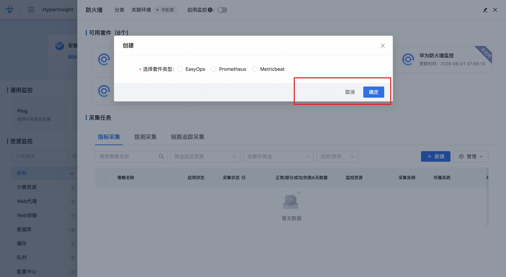

### 步骤 3：选择「EasyOps」采集套件
<!-- url: infra-monitor/guide?resourceQuery=fi#FIREWALL@ONEMODEL | step_id: 6 -->
在采集套件类型中选择「EasyOps」，表示使用 EasyOps 自定义采集方式创建监控套件。
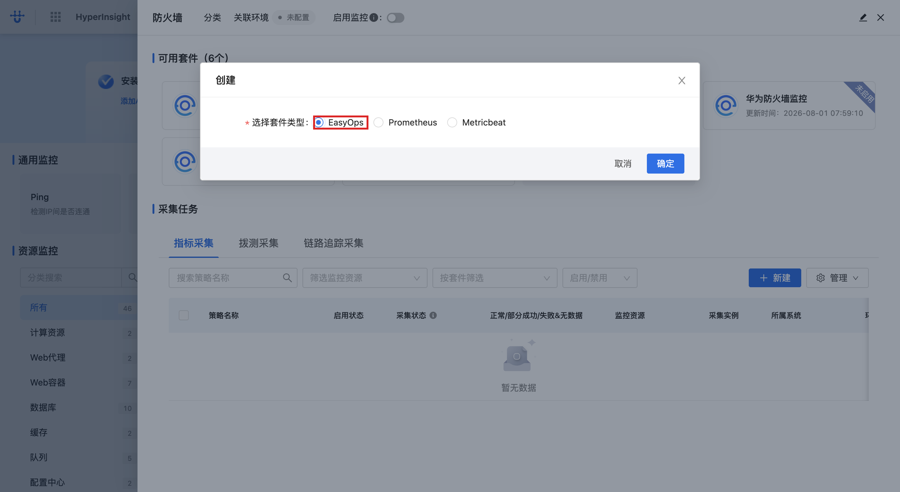

### 步骤 4：点击「确定」确认关联资源
<!-- url: infra-monitor/guide?resourceQuery=fi#FIREWALL@ONEMODEL | api: POST /next/api/gateway/cmdb.instance.PostSearchV3/v3/object/MICRO_APP_CATEGORY@EASYOPS/instance/_search | tag: 套件搜索与资源关联 | step_id: 7 -->
点击「确定」，确认该资源关联的监控套件创建方式，系统跳转到套件创建页（`monitor-kit/kit/easyops/create?relateObjectId=FIREWALL@ONEMODEL`）。
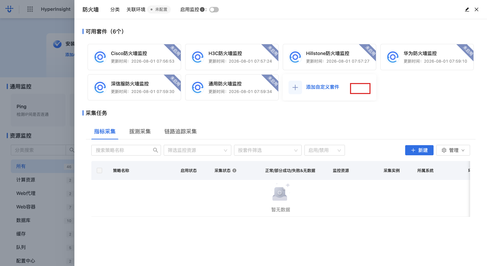
> 🔗 本步调用：POST 微应用分类实例搜索、套件包搜索（详见 openapi.yaml 的「套件搜索与资源关联」）

## 三、填写套件信息

### 步骤 1：填写套件名称
<!-- url: monitor-kit/kit/easyops/create?relateObjectId=FIREWALL@ONEMODEL | step_id: 8 -->
在「请输入套件名称」输入框中填写套件名称（示例：`test`）。
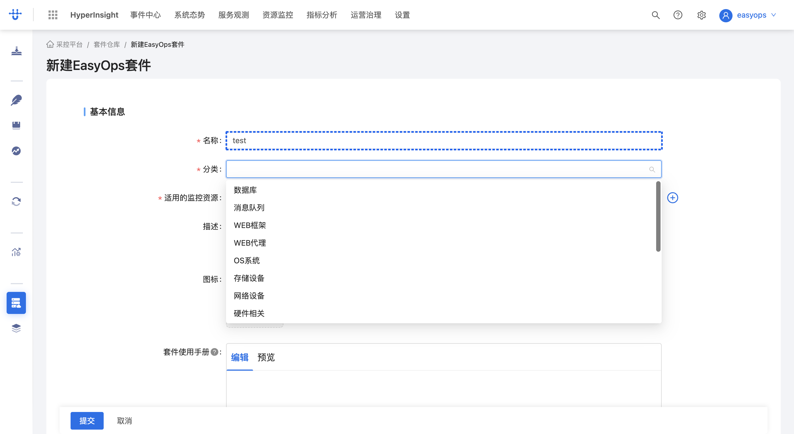

### 步骤 2：填写套件描述
<!-- url: monitor-kit/kit/easyops/create?relateObjectId=FIREWALL@ONEMODEL | step_id: 9 -->
在描述文本框中填写套件说明（示例：`descr^^`）。
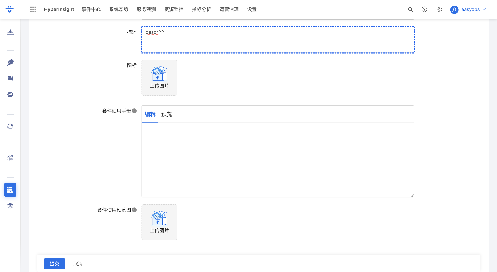

### 步骤 3：填写套件帮助文档
<!-- url: monitor-kit/kit/easyops/create?relateObjectId=FIREWALL@ONEMODEL | step_id: 10 -->
在帮助文档文本框中填写 Markdown 格式的使用说明（示例：`# title1`、`## title2`、`1. l1`、`2. l2` 等），用于套件使用方查看。

### 步骤 4：继续完善帮助文档内容
<!-- url: monitor-kit/kit/easyops/create?relateObjectId=FIREWALL@ONEMODEL | step_id: 11 -->
在帮助文档中补充二级子条目（如 `a. l2.1`），编辑时支持实时预览。
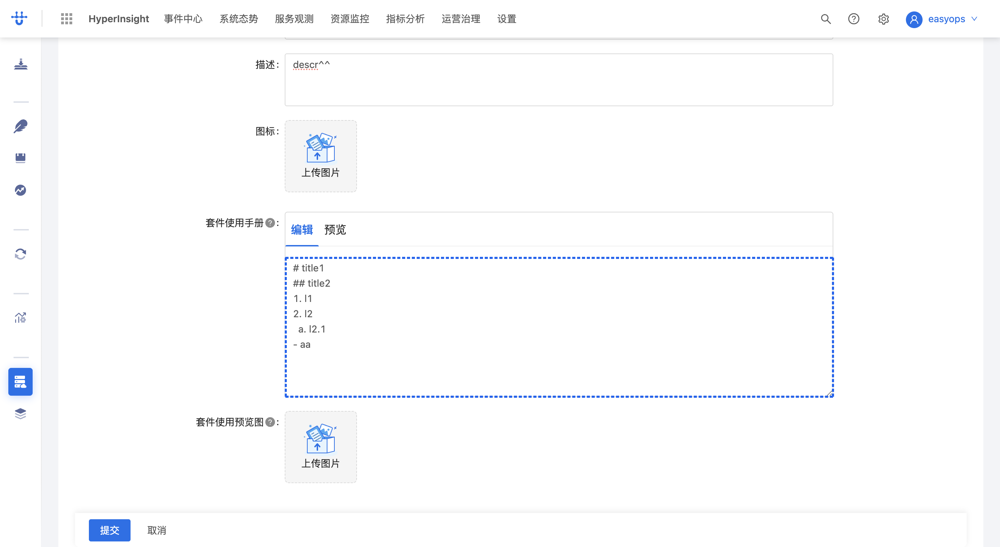

### 步骤 5：完成帮助文档编辑
<!-- url: monitor-kit/kit/easyops/create?relateObjectId=FIREWALL@ONEMODEL | api: GET /next/api/gateway/artifact.pkgservice.Search/package/search | tag: 套件信息填写 | step_id: 12 -->
确认帮助文档内容无误，编辑区关联的套件包与版本信息已加载。
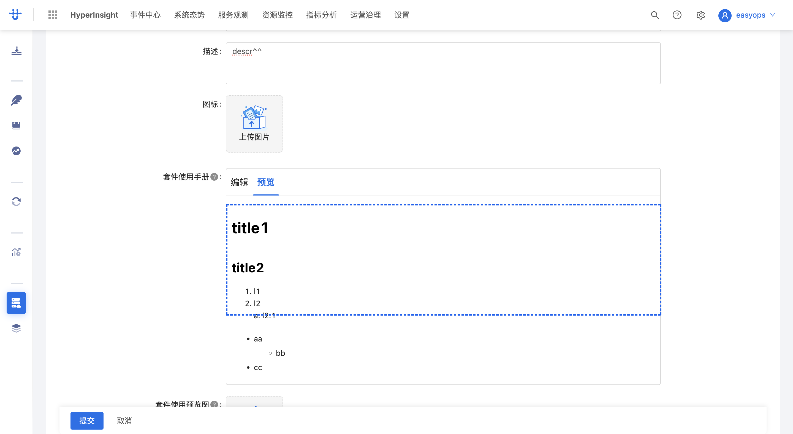
> 🔗 本步调用：GET 套件包搜索 / 版本列表（详见 openapi.yaml 的「套件信息填写」）

## 四、配置采集参数

### 步骤 1：填写默认采集机器
<!-- url: monitor-kit/kit/easyops/create?relateObjectId=FIREWALL@ONEMODEL | step_id: 13 -->
在「请填写执行采集的机器的默认值」输入框中填写默认采集机器表达式（示例：`$.ip`，从资源实例中取 IP 字段）。
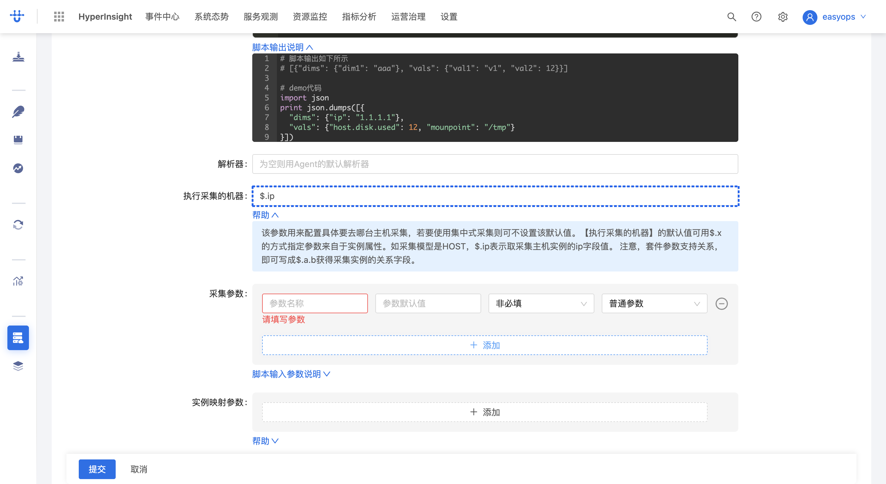

### 步骤 2：填写参数名称
<!-- url: monitor-kit/kit/easyops/create?relateObjectId=FIREWALL@ONEMODEL | step_id: 14 -->
在「参数名称」输入框中填写采集参数名（示例：`ip`）。
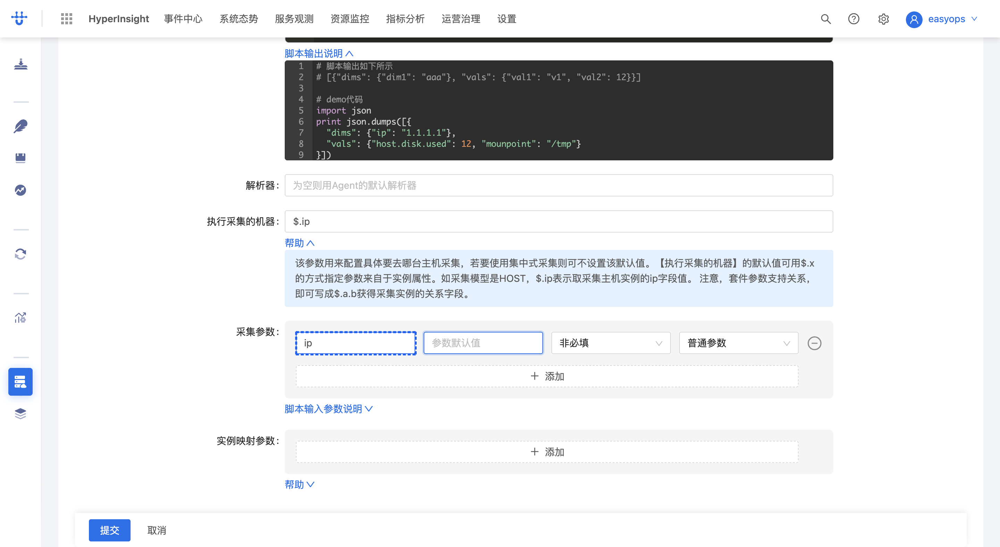

### 步骤 3：填写参数默认值
<!-- url: monitor-kit/kit/easyops/create?relateObjectId=FIREWALL@ONEMODEL | api: POST /next/api/gateway/collector_plugin_service.easyops_plugin.CreatePluginWithScriptInfo/api/v1/plugin/with_script_info | tag: 采集参数配置 | step_id: 15 -->
在「参数默认值」输入框中填写采集参数默认值（示例：`$.ip`）。填写完成后保存，系统创建采集插件、导入采集指标并激活套件。
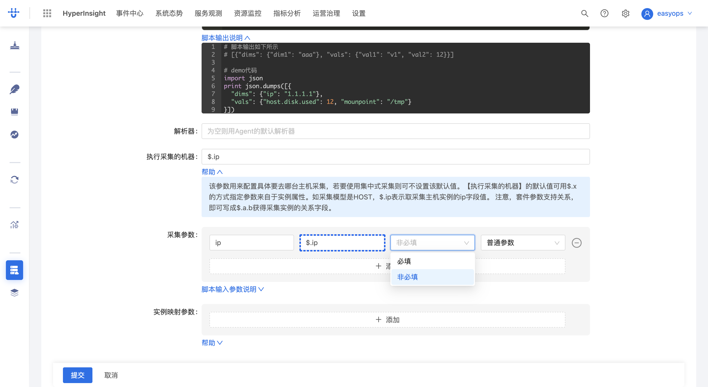
> 🔗 本步调用：POST 创建采集插件、导入指标、激活套件（详见 openapi.yaml 的「采集参数配置」）

## 附：本流程接口速查
| tag | 方法 | 路径(简) | 用途 | 步骤 |
| --- | --- | --- | --- | --- |
| 套件搜索与资源关联 | GET | `logic.resource_monitor/api/v1/resource-monitor-config/{objectId}` | 查询资源监控配置 | 步骤 2 |
| 套件搜索与资源关联 | GET | `easyops.api.collector_service.job.ListCollectorKitInfo/api/v1/collector/kit/info/list` | 查询套件信息列表 | 步骤 3 |
| 套件搜索与资源关联 | GET | `logic.collector_service/api/v1/collector_detect_job` | 查询采集探测任务 | 步骤 3 |
| 套件搜索与资源关联 | POST | `cmdb.instance.PostSearchV3/v3/object/{模型}/instance/_search` | 搜索模型实例 | 步骤 7 |
| 套件信息填写 | GET | `artifact.pkgservice.Search/package/search` | 搜索套件包 | 步骤 12 |
| 套件信息填写 | GET | `artifact.version.ListVersion/version/list` | 查询套件包版本 | 步骤 12 |
| 采集参数配置 | POST | `collector_plugin_service.easyops_plugin.CreatePluginWithScriptInfo/api/v1/plugin/with_script_info` | 创建采集插件 | 步骤 15 |
| 采集参数配置 | POST | `collector_plugin_service.metric_management.ImportPluginAliasMetrics/api/v2/import/plugin/{pluginId}/alias/metric/import` | 导入采集指标 | 步骤 15 |
| 采集参数配置 | POST | `easyops.api.collector_service.job.ActivateCollectorKit/api/v1/collector/kit/activate` | 激活采集套件 | 步骤 15 |
