# ITSM 定时工单管理 - 操作指引

> 适用场景：在 ITSM 工作台对**定时工单（scheduled ticket / 定时触发任务）**进行全生命周期管理——按 cron 表达式定时、周期性地自动发起指定流程工单。本流程覆盖「进入定时工单列表 → 新建定时任务（命名/选流程/配 cron/选通知）→ 提交 → 编辑 → 启停 → 删除」全链路。
> 配套接口：见同目录 [`ITSM-定时工单管理-openapi.yaml`](./ITSM-定时工单管理-openapi.yaml)。
>
> 与 [`ITSM-工单发起`](../ITSM-工单发起/ITSM-工单发起-操作指引.md) 的区别：**工单发起**是人工即时发起单次工单；**定时工单管理**是配置一条「按 cron 周期自动发起」的规则，到点由系统自动触发，无需人工逐次发起。
>
> 截图标注图例：🔴红框=点击 / 🔵蓝虚线框=输入 / 🟠橙框+▾=下拉 / 🟣紫圈=单复选 / 🟢绿粗框=提交。

## 目录
- [一、进入定时工单管理](#一进入定时工单管理)
- [二、列表搜索与筛选](#二列表搜索与筛选)
- [三、新建定时工单](#三新建定时工单)
- [四、编辑定时工单](#四编辑定时工单)
- [五、启用 / 禁用定时工单](#五启用--禁用定时工单)
- [六、删除定时工单](#六删除定时工单)
- [附：本流程接口速查](#附本流程接口速查)

<!-- deep-links: 本流程关键页面直达（SPA 路径，去掉 host 前缀，参数化）
  工作台:        itsc-workbench/workbench
  定时工单列表:   itsc-ticket-center/schedulers/ticket
  新建定时工单:   itsc-ticket-center/schedulers/ticket/create
  定时工单详情:   itsc-ticket-center/schedulers/ticket/{instanceId}/detail
  编辑定时工单:   itsc-ticket-center/schedulers/ticket/{instanceId}/edit
-->

## 一、进入定时工单管理

从工作台导航到「定时工单管理」列表页（`schedulers/ticket`）。

### 步骤 1：在工作台点击「系统管理」
<!-- url: itsc-workbench/workbench | step_id: 1 -->
在工作台点击「系统管理」入口。

### 步骤 2：在系统管理中点击「定时工单管理」
<!-- url: itsc-workbench/workbench | step_id: 2 -->
在系统管理菜单中点击「定时工单管理」（部分版本显示为「系统管理」下的定时任务入口）。
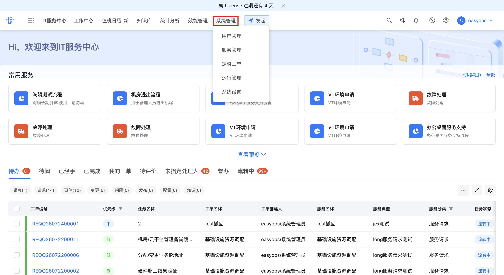

### 步骤 3：进入定时工单列表页
<!-- url: itsc-ticket-center/schedulers/ticket | api: GET .../scheduled_ticket/list | tag: 定时工单管理 | step_id: 3 -->
跳转到定时工单列表页，自动拉取定时工单列表。
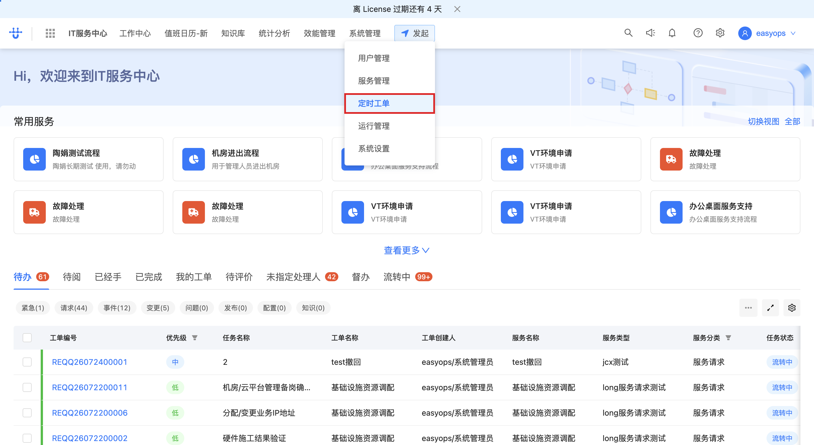
> 🔗 本步调用：`GET /next/api/gateway/logic.flowable_service/api/flowable_service/v1/scheduled_ticket/list`（详见 openapi.yaml 的「定时工单管理」），同时加载微应用、菜单、用户信息等。

## 二、列表搜索与筛选

在列表页按创建人、状态、名称等条件搜索/筛选定时工单。

### 步骤 1：在搜索框输入关键字
<!-- step_id: 4-5 -->
> ⚠️ 未截图（纯文本输入过程不截图）。在列表上方搜索框输入关键字（如 `test`）。
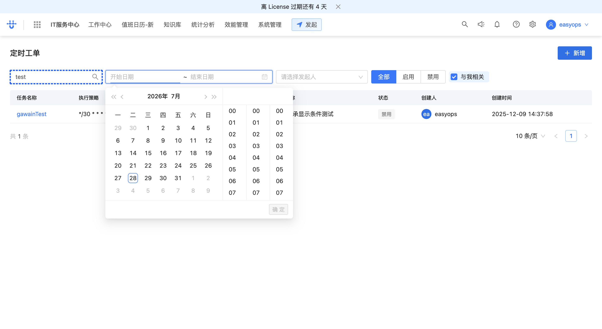

### 步骤 2：选择创建人筛选
<!-- step_id: 6-9 | api: GET .../scheduled_ticket/list | tag: 定时工单管理 -->
点击创建人筛选下拉，选择目标创建人（如 `easyops`），点「确定」生效，列表按创建人过滤。
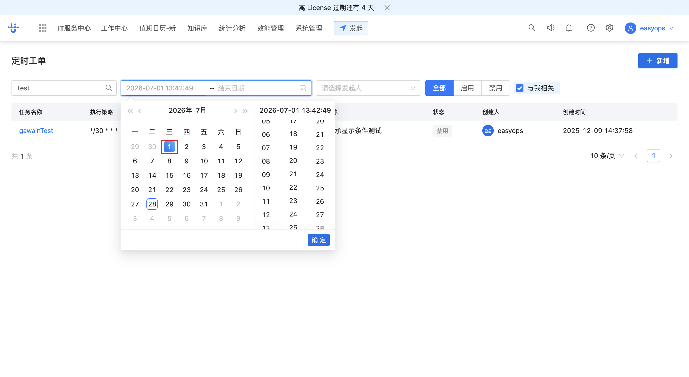
> 💡 后续选择「确定」的截图见 step-12/14。
> 🔗 本步调用：`GET .../scheduled_ticket/list`（带创建人参数）。

### 步骤 3：按状态筛选（全部 / 启用 / 禁用）
<!-- step_id: 10-13 | api: GET .../scheduled_ticket/list | tag: 定时工单管理 -->
依次点击状态筛选：选中创建人 `easyops`（step-15）→「全部」（step-16）→「启用」（step-17）→「禁用」（step-18），列表按状态过滤定时工单。

选中创建人 easyops：
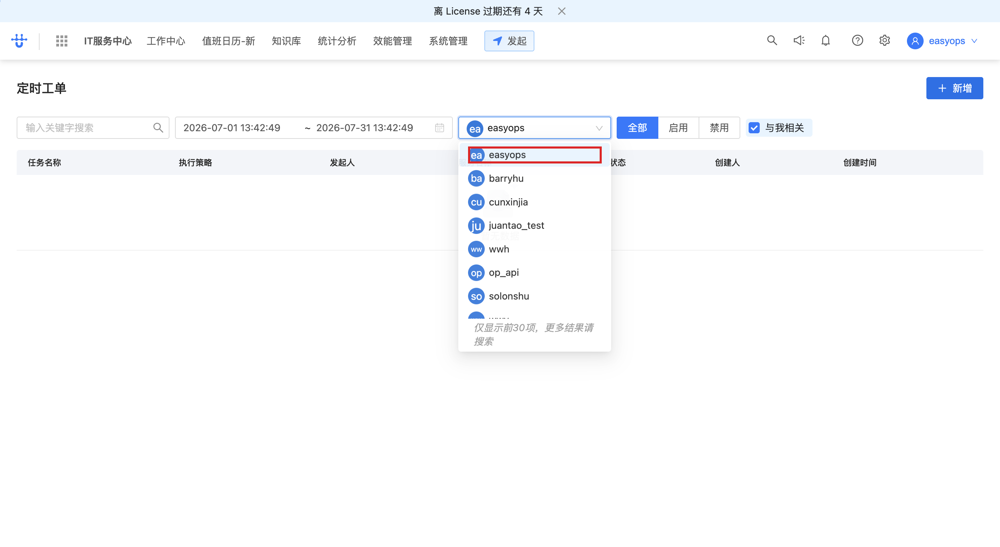

切换「全部」状态：
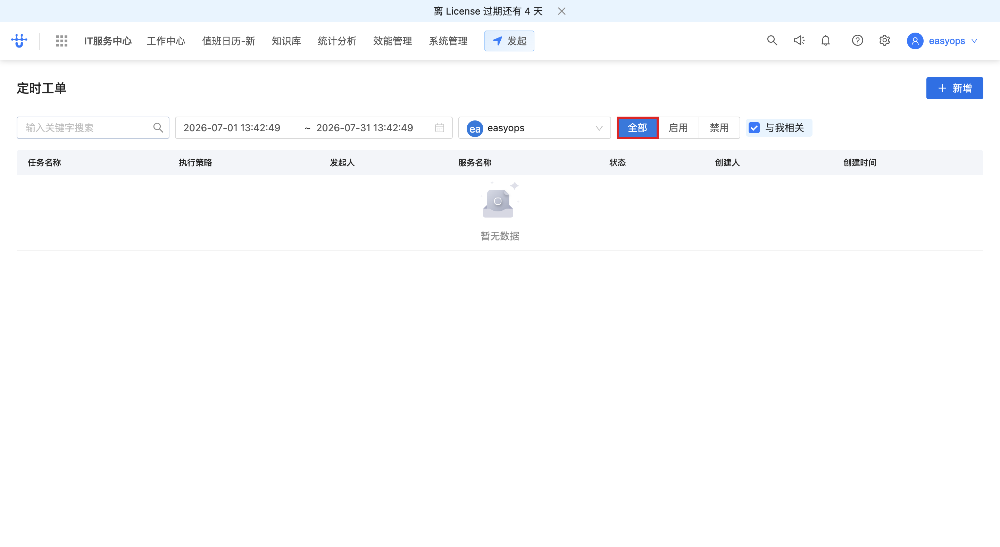

切换「启用」状态：
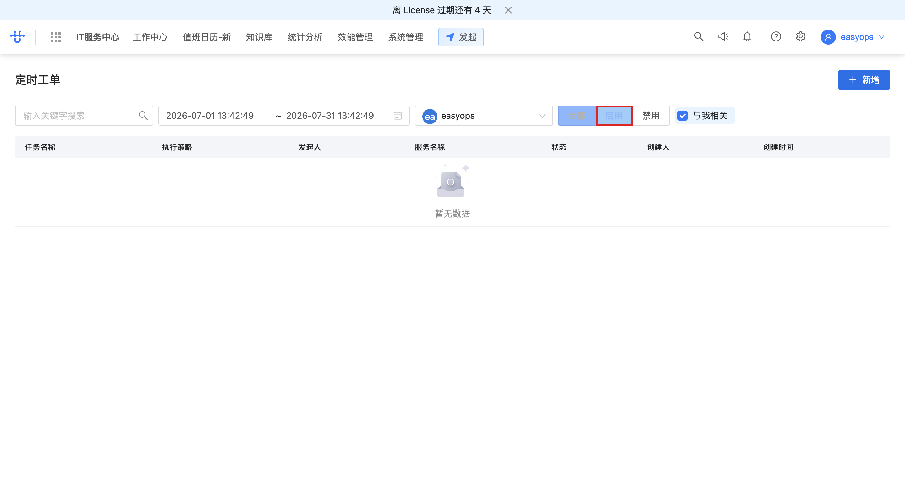

切换「禁用」状态：
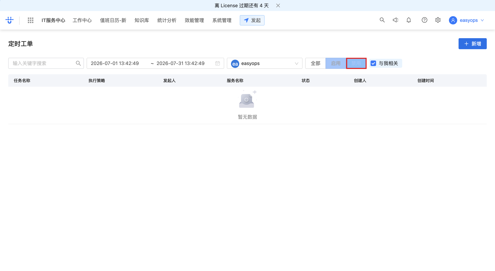
> 🔗 每次切换状态都调用 `GET .../scheduled_ticket/list`（带 `status` 参数：`enabled`/`disabled`）。

### 步骤 4：按名称搜索定位
<!-- step_id: 14-15 | api: GET .../scheduled_ticket/list | tag: 定时工单管理 -->
在搜索框输入名称（如 `test`）后触发查询，列表按名称过滤。
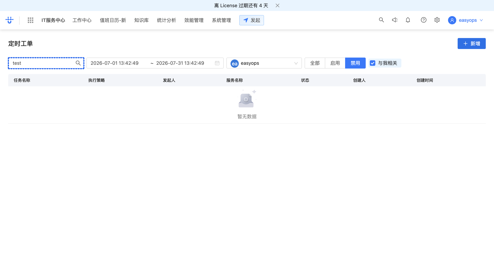
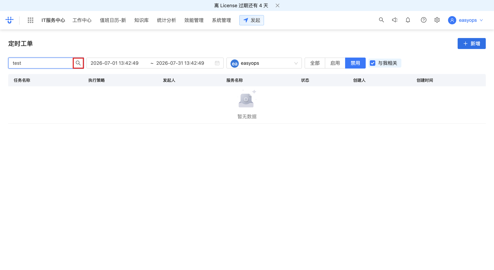
> 🔗 本步调用：`GET .../scheduled_ticket/list`（带 `name=test` 参数）。

## 三、新建定时工单

点击「新增」打开新建表单，配置任务名称、触发流程、备注、cron 定时表达式、通知策略后提交。

### 步骤 1：点击「新增」
<!-- url: itsc-ticket-center/schedulers/ticket/create | api: POST .../cmdb/instance/_search | tag: 定时工单管理 | step_id: 16 -->
在列表页点击「新增」按钮，打开新建定时工单表单页。
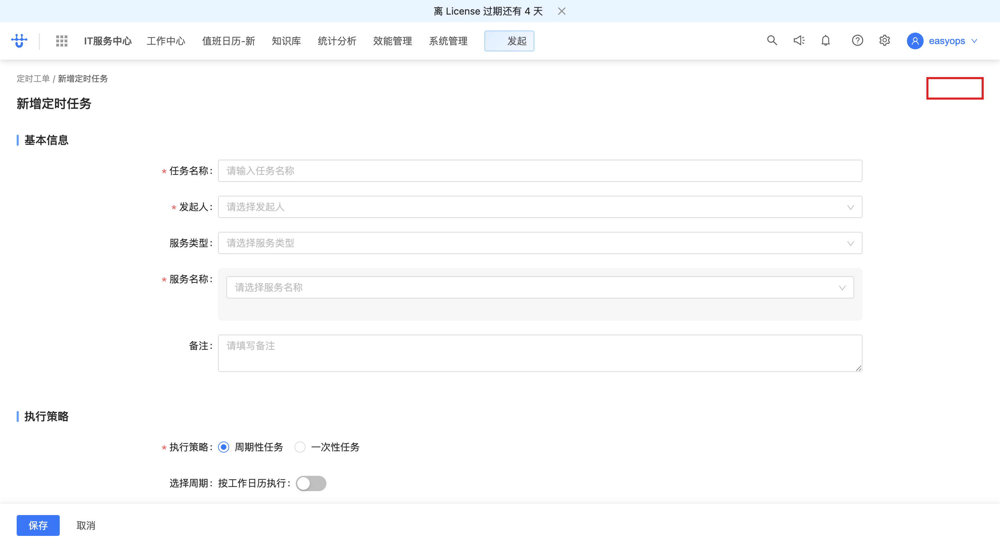

### 步骤 2：输入任务名称
<!-- step_id: 17 -->
在「任务名称」输入框填写任务名（如 `test`）。
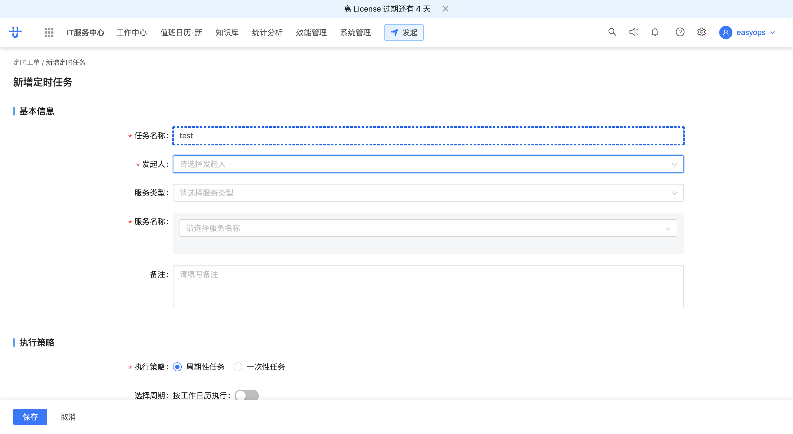

### 步骤 3：选择工单创建人 / 发起人
<!-- step_id: 18 -->
选择工单的创建人（即定时触发时以谁的身份发起，如 `easyops`）。
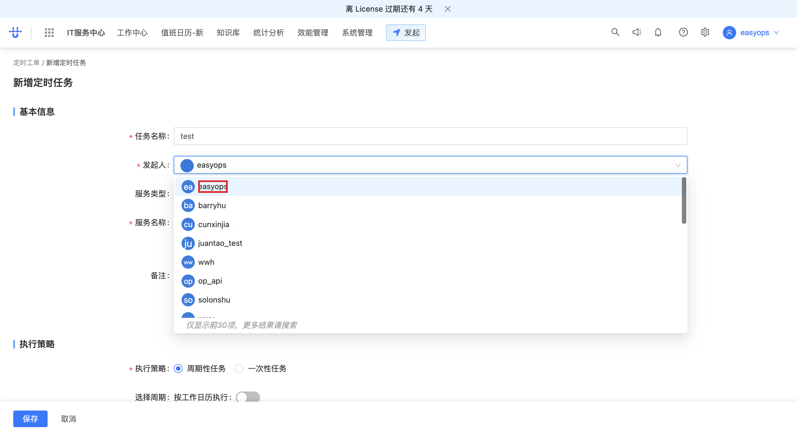

### 步骤 4：下拉选择「触发类型 / 流程」
<!-- step_id: 19-21 | api: GET .../service_catalog, GET .../service_instance, GET .../service_instance/{id} | tag: 服务目录与流程 | step_id: 19 -->
点击下拉（caret-down），选择「标准事件」分类，再选择具体流程（如「宜昌-事件管理流程」）。
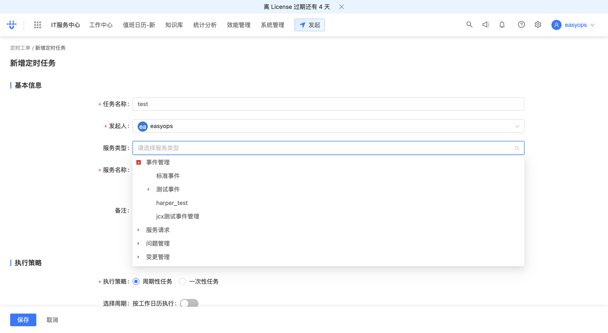

选择「标准事件」分类：
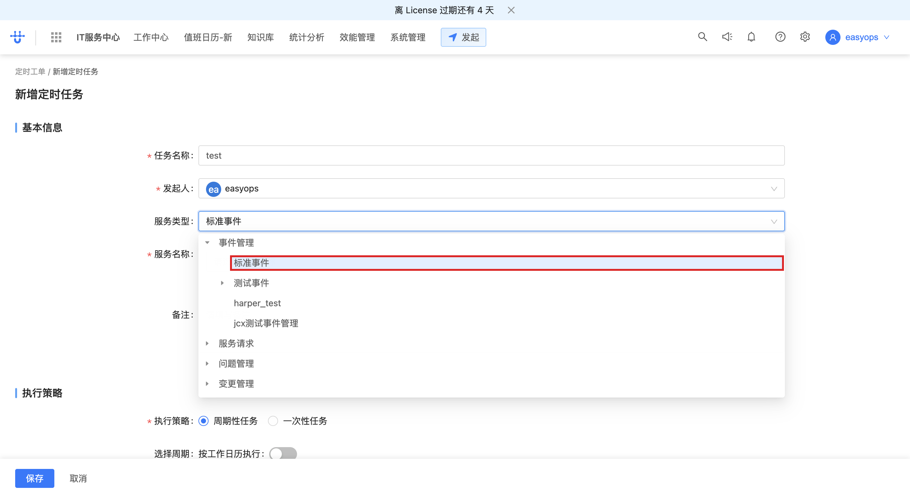

选择具体流程「宜昌-事件管理流程」：
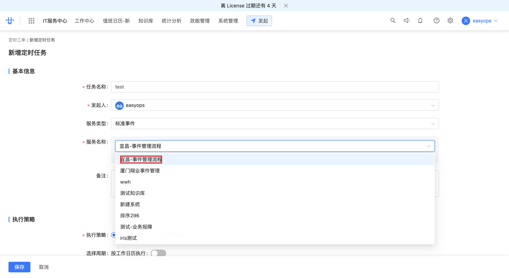
> 🔗 本步调用：`GET .../service_catalog`（服务目录）→ `GET .../service_instance`（服务实例）→ `GET .../service_instance/{serviceId}`（流程发起参数），详见 openapi.yaml 的「服务目录与流程」。

### 步骤 5：填写备注
<!-- step_id: 22-35 -->
> ⚠️ 未截图（纯文本输入过程不截图，逐字符录入）。在「备注」输入框填写说明文字，最终值为 `测试用`。输入过程中只记录值变化，失焦后即 step-49 截图。

### 步骤 6：失焦确认备注内容
<!-- step_id: 35 -->
备注输入完成（值 `测试用`），失焦确认。
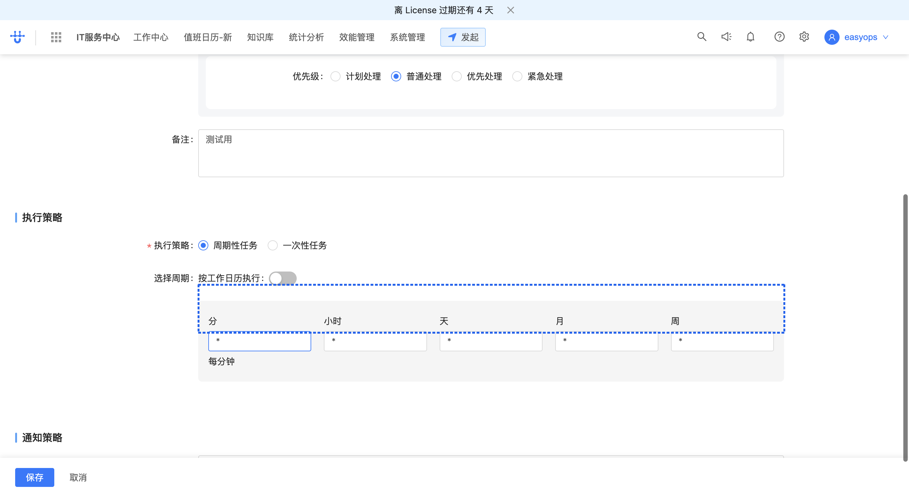

### 步骤 7：选择通知策略
<!-- step_id: 36 | api: GET .../notify_policy | tag: 通知策略 -->
点击「通知名称」选择框，选择通知策略（在「通知配置管理」中预先创建的通知）。
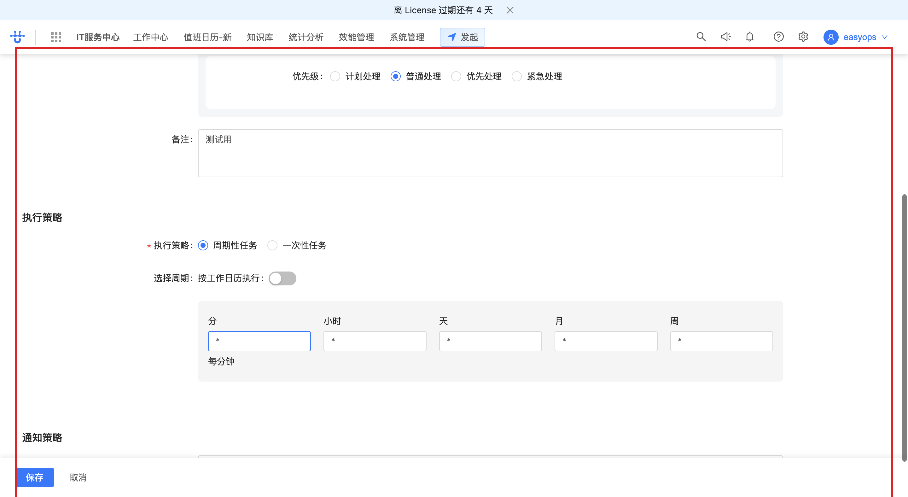
> 🔗 本步调用：`GET /next/api/gateway/logic.flowable_service/api/itsc_trigger/v1/notify_policy`（详见 openapi.yaml 的「通知策略」）。

### 步骤 8：配置定时频率（cron 表达式）
<!-- step_id: 37-40 -->
在定时频率输入区配置 cron 表达式。本例配置为「每 5 分钟一次」，最终表达式 `0 0 * * */5`。
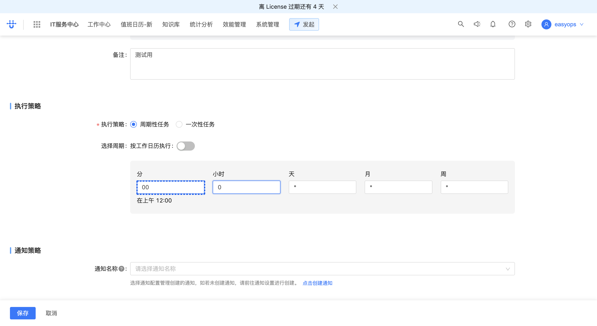
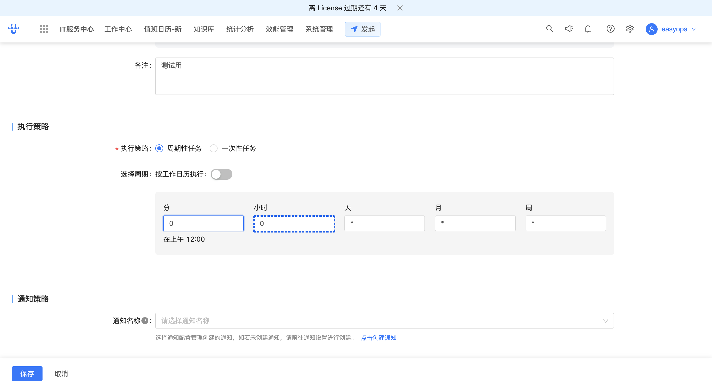

配置完成（`*/5` 即每 5 分钟）：
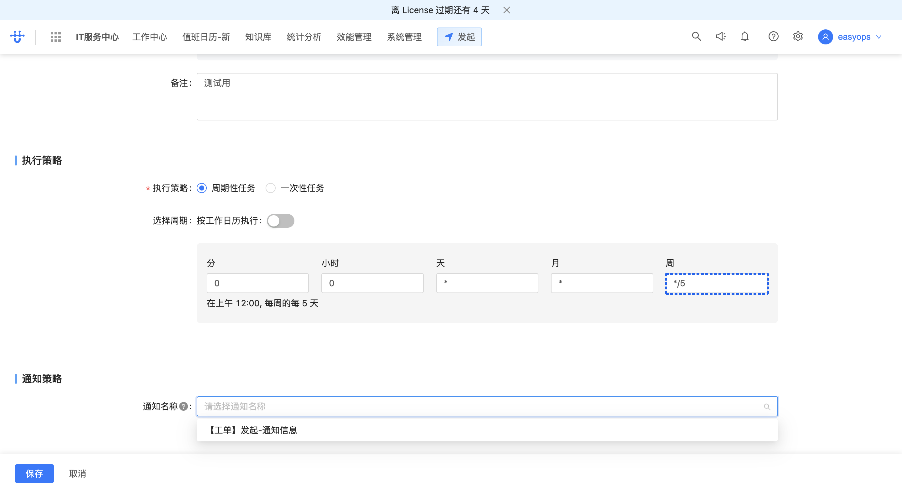
> 💡 cron 表达式说明（提交时拼装为 `0 0 * * */5`，即「分 时 日 月 周」中分钟与小时为 0、周为每 5 一次）。UI 上通常按「分钟/小时/日/月/周」分段配置，也可直接输入表达式。

### 步骤 9：展开通知信息预览
<!-- step_id: 41 -->
点击「【工单】发起-通知信息」展开通知配置预览。
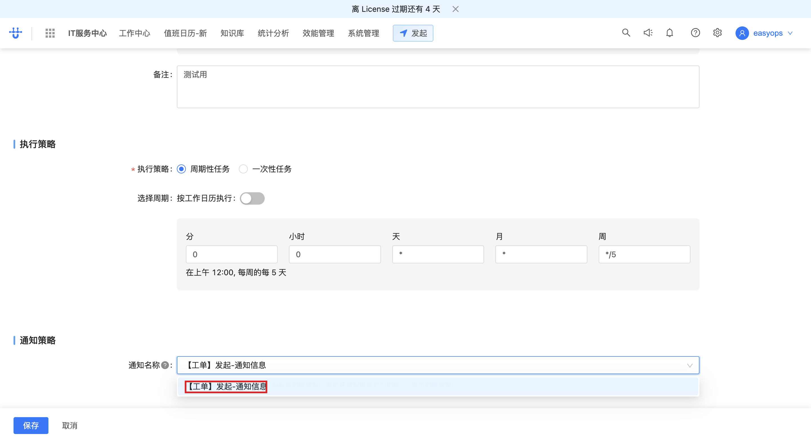

### 步骤 10：提交新建定时工单
<!-- step_id: 42 | api: POST .../scheduled_ticket/create | tag: 定时工单管理 -->
点击「确定 / 提交」按钮，创建定时工单。
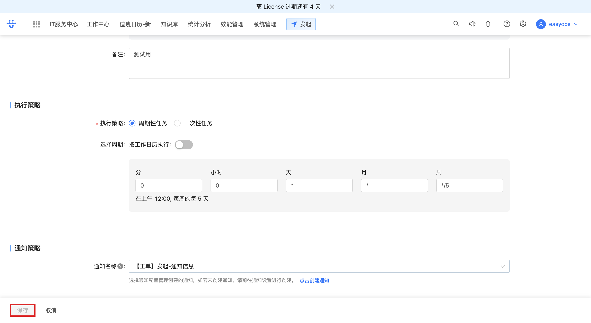
> 🔗 本步调用：`POST /next/api/gateway/logic.flowable_service/api/flowable_service/v1/scheduled_ticket/create`（详见 openapi.yaml 的「定时工单管理」），创建成功后返回 `instanceId`，并拉取详情 `GET .../scheduled_ticket/{instanceId}`。

## 四、编辑定时工单

对已创建的定时工单修改配置。

### 步骤 1：点击列表行的「编辑」
<!-- url: itsc-ticket-center/schedulers/ticket/{instanceId}/edit | api: GET .../scheduled_ticket/{id}, PUT .../scheduled_ticket/{id} | tag: 定时工单管理 | step_id: 43 -->
在定时工单详情页点击「编辑」，进入编辑表单（表单回填原配置）。
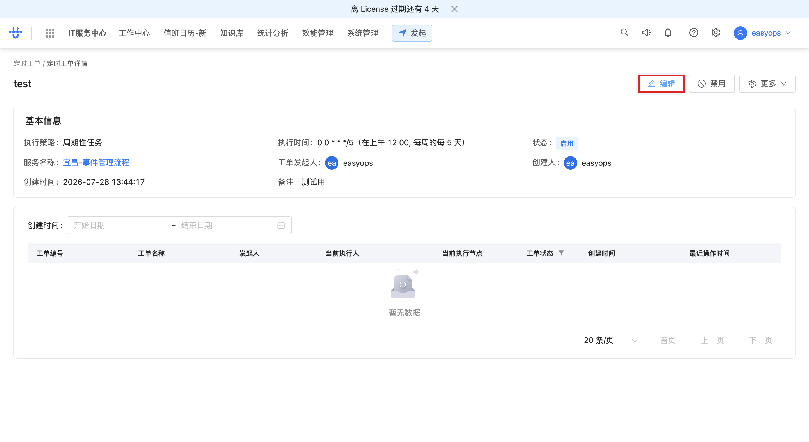
> 🔗 本步调用：`GET .../scheduled_ticket/{instanceId}`（回填详情）→ 编辑后 `PUT .../scheduled_ticket/{instanceId}`（保存），详见 openapi.yaml 的「定时工单管理」。

### 步骤 2：修改字段并保存
<!-- step_id: 44-45 -->
修改需要调整的字段（如某数值改为 `1`），点击保存。
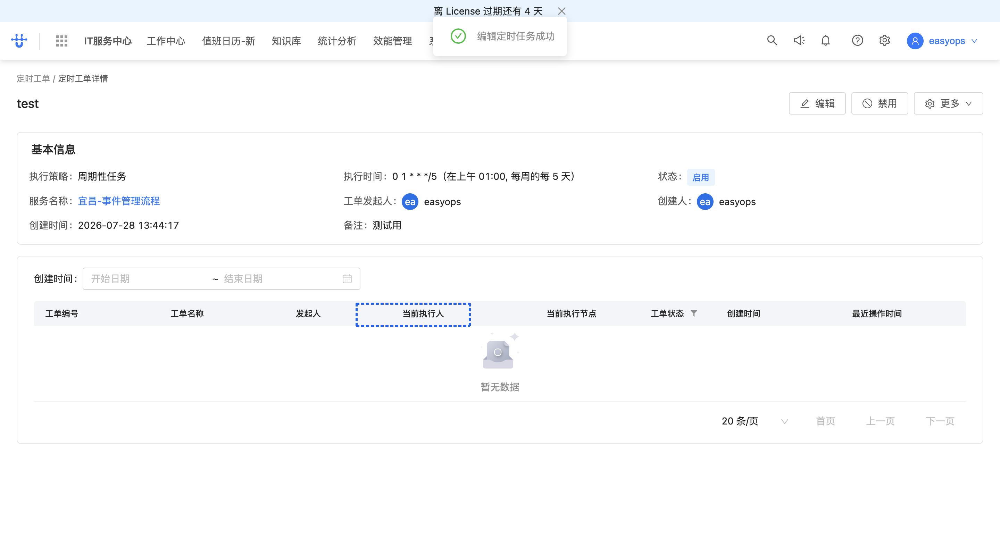
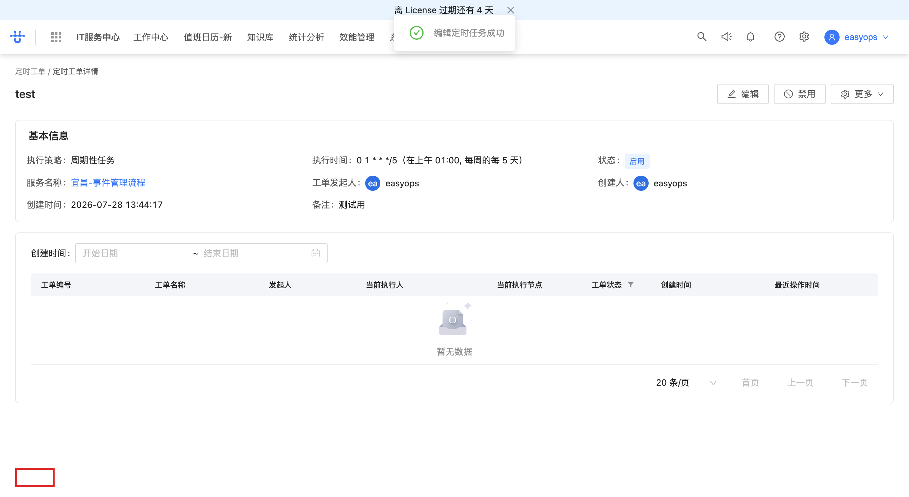

## 五、启用 / 禁用定时工单

通过状态切换控制定时任务是否生效（启用的任务到点才会自动发起工单）。

### 步骤 1：点击「禁用」并在弹窗确认
<!-- step_id: 46-47 | api: PUT .../scheduled_ticket/{id}/status | tag: 定时工单管理 -->
在详情/列表点击「禁用」，弹窗点击「确定」确认禁用。
点击「禁用」：
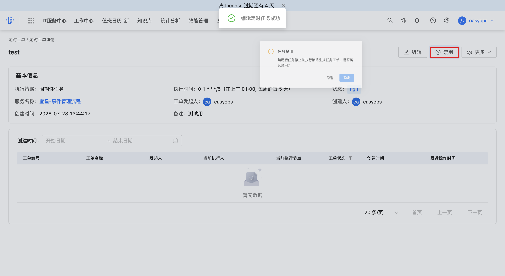

弹窗点击「确定」：

> 🔗 本步调用：`PUT /next/api/gateway/logic.flowable_service/api/flowable_service/v1/scheduled_ticket/{instanceId}/status`，请求体 `{"status": false}`（详见 openapi.yaml 的「定时工单管理」）。

### 步骤 2：点击「启用」恢复
<!-- step_id: 48 | api: PUT .../scheduled_ticket/{id}/status | tag: 定时工单管理 -->
点击「启用」，将定时工单恢复为生效状态。
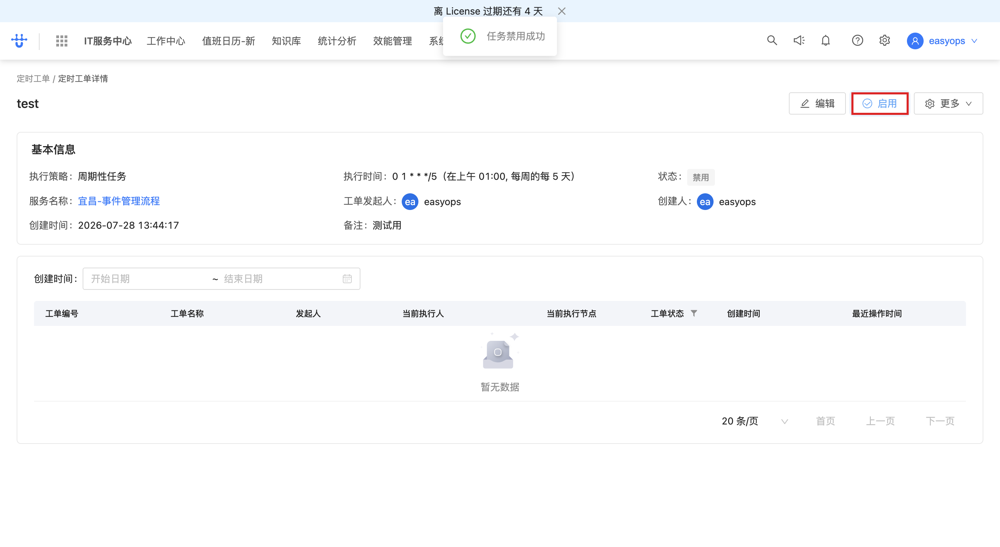
> 🔗 本步调用：`PUT .../scheduled_ticket/{instanceId}/status`，请求体 `{"status": true}`。

## 六、删除定时工单

彻底删除定时工单配置。

### 步骤 1：点击「更多 → 删除」
<!-- step_id: 49-50 -->
在列表行点击「更多」展开操作菜单，点击「删除」。
点击「更多」：
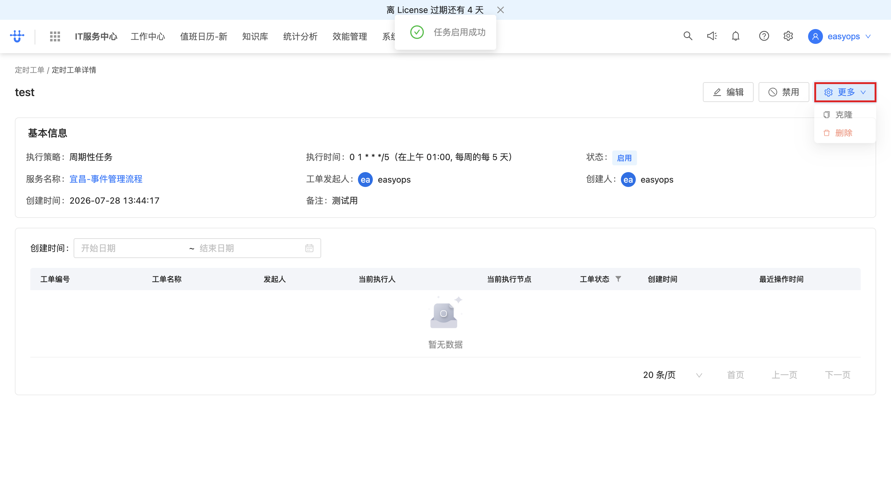

点击「删除」：
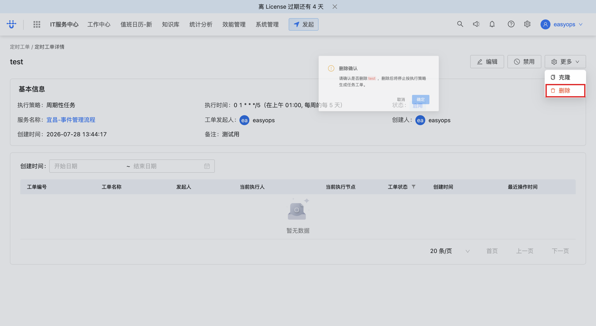

### 步骤 2：弹窗确认删除
<!-- step_id: 51-52 | api: DELETE .../scheduled_ticket/{id} | tag: 定时工单管理 -->
在确认弹窗点击「确定」，删除该定时工单。
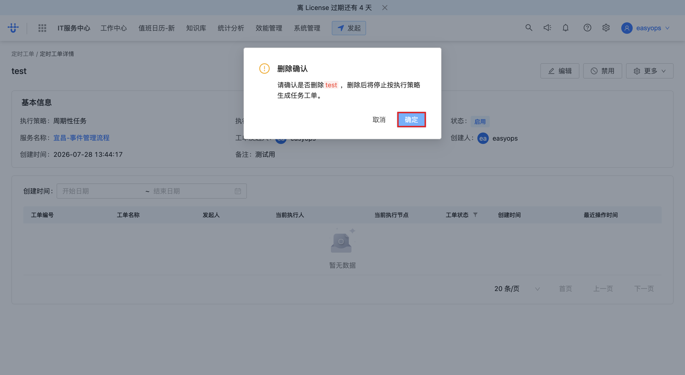

删除完成，返回列表页（列表已刷新，该条消失）：
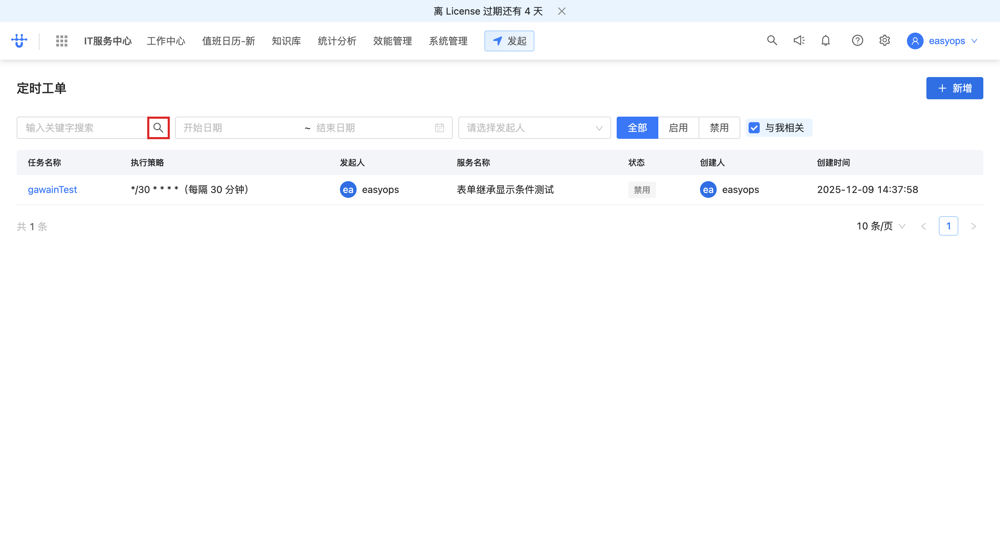
> 🔗 本步调用：`DELETE /next/api/gateway/logic.flowable_service/api/flowable_service/v1/scheduled_ticket/{instanceId}`（详见 openapi.yaml 的「定时工单管理」）。

## 附：本流程接口速查

| 操作 | 方法 | 路径 | 说明 |
| --- | --- | --- | --- |
| 定时工单列表 | GET | `/next/api/gateway/logic.flowable_service/api/flowable_service/v1/scheduled_ticket/list` | 支持按创建人/状态/名称筛选（`status`=enabled/disabled、`name`、`ticketCreator`） |
| 定时工单详情 | GET | `/next/api/gateway/logic.flowable_service/api/flowable_service/v1/scheduled_ticket/{instanceId}` | 回填编辑表单 |
| 新建定时工单 | POST | `/next/api/gateway/logic.flowable_service/api/flowable_service/v1/scheduled_ticket/create` | body 含 name/taskType=crontab/memo/notifyPolicyId/taskScheduler/crontabExtConfig |
| 编辑定时工单 | PUT | `/next/api/gateway/logic.flowable_service/api/flowable_service/v1/scheduled_ticket/{instanceId}` | 同 create 字段 + ticketCreator |
| 启停定时工单 | PUT | `/next/api/gateway/logic.flowable_service/api/flowable_service/v1/scheduled_ticket/{instanceId}/status` | body `{"status": bool}`，true=启用 / false=禁用 |
| 删除定时工单 | DELETE | `/next/api/gateway/logic.flowable_service/api/flowable_service/v1/scheduled_ticket/{instanceId}` | 路径参数为 instanceId |
| 服务目录 | GET | `/next/api/gateway/logic.flowable_service/api/flowable_service/v1/service_catalog` | 新建时选流程用 |
| 服务实例 | GET | `/next/api/gateway/logic.flowable_service/api/flowable_service/v1/service_instance` | 按 catalogID 查可发起服务 |
| 流程发起参数 | GET | `/next/api/gateway/flowable_service.service_catalog.GetStartServiceParams/api/flowable_service/v2/service_instance/{serviceId}` | 取流程表单/字段 |
| 通知策略列表 | GET | `/next/api/gateway/logic.flowable_service/api/itsc_trigger/v1/notify_policy` | 选通知用，按 notifyType=process_instance、triggerSignal=start 过滤 |
