# ITSM 工单发起 - 操作指引

> 适用场景：在 ITSM 工作台从服务目录选择服务，填写表单后**发起一个工单**，并查看发起结果（工单号/待办）。本流程覆盖「发起 -> 选服务 -> 填表单 -> 提交 -> 查看结果」全链路。
> 配套接口：见同目录 [`ITSM-工单发起-openapi.yaml`](./ITSM-工单发起-openapi.yaml)。
>
> 与 [`ITSM-工单搜索与处理`](../ITSM-工单搜索与处理/ITSM-工单搜索与处理-操作指引.md) 的区别：本流程是**新建/发起**一个工单；后者是**搜索并处理**已有工单。
>
> 截图标注图例：🔴红框=点击 / 🔵蓝虚线框=输入 / 🟠橙框+▾=下拉 / 🟣紫圈=单复选 / 🟢绿粗框=提交。

## 目录
- [一、进入发起入口](#一进入发起入口)
- [二、选择服务](#二选择服务)
- [三、填写工单表单](#三填写工单表单)
- [四、提交工单](#四提交工单)
- [五、查看发起结果](#五查看发起结果)
- [附：本流程接口速查](#附本流程接口速查)

<!-- deep-links: 本流程关键页面直达（SPA 路径，去掉 host 前缀，参数化）
  工作台:       itsc-workbench/workbench
  发起页(选服务后): itsc-ticket-center/ticket-apply?serviceId={serviceId}
  工作台待办:    itsc-workbench/workbench?activeKey=run
-->

## 一、进入发起入口

从工作台进入「发起」入口，展示服务目录树。

### 步骤 1：点击「发起」
<!-- url: itsc-workbench/workbench | api: GET .../service_catalog_tree | tag: 服务目录与服务实例 | step_id: 1 -->
在工作台点击「发起」，展开服务目录树（事件管理、知识管理等分类，含可发起的服务）。
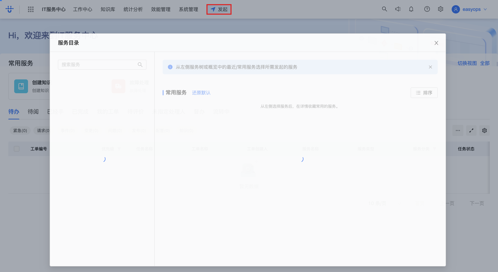
> 🔗 本步调用：`GET /next/api/gateway/logic.flowable_service/api/flowable_service/v1/service_catalog_tree`（详见 openapi.yaml 的「服务目录与服务实例」），同时拉取常用服务 `GET .../process_common`。

## 二、选择服务

在服务目录树中找到要发起的服务，或在搜索框按名称定位，点击进入该服务的发起表单页。

### 步骤 1：点击服务目录树展开分类
<!-- step_id: 2 -->
点击「serviceTree」（服务目录树），展开分类节点（如「事件管理」）。
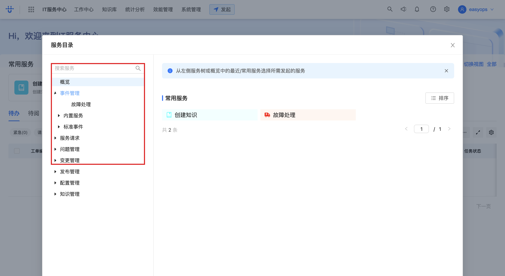

### 步骤 2：点击分类下的服务（如「故障处理」）
<!-- api: GET .../service_instance/{id}, POST .../form_template/_search | tag: 服务目录与服务实例 | step_id: 3 -->
在展开的分类下点击目标服务（如「故障处理」），拉取该服务实例详情与表单模板。
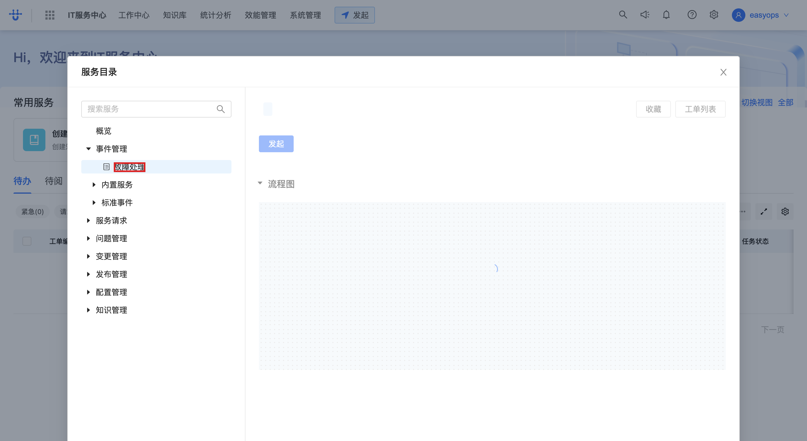
> 🔗 本步调用：`GET .../v2/service_instance/{serviceId}` 与 `GET .../v1/service_instance/{serviceId}`（详见 openapi.yaml 的「服务目录与服务实例」），以及 `POST .../form_template/_search`（「表单模板」）查询该服务节点的表单。

### 步骤 3：在搜索框输入服务名快速定位
<!-- step_id: 4 -->
若服务较多，在搜索框输入服务名关键词（如 `表单`）过滤定位。
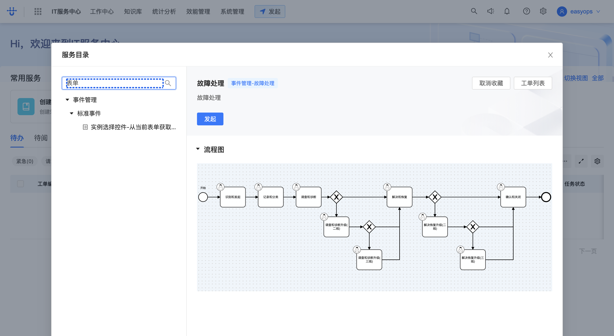
> 💡 提示：本录制中最终选中的服务是搜索到的「实例选择控件-从当前表单获取值」（serviceId=608f94db73be5，标准事件分类），用于演示含字段依赖的表单。

### 步骤 4：点击服务进入发起表单页
<!-- url: itsc-ticket-center/ticket-apply?serviceId={serviceId} | api: GET .../v2/service_instance/{id}(GetStartServiceParams), POST .../form_template/_search | tag: 服务目录与服务实例 | step_id: 6 -->
点击目标服务（如「实例选择控件-从当前表单获取值」），进入工单发起表单页 `ticket-apply?serviceId=...`，加载发起参数与表单定义。
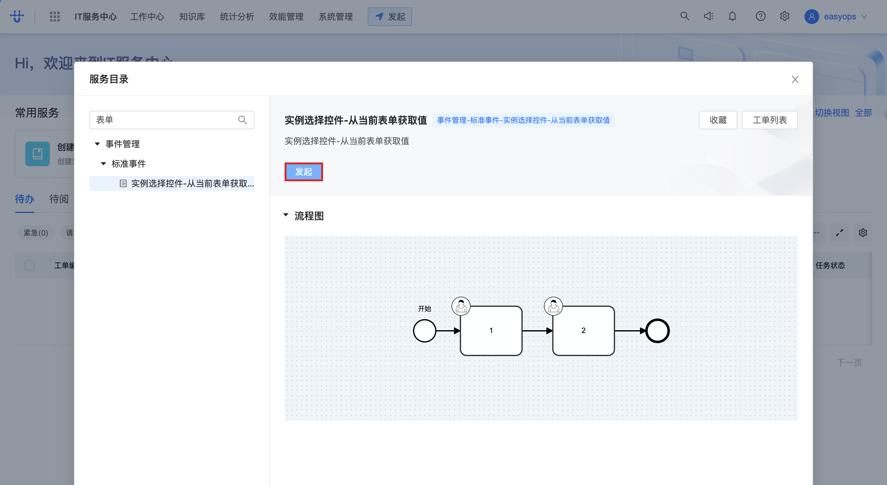
> 🔗 本步调用：`GET /next/api/gateway/flowable_service.service_catalog.GetStartServiceParams/api/flowable_service/v2/service_instance/{serviceId}`（详见 openapi.yaml 的「服务目录与服务实例」），获取发起参数（taskInfo/formId/formVersionId 等），并 `POST .../form_template/_search`（「表单模板」）加载表单。

## 三、填写工单表单

在发起表单页填写各字段。字段由该服务绑定的表单定义决定（不同服务字段不同）。

### 步骤 1：填写实例选择字段
<!-- step_id: 7 -->
点击实例选择控件，选择一个实例值（如 `a2`）。该控件可从当前表单其它字段取值。
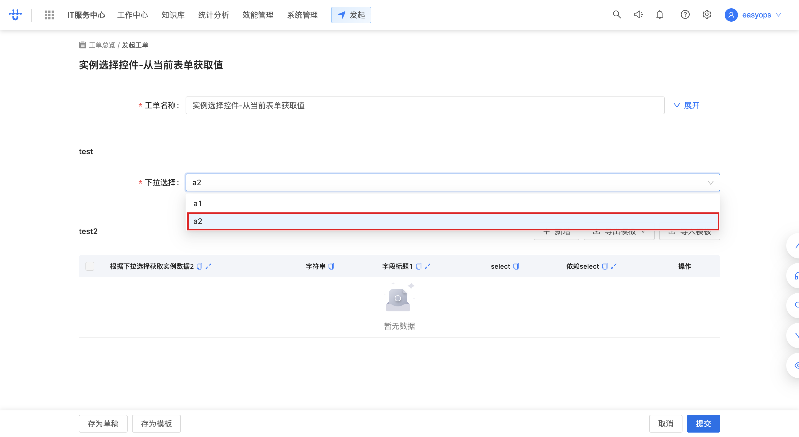

### 步骤 2：点击「新增」添加表单子项
<!-- step_id: 8 -->
若表单含可重复的子项（如多行明细），点击「新增」添加一行。
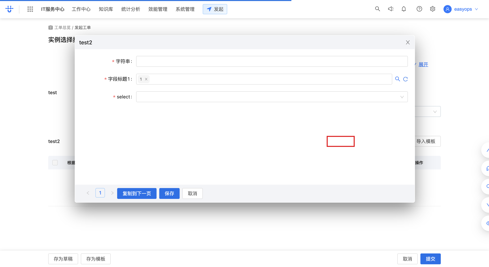

### 步骤 3：填写字段值
<!-- step_id: 11 -->
在字段输入框填写值（如 `aa`），文本输入不截图，失焦时捕获。
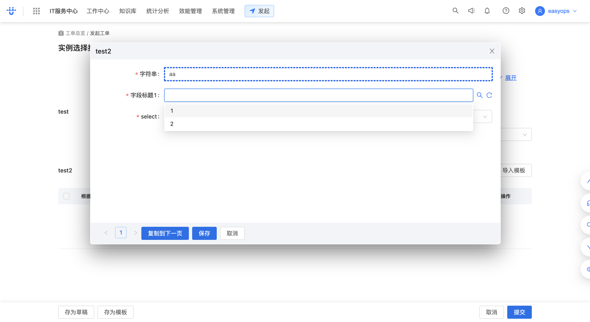
> 💡 提示：步骤 9-10 为输入过程的逐字符事件，最终值为 `aa`。

### 步骤 4：选择下拉/单选项
<!-- step_id: 13 -->
点击「select」下拉，选择选项（如 `A`）。部分字段存在依赖关系（依赖 select），选项随上游字段值变化。
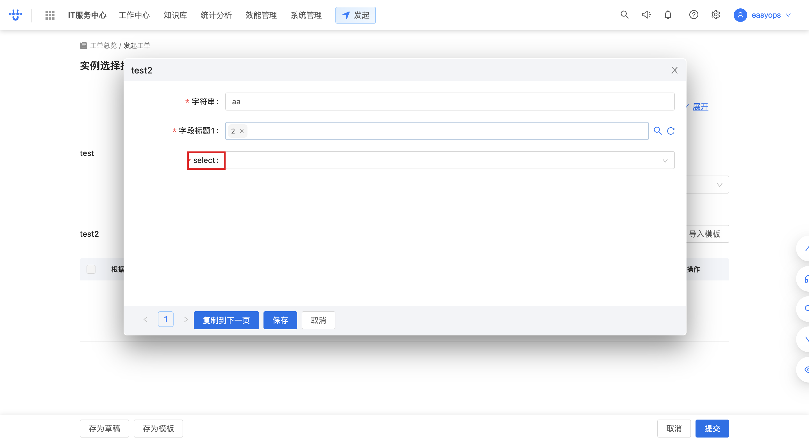

### 步骤 5：配置字段标题与依赖（若有）
<!-- step_id: 18 -->
表单含「字段标题」「依赖 select」等配置项时，按需设置（如选择 1/2、依赖项）。步骤 12/16/17 为选项点击，步骤 14 选 A。
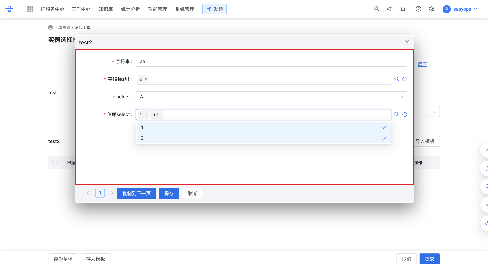
> 💡 提示：本表单为测试服务「实例选择控件-从当前表单获取值」，含字段依赖演示（字符串字段依赖 select 选项）。实际业务服务的字段以表单定义为准。

### 步骤 6：点击「保存」（暂存表单）
<!-- step_id: 19 -->
填写过程中可点击「保存」暂存表单数据（不提交），便于后续继续填写。
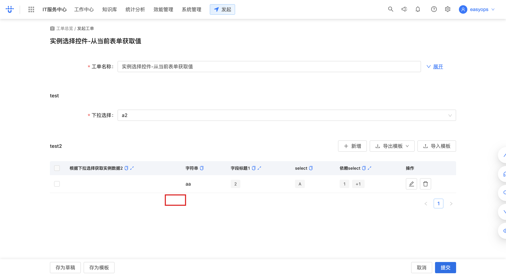

## 四、提交工单

表单填写完成后点击「提交」，发起工单实例。

### 步骤 1：点击「提交」发起工单
<!-- api: POST .../v2/process_instance(StartProcessInstanceV2), POST .../turn_group_conf | tag: 工单发起 | step_id: 20 -->
点击页面底部「提交」按钮，发起工单。提交前会先校验转办组配置，再创建流程实例。
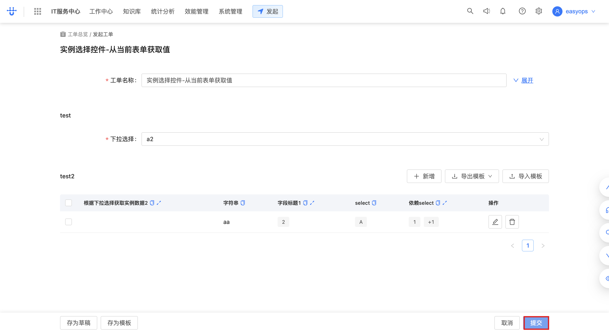
> 🔗 本步调用：`POST /next/api/gateway/flowable_service.process_instance.StartProcessInstanceV2/api/flowable_service/v2/process_instance`（详见 openapi.yaml 的「工单发起」），body 含 name/formData/variableName/variableValue/variables。提交前先 `POST .../turn_group_conf` 校验转办组。成功返回 `instanceId` 与工单号 `orderNum`（如 INC26071300003）。

## 五、查看发起结果

提交成功后返回工作台，可在「待办」中看到刚发起的工单，点击工单号查看详情。

### 步骤 1：返回工作台「待办」
<!-- url: itsc-workbench/workbench?activeKey=run | step_id: 21 -->
提交成功后返回工作台，「待办」数量 +1，可在待办列表看到新工单。
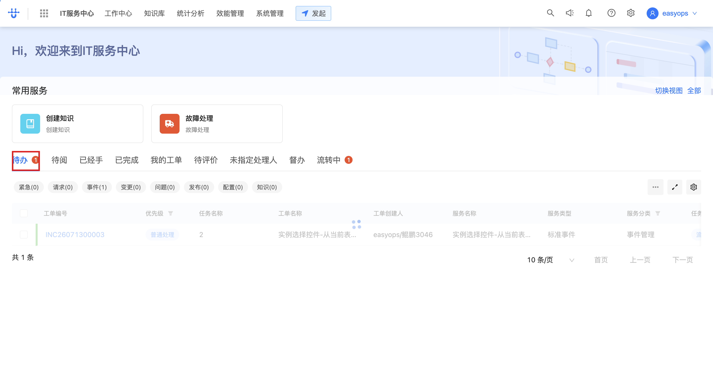

### 步骤 2：点击工单号查看详情
<!-- api: GET .../ticket/{id}/task/{tid}(GetTaskDetail), PUT .../process_instance_step_ack/{id} | tag: 工单任务详情 | step_id: 22 -->
在待办列表点击工单号（如 `INC26071300003`），进入工单任务详情页，查看任务信息并自动确认（ack）该步骤。

> 🔗 本步调用：`GET /next/api/gateway/flowable_service.process_instance.GetTaskDetail/api/flowable_service/v1/ticket/{ticketId}/task/{taskId}`（详见 openapi.yaml 的「工单任务详情」），同时 `PUT .../process_instance_step_ack/{stepId}` 确认步骤，并拉取工单关联 `GET .../ticket/{id}/relevance`、评论已读 `GET .../process_instance_discuss/{id}/read_record`。

## 附：本流程接口速查

| 接口 | 方法 | 路径 | 说明 | 触发步骤 |
| --- | --- | --- | --- | --- |
| 服务目录树 | GET | `/next/api/gateway/logic.flowable_service/api/flowable_service/v1/service_catalog_tree` | 拉取服务目录树（分类+服务） | 步骤一·1 |
| 常用服务 | GET | `/next/api/gateway/logic.flowable_service/api/flowable_service/v1/process_common` | 拉取常用/最近发起的服务 | 步骤一·1 |
| 服务实例详情(v2) | GET | `/next/api/gateway/logic.flowable_service/api/flowable_service/v2/service_instance/{serviceId}` | 拉取服务实例详情（taskInfo/formId） | 步骤二·2 |
| 服务实例详情(v1) | GET | `/next/api/gateway/logic.flowable_service/api/flowable_service/v1/service_instance/{serviceId}` | 拉取服务实例基础信息 | 步骤二·2 |
| 发起服务参数 | GET | `/next/api/gateway/flowable_service.service_catalog.GetStartServiceParams/api/flowable_service/v2/service_instance/{serviceId}` | 发起前获取服务参数（表单/任务配置） | 步骤二·4 |
| 表单模板查询 | POST | `/next/api/gateway/flowable_service.form_template.SearchFormTemplate/api/flowable_service/v1/form_template/_search` | 按服务/流程节点查询表单模板 | 步骤二·2、二·4 |
| 转办组配置 | POST | `/next/api/gateway/flowable_service.process_instance.GetProcessTurnGroupConf/api/flowable_service/v2/process_instance/turn_group_conf` | 提交前校验转办组配置 | 步骤四·1 |
| 工单发起 | POST | `/next/api/gateway/flowable_service.process_instance.StartProcessInstanceV2/api/flowable_service/v2/process_instance` | **发起工单**，返回 instanceId + orderNum | 步骤四·1 |
| 工单任务详情 | GET | `/next/api/gateway/flowable_service.process_instance.GetTaskDetail/api/flowable_service/v1/ticket/{ticketId}/task/{taskId}` | 查询工单任务详情（mainTask 等） | 步骤五·2 |
| 步骤确认 | PUT | `/next/api/gateway/flowable_service.process_instance.AckProcessInstanceStep/api/flowable_service/v1/process_instance_step_ack/{stepId}` | 确认工单步骤（ack） | 步骤五·2 |
| 工单关联 | GET | `/next/api/gateway/logic.flowable_service/api/flowable_service/v1/ticket/{ticketId}/relevance` | 查询工单关联服务 | 步骤五·2 |
| 评论已读 | GET | `/next/api/gateway/logic.flowable_service/api/flowable_service/v1/process_instance_discuss/{instanceId}/read_record` | 标记工单评论已读 | 步骤五·2 |
