# ITSM 工单搜索与处理 — 操作指引

> 适用场景：工单的「搜索定位」与「详情查看 + 审批处理」。已知编号/关键词用快速搜索，多条件组合用高级搜索，定位后查看详情并完成审批流转。
> 配套接口：见同目录 [`ITSM-工单搜索与处理-openapi.yaml`](./ITSM-工单搜索与处理-openapi.yaml)

## 目录

- [一、进入工单工作台](#一进入工单工作台)
- [二、关键词快速搜索工单](#二关键词快速搜索工单)
- [三、高级搜索工单](#三高级搜索工单)
- [四、打开工单详情](#四打开工单详情)
- [五、查看工单详情信息](#五查看工单详情信息)
- [六、审批处理工单](#六审批处理工单)
- [七、按状态浏览工单列表](#七按状态浏览工单列表)

<!-- deep-links: 本流程关键页面直达(SPA 路径,去掉 host 前缀,参数化)
  工单工作台:   itsc-workbench/workbench
  工单列表:     itsc-ticket-center/ticket-list
  工单详情:     itsc-ticket-center/task-list/{ticketId}/{taskId}
  工作台待办:   itsc-workbench/workbench?activeKey=run
-->

---

## 一、进入工单工作台

登录 EasyOps 后，从顶部导航进入工单工作台。

**1.** 点击顶部导航的「**工作中心**」菜单。

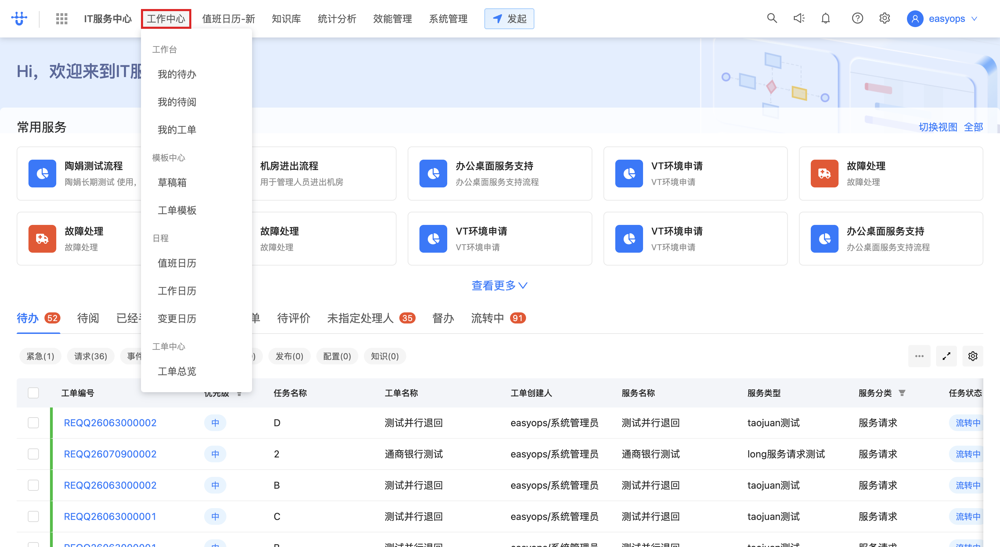

**2.** 进入工作中心后，点击「**工单中心 / 工单列表**」入口，进入工单列表页（`/next/itsc-ticket-center/ticket-list`）。

<!-- url: itsc-ticket-center/ticket-list | step_id: 2 -->
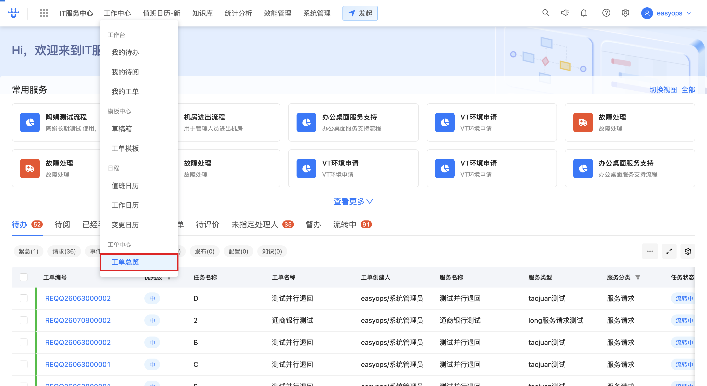

> 💡 页面会自动拉取服务分类（`service_category`）、优先级集（`priority_set_all`）、流程定义（`process_common`）等基础数据，作为后续筛选条件的数据源。

---

## 二、关键词快速搜索工单

适用于已知工单编号、标题关键词的场景，在列表顶部搜索框直接查询。

**1.** 在工单列表顶部「**根据关键词搜索**」框中输入关键词（示例：`test`）。

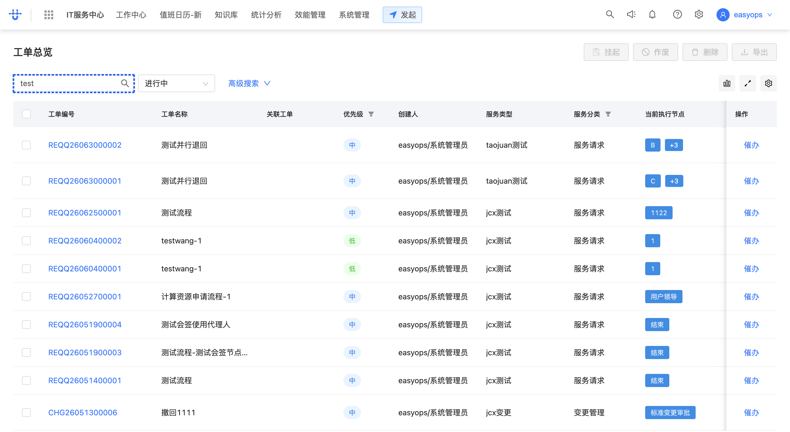

> ⚠️ 文本输入过程不截图，上图是失焦后状态。请以「输入完毕」为准。

**2.** 点击搜索按钮（或回车）触发查询，URL 变为 `?q=test&page=1`。

<!-- api: POST .../v4/process_instance_filter | tag: 工单列表查询 | step_id: 10 -->
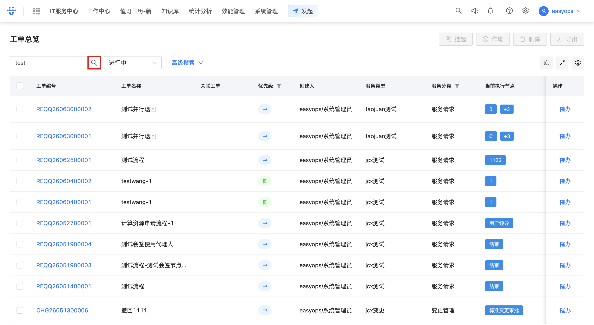

> 🔗 本步调用：`POST /next/api/gateway/flowable_service.process_instance.ListProcessInstanceFilterV4/api/flowable_service/v4/process_instance_filter`（详见 openapi.yaml 的「工单列表查询」）

---

## 三、高级搜索工单

当需要按工单名称、发起人、状态、服务分类等多个条件组合筛选时，使用高级搜索。

**1.** 点击「**高级搜索**」展开高级搜索面板。

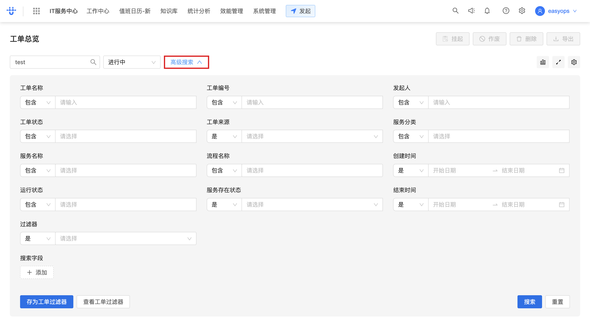

**2.** 在「**请输入**」框中输入筛选值（示例：`easyops`）。

> ⚠️ 文本输入过程不截图，**本步骤无截图**，请直接在展开的高级搜索面板第一个输入框填值。

**3.** 点击字段下拉，选择要匹配的字段（如「**工单名称** 包含 / 工单编号 包含 / 发起人 包含 / 工单状态 包含」等，选择「**发起人**」）。

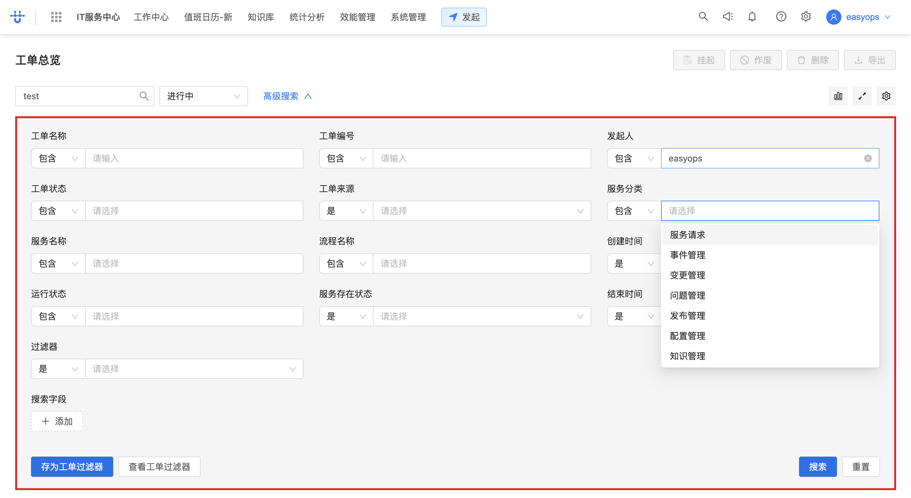

**4.** 在选定字段的输入框中填入对应值（示例：发起人填 `easyops`）。

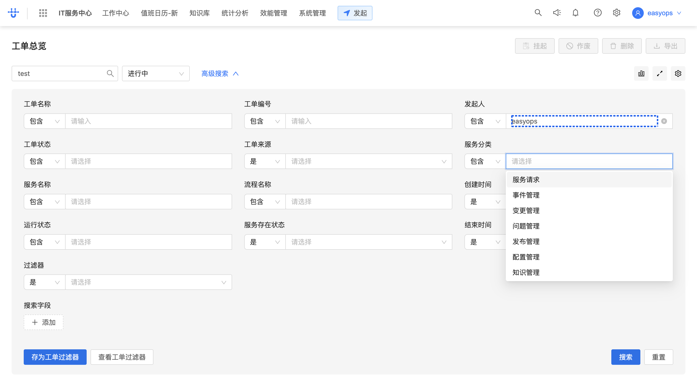

**5.** 点击「**服务分类**」下拉，选择目标分类（示例：「**变更管理**」）。

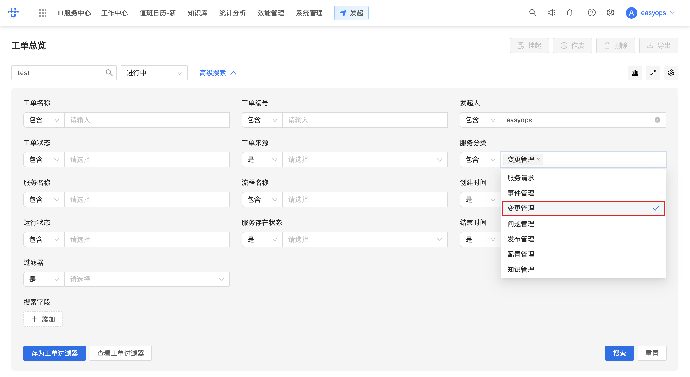

**6.** 如需追加第二个筛选字段，再次点击字段下拉选择。

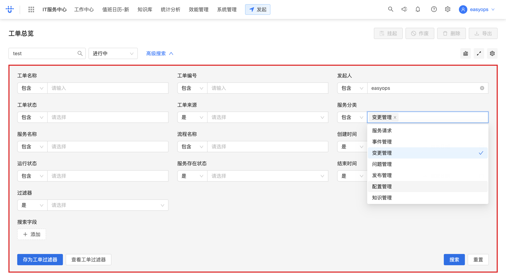

**7.** 条件填好后，点击「**搜索**」按钮执行高级查询。

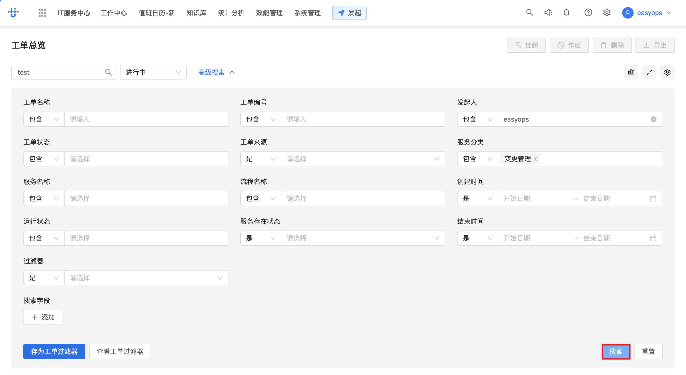

**8.** 系统按组合条件返回工单列表。可继续调整条件后再次提交，逐步缩小范围。

<!-- api: POST .../v4/process_instance_filter + POST .../v2/relation_ticket | tag: 工单列表查询 | step_id: 22 -->
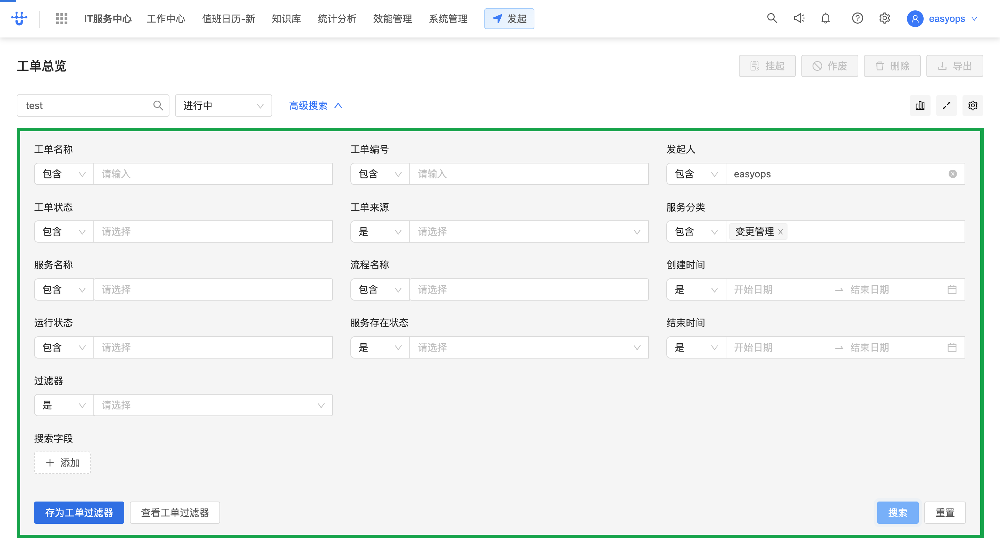

> 🔗 本步调用：`POST .../v4/process_instance_filter`（高级搜索查询）；若结果含关联工单，还会调用 `POST .../v2/relation_ticket`（详见 openapi.yaml 的「工单列表查询」）

**9.** 查看完毕，再次点击「**高级搜索**」收起面板。

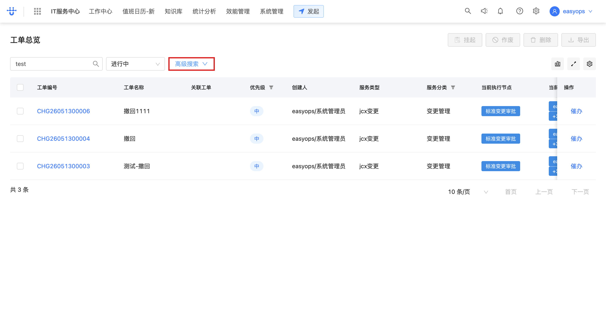

---

## 四、打开工单详情

从工作台定位到待处理工单，进入详情页。

**1.** 点击顶部「**工作中心**」返回工单工作台。

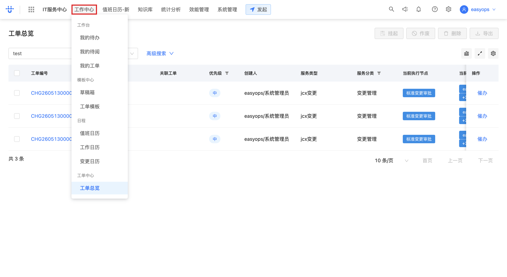

**2.** 在工作台「待办」区域，点击待处理工单卡片。

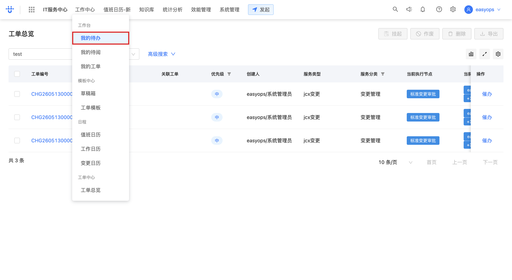

**3.** 在列表中点击目标工单编号（示例：`REQQ26063000001`），进入工单详情页。

<!-- url: itsc-ticket-center/task-list/{ticketId}/{taskId} | api: PUT .../v1/process_instance_step_ack/{stepId} + GET .../v1/ticket/{ticketId}/task/{taskId} | tag: 工单详情 | step_id: 31 -->

> 🔗 本步调用：`PUT .../v1/process_instance_step_ack/{stepId}`（自动领取/确认待办）+ `GET .../v1/ticket/{ticketId}/task/{taskId}`（加载任务详情）。详见 openapi.yaml 的「工单详情」。

---

## 五、查看工单详情信息

工单详情页通过顶部 Tab 切换查看不同维度的信息。

**1.** 点击「**流程图**」Tab，查看工单当前流转节点与历史路径。

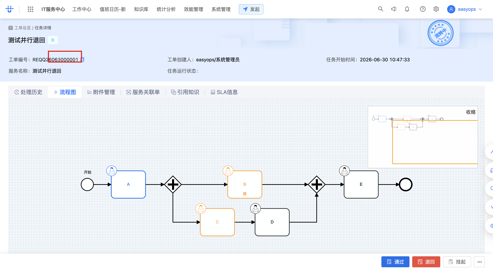

**2.** 点击「**附件管理**」Tab，查看工单相关附件。

<!-- api: GET .../v1/process_instance_file/{ticketId} | tag: 工单详情 | step_id: 33 -->
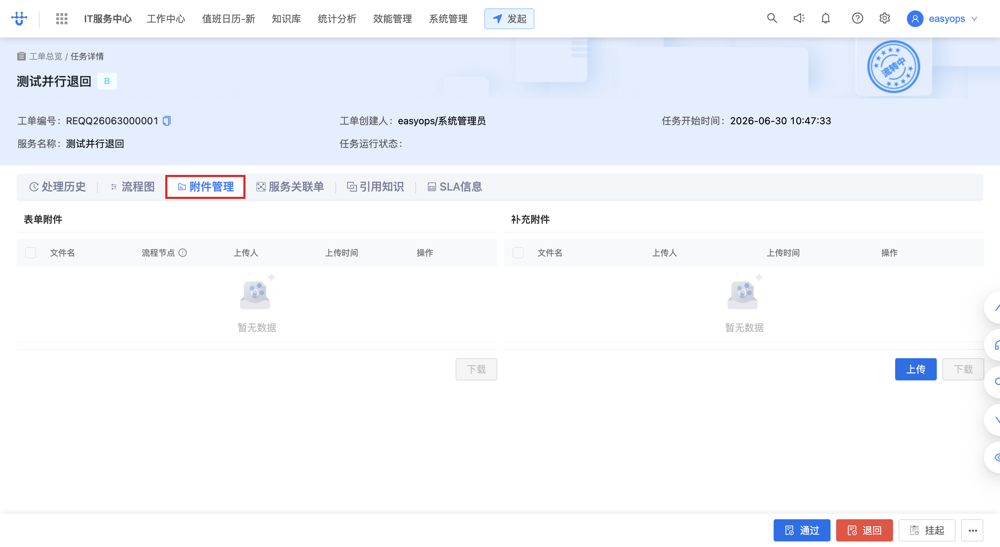

> 🔗 本步调用：`GET .../v1/process_instance_file/{ticketId}`（附件列表）

**3.** 点击「**服务关联单**」Tab，查看与本工单关联的其他工单。

<!-- api: GET .../v1/ticket/{ticketId}/relevance | tag: 工单详情 | step_id: 34 -->
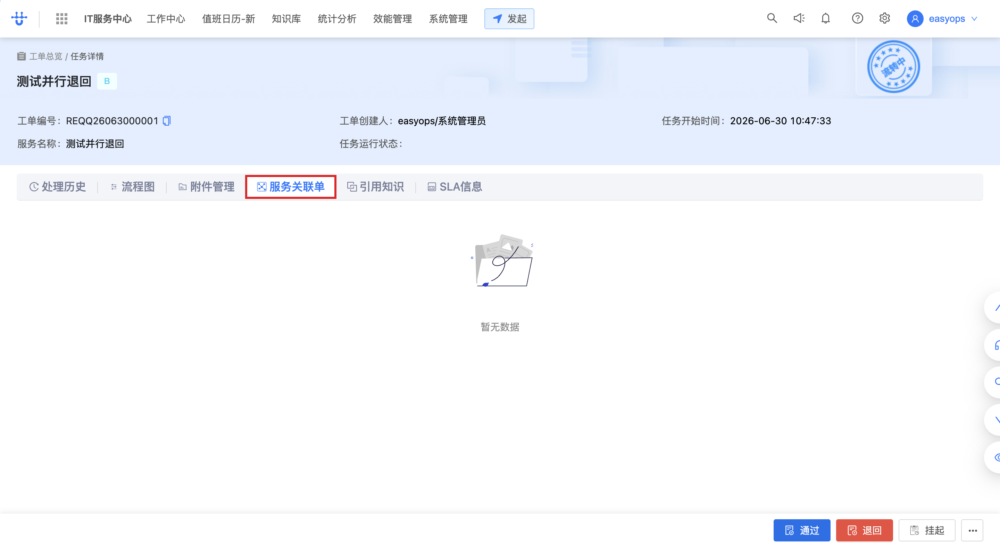

> 🔗 本步调用：`GET .../v1/ticket/{ticketId}/relevance`（关联工单）

**4.** 点击「**引用知识**」Tab，查看工单引用的知识库条目。

<!-- api: GET .../v1/knowledge_base/knowledge?relevanceTicketId={ticketId} | tag: 工单详情 | step_id: 35 -->

> 🔗 本步调用：`GET .../v1/knowledge_base/knowledge?relevanceTicketId={ticketId}`（引用知识）

**5.** 点击「**SLA信息**」Tab，查看工单的 SLA 达标/超时记录。

<!-- api: GET .../v1/ticket/{ticketId}/sla_record | tag: 工单详情 | step_id: 36 -->
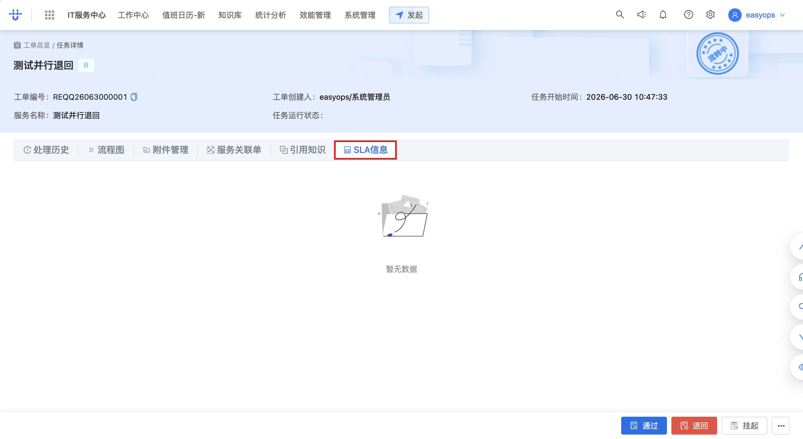

> 🔗 本步调用：`GET .../v1/ticket/{ticketId}/sla_record`（SLA 记录）

---

## 六、审批处理工单

在工单详情页对当前节点进行审批处理（通过/退回/挂起）并流转。

**1.** 在工单详情底部操作区，点击「**通过**」按钮（也可选「退回」「挂起」）。

**2.** 在弹出的审批弹窗「**意见**」输入框中填写审批意见（示例：`审批通过！`）。

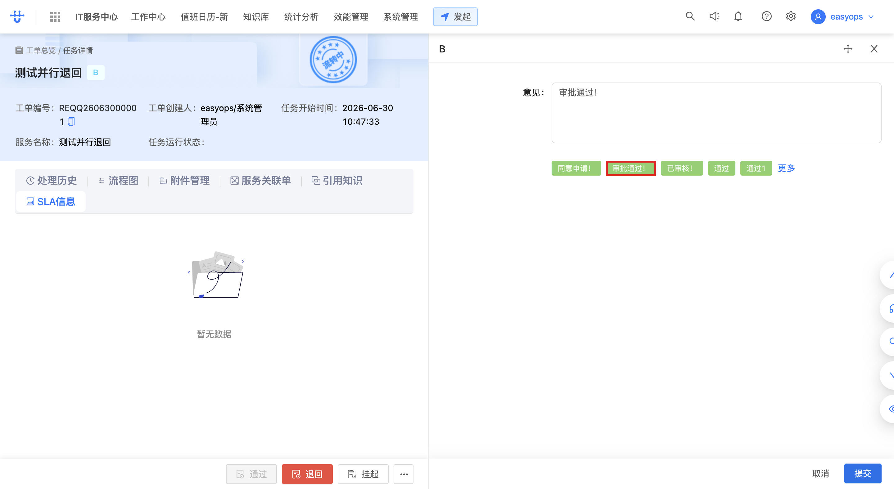

> 💡 弹窗同时提供「通过 / 退回 / 挂起 / 更多」操作，确认意见后点底部「提交」。

**3.** 点击「**提交**」完成审批，工单流转至下一节点。

<!-- api: POST .../v2/process_instance/{ticketId}/task/{taskId} + POST .../v2/process_instance/turn_group_conf | tag: 工单处理 | step_id: 39 -->
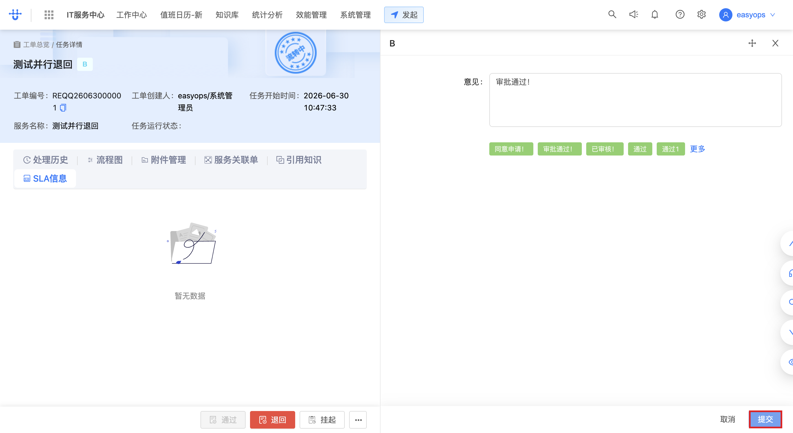

> 🔗 本步调用：`POST .../v2/process_instance/{ticketId}/task/{taskId}`（提交任务、流转工单），提交前会先调用 `POST .../v2/process_instance/turn_group_conf`（获取流转目标配置）。详见 openapi.yaml 的「工单处理」。

---

## 七、按状态浏览工单列表

回到工作台，按不同状态分类浏览工单。

**1.** 点击「**我经手**」Tab，查看当前用户参与处理过的工单。

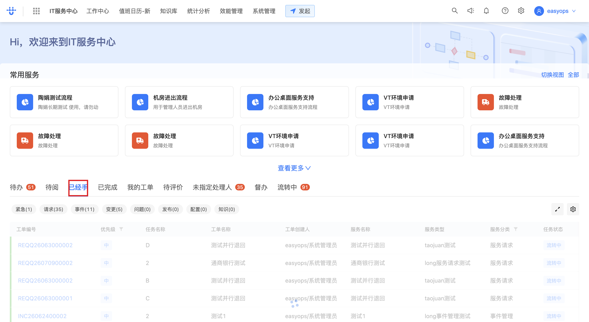

**2.** 点击「**已完成**」Tab，查看已完结的工单。

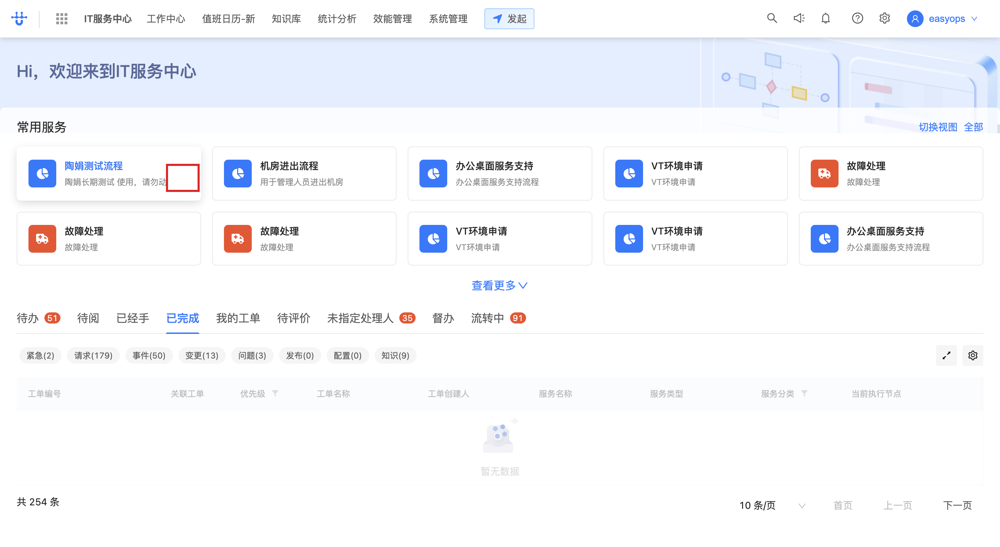

**3.** 点击「**流转中**」Tab，查看正在流转中的工单。

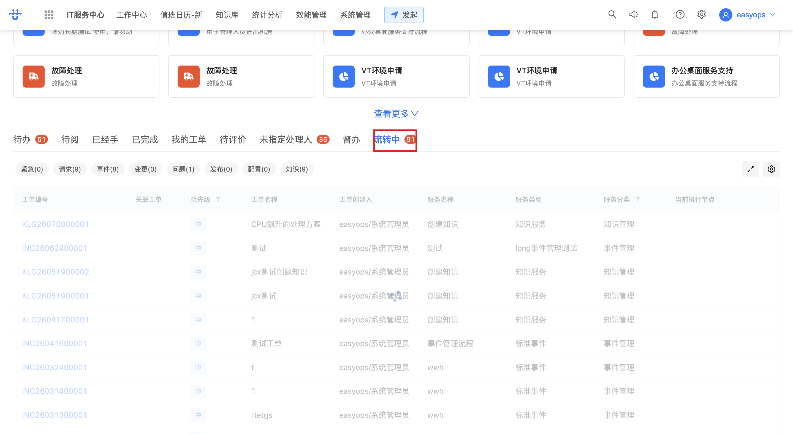

**4.** 如有侧边筛选弹窗，点击其「**关闭**」收起。

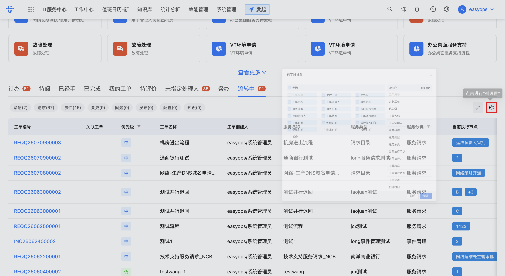

**5.** 在确认提示中点击「**确定**」。

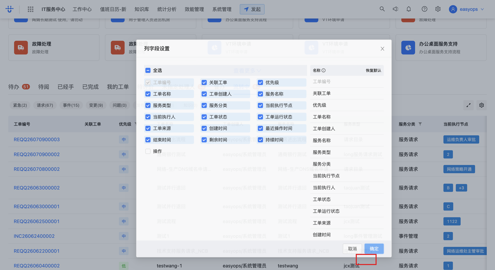

**6.** 回到工单列表，可点击表头「**工单编号 / 关联工单 / 优先级 / 工单名称**」等列进行排序查看。

<!-- api: POST .../v4/process_instance_filter | tag: 工单列表查询 | step_id: 45 -->
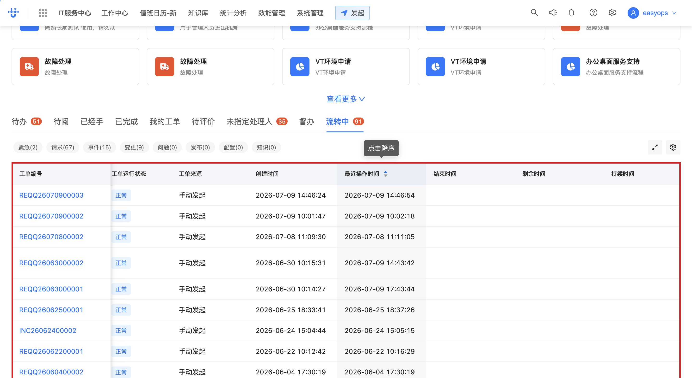

> 🔗 本步调用：`POST .../v4/process_instance_filter`（按状态刷新列表）

---

## 附：本流程接口速查

| tag | 方法 | 路径(简) | 用途 | 步骤 |
| --- | --- | --- | --- | --- |
| 工单列表查询 | POST | `.../v4/process_instance_filter` | 关键词/高级搜索、按状态刷新 | 二-2、三-8、七-6 |
| 工单列表查询 | POST | `.../v2/relation_ticket` | 关联工单（搜索结果含关联时） | 三-8 |
| 工单详情 | PUT | `.../v1/process_instance_step_ack/{stepId}` | 自动领取/确认待办 | 四-3 |
| 工单详情 | GET | `.../v1/ticket/{ticketId}/task/{taskId}` | 加载任务详情 | 四-3 |
| 工单详情 | GET | `.../v1/process_instance_file/{ticketId}` | 附件列表 | 五-2 |
| 工单详情 | GET | `.../v1/ticket/{ticketId}/relevance` | 关联工单 | 五-3 |
| 工单详情 | GET | `.../v1/knowledge_base/knowledge` | 引用知识 | 五-4 |
| 工单详情 | GET | `.../v1/ticket/{ticketId}/sla_record` | SLA 记录 | 五-5 |
| 工单处理 | POST | `.../v2/process_instance/turn_group_conf` | 流转目标配置 | 六-3 |
| 工单处理 | POST | `.../v2/process_instance/{ticketId}/task/{taskId}` | 提交任务、流转工单 | 六-3 |

---

> **小结**：工单搜索（关键词 + 高级组合条件）定位工单 → 工单详情（流程图/附件/关联单/知识/SLA）核查信息 → 审批处理（通过 + 意见 + 提交）完成流转 → 按状态分类浏览。所有列表与详情数据均通过 EasyOps 网关 `flowable_service` 获取，接口契约详见 [openapi.yaml](./ITSM-工单搜索与处理-openapi.yaml)。
