# ITSM 系统管理 · 标准字段管理 - 操作指引

> 适用场景：在 ITSM 工作台的「系统管理 -> 标准字段管理」中，完成标准字段的**搜索、新建（含字段类型与属性配置）、编辑、删除**全流程。标准字段是可复用于多个表单的字段定义，配置一次即可在多处引用。
> 配套接口：见同目录 [`ITSM-标准字段管理-openapi.yaml`](./ITSM-标准字段管理-openapi.yaml)。
>
> 截图标注图例：🔴红框=点击 / 🔵蓝虚线框=输入 / 🟠橙框+▾=下拉 / 🟣紫圈=单复选 / 🟢绿粗框=提交。

## 目录
- [一、进入标准字段管理](#一进入标准字段管理)
- [二、搜索字段](#二搜索字段)
- [三、新建标准字段](#三新建标准字段)
- [四、删除字段](#四删除字段)
- [五、编辑字段](#五编辑字段)
- [附：本流程接口速查](#附本流程接口速查)

<!-- deep-links: 本流程关键页面直达（SPA 路径，去掉 host 前缀，参数化）
  工作台:          itsc-workbench/workbench
  标准字段列表:     itsc-advanced-settings/standard-field
  带关键词搜索:     itsc-advanced-settings/standard-field?q={关键词}
  新建字段页:       itsc-advanced-settings/standard-field/standard-field-create
  编辑字段页:       itsc-advanced-settings/standard-field/{fieldId}/editting
-->

## 一、进入标准字段管理

从工作台导航到标准字段管理列表页，默认加载全部标准字段。

### 步骤 1：点击顶部「系统管理」
<!-- url: itsc-workbench/workbench | step_id: 1 -->
在工作台顶部导航栏点击「系统管理」，展开系统管理子菜单。
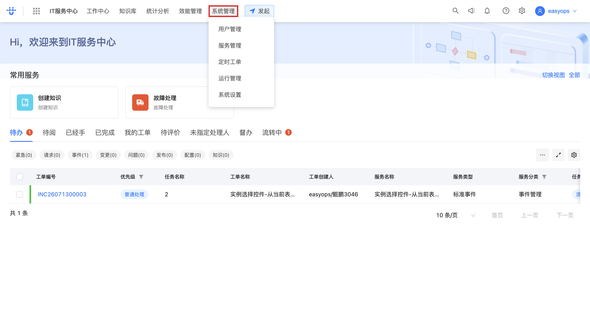

### 步骤 2：在菜单中点击进入「标准字段管理」
<!-- url: itsc-advanced-settings/standard-field | api: POST .../standard_field/_search | tag: 标准字段列表查询 | step_id: 3 -->
在展开的菜单中找到并点击「标准字段管理」，进入标准字段列表页，自动加载字段列表。
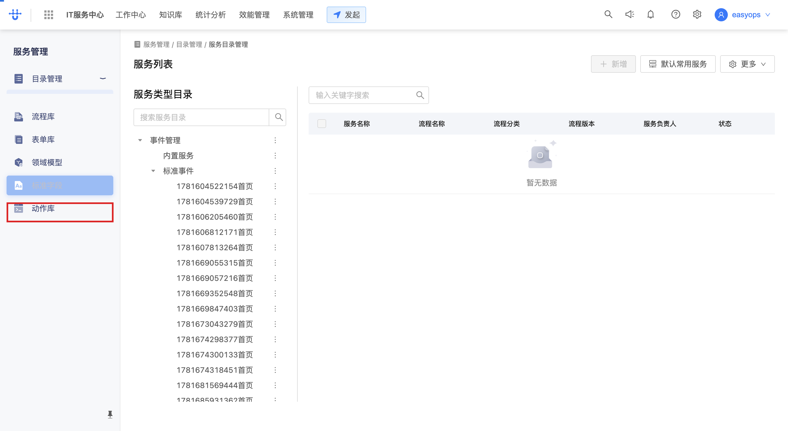
> 🔗 本步调用：`POST /next/api/gateway/logic.flowable_service/api/flowable_service/v1/standard_field/_search`（详见 openapi.yaml 的「标准字段列表查询」）。

## 二、搜索字段

字段较多时，通过关键词快速定位，或用高级搜索按字段类型组合筛选。

### 步骤 1：在搜索框输入关键词
<!-- url: itsc-advanced-settings/standard-field?q={关键词} | step_id: 4 -->
在列表上方搜索框输入关键词（如 `处理人`），按唯一标识、字段名称、字段说明、创建人模糊匹配。
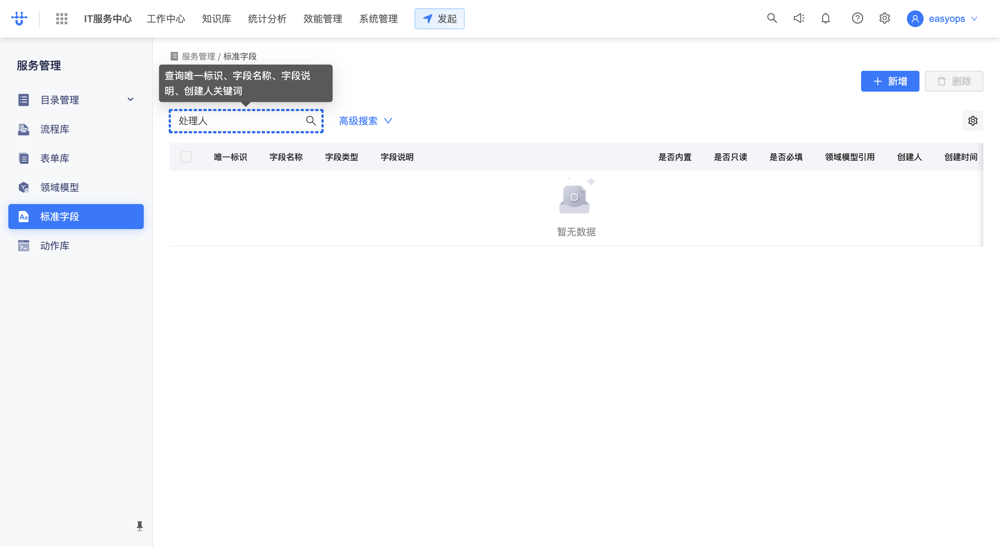

### 步骤 2：点击「高级搜索」展开条件区
<!-- step_id: 6 -->
点击搜索框右侧的「高级搜索」，展开多字段条件配置区（唯一标识、字段名称、字段类型、用户、创建人）。
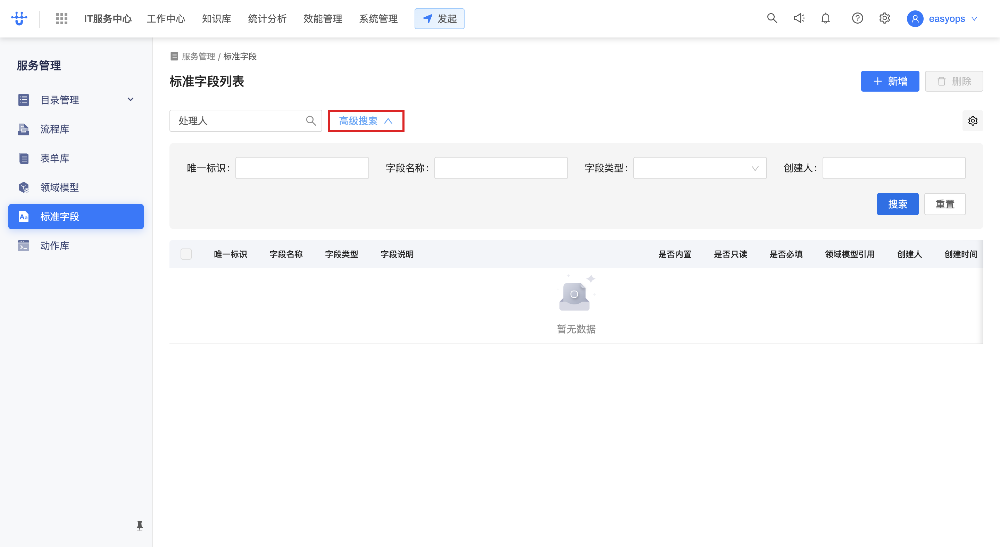

### 步骤 3：配置筛选条件（如字段类型选「用户」）
<!-- step_id: 7 -->
在条件区选择字段类型（如「用户」），按类型筛选字段。
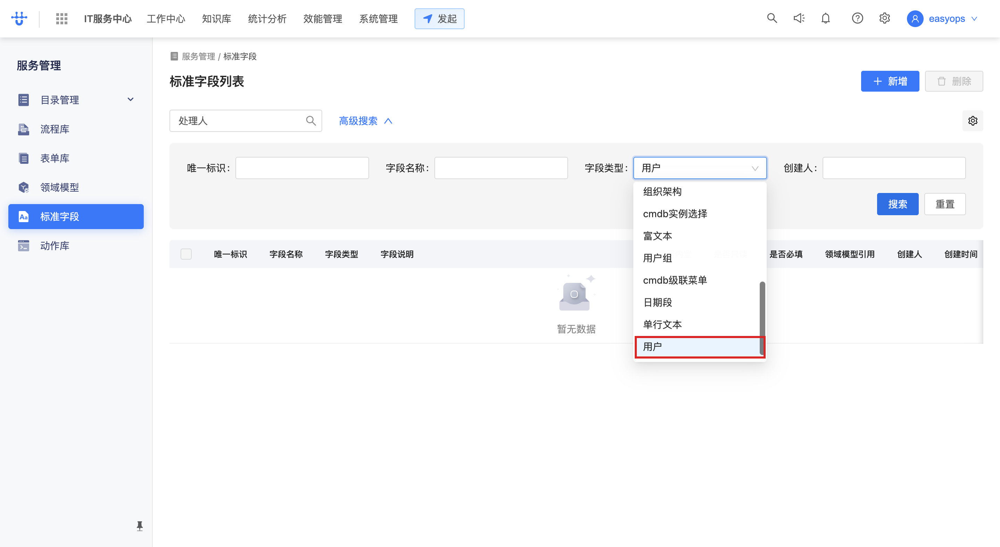

### 步骤 4：点击「搜索」执行查询
<!-- api: POST .../standard_field/_search | tag: 标准字段列表查询 | step_id: 8 -->
配置完条件后点击「搜索」按钮，列表按条件刷新出结果。
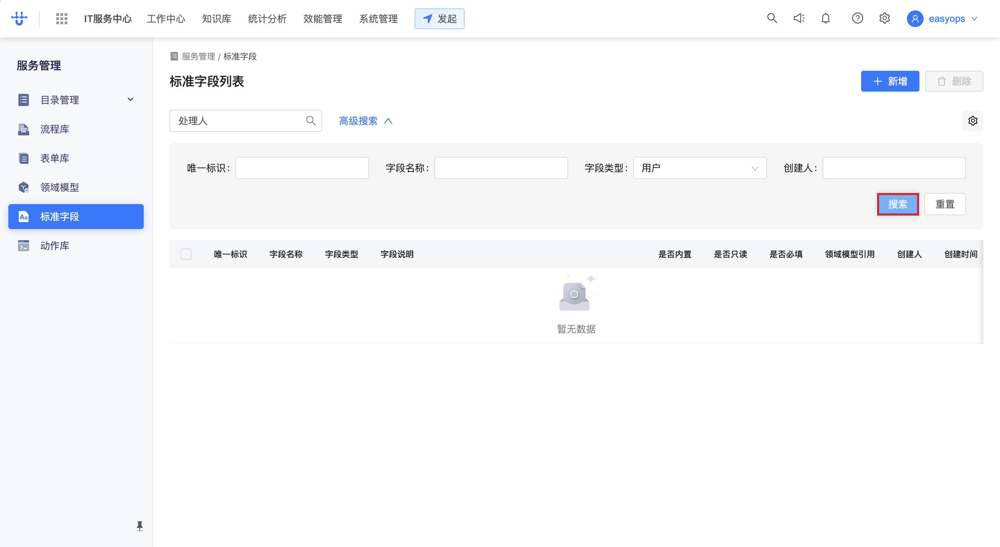
> 🔗 本步调用：`POST /next/api/gateway/logic.flowable_service/api/flowable_service/v1/standard_field/_search`（详见 openapi.yaml 的「标准字段列表查询」），body 含 Q/kind 等筛选条件。

## 三、新建标准字段

在列表页点击「新增」，进入新建页填写唯一标识、字段名称、字段类型，并配置字段属性后保存。

### 步骤 1：点击「新增」进入新建页
<!-- url: itsc-advanced-settings/standard-field/standard-field-create | step_id: 15 -->
在标准字段列表页点击「新增」按钮，进入新建标准字段页。
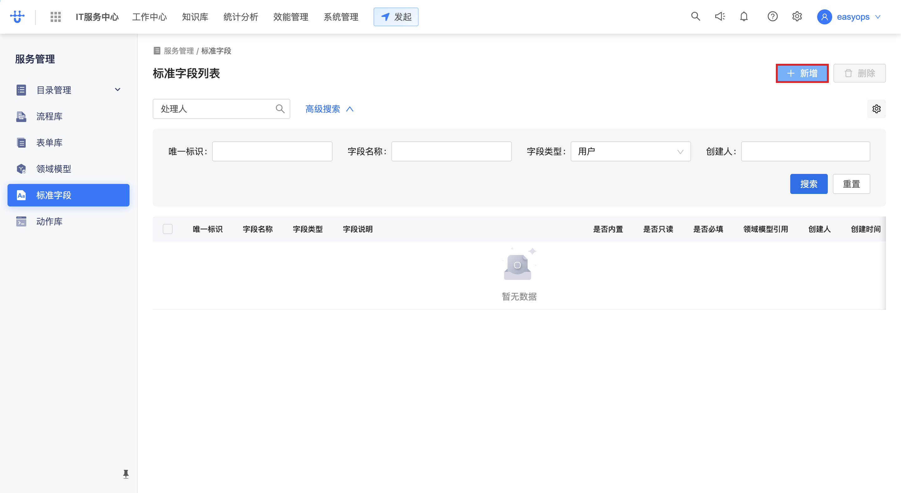

### 步骤 2：填写「唯一标识」
<!-- step_id: 17 -->
在「唯一标识」输入框填写（如 `ITSC_handler`），规则：包含数字、大小写字母、下划线。文本输入不截图，失焦时捕获。
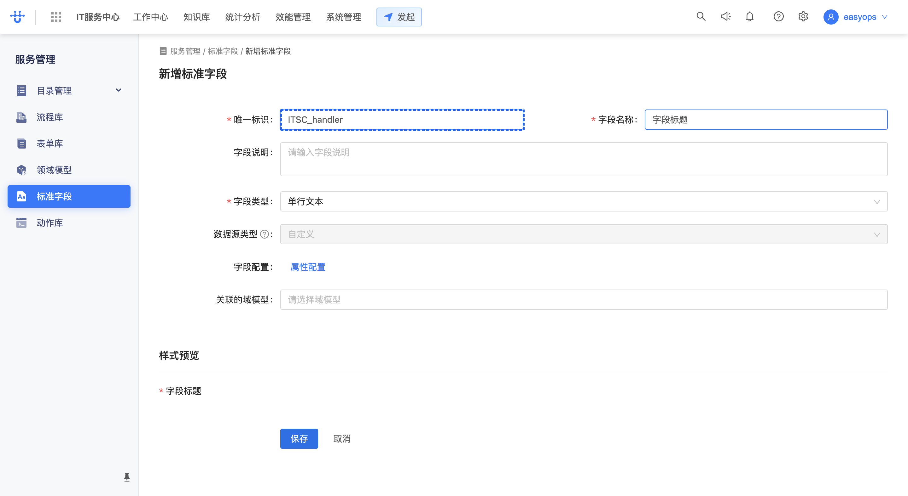
> 💡 提示：步骤 16-19 为唯一标识的逐字符输入过程，最终值为 `ITSC_handler`。

### 步骤 3：填写「字段名称」
<!-- step_id: 22 -->
在「字段名称」输入框填写（如 `处理人`），失焦时捕获。
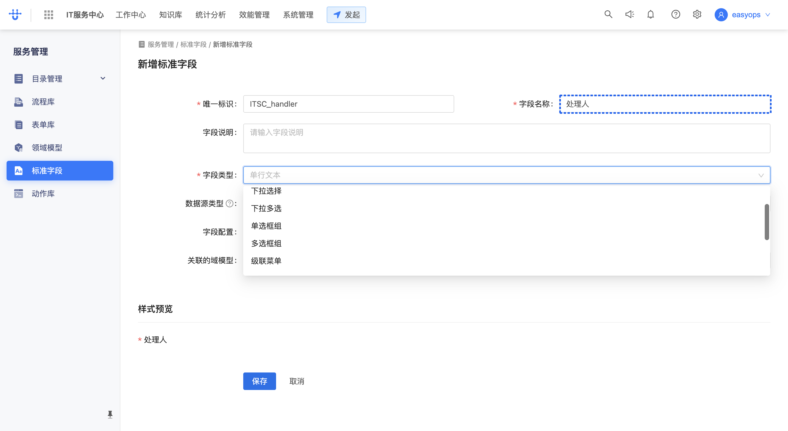

### 步骤 4：选择「字段类型」
<!-- step_id: 21 -->
点击「字段类型」下拉，选择类型（如「单行文本」）。本录制中实际选的是「用户」类型（USER_SELECTOR），含属性配置。
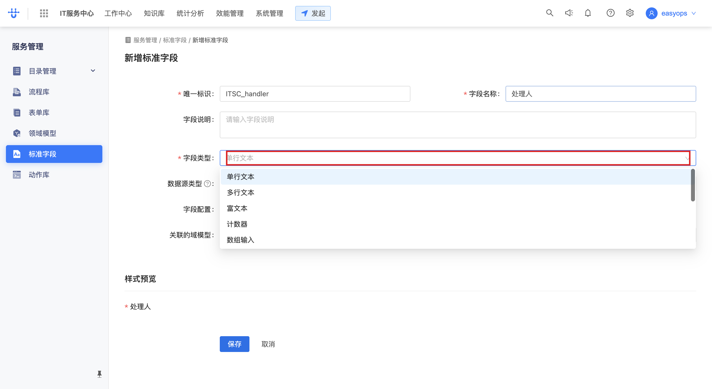
> 💡 提示：字段类型决定后续属性配置项。选「用户」类型可配置显示字段、多选上限等；选「单行文本」则配置默认值、校验等。

### 步骤 5：选择「用户」类型并打开「属性配置」
<!-- api: GET .../assistant/... | step_id: 23 -->
字段类型选「用户」后，点击「属性配置」打开用户字段属性弹窗。
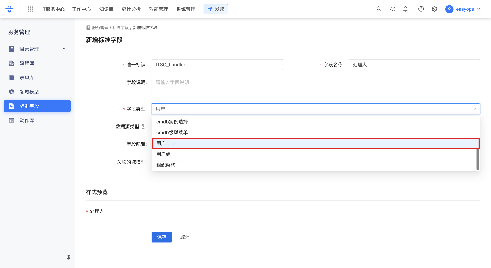
> 🔗 本步调用：`GET /next/api/gateway/flowable_service.assistant.../...`（加载用户字段可选属性，如用户昵称、联系电话）。

### 步骤 6：配置用户字段属性
<!-- step_id: 28 -->
在属性配置弹窗中勾选要显示的属性（如「用户昵称」「联系电话」），设置「默认用户」（可空）。
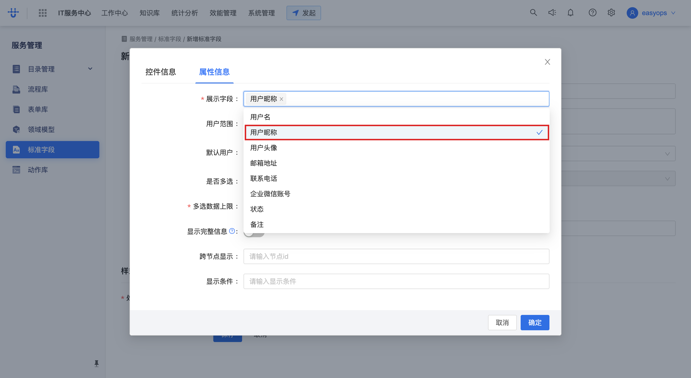

### 步骤 7：设置「多选数据上限」并确定
<!-- step_id: 31 -->
在「请输入多选数据上限」填入数值（如 `3`），配置完成后点击「确定」保存属性配置。
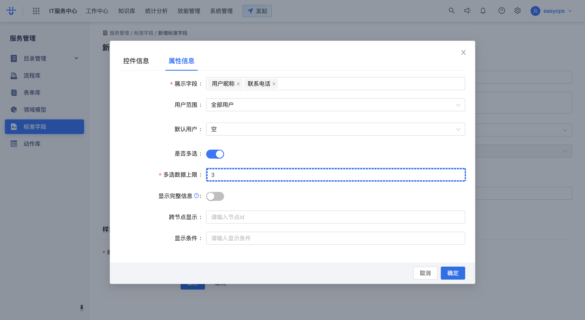

### 步骤 8：点击「保存」提交新建
<!-- api: POST .../standard_field | tag: 标准字段创建 | step_id: 34 -->
属性配置完成后点击页面底部「保存」按钮，提交创建标准字段。
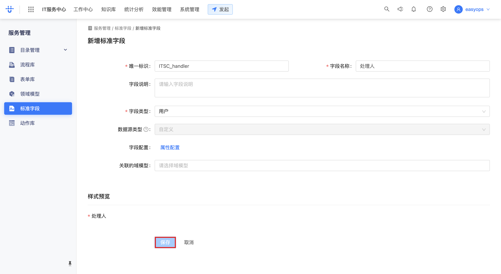
> 🔗 本步调用：`POST /next/api/gateway/logic.flowable_service/api/flowable_service/v1/standard_field`（详见 openapi.yaml 的「标准字段创建」），body 含 key/name/kind/sourceType/sourceConfig/required/readonly/default/desc/domainModelIds。成功返回字段 instanceId（如 656788ffdaf71）。

## 四、删除字段

在列表中对不再需要的标准字段执行删除，需输入确认数字二次确认。

### 步骤 1：点击「删除」
<!-- step_id: 43 -->
在标准字段列表中，点击目标字段操作列的「删除」按钮。
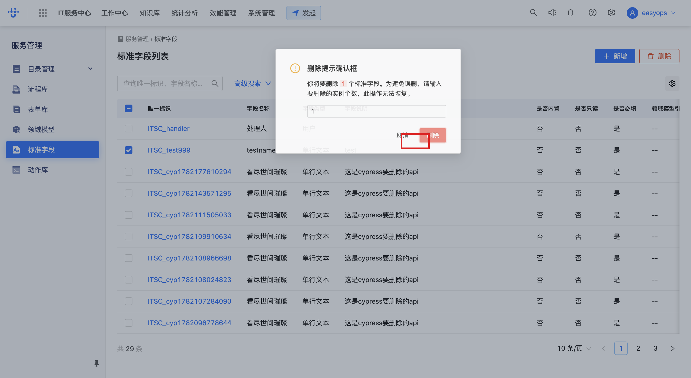

### 步骤 2：输入确认数字
<!-- step_id: 42 -->
在弹出的确认框中输入提示数字（如 `1`）以解锁删除按钮。
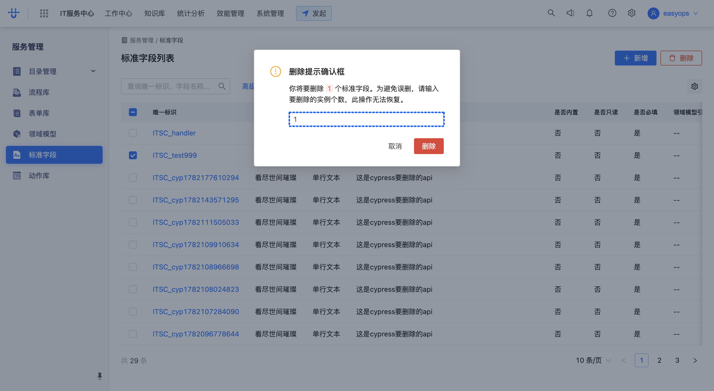

### 步骤 3：确认删除
<!-- api: DELETE .../standard_field/{id} | tag: 标准字段删除 | step_id: 43 -->
输入正确数字后点击「删除」确认，删除该字段并刷新列表。

> 🔗 本步调用：`DELETE /next/api/gateway/logic.flowable_service/api/flowable_service/v1/standard_field/{fieldId}`（详见 openapi.yaml 的「标准字段删除」）。录制中此处删除了字段 654e1f0fad767。

## 五、编辑字段

在列表中点击字段进入编辑页，修改字段说明等属性后保存。

### 步骤 1：在列表点击字段进入编辑页
<!-- url: itsc-advanced-settings/standard-field/{fieldId}/editting | api: GET .../standard_field/{id} | tag: 标准字段详情 | step_id: 44 -->
在标准字段列表中点击目标字段（如 `ITSC_handler`），进入其编辑页，自动拉取字段详情。
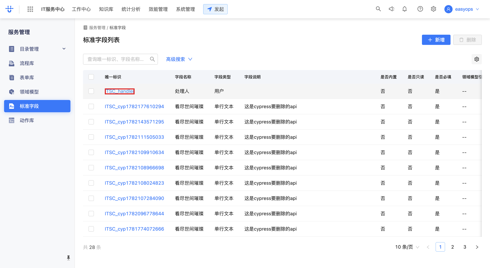
> 🔗 本步调用：`GET /next/api/gateway/logic.flowable_service/api/flowable_service/v1/standard_field/{fieldId}`（详见 openapi.yaml 的「标准字段详情」），返回字段完整定义（key/name/kind/sourceConfig 等）。

### 步骤 2：填写「字段说明」
<!-- step_id: 63 -->
在「字段说明」输入框填写说明（如 `工单处理人`），失焦时捕获。
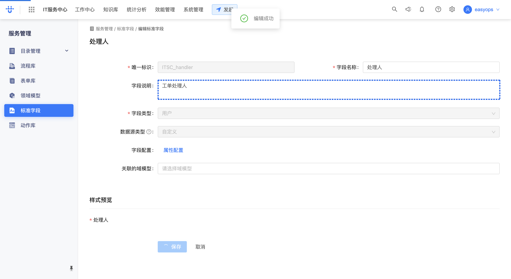
> 💡 提示：步骤 45-62 为字段说明的拼音逐字输入过程（gong'dan... -> 工单处理人），最终值为 `工单处理人`。

### 步骤 3：点击「保存」提交更新
<!-- api: PUT .../standard_field/{id} | tag: 标准字段更新 | step_id: 64 -->
修改完成后点击页面底部「保存」按钮，提交更新。
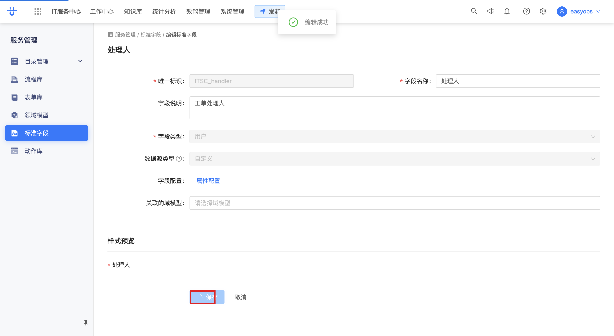
> 🔗 本步调用：`PUT /next/api/gateway/logic.flowable_service/api/flowable_service/v1/standard_field/{fieldId}`（详见 openapi.yaml 的「标准字段更新」），body 含更新后的 key/name/desc/kind/sourceConfig 等。

## 附：本流程接口速查

| 接口 | 方法 | 路径 | 说明 | 触发步骤 |
| --- | --- | --- | --- | --- |
| 标准字段列表查询 | POST | `/next/api/gateway/logic.flowable_service/api/flowable_service/v1/standard_field/_search` | 按关键词/字段类型/创建人查询字段列表 | 步骤一·2、二·4 |
| 标准字段详情 | GET | `/next/api/gateway/logic.flowable_service/api/flowable_service/v1/standard_field/{fieldId}` | 查询单个标准字段详情 | 步骤五·1 |
| 标准字段创建 | POST | `/next/api/gateway/logic.flowable_service/api/flowable_service/v1/standard_field` | 新建标准字段（key/name/kind/sourceConfig） | 步骤三·8 |
| 标准字段更新 | PUT | `/next/api/gateway/logic.flowable_service/api/flowable_service/v1/standard_field/{fieldId}` | 更新标准字段（修改说明/属性等） | 步骤五·3 |
| 标准字段删除 | DELETE | `/next/api/gateway/logic.flowable_service/api/flowable_service/v1/standard_field/{fieldId}` | 删除标准字段 | 步骤四·3 |
