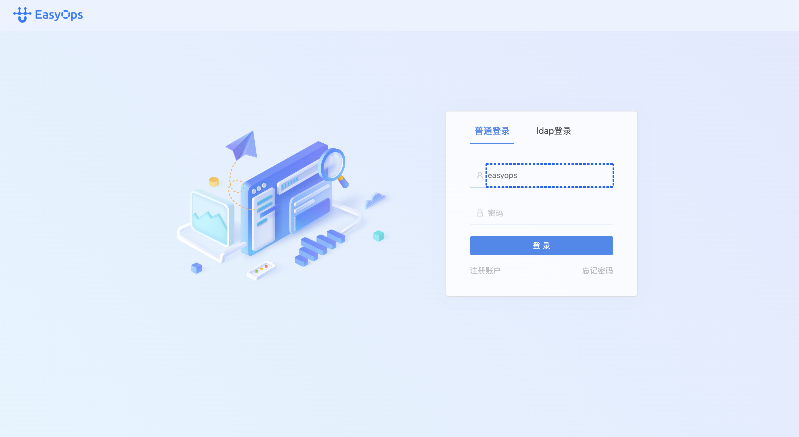
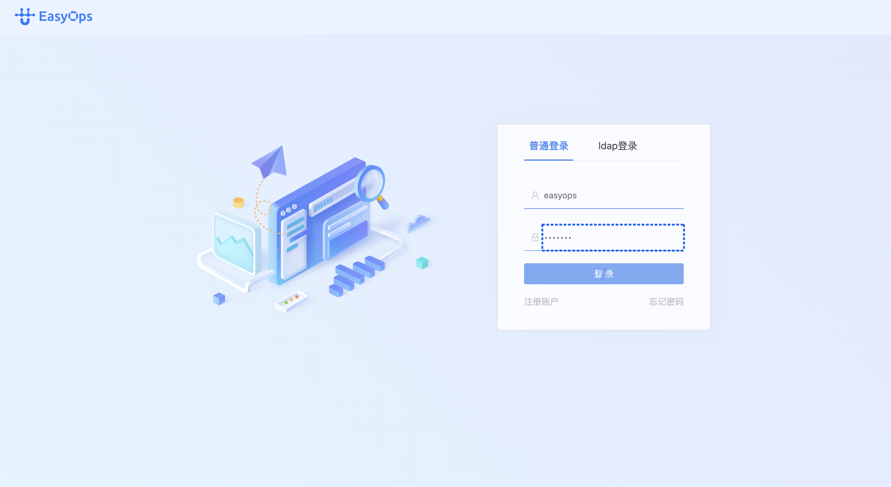
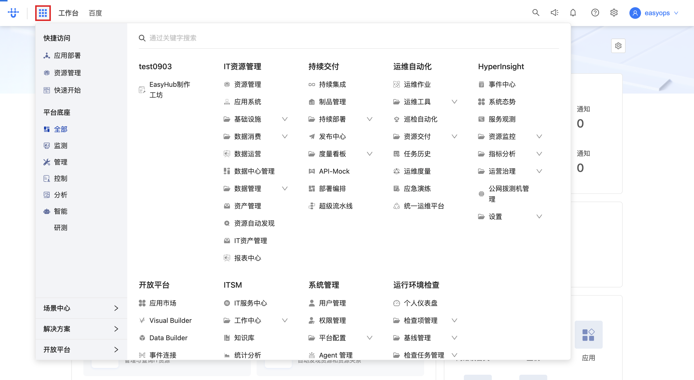
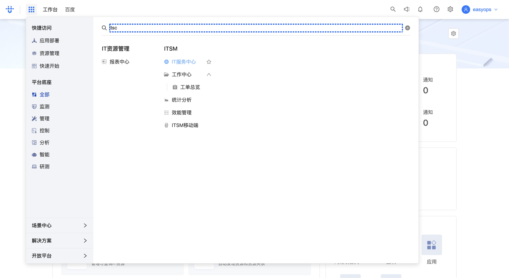

# ITSM 登录与功能入口 — 操作指引

> 适用场景：首次登录 EasyOps 平台，并从门户进入 ITSM（IT 服务管理 / 工单）工作台。
> 配套接口：见同目录 [`ITSM-登录与功能入口-openapi.yaml`](./ITSM-登录与功能入口-openapi.yaml)

## 目录

- [一、登录系统](#一登录系统)
  - [步骤 1：输入用户名](#步骤-1输入用户名)
  - [步骤 2：输入密码](#步骤-2输入密码)
  - [步骤 3：点击「登录」](#步骤-3点击登录)
  - [步骤 4：提交并跳转门户](#步骤-4提交并跳转门户)
- [二、进入 ITSM 功能入口](#二进入-itsm-功能入口)
  - [步骤 1：确认进入门户首页](#步骤-1确认进入门户首页)
  - [步骤 2：搜索 ITSM](#步骤-2搜索-itsm)
  - [步骤 3：进入 ITSM 工作台](#步骤-3进入-itsm-工作台)
- [附：本流程接口速查](#附本流程接口速查)
- [附：后续免登录说明](#附后续免登录说明)

<!-- deep-links: 本流程关键页面直达(SPA 路径,去掉 host 前缀,参数化)
  登录页:       auth/login
  门户首页:     portal
  ITSM工作台:  itsc-workbench/workbench
-->

---

## 一、登录系统

打开 http://172.30.0.90/ 会自动跳转到登录页（`/next/auth/login`）。默认是「普通登录」标签页。

### 步骤 1：输入用户名

在登录卡片的**第一个输入框**（用户名）输入账号，示例账号为 `easyops`。

💡 输入框下方出现蓝色高亮边框表示已聚焦。

<!-- url: auth/login | step_id: 1 -->

### 步骤 2：输入密码

在**第二个输入框**（密码，左侧有眼睛图标可切换明文）输入密码。

⚠️ 密码不会显示明文，确认输入无误后再继续。

<!-- step_id: 2 -->

### 步骤 3：点击「登录」

点击输入框下方的蓝色 **「登 录」** 按钮。

<!-- step_id: 3 -->

### 步骤 4：提交并跳转门户

点击登录后，前端会调用登录接口完成认证；登录成功后**自动跳转到门户首页**（`/next/portal`），并加载工作台、应用清单、用户信息等数据。

<!-- url: portal | api: POST /next/api/auth/login/v2 | tag: 认证 | step_id: 4 -->

> 🔗 本步调用：POST `/next/api/auth/login/v2`（详见 openapi.yaml 的「认证」）

---

## 二、进入 ITSM 功能入口

登录后默认进入门户首页（Portal），这是所有微应用/工作台的统一入口。ITSM 工作台需要在首页找到并点进去。

### 步骤 1：确认进入门户首页

门户首页布局：**左上角是「EasyOps 工作台」logo**，右侧是「请输入关键字搜索」的搜索框；下方是**应用卡片网格**，按分组排列（如 IT 资源管理、运维自动化等）。

💡 如果登录后没有直接停在首页，点击左上角 **EasyOps logo** 即可回到门户。

<!-- url: portal | step_id: 5 -->

### 步骤 2：搜索 ITSM

在顶部**搜索框**输入 `itsc`（ITSM 的缩写），系统会实时检索匹配的应用/工作台卡片。

<!-- step_id: 6 -->

### 步骤 3：进入 ITSM 工作台

在搜索结果中点击 **ITSM 工作台**（`itsc-workbench`）卡片，进入 IT 服务管理界面。

<!-- url: itsc-workbench/workbench | api: GET /next/api/gateway/logic.micro_app_standalone_service/api/v1/micro_app_standalone/runtime/itsc-workbench | tag: ITSM 工作台初始化 | step_id: 7 -->

> 🔗 本步调用：GET `/next/api/gateway/logic.micro_app_standalone_service/api/v1/micro_app_standalone/runtime/itsc-workbench`（详见 openapi.yaml 的「ITSM 工作台初始化」）

⚠️ 点击后页面会有短暂的加载过程（红色边框占位），等待加载完成即可看到完整的工单工作台。

---

## 附：本流程接口速查

| tag | 方法 | 路径(简) | 用途 | 步骤 |
| --- | --- | --- | --- | --- |
| 认证 | POST | `/api/auth/login/v2` | 登录认证 | 一-4 |
| ITSM 工作台初始化 | GET | `.../micro_app_standalone/runtime/itsc-workbench` | 进入 ITSM 工作台 | 二-3 |

---

## 附：后续免登录说明

首次登录后，登录态会保存在浏览器 profile 中（按 host `172.30.0.90` 共享）。下次打开同一地址**无需重复登录**，可直接进入门户；同平台的其他子模块（CMDB、监控等）也共享该登录态。
