# ITSM 系统管理 · 代理人管理 - 操作指引

> 适用场景：在 ITSM 工作台的「系统管理 -> 代理人管理」中，完成代理人规则的**搜索筛选、新建、编辑（启用/添加代理人）、删除**全流程。代理人用于在被代理人不在岗时，由代理人代为处理指定服务分类下的工单。
> 配套接口：见同目录 [`ITSM-系统管理-代理人管理-openapi.yaml`](./ITSM-系统管理-代理人管理-openapi.yaml)。
>
> 截图标注图例：🔴红框=点击 / 🔵蓝虚线框=输入 / 🟠橙框+▾=下拉 / 🟣紫圈=单复选 / 🟢绿粗框=提交。

## 目录
- [一、进入代理人管理](#一进入代理人管理)
- [二、搜索与筛选代理人](#二搜索与筛选代理人)
- [三、新建代理人规则](#三新建代理人规则)
- [四、编辑代理人-启用全权代理人](#四编辑代理人-启用全权代理人)
- [五、删除代理人](#五删除代理人)
- [附：本流程接口速查](#附本流程接口速查)

<!-- deep-links: 本流程关键页面直达（SPA 路径，去掉 host 前缀，参数化）
  工作台:           itsc-workbench/workbench
  代理人管理列表:    itsc-personal-center/deputy-management
  带关键词搜索:      itsc-personal-center/deputy-management?q={关键词}
  新建代理人页:      itsc-personal-center/deputy-management/create
-->

## 一、进入代理人管理

从工作台导航到代理人管理列表页，默认加载全部代理人规则。

### 步骤 1：点击顶部「系统管理」
<!-- url: itsc-workbench/workbench | step_id: 1 -->
在工作台顶部导航栏点击「系统管理」，展开系统管理子菜单。

> 💡 提示：若菜单未展开，再点一次「系统管理」即可（步骤 2 为二次点击确认展开）。

### 步骤 2：在菜单中点击进入「代理人管理」
<!-- url: itsc-personal-center/deputy-management | api: GET .../service_catalog, POST .../proxy_setting/_search | tag: 代理人列表查询 | step_id: 4 -->
在展开的系统管理菜单中找到并点击「代理人管理」，进入代理人管理列表页，自动加载服务目录与代理人列表。
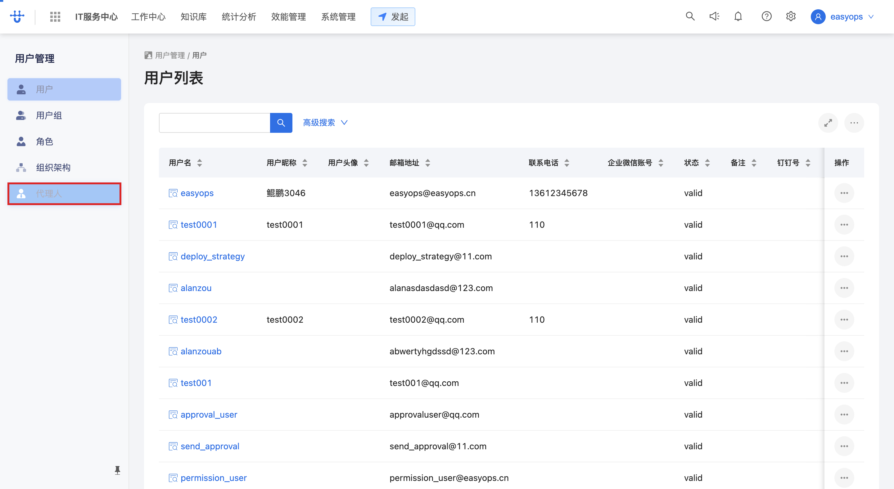
> 🔗 本步调用：`POST /next/api/gateway/flowable_service.personal_center.SearchProxySetting/api/flowable_service/v1/personal_center/proxy_setting/_search`（详见 openapi.yaml 的「代理人列表查询」），同时拉取服务目录 `GET .../service_catalog`。

## 二、搜索与筛选代理人

代理人规则较多时，通过关键词快速定位，或用高级搜索按服务分类、状态、负责人、与我相关、代理人等多条件组合筛选。

### 步骤 1：在搜索框输入关键词
<!-- url: itsc-personal-center/deputy-management?q={关键词} | step_id: 5 -->
在列表上方的搜索框输入关键词（如 `test`），文本输入过程不截图，失焦时捕获当前值。
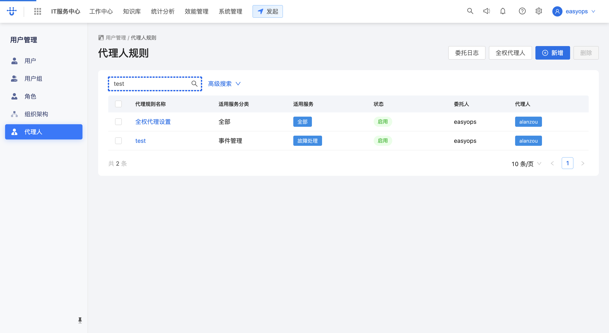
> 💡 提示：关键词会按代理规则名称模糊匹配。

### 步骤 2：点击「高级搜索」展开条件区
<!-- step_id: 7 -->
点击搜索框右侧的「高级搜索」，展开多字段条件配置区。
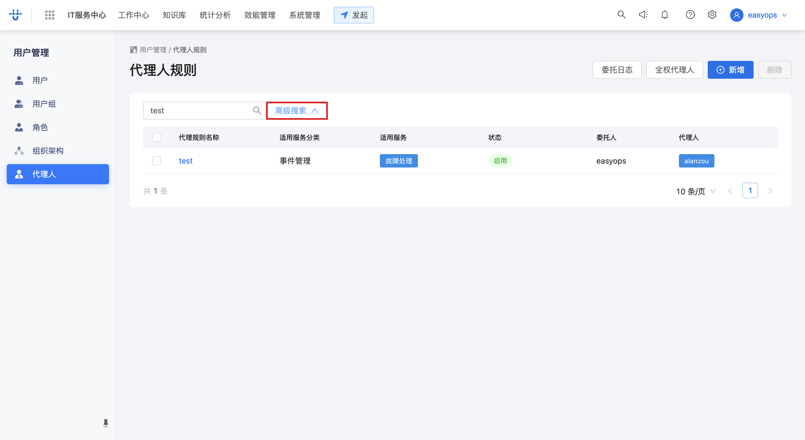

### 步骤 3：配置筛选条件
<!-- step_id: 8 -->
在条件区依次设置各筛选项，如「适用服务分类」选「全部」、「状态」选「启用」、「与我相关」「代理人」按需选择「全部」。
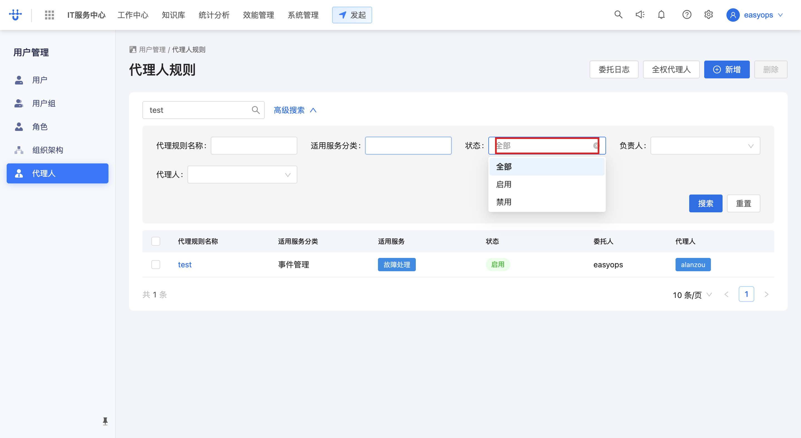
> 💡 提示：可叠加多个条件组合筛选，未设置的字段默认「全部」。

### 步骤 4：点击「搜索」执行查询
<!-- api: POST .../proxy_setting/_search | tag: 代理人列表查询 | step_id: 12 -->
配置完条件后点击「搜索」按钮，列表按条件刷新出结果。
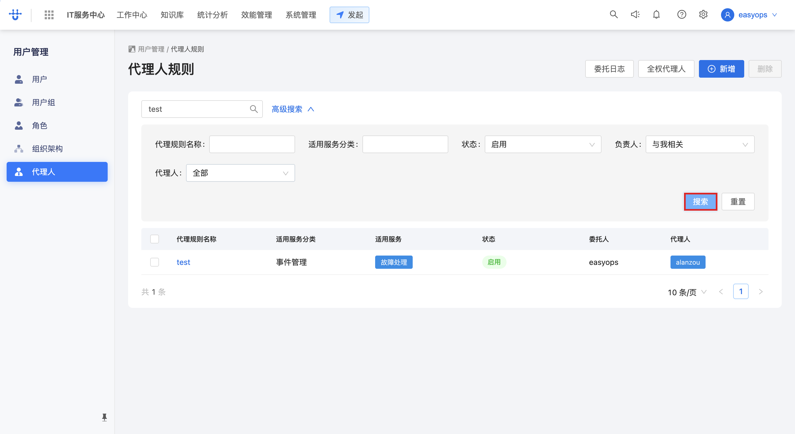
> 🔗 本步调用：`POST /next/api/gateway/flowable_service.personal_center.SearchProxySetting/api/flowable_service/v1/personal_center/proxy_setting/_search`（详见 openapi.yaml 的「代理人列表查询」）。

## 三、新建代理人规则

在列表页点击「新增」，进入新建表单填写代理规则名称、适用服务分类、适用服务、状态、代理时效、代理人后保存。

### 步骤 1：点击「新增」
<!-- step_id: 19 -->
在代理人管理列表页点击右上角「新增」按钮，进入新建代理人规则表单页。
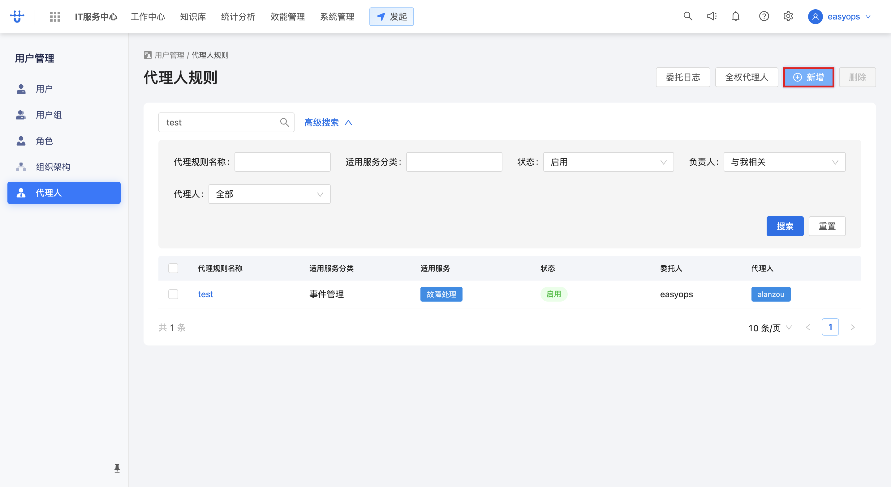

### 步骤 2：输入代理规则名称
<!-- url: itsc-personal-center/deputy-management/create | step_id: 20 -->
在「代理规则名称」输入框填写名称（如 `test01`），文本输入不截图，失焦时捕获。
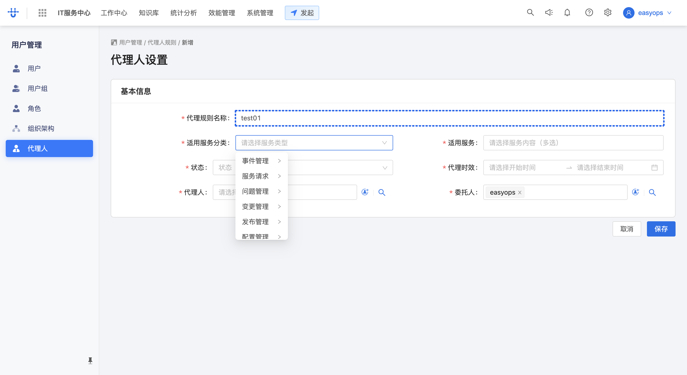

### 步骤 3：选择「适用服务分类」
<!-- step_id: 26 -->
点击「适用服务分类」下拉，依次选择分类层级（如「事件管理 / 标准事件」）。
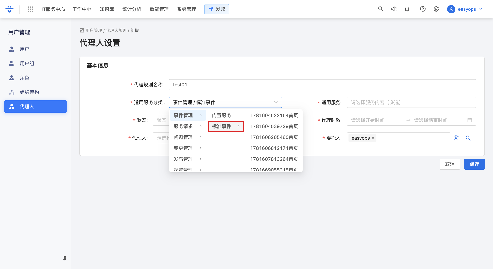
> 💡 提示：服务分类为树形结构，需逐级选择到末级分类（步骤中先选「事件管理」，再选「标准事件」）。

### 步骤 4：选择「适用服务」
<!-- api: GET .../service_instance | tag: 服务目录与用户选择 | step_id: 30 -->
点击「适用服务」的「请选择服务内容（多选）」，在弹出的实例选择控件中勾选要代理的具体服务。
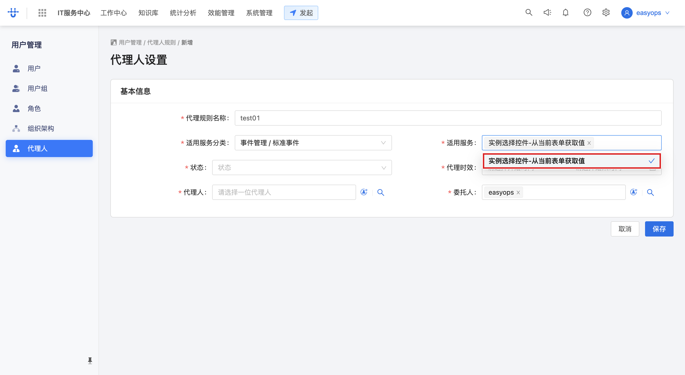
> 🔗 本步调用：`GET /next/api/gateway/flowable_service.service_catalog.ListService/api/flowable_service/v1/service_instance`（详见 openapi.yaml 的「服务目录与用户选择」），加载可选服务实例。

### 步骤 5：设置「状态」为启用
<!-- step_id: 31 -->
在「状态」开关处选择「启用」，使该代理规则创建后立即生效。
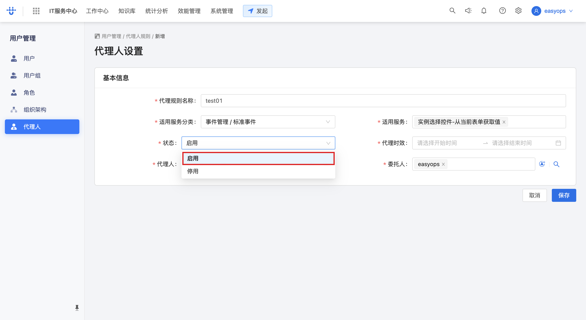

### 步骤 6：设置「代理时效」
<!-- step_id: 33 -->
点击「代理时效」时间选择器，选择代理生效的开始时间与结束时间（先选日期/时分的起始值，点「确定」；再选结束值，点「确定」）。
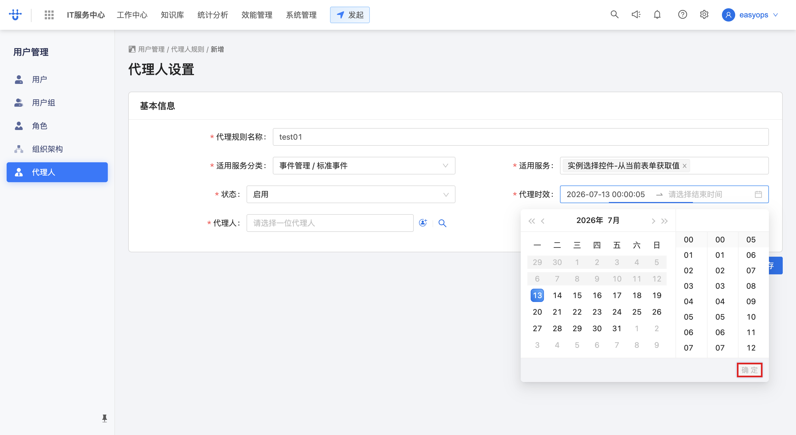
> 💡 提示：代理时效决定代理人在哪个时间段内代为处理工单，超时自动失效。

### 步骤 7：选择「代理人」
<!-- api: POST .../object/USER/instance/_search | tag: 服务目录与用户选择 | step_id: 36 -->
点击「请选择一位代理人」，在弹出的用户选择框中搜索并选中代理人（如 `test0002`）。
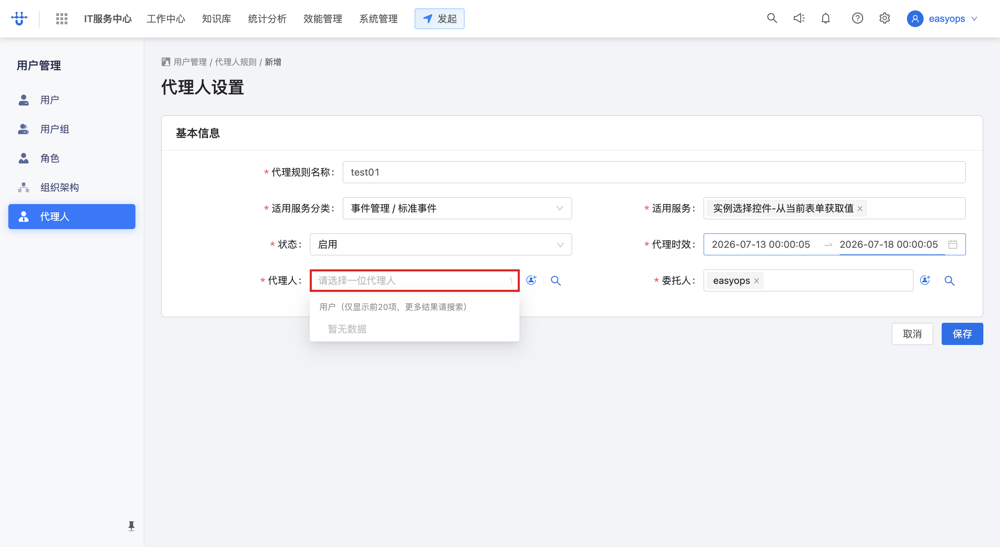
> 🔗 本步调用：`POST /next/api/gateway/cmdb.instance.PostSearch/object/USER/instance/_search`（详见 openapi.yaml 的「服务目录与用户选择」），查询可选用户。

### 步骤 8：点击「保存」
<!-- api: POST .../personal_center/proxy_setting | tag: 代理人创建 | step_id: 40 -->
表单填写完成后点击页面底部「保存」按钮，提交创建代理人规则。
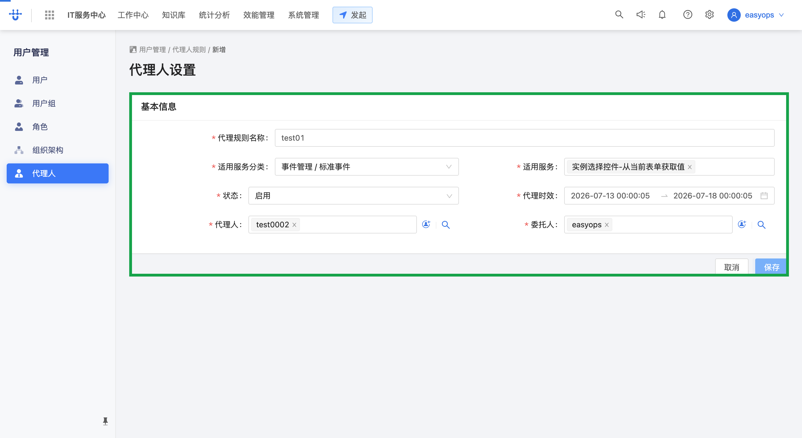
> 🔗 本步调用：`POST /next/api/gateway/flowable_service.personal_center.CreateProxySetting/api/flowable_service/v1/personal_center/proxy_setting`（详见 openapi.yaml 的「代理人创建」）。保存成功后自动返回列表页。

## 四、编辑代理人-启用全权代理人

在列表中点击某代理人规则进入编辑，可启用「全权代理人」并添加多个代理人、设置各自代理时效后保存。

### 步骤 1：在列表点击进入代理人编辑
<!-- step_id: 48 -->
在代理人管理列表中点击目标规则名称（如「全权代理人」），进入其编辑页。
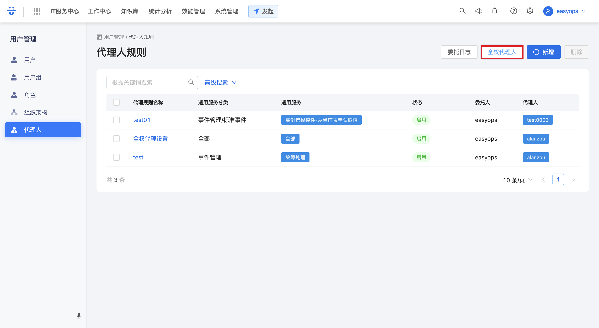
> 💡 提示：步骤 1 之前录制中先点击了列表里的 `test` 规则查看详情（步骤 18，触发 `GET .../proxy_setting/{id}` 拉取详情），再返回列表进入「全权代理人」编辑。

### 步骤 2：设置「状态」为启用
<!-- step_id: 49 -->
在编辑页将「状态」开关切换为「启用」。
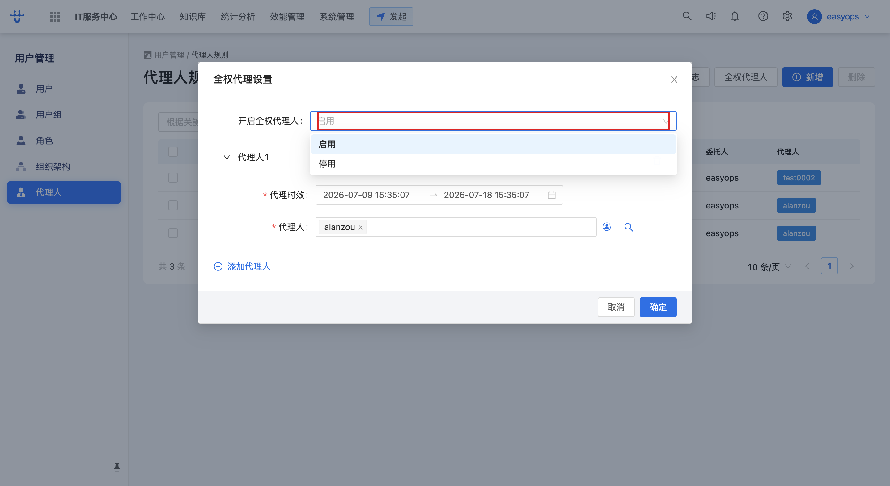

### 步骤 3：设置第一个代理人的「代理时效」
<!-- step_id: 53 -->
为「代理人 1」设置代理时效，在时间选择器中选择起始与结束时间，点「确定」。
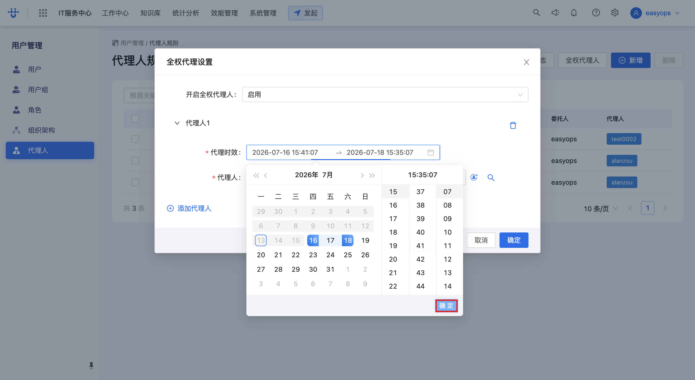

### 步骤 4：选择第一个代理人
<!-- step_id: 57 -->
点击「请选择一位代理人」，在用户选择框中搜索并选中（如 `alanzou`）。若展示为对象键名（如 `deploy_strategy`），表示该用户字段，可继续选择。
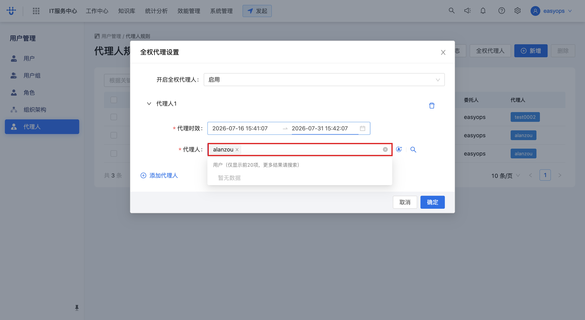
> ⚠️ 提示：步骤 5 关闭了某个临时弹层（`close`），随后进入多代理人配置区。

### 步骤 5：点击「添加代理人」增加第二个代理人
<!-- step_id: 61 -->
点击「添加代理人」按钮，新增一行代理人配置（代理人 2）。
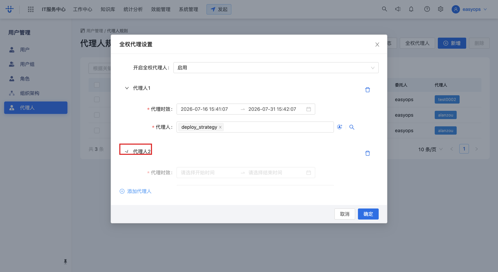

### 步骤 6：设置第二个代理人的时效并选择代理人
<!-- step_id: 65 -->
为「代理人 2」设置代理时效（点「确定」），再点击「请选择一位代理人」选中（如 `test001`）。
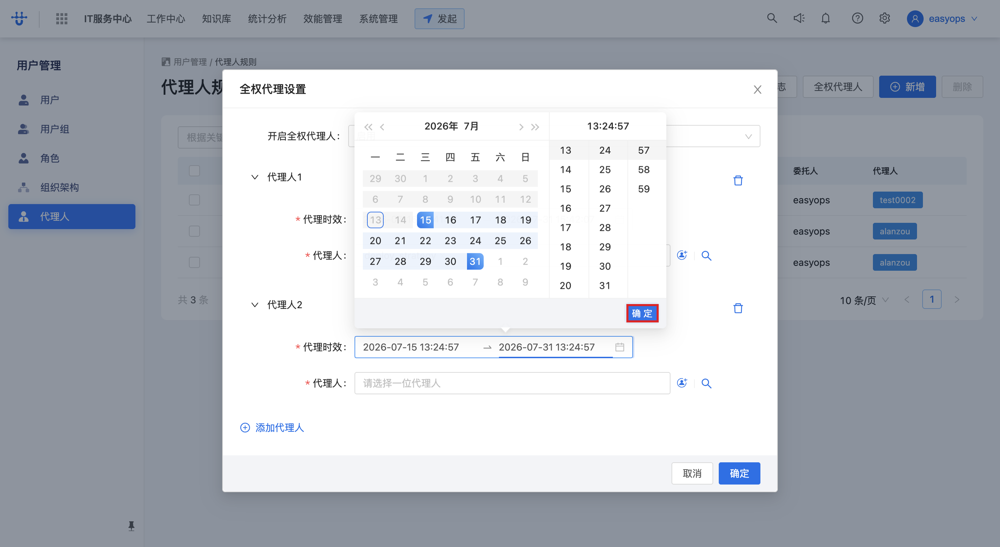
> 💡 提示：可添加多个代理人，各自独立设置代理时效，按顺序代理处理工单。

### 步骤 7：点击「确定」保存修改
<!-- api: PUT .../personal_center/proxy_setting/{id} | tag: 代理人更新 | step_id: 69 -->
配置完成后点击页面底部「确定」按钮，提交更新。
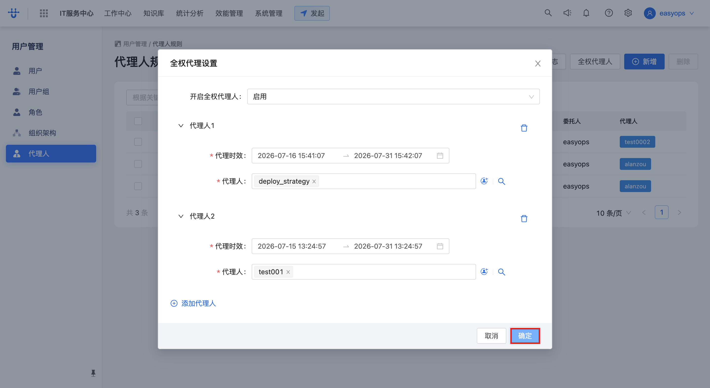
> 🔗 本步调用：`PUT /next/api/gateway/flowable_service.personal_center.UpdateProxySetting/api/flowable_service/v1/personal_center/proxy_setting/{id}`（详见 openapi.yaml 的「代理人更新」）。

### 步骤 8：确认保存（二次确认弹窗）
<!-- step_id: 70 -->
若弹出二次确认框，点击「确认」完成保存。
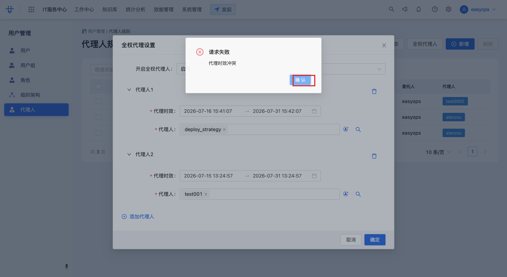
> 💡 提示：步骤中还存在对代理时效的二次调整与保存（步骤 72-76，再次 `PUT` 更新），属同一编辑保存动作的多次提交。

## 五、删除代理人

在列表中对不再需要的代理人规则执行删除，需输入确认数字二次确认。

### 步骤 1：点击「删除」
<!-- step_id: 77 -->
在代理人管理列表中，点击目标规则操作列的「删除」按钮。
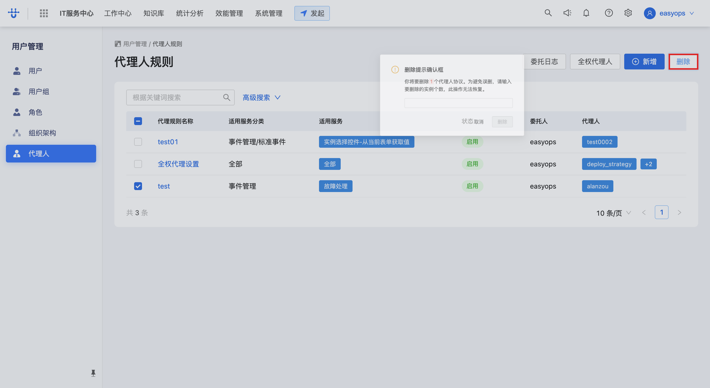

### 步骤 2：输入确认数字
<!-- step_id: 78 -->
在弹出的确认框中，按提示输入确认数字（如 `1`）以防止误删。
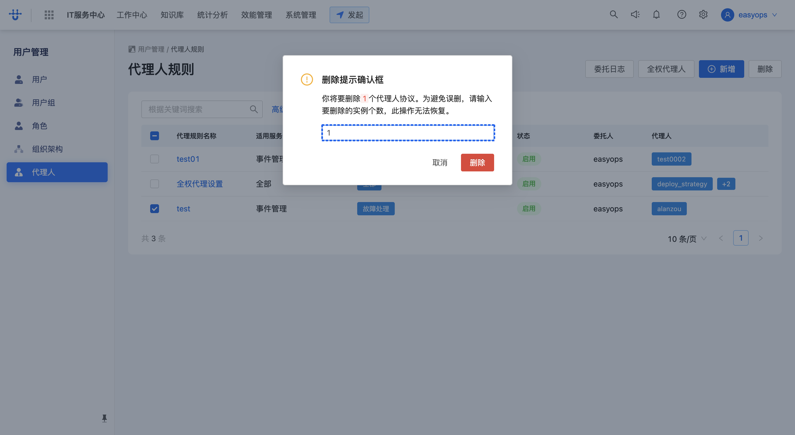

### 步骤 3：点击「删除」确认
<!-- api: DELETE .../personal_center/proxy_setting/{id} | tag: 代理人删除 | step_id: 79 -->
输入确认数字后点击「删除」按钮，完成删除并刷新列表。
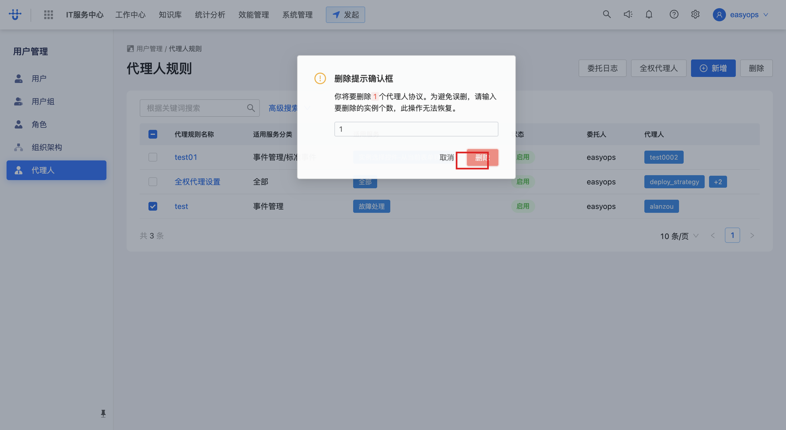
> 🔗 本步调用：`DELETE /next/api/gateway/flowable_service.personal_center.BatchDeleteProxySetting/api/flowable_service/v1/personal_center/proxy_setting/{id}`（详见 openapi.yaml 的「代理人删除」）。

## 附：本流程接口速查

| 接口 | 方法 | 路径 | 说明 | 触发步骤 |
| --- | --- | --- | --- | --- |
| 代理人列表查询 | POST | `/next/api/gateway/flowable_service.personal_center.SearchProxySetting/api/flowable_service/v1/personal_center/proxy_setting/_search` | 按关键词/高级搜索条件查询代理人规则列表 | 步骤二·4、三·1、四·1 |
| 代理人详情 | GET | `/next/api/gateway/flowable_service.personal_center.GetProxySetting/api/flowable_service/v1/personal_center/proxy_setting/{id}` | 查询单个代理人规则详情 | 步骤四·1 前 |
| 代理人创建 | POST | `/next/api/gateway/flowable_service.personal_center.CreateProxySetting/api/flowable_service/v1/personal_center/proxy_setting` | 新建代理人规则 | 步骤三·8 |
| 代理人更新 | PUT | `/next/api/gateway/flowable_service.personal_center.UpdateProxySetting/api/flowable_service/v1/personal_center/proxy_setting/{id}` | 编辑代理人（启用/添加代理人/改时效） | 步骤四·7 |
| 代理人删除 | DELETE | `/next/api/gateway/flowable_service.personal_center.BatchDeleteProxySetting/api/flowable_service/v1/personal_center/proxy_setting/{id}` | 删除代理人规则 | 步骤五·3 |
| 服务目录 | GET | `/next/api/gateway/flowable_service.service_catalog.ListCatalog/api/flowable_service/v1/service_catalog` | 拉取服务分类目录（适用服务分类下拉） | 步骤一·2、二·4 |
| 服务实例 | GET | `/next/api/gateway/flowable_service.service_catalog.ListService/api/flowable_service/v1/service_instance` | 拉取适用服务可选实例 | 步骤三·4 |
| 用户搜索 | POST | `/next/api/gateway/cmdb.instance.PostSearch/object/USER/instance/_search` | 选择代理人时搜索用户 | 步骤三·7、四·4 |
| 用户对象引用 | GET | `/next/api/gateway/cmdb.cmdb_object.GetObjectRef/object_ref?ref_object=USER` | 获取用户对象引用配置 | 步骤一·2 |
