# ITSM 系统管理 · 服务目录管理 - 操作指引

> 适用场景：在 ITSM 工作台的「系统管理 -> 服务目录管理」中，完成服务目录（catalog）的**搜索、新建、编辑、隐藏/显示、设置权限、删除**，以及在目录下**新建/排序/导出/导入/删除服务**，最后配置**默认常用服务**与**创建知识**。看完即可独立管理一棵服务目录树及其下的服务。
> 配套接口：见同目录 [`ITSM-系统管理-服务目录管理-openapi.yaml`](./ITSM-系统管理-服务目录管理-openapi.yaml)。
>
> 截图标注图例：🔴红框=点击 / 🔵蓝虚线框=输入 / 🟠橙框+▾=下拉 / 🟣紫圈=单复选 / 🟢绿粗框=提交。

## 目录

- [一、进入服务目录管理](#一进入服务目录管理)
- [二、搜索并选择服务目录](#二搜索并选择服务目录)
- [三、新建服务目录](#三新建服务目录)
- [四、新建服务](#四新建服务)
- [五、服务排序](#五服务排序)
- [六、导出服务](#六导出服务)
- [七、导入服务](#七导入服务)
- [八、删除服务](#八删除服务)
- [九、编辑服务目录](#九编辑服务目录)
- [十、设置目录权限](#十设置目录权限)
- [十一、隐藏/显示目录](#十一隐藏显示目录)
- [十二、删除服务目录](#十二删除服务目录)
- [十三、默认常用服务](#十三默认常用服务)
- [十四、创建知识](#十四创建知识)
- [附：本流程接口速查](#附本流程接口速查)

<!-- deep-links: 本流程关键页面直达（SPA 路径，去掉 host 前缀，参数化）
  工作台:         itsc-workbench/workbench
  服务目录管理:     itsc-service-management/setting-list
  指定目录服务列表:  itsc-service-management/setting-list?catalog={catalogName}&catalogId={catalogId}
-->

## 一、进入服务目录管理

从工作台导航到服务目录管理页。

### 步骤 1：点击顶部「系统管理」

<!-- url: itsc-workbench/workbench | step_id: 1 -->

在工作台顶部导航栏点击「系统管理」，展开系统管理子菜单。
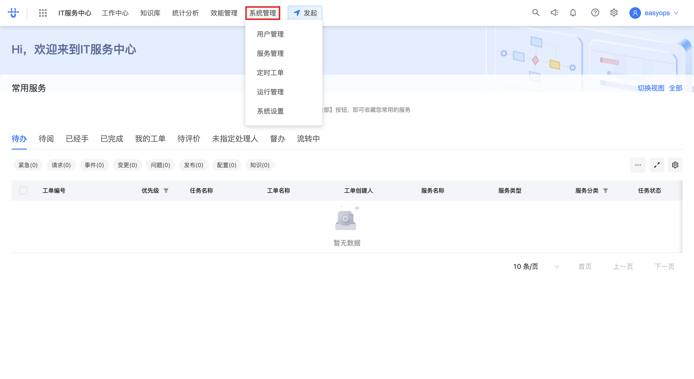

> 💡 提示：若已直接处于服务目录管理页，可跳过本段。

### 步骤 2：进入「服务管理」模块

<!-- url: itsc-service-management/setting-list | api: GET .../service_catalog | tag: 服务目录管理 | step_id: 2 -->

在系统管理菜单中点击进入「服务管理」模块，页面加载服务目录树。
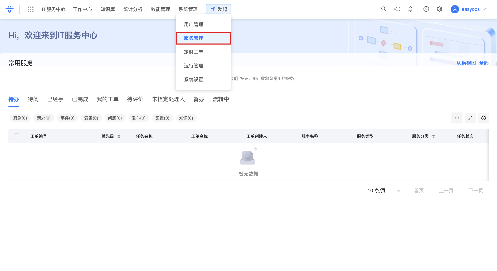

> 🔗 本步调用：`GET /next/api/gateway/flowable_service.service_catalog.ListCatalog/api/flowable_service/v1/service_catalog`（详见 openapi.yaml 的「服务目录管理」），加载全部服务目录。

### 步骤 3：进入「服务目录管理」页签

<!-- url: itsc-service-management/setting-list | step_id: 3 -->

切换到「服务目录管理」页签，左侧展示服务目录树（请求目录、事件管理等分类）。
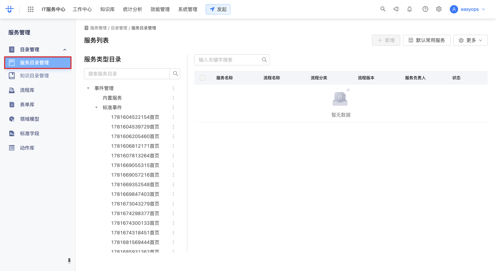

> 🔗 本步调用：`GET .../service_catalog`（刷新目录树）与 `GET .../groups/id`（当前用户用户组）。

## 二、搜索并选择服务目录

目录较多时，用搜索框快速定位目标目录并查看其下服务。

### 步骤 1：在搜索框输入目录关键词

<!-- url: itsc-service-management/setting-list | step_id: 6 -->

在服务目录搜索框输入关键词（如「请求」），实时过滤匹配的目录。
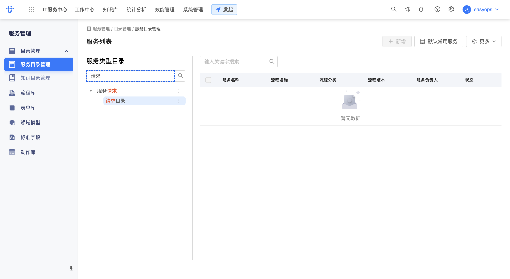

> 💡 提示：输入过程不截图，此处展示输入「请求」后的过滤结果。

### 步骤 2：点击命中目录

<!-- url: itsc-service-management/setting-list?catalogId={catalogId} | api: GET .../service_instance | tag: 服务实例管理 | step_id: 7 -->

点击搜索结果中的「请求目录」，右侧加载该目录下的服务列表。
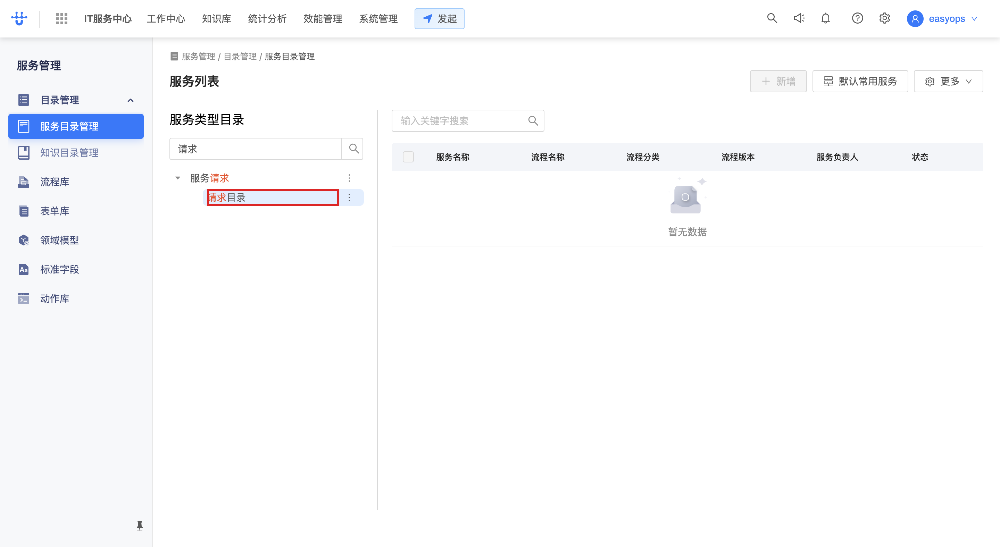

> 🔗 本步调用：`GET /next/api/gateway/flowable_service.service_catalog.ListService/api/flowable_service/v1/service_instance`（详见 openapi.yaml 的「服务实例管理」），按 catalogID 查询服务。

### 步骤 3：切换到「标准事件」目录

<!-- url: itsc-service-management/setting-list?catalog=标准事件 | step_id: 9 -->

清空搜索后点击「标准事件」目录，查看其下服务（后续在其下新建子目录）。
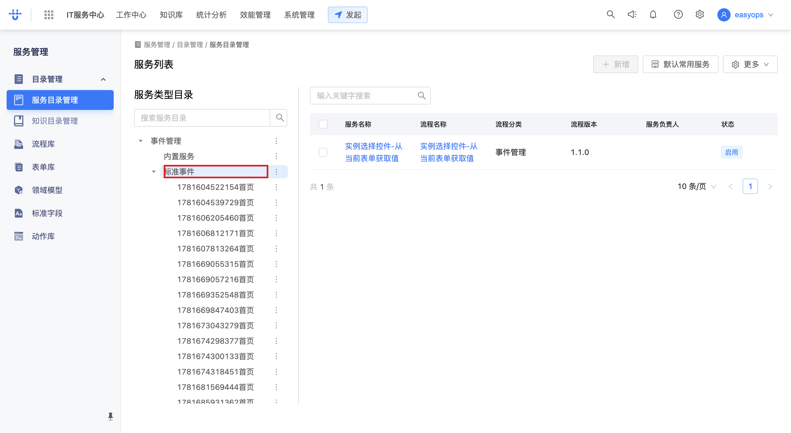

## 三、新建服务目录

在「标准事件」目录下新建一个子目录 test。

### 步骤 1：点击「more」展开操作菜单

<!-- url: itsc-service-management/setting-list?catalog=标准事件 | step_id: 10 -->

点击目标目录操作区的「more」按钮，展开操作菜单。
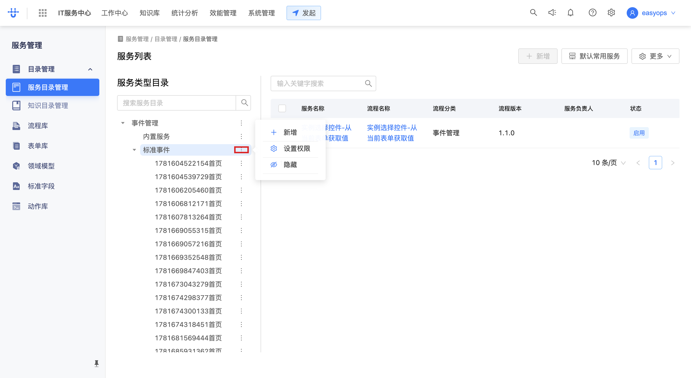

### 步骤 2：点击「新增」

<!-- url: itsc-service-management/setting-list?catalog=标准事件 | step_id: 11 -->

在 more 菜单中点击「新增」，弹出新建目录对话框。
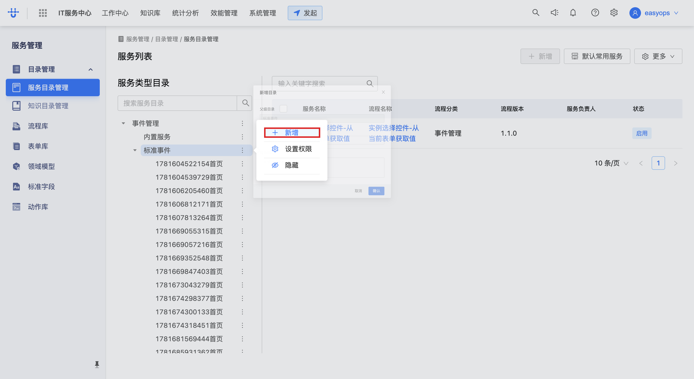

### 步骤 3：输入目录名称

<!-- url: itsc-service-management/setting-list?catalog=标准事件 | step_id: 13 -->

在「请输入目录名称」框中输入目录名（如「test」）。
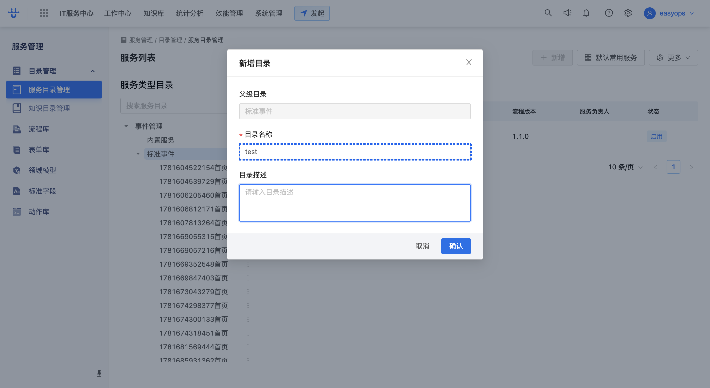

### 步骤 4：输入目录描述

<!-- url: itsc-service-management/setting-list?catalog=标准事件 | step_id: 20 -->

在「请输入目录描述」框中输入描述（如「测试」）。
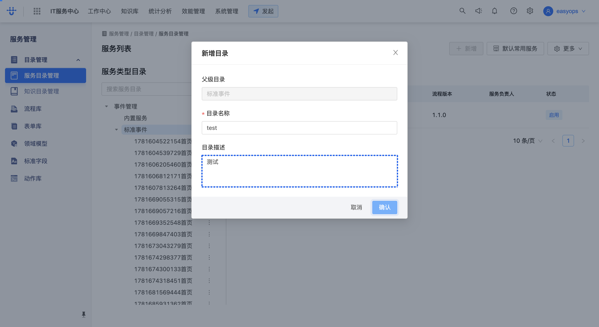

### 步骤 5：点击「确认」创建目录

<!-- url: itsc-service-management/setting-list?catalog=test | api: POST .../service_catalog | tag: 服务目录管理 | step_id: 21 -->

点击「确认」，在当前目录下创建子目录 test，返回新目录 instanceId。
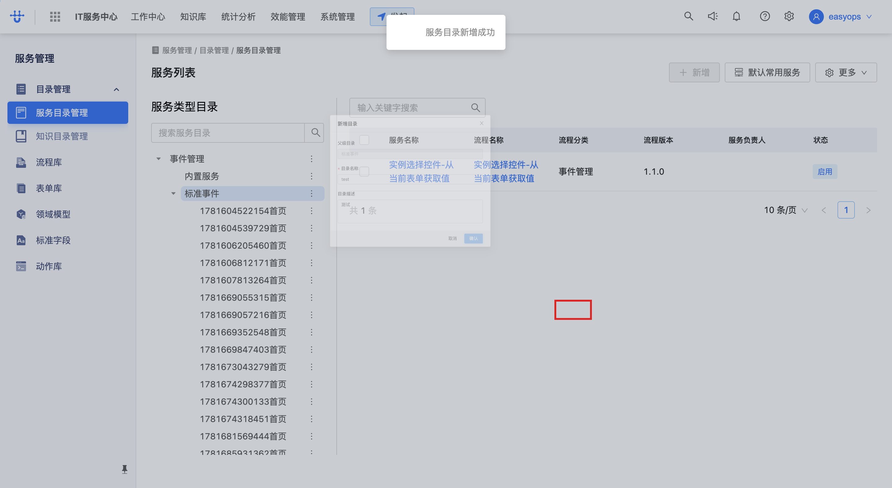

> 🔗 本步调用：`POST /next/api/gateway/logic.flowable_service/api/flowable_service/v1/service_catalog`（详见 openapi.yaml 的「服务目录管理」），并刷新目录树与服务列表。

## 四、新建服务

在 test 目录下新建一个服务，需配置名称、关联流程、负责人、触发器、分类码等。

### 步骤 1：搜索并进入 test 目录

<!-- url: itsc-service-management/setting-list?catalog=test | step_id: 23 -->

搜索「test」并点击进入 test 目录。
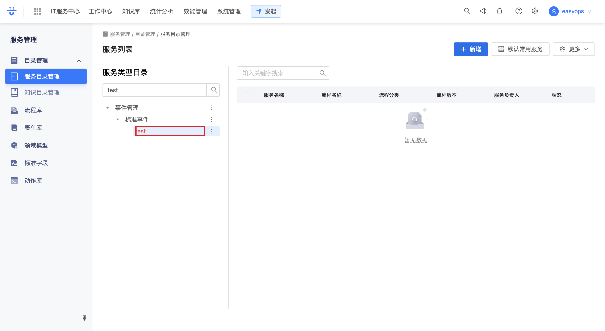

### 步骤 2：点击「新增」打开服务表单

<!-- url: itsc-service-management/setting-list?catalog=test | api: GET .../knowledge_base/catalog_tree | tag: 流程与知识关联 | step_id: 24 -->

点击「新增」按钮，打开新建服务表单，并加载知识库目录树。
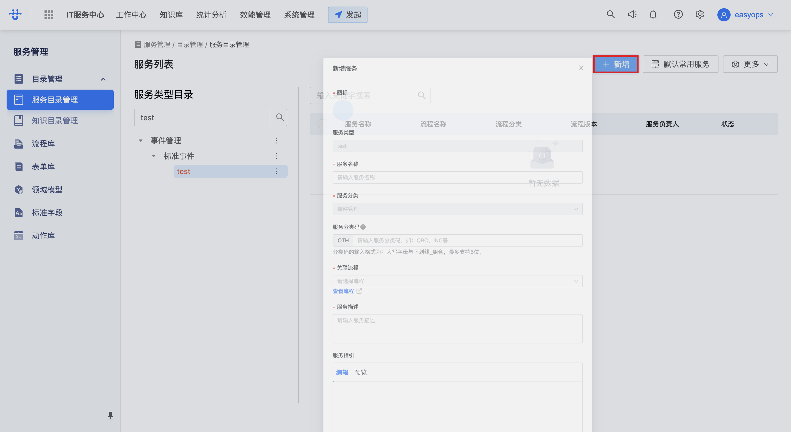

> 🔗 本步调用：`GET /next/api/gateway/logic.flowable_service/api/flowable_service/v1/knowledge_base/catalog_tree`（详见 openapi.yaml 的「流程与知识关联」）。

### 步骤 3：输入服务名称

<!-- url: itsc-service-management/setting-list?catalog=test | step_id: 26 -->

在「请输入服务名称」框中输入服务名（如「test」）。
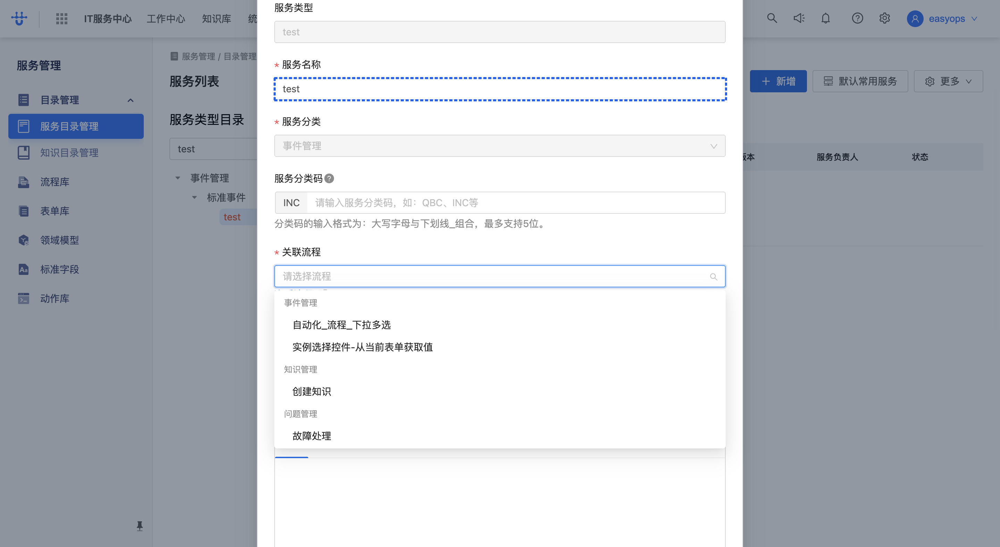

### 步骤 4：选择关联流程

<!-- url: itsc-service-management/setting-list?catalog=test | api: GET .../process_definition | tag: 流程与知识关联 | step_id: 27 -->

点击「关联流程」下拉，选择已发布的流程（如「自动化_流程_下拉多选」）。
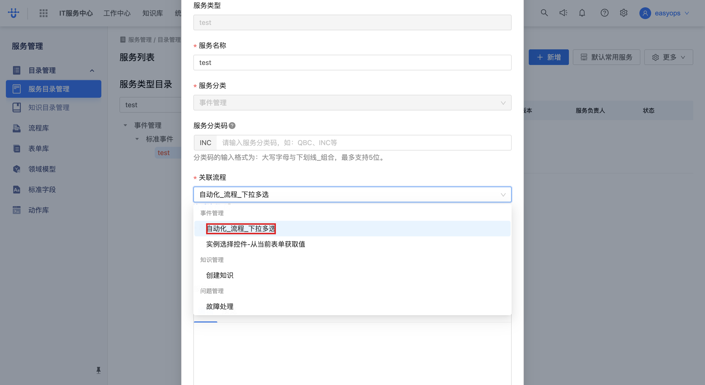

> 🔗 本步调用：`GET /next/api/gateway/flowable_service.process_definition_version.ListProcessDefinition/api/flowable_service/v1/process_definition`（详见 openapi.yaml 的「流程与知识关联」），加载可选主版本流程。

### 步骤 5：输入服务描述

<!-- url: itsc-service-management/setting-list?catalog=test | step_id: 33 -->

在「请输入服务描述」框中输入描述（如「测试」）。
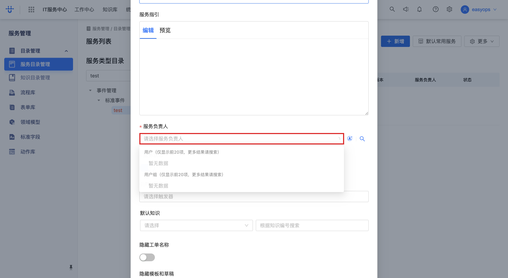

### 步骤 6：选择服务负责人

<!-- url: itsc-service-management/setting-list?catalog=test | api: POST .../object/USER/_search | tag: 用户与用户组搜索 | step_id: 34 -->

点击「请选择服务负责人」，弹出选人框并搜索用户。

> 🔗 本步调用：`POST /next/api/gateway/cmdb.instance.PostSearch/object/USER/instance/_search` 与 `.../USER_GROUP/instance/_search`（详见 openapi.yaml 的「用户与用户组搜索」）。

### 步骤 7：选中负责人

<!-- url: itsc-service-management/setting-list?catalog=test | step_id: 36 -->

在搜索结果中点击选中负责人（如「test0001」）。
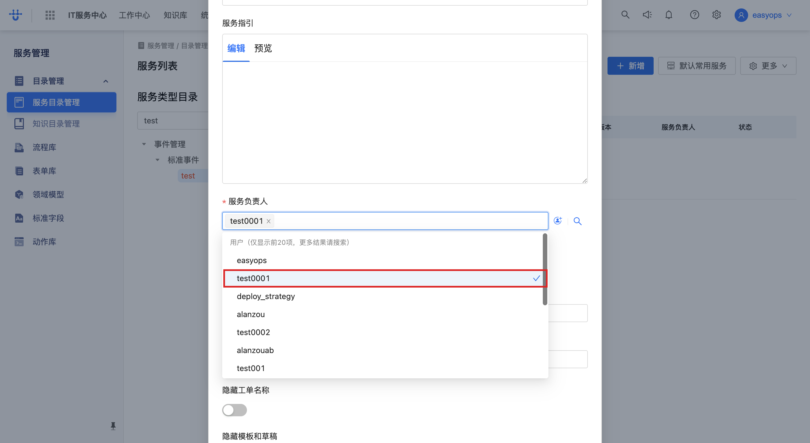

### 步骤 8：选择触发器

<!-- url: itsc-service-management/setting-list?catalog=test | api: GET .../trigger | tag: 流程与知识关联 | step_id: 38 -->

点击「引用触发器」并在下拉中选择触发器（如「cyp新建...」）。
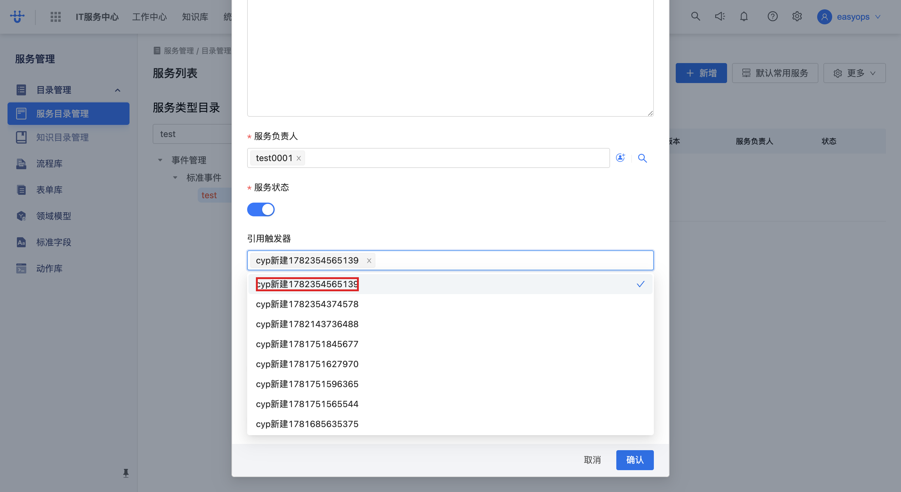

> 🔗 本步调用：`GET /next/api/gateway/flowable_service.trigger.ListTrigger/api/flowable_service/v1/trigger`（详见 openapi.yaml 的「流程与知识关联」）。

### 步骤 9：选择服务分类码

<!-- url: itsc-service-management/setting-list?catalog=test | step_id: 41 -->

在「服务分类码」type-select 下拉中选择分类码（大写字母+下划线，最多 5 位，如「test」）。
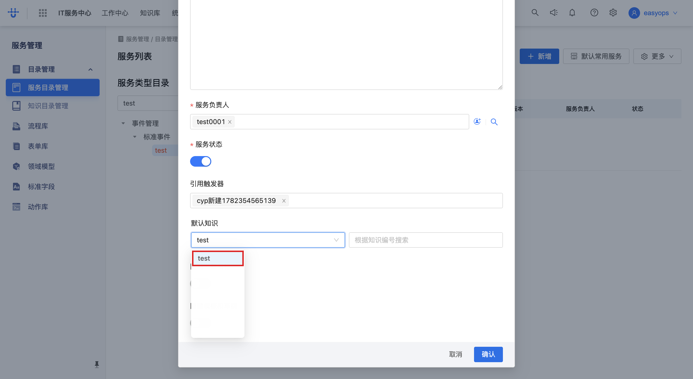

### 步骤 10：搜索并关联知识

<!-- url: itsc-service-management/setting-list?catalog=test | api: GET .../knowledge_base/knowledge | tag: 流程与知识关联 | step_id: 42 -->

点击「根据知识编号搜索」，从知识库中选择关联知识。
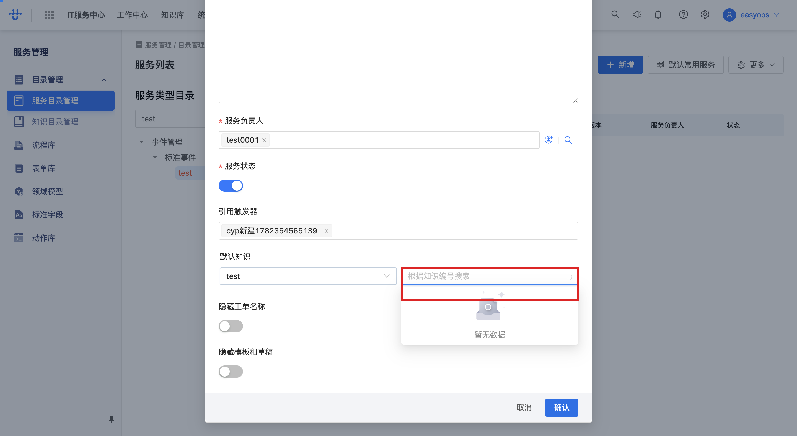

> 🔗 本步调用：`GET /next/api/gateway/flowable_service.knowledge_base.ListKnowledge/api/flowable_service/v1/knowledge_base/knowledge`（详见 openapi.yaml 的「流程与知识关联」）。

### 步骤 11：点击「确认」创建服务

<!-- url: itsc-service-management/setting-list?catalog=test | api: POST .../v2/service_instance | tag: 服务实例管理 | step_id: 44 -->

填写完成后点击「确认」，创建服务并返回 instanceId。
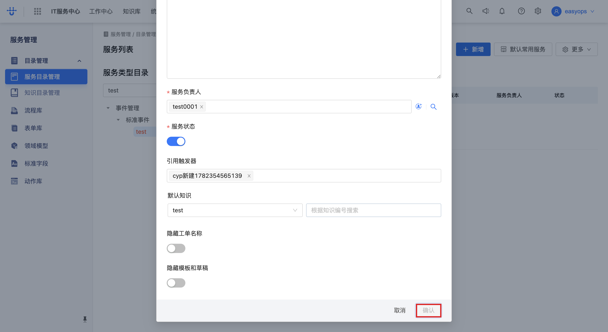

> 🔗 本步调用：`POST /next/api/gateway/logic.flowable_service/api/flowable_service/v2/service_instance`（详见 openapi.yaml 的「服务实例管理」），并刷新服务列表。

## 五、服务排序

调整目录下服务的展示顺序。

### 步骤 1：点击「更多」->「排序」

<!-- url: itsc-service-management/setting-list?catalog=test | step_id: 46 -->

点击「更多」->「排序」，打开排序面板，拖拽服务到目标位置。
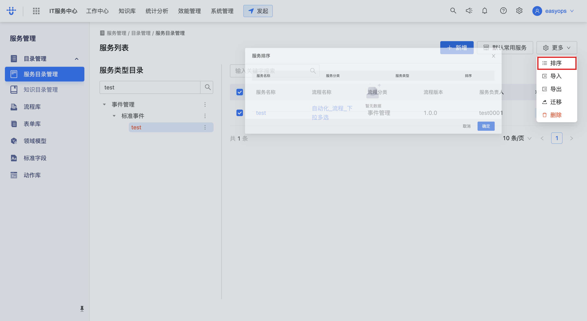

> 🔗 本步调用：`GET .../service_instance`（加载目录下全部服务）后 `POST .../service_instance/sort`（提交排序）。

### 步骤 2：点击「确定」保存排序

<!-- url: itsc-service-management/setting-list?catalog=test | api: POST .../service_instance/sort | tag: 服务实例管理 | step_id: 47 -->

调整完成后点击「确定」，保存新的排序。
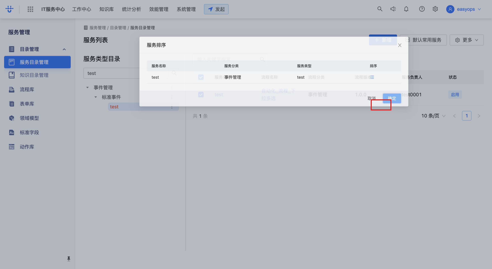

> 🔗 本步调用：`POST /next/api/gateway/logic.flowable_service/api/flowable_service/v1/service_instance/sort`（serviceIdList + sortList，详见 openapi.yaml 的「服务实例管理」）。

## 六、导出服务

将目录下服务导出为文件。

### 步骤 1：点击「更多」->「导出」

<!-- url: itsc-service-management/setting-list?catalog=test | step_id: 51 -->

点击「更多」->「导出」，弹出导出选项。
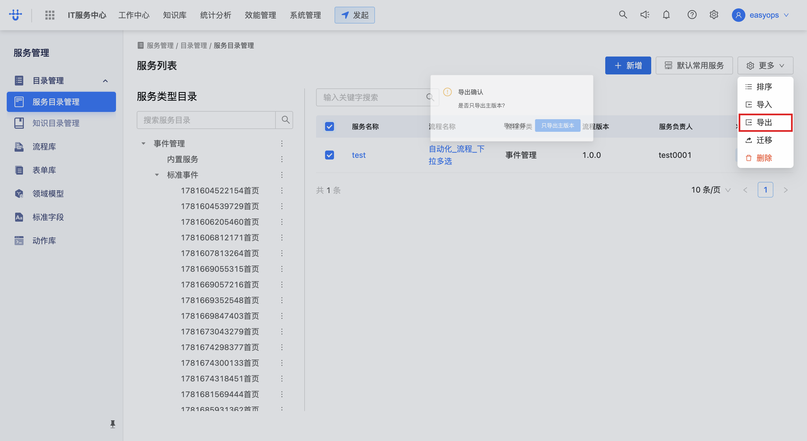

### 步骤 2：选择「只导出主版本」

<!-- url: itsc-service-management/setting-list?catalog=test | step_id: 52 -->

勾选「只导出主版本」，开始下载导出文件。
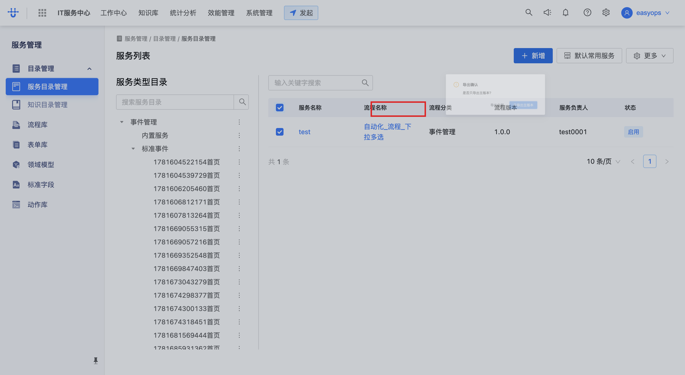

> 💡 提示：导出为浏览器原生下载行为，完成后在下载页查看。

## 七、导入服务

通过文件批量导入服务。

### 步骤 1：点击「更多」->「导入」

<!-- url: itsc-service-management/setting-list?catalog=test | step_id: 54 -->

点击「更多」->「导入」，打开导入面板。
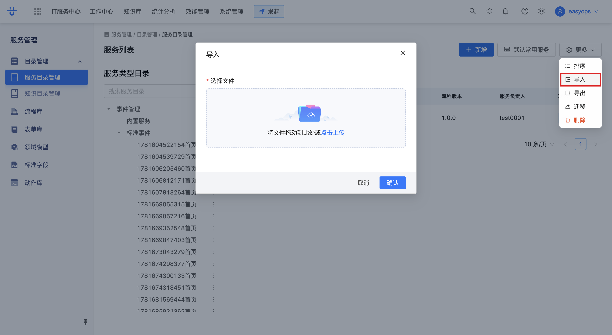

### 步骤 2：上传文件

<!-- url: itsc-service-management/setting-list?catalog=test | api: POST .../service_catalog/{id}/import | tag: 服务导入导出 | step_id: 56 -->

点击「upload」选择文件并上传。
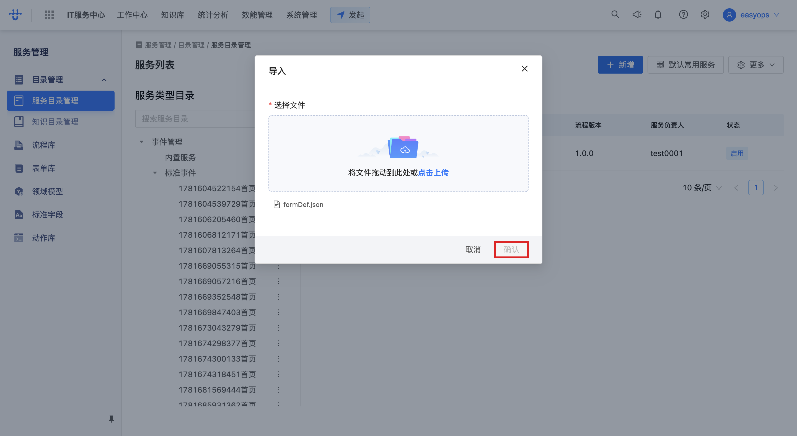

> 🔗 本步调用：`POST /next/api/gateway/logic.flowable_service/api/flowable_service/v1/service_catalog/{catalogId}/import`（详见 openapi.yaml 的「服务导入导出」）。
> ⚠️ 提示：本次录制上传的文件格式不被识别（返回 `gzip: invalid header`，code=500）。请使用「导出」功能下载的模板格式导入，避免格式错误。

### 步骤 3：关闭导入面板

<!-- url: itsc-service-management/setting-list?catalog=test | step_id: 58 -->

点击「close-button」关闭导入面板。
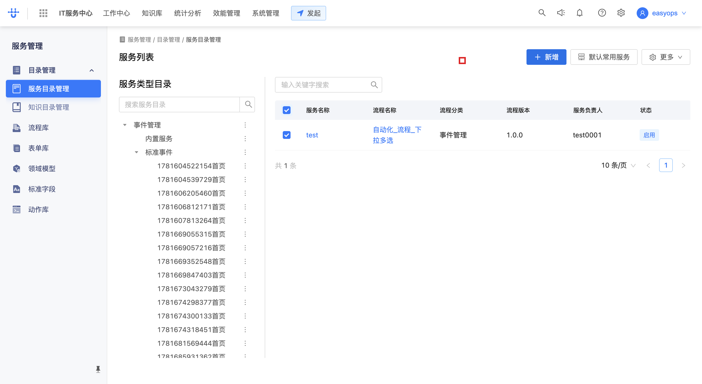

## 八、删除服务

删除目录下的某个服务。

### 步骤 1：点击「更多」->「删除」

<!-- url: itsc-service-management/setting-list?catalog=test | step_id: 60 -->

点击目标服务操作列的「更多」->「删除」，弹出删除确认框。
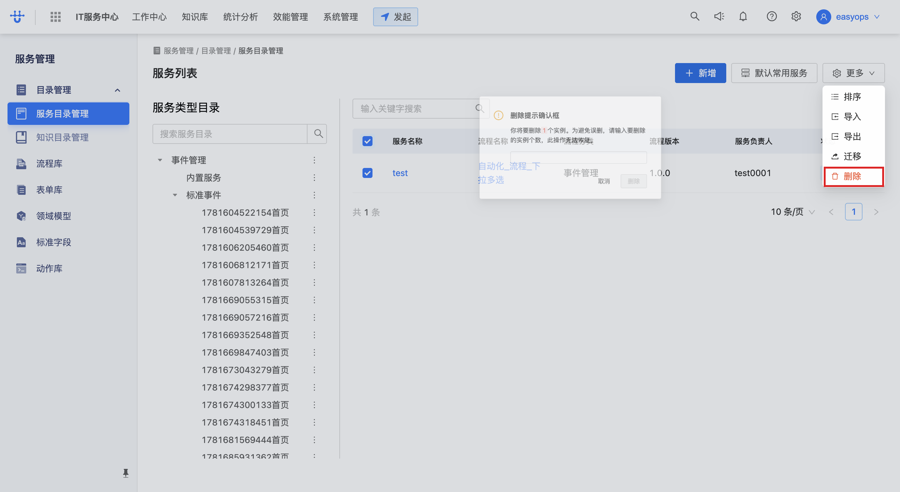

### 步骤 2：输入确认信息

<!-- url: itsc-service-management/setting-list?catalog=test | step_id: 61 -->

按提示输入确认信息（如「1」）以二次确认。
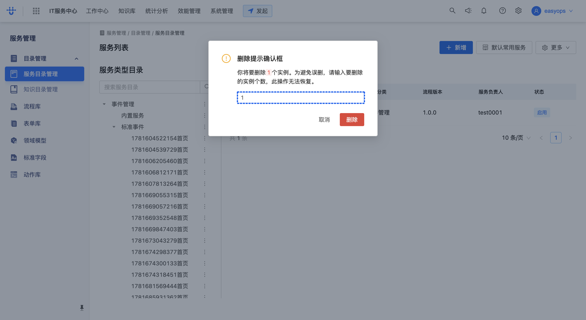

### 步骤 3：点击「删除」确认

<!-- url: itsc-service-management/setting-list?catalog=test | api: DELETE .../service_instance/{id} | tag: 服务实例管理 | step_id: 62 -->

点击「删除」，删除该服务。
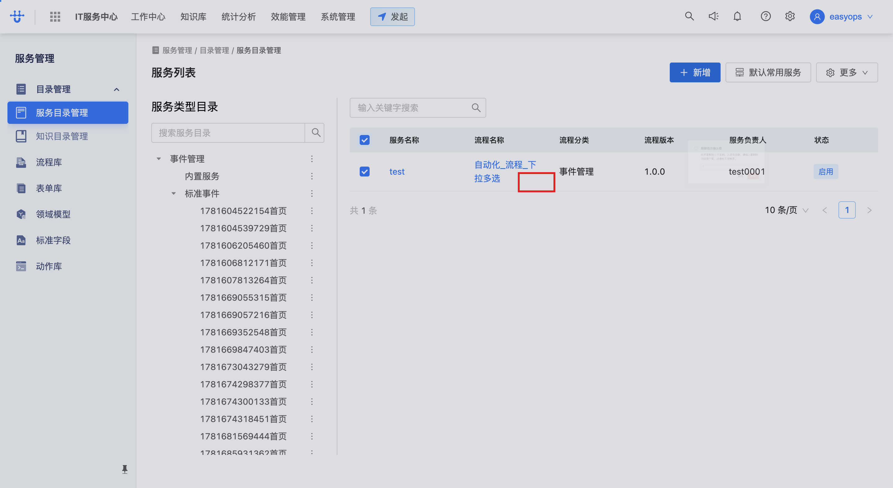

> 🔗 本步调用：`DELETE /next/api/gateway/logic.flowable_service/api/flowable_service/v1/service_instance/{instanceId}`（详见 openapi.yaml 的「服务实例管理」）。

## 九、编辑服务目录

修改目录名称、描述等信息。

### 步骤 1：点击「more」->「编辑」

<!-- url: itsc-service-management/setting-list?catalog=test | step_id: 64 -->

点击目录操作区的「more」->「编辑」，弹出编辑对话框。
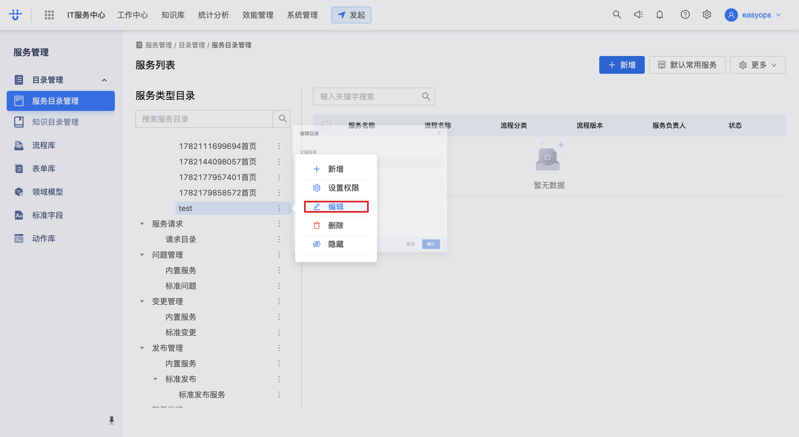

### 步骤 2：修改目录名称

<!-- url: itsc-service-management/setting-list?catalog=test | api: PUT .../service_catalog/{id} | tag: 服务目录管理 | step_id: 65 -->

在「请输入目录名称」框中修改名称（如改为「test1」）。
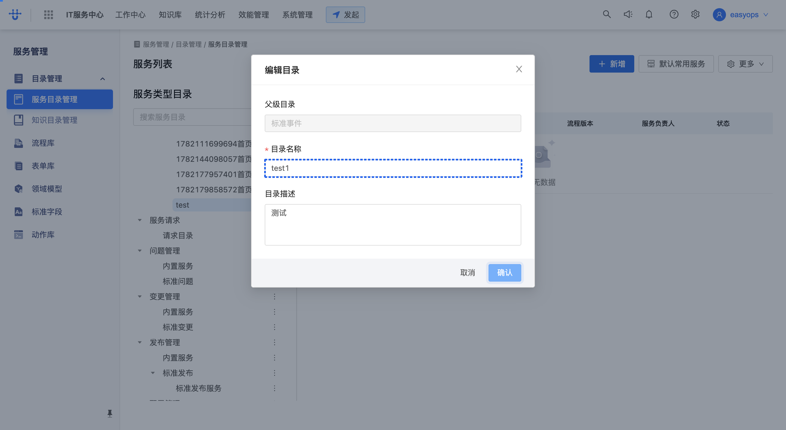

> 🔗 本步调用：`PUT /next/api/gateway/logic.flowable_service/api/flowable_service/v1/service_catalog/{catalogId}`（详见 openapi.yaml 的「服务目录管理」）。

### 步骤 3：点击「确认」保存

<!-- url: itsc-service-management/setting-list?catalog=test1 | step_id: 66 -->

点击「确认」保存修改，刷新目录树与服务列表。
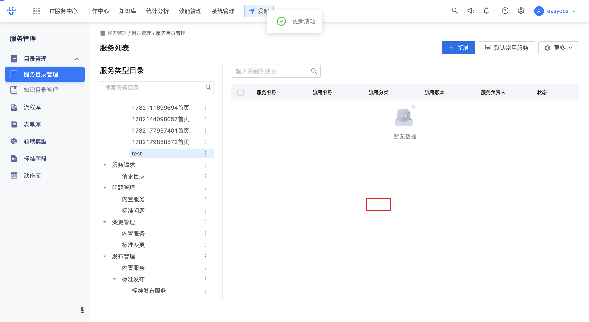

## 十、设置目录权限

配置哪些用户/用户组可查看、可操作该服务目录。

### 步骤 1：搜索目录并点击「more」->「设置权限」

<!-- url: itsc-service-management/setting-list?catalog=test1 | step_id: 69 -->

搜索「test1」定位目录，点击「more」->「设置权限」，打开权限配置面板。
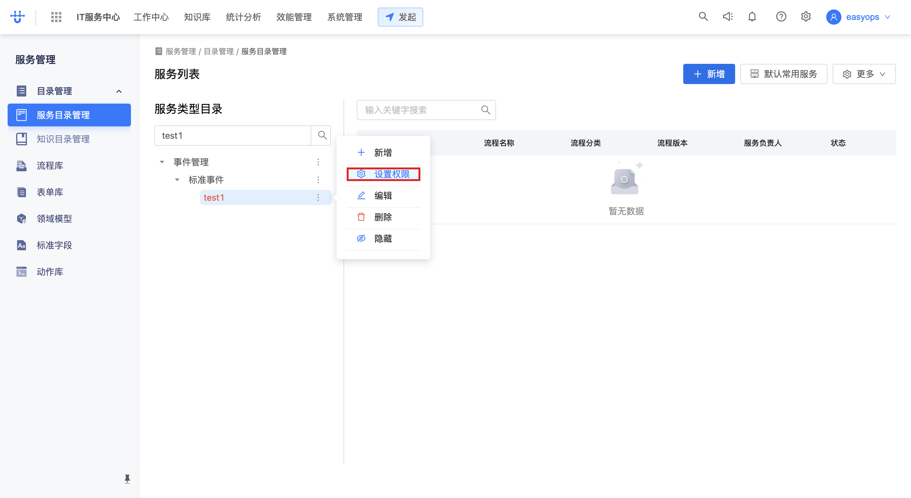

### 步骤 2：选择「可查看」的用户/用户组

<!-- url: itsc-service-management/setting-list?catalog=test1 | api: POST .../object/USER/_search | tag: 用户与用户组搜索 | step_id: 70 -->

点击「选择可查看当前服务目录的用户或用户组」，搜索并勾选（如 deploy_strategy、alanzou）。
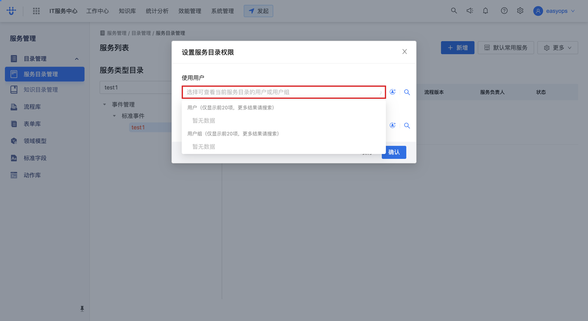

> 🔗 本步调用：`POST .../object/USER/instance/_search` 与 `.../USER_GROUP/instance/_search`（详见 openapi.yaml 的「用户与用户组搜索」）。

### 步骤 3：确认查看权限选择

<!-- url: itsc-service-management/setting-list?catalog=test1 | step_id: 73 -->

确认已选的查看用户/用户组列表。
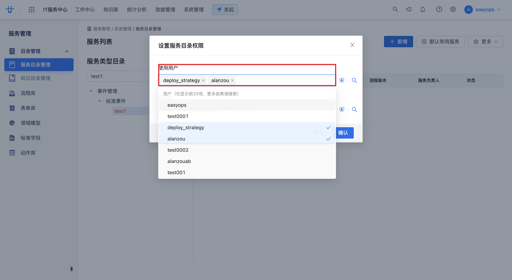

### 步骤 4：选择「可操作」的用户/用户组

<!-- url: itsc-service-management/setting-list?catalog=test1 | step_id: 74 -->

点击「选择可操作当前服务目录的用户或用户组」，搜索并勾选（如 test0001）。
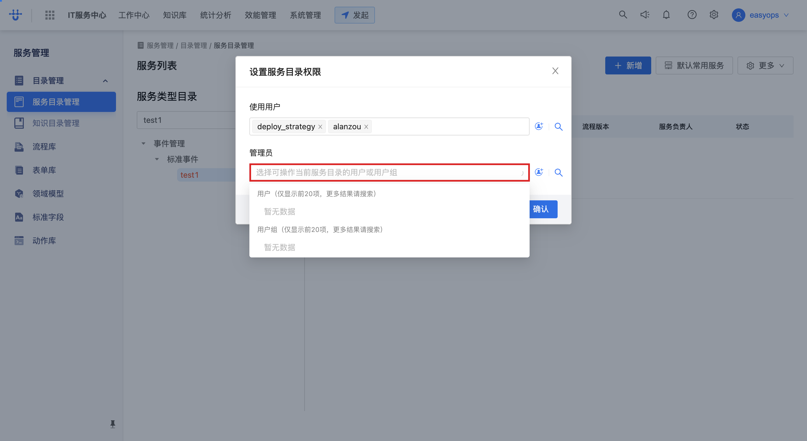

### 步骤 5：确认操作权限选择

<!-- url: itsc-service-management/setting-list?catalog=test1 | step_id: 76 -->

确认已选的操作用户/用户组列表。
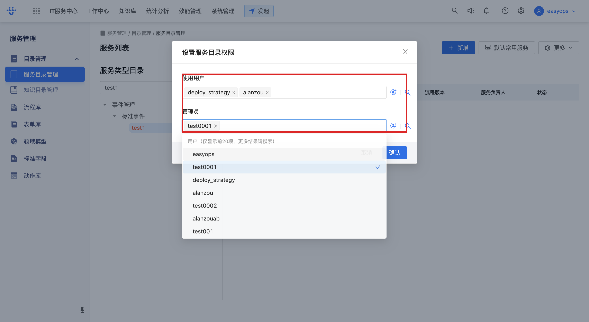

### 步骤 6：点击「确认」保存权限

<!-- url: itsc-service-management/setting-list?catalog=test1&modifyUserList=... | api: POST .../set_catalog_permission | tag: 目录权限 | step_id: 77 -->

点击「确认」，保存目录的查看/操作权限。
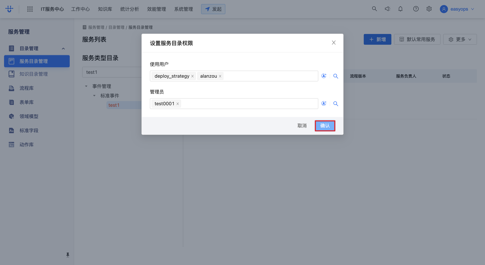

> 🔗 本步调用：`POST /next/api/gateway/flowable_service.service_catalog.SetCatalogPermission/api/flowable_service/v1/set_catalog_permission`（readUserList + modifyUserList，详见 openapi.yaml 的「目录权限」）。

## 十一、隐藏/显示目录

控制目录在前台用户侧是否可见。

### 步骤 1：点击「more」->「隐藏」

<!-- url: itsc-service-management/setting-list?catalog=test1 | api: PUT .../service_catalog/{id} | tag: 服务目录管理 | step_id: 79 -->

点击目录的「more」->「隐藏」，将该目录对前台用户隐藏。
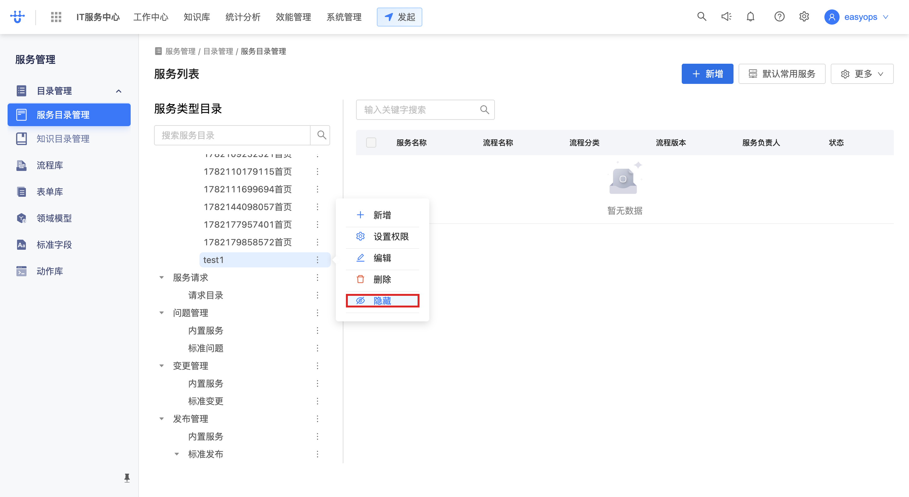

> 🔗 本步调用：`PUT .../service_catalog/{catalogId}`（更新可见状态，详见 openapi.yaml 的「服务目录管理」）。

### 步骤 2：点击「more」->「显示」恢复

<!-- url: itsc-service-management/setting-list?catalog=test1 | api: PUT .../service_catalog/{id} | tag: 服务目录管理 | step_id: 81 -->

再次点击「more」->「显示」，恢复目录可见。
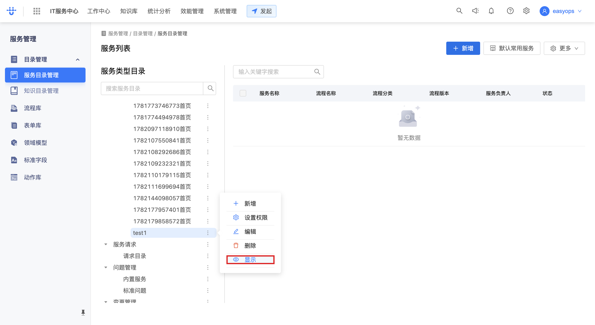

> 🔗 本步调用：同上 `PUT .../service_catalog/{catalogId}`。

## 十二、删除服务目录

删除整个服务目录（含其下服务需先清空或确认）。

### 步骤 1：点击「more」->「删除」

<!-- url: itsc-service-management/setting-list?catalog=test1 | step_id: 83 -->

点击目录的「more」->「删除」，弹出确认框。
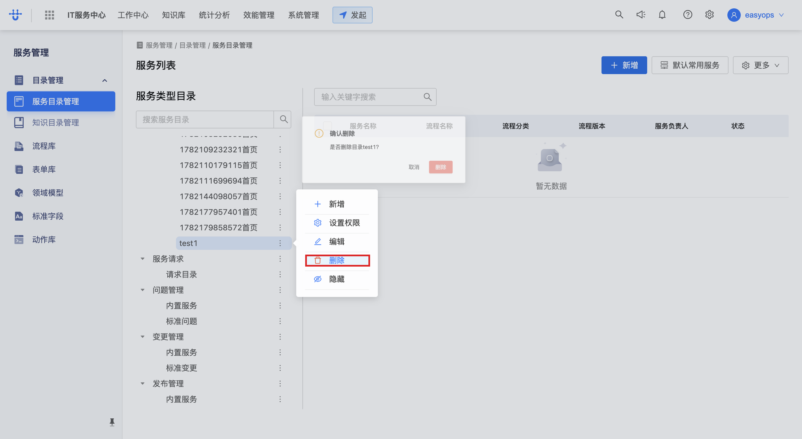

### 步骤 2：点击「删除」确认

<!-- url: itsc-service-management/setting-list?catalog=test1 | api: DELETE .../service_catalog/{id} | tag: 服务目录管理 | step_id: 84 -->

点击「删除」确认，删除该目录。
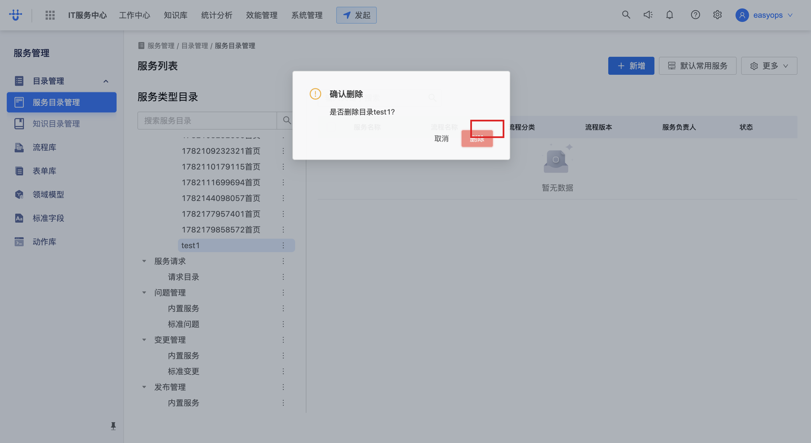

> 🔗 本步调用：`DELETE /next/api/gateway/logic.flowable_service/api/flowable_service/v1/service_catalog/{catalogId}`（详见 openapi.yaml 的「服务目录管理」）。

## 十三、默认常用服务

配置用户组默认可见的常用服务优先级。

### 步骤 1：点击「默认常用服务」

<!-- url: itsc-service-management/setting-list | step_id: 85 -->

在服务目录管理页点击「默认常用服务」页签，进入常用服务配置。
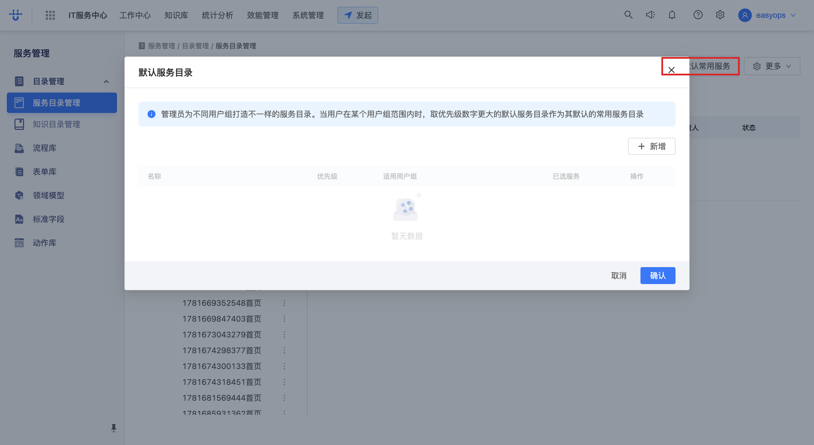

### 步骤 2：新增常用服务配置

<!-- url: itsc-service-management/setting-list | step_id: 86 -->

点击新增按钮，打开常用服务配置表单。
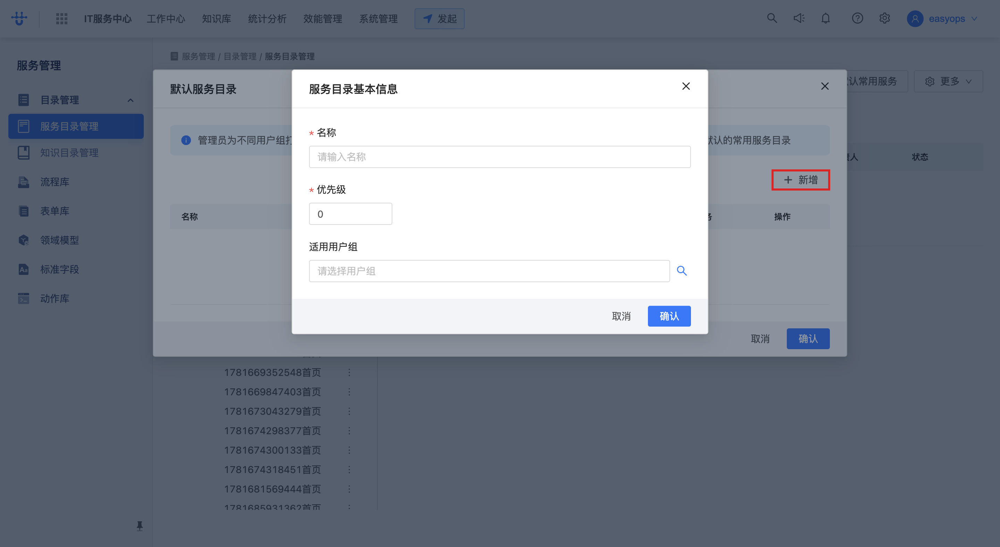

### 步骤 3：输入名称

<!-- url: itsc-service-management/setting-list | step_id: 87 -->

在「请输入名称」框中输入常用服务配置名称（如「test」）。
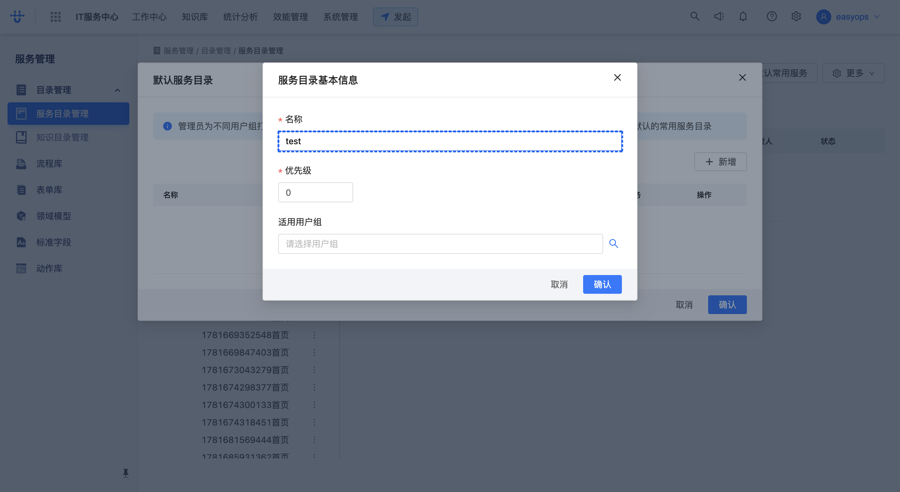

### 步骤 4：选择适用用户组

<!-- url: itsc-service-management/setting-list | api: POST .../object/USER_GROUP/_search | tag: 用户与用户组搜索 | step_id: 88 -->

点击「请选择用户组」，搜索并选中用户组（如 test）。

> 🔗 本步调用：`POST /next/api/gateway/cmdb.instance.PostSearch/object/USER_GROUP/instance/_search`（详见 openapi.yaml 的「用户与用户组搜索」）。

### 步骤 5：确认选择

<!-- url: itsc-service-management/setting-list | step_id: 90 -->

确认已选的用户组与优先级。
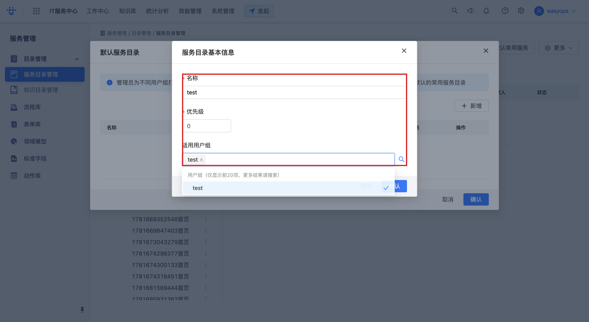

### 步骤 6：保存配置

<!-- url: itsc-service-management/setting-list | api: POST .../process_definition | tag: 流程与知识关联 | step_id: 91 -->

点击保存，提交常用服务配置。
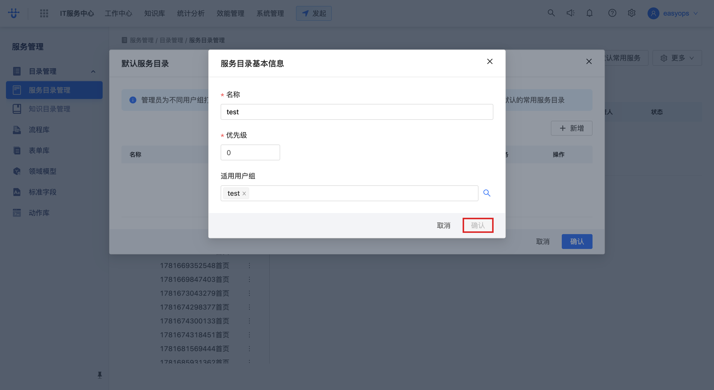

> 🔗 本步调用：`POST /next/api/gateway/logic.flowable_service/api/flowable_service/v1/process_definition`（常用服务配置，详见 openapi.yaml 的「流程与知识关联」）。

### 步骤 7：点击「服务目录」

<!-- url: itsc-service-management/setting-list | api: GET .../service_catalog | tag: 服务目录管理 | step_id: 92 -->

点击「服务目录」回到目录视图，刷新目录树与服务列表。
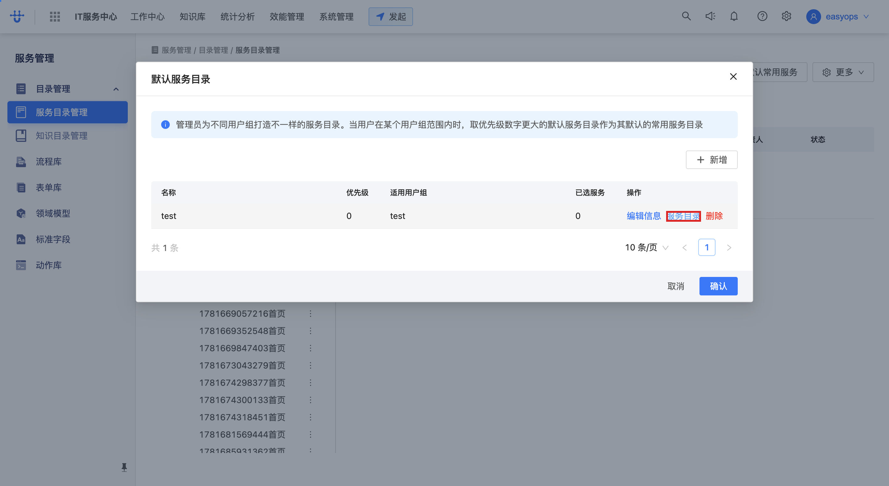

> 🔗 本步调用：`GET .../service_catalog` 与 `GET .../service_instance`。

### 步骤 8：点击「创建知识」

<!-- url: itsc-service-management/setting-list | step_id: 93 -->

点击「创建知识」，弹出创建确认框。
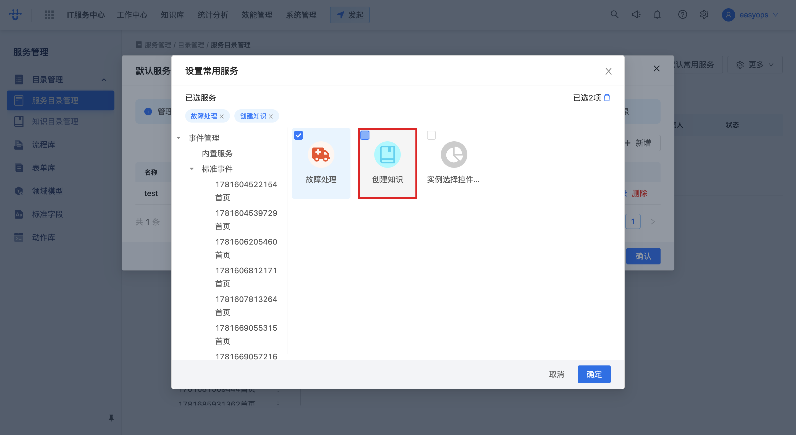

### 步骤 9：点击「确定」创建

<!-- url: itsc-service-management/setting-list | api: POST .../process_definition | tag: 流程与知识关联 | step_id: 94 -->

点击「确定」，创建知识条目。
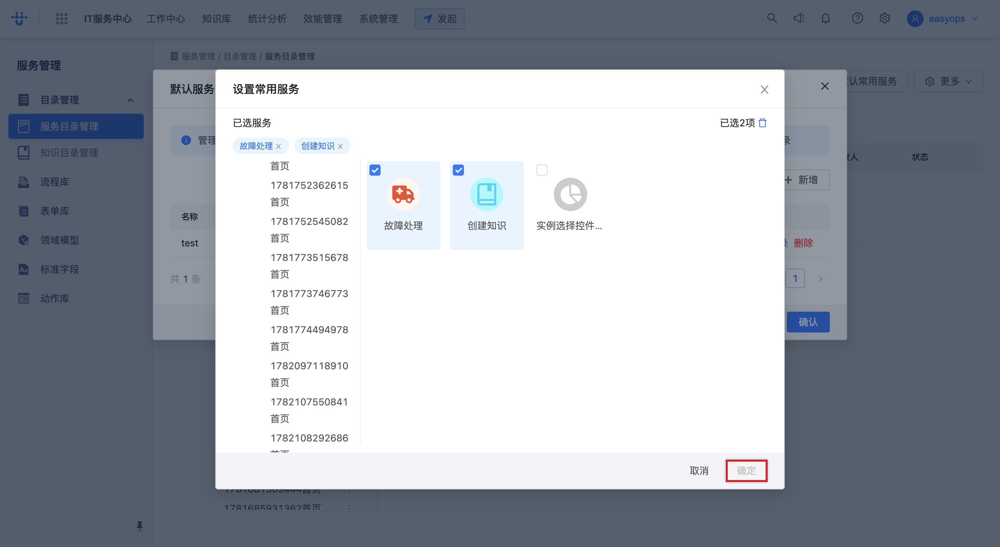

> 🔗 本步调用：`POST /next/api/gateway/logic.flowable_service/api/flowable_service/v1/process_definition`（详见 openapi.yaml 的「流程与知识关联」）。

## 附：本流程接口速查

| tag              | 方法   | 路径（简）                                                                                  | 用途                    | 步骤                 |
| ---------------- | ------ | ------------------------------------------------------------------------------------------- | ----------------------- | -------------------- |
| 服务目录管理     | GET    | `.../service_catalog.ListCatalog/api/flowable_service/v1/service_catalog`                 | 加载全部服务目录树      | 一-2、一-3、十四-1   |
| 服务目录管理     | POST   | `.../logic.flowable_service/api/flowable_service/v1/service_catalog`                      | 新建服务目录            | 三-5                 |
| 服务目录管理     | PUT    | `.../logic.flowable_service/api/flowable_service/v1/service_catalog/{id}`                 | 编辑目录/隐藏/显示      | 九-2、十一-1、十一-2 |
| 服务目录管理     | DELETE | `.../logic.flowable_service/api/flowable_service/v1/service_catalog/{id}`                 | 删除服务目录            | 十二-2               |
| 服务实例管理     | GET    | `.../service_catalog.ListService/api/flowable_service/v1/service_instance`                | 查询目录下服务列表      | 二-2、五-1           |
| 服务实例管理     | POST   | `.../logic.flowable_service/api/flowable_service/v2/service_instance`                     | 新建服务                | 四-11                |
| 服务实例管理     | POST   | `.../logic.flowable_service/api/flowable_service/v1/service_instance/sort`                | 服务排序                | 五-2                 |
| 服务实例管理     | DELETE | `.../logic.flowable_service/api/flowable_service/v1/service_instance/{id}`                | 删除服务                | 八-3                 |
| 服务导入导出     | POST   | `.../logic.flowable_service/api/flowable_service/v1/service_catalog/{id}/import`          | 导入服务                | 七-2                 |
| 目录权限         | POST   | `.../service_catalog.SetCatalogPermission/api/flowable_service/v1/set_catalog_permission` | 设置目录查看/操作权限   | 十-6                 |
| 用户与用户组搜索 | POST   | `.../cmdb.instance.PostSearch/object/USER/instance/_search`                               | 搜索用户（负责人/权限） | 四-6、十-2           |
| 用户与用户组搜索 | POST   | `.../cmdb.instance.PostSearch/object/USER_GROUP/instance/_search`                         | 搜索用户组              | 四-6、十-2、十三-4   |
| 流程与知识关联   | GET    | `.../process_definition_version.ListProcessDefinition/.../process_definition`             | 加载可选流程            | 四-4                 |
| 流程与知识关联   | GET    | `.../knowledge_base.ListKnowledge/.../knowledge_base/knowledge`                           | 搜索关联知识            | 四-10                |
| 流程与知识关联   | GET    | `.../trigger.ListTrigger/api/flowable_service/v1/trigger`                                 | 加载触发器              | 四-8                 |
| 流程与知识关联   | GET    | `.../logic.flowable_service/api/flowable_service/v1/knowledge_base/catalog_tree`          | 知识库目录树            | 四-2                 |
| 流程与知识关联   | POST   | `.../logic.flowable_service/api/flowable_service/v1/process_definition`                   | 默认常用服务/创建知识   | 十三-6、十四-3       |
