# ITSM 系统管理 · 流程管理 - 操作指引

> 适用场景：在 ITSM 工作台的「系统管理 -> 流程管理」中，完成流程的**新建、流程图编排（添加节点、配置变量/处理人/表单/通知）、保存发布版本、阶段设置、列表搜索、编辑、复制版本、设为主版本、表单绑定、版本删除**。看完即可独立创建并发布一个完整的工单流程。
> 配套接口：见同目录 [`ITSM-系统管理-流程管理-openapi.yaml`](./ITSM-系统管理-流程管理-openapi.yaml)。
>
> 截图标注图例：🔴红框=点击 / 🔵蓝虚线框=输入 / 🟠橙框+▾=下拉 / 🟣紫圈=单复选 / 🟢绿粗框=提交。
> ⚠️ 说明：流程编排涉及大量节点拖拽与属性填写，本指引按「创建流程 -> 编排节点 -> 配置节点 -> 保存版本 -> 阶段设置 -> 列表与版本管理」主线组织，重复的节点操作合并描述，关键动作配图。

## 目录
- [一、进入流程管理](#一进入流程管理)
- [二、新建流程](#二新建流程)
- [三、流程编排-添加节点](#三流程编排-添加节点)
- [四、节点配置-变量与表单](#四节点配置-变量与表单)
- [五、节点配置-处理人](#五节点配置-处理人)
- [六、保存并发布版本](#六保存并发布版本)
- [七、流程设置-表单与阶段](#七流程设置-表单与阶段)
- [八、流程列表搜索与编辑](#八流程列表搜索与编辑)
- [九、复制版本与设为主版本](#九复制版本与设为主版本)
- [十、表单绑定](#十表单绑定)
- [十一、版本管理与删除](#十一版本管理与删除)
- [附：本流程接口速查](#附本流程接口速查)

<!-- deep-links: 本流程关键页面直达（SPA 路径，去掉 host 前缀，参数化）
  工作台:         itsc-workbench/workbench
  流程列表:         itsc-process-manage/process-list
  带关键词搜索:      itsc-process-manage/process-list?q={关键词}&page=1
  流程编排页:        itsc-process-manage/process-create-v2/{processId}?activeTab=0
  版本创建页:        itsc-process-manage/{processId}/versionCreate-v2/{versionId}?activeTab={tab}
  流程详情页:        itsc-process-manage/detail/{processId}/{versionId}?activeKey=1
-->

## 一、进入流程管理

从工作台导航到流程管理页。

### 步骤 1：点击顶部「系统管理」
<!-- url: itsc-workbench/workbench | step_id: 1 -->
在工作台顶部导航栏点击「系统管理」，展开系统管理子菜单。

> 💡 提示：若已直接处于流程管理页，可跳过本段。

### 步骤 2：进入「服务管理」模块
<!-- url: itsc-service-management/setting-list | step_id: 2 -->
在系统管理菜单中点击进入「服务管理」模块。
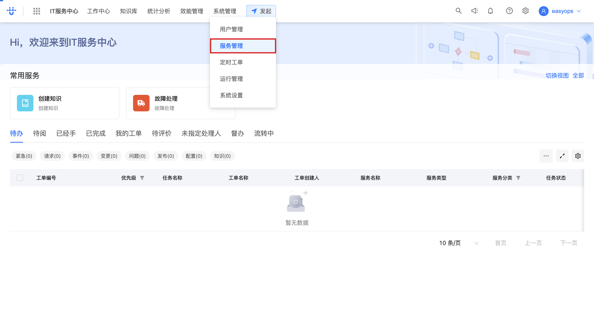

### 步骤 3：进入「流程管理」页签
<!-- url: itsc-process-manage/process-list | api: GET .../process_definition | tag: 流程列表与详情 | step_id: 3 -->
切换到「流程管理」页签，加载流程定义列表。
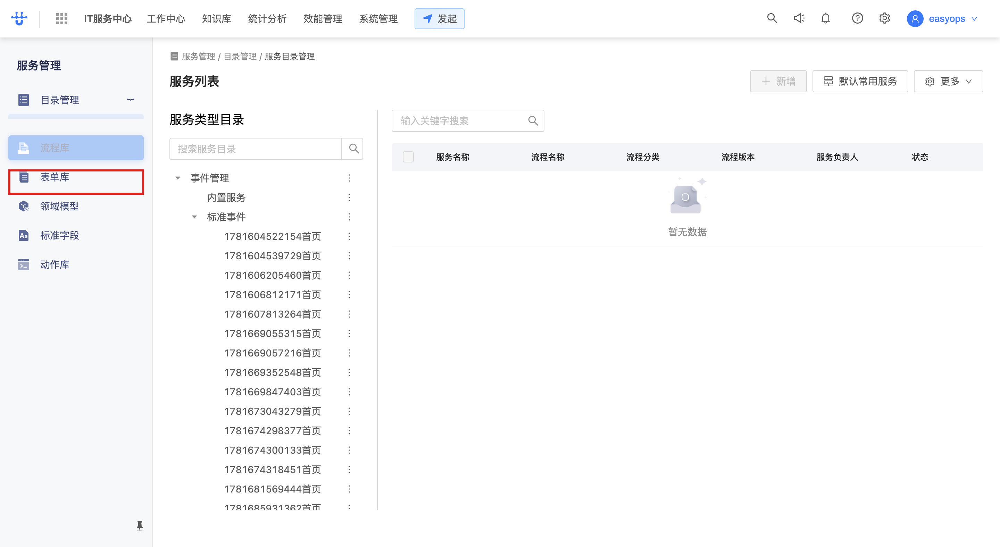
> 🔗 本步调用：`GET /next/api/gateway/flowable_service.process_definition_version.ListProcessDefinition/api/flowable_service/v1/process_definition`（详见 openapi.yaml 的「流程列表与详情」）。

## 二、新建流程

创建一个新的流程定义，填写基本信息并选择触发器。

### 步骤 1：点击「新增」
<!-- url: itsc-process-manage/process-list | api: GET .../trigger | tag: 触发器与表单 | step_id: 4 -->
点击「新增」按钮，打开新建流程对话框，并加载可选触发器。
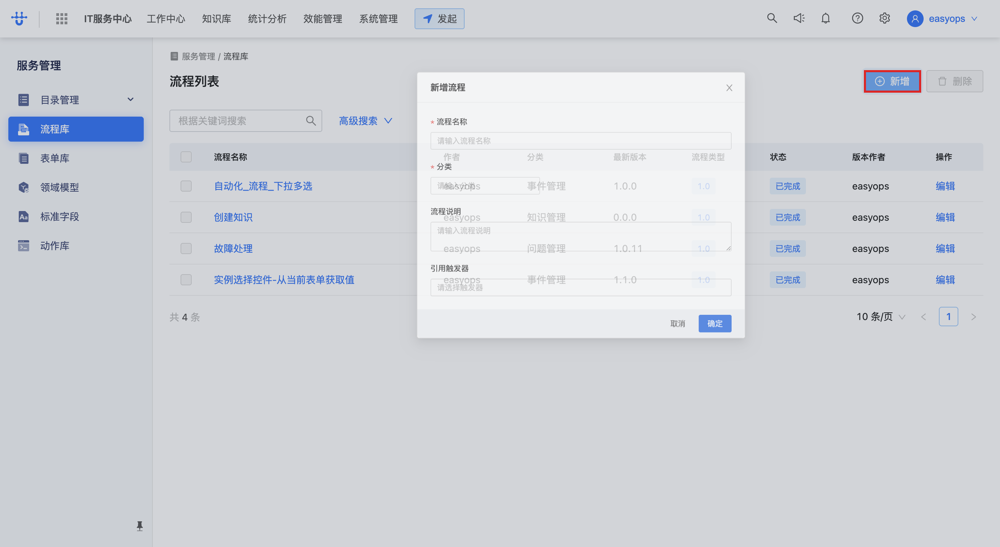
> 🔗 本步调用：`GET /next/api/gateway/flowable_service.trigger.ListTrigger/api/flowable_service/v1/trigger`（详见 openapi.yaml 的「触发器与表单」）。

### 步骤 2：输入流程名称并选择分类
<!-- url: itsc-process-manage/process-list | step_id: 6 -->
在「请输入流程名称」框输入名称（如「test」），选择流程分类（如「事件管理」）。
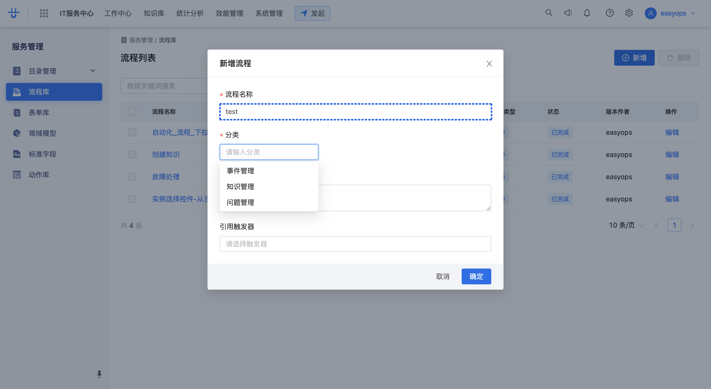

### 步骤 3：选择流程分类「事件管理」
<!-- url: itsc-process-manage/process-list | step_id: 7 -->
在分类下拉中选择「事件管理」。
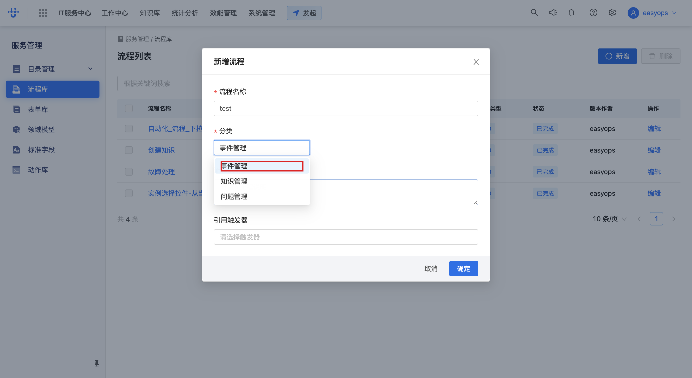

### 步骤 4：输入流程说明
<!-- url: itsc-process-manage/process-list | step_id: 13 -->
在「请输入流程说明」框输入说明（如「info」）。
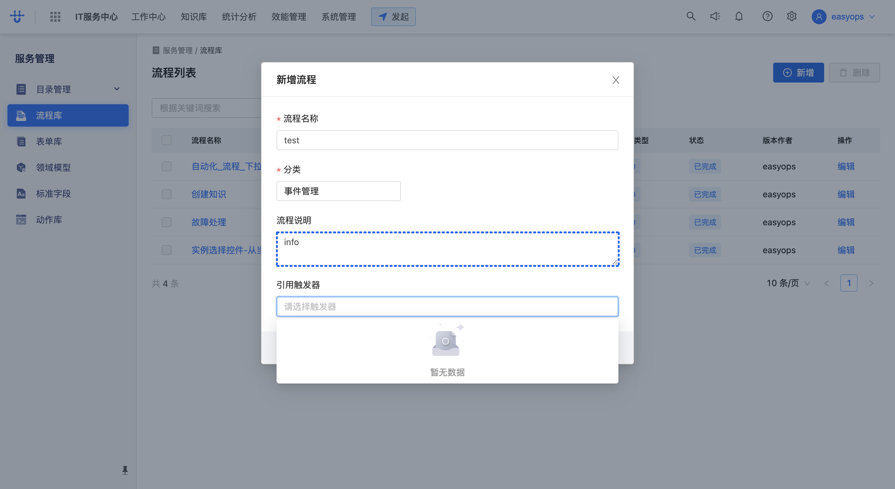

### 步骤 5：选择触发器
<!-- url: itsc-process-manage/process-list | step_id: 14 -->
点击「引用触发器」下拉，选择该流程的触发器。
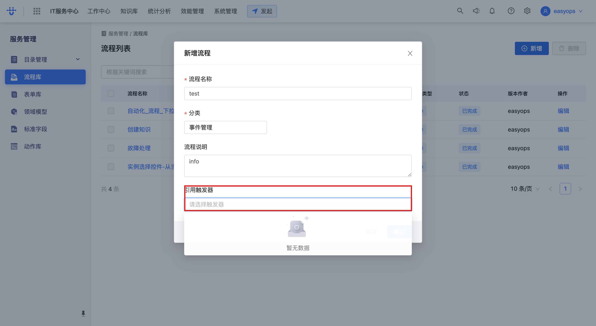

### 步骤 6：点击「确定」创建流程
<!-- url: itsc-process-manage/process-create-v2/{processId}?activeTab=0 | api: POST .../process_definition | tag: 流程创建与编辑 | step_id: 15 -->
点击「确定」，创建流程并进入流程编排页。
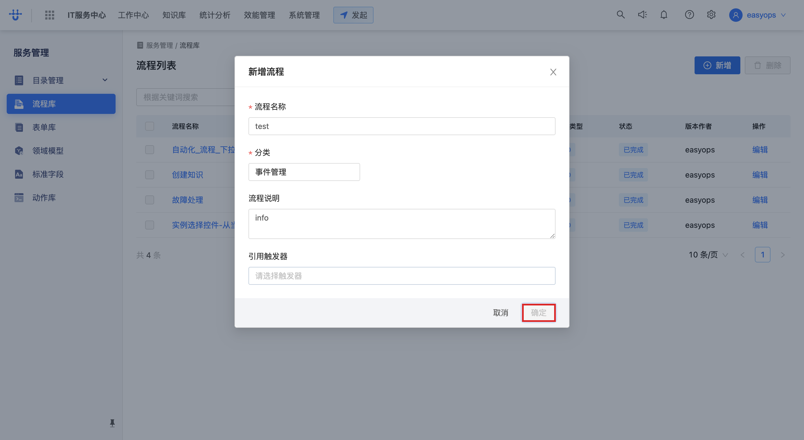
> 🔗 本步调用：`POST /next/api/gateway/logic.flowable_service/api/flowable_service/v1/process_definition`（详见 openapi.yaml 的「流程创建与编辑」）。

## 三、流程编排-添加节点

在流程图画布上从「开始」节点起，依次拖入各业务节点。

### 步骤 1：点击「开始」节点
<!-- url: itsc-process-manage/process-create-v2/{processId} | api: POST .../GetJumpableNodes | tag: 流程节点编排 | step_id: 18 -->
点击画布上的「开始」节点，加载可跳转节点（编排辅助）。
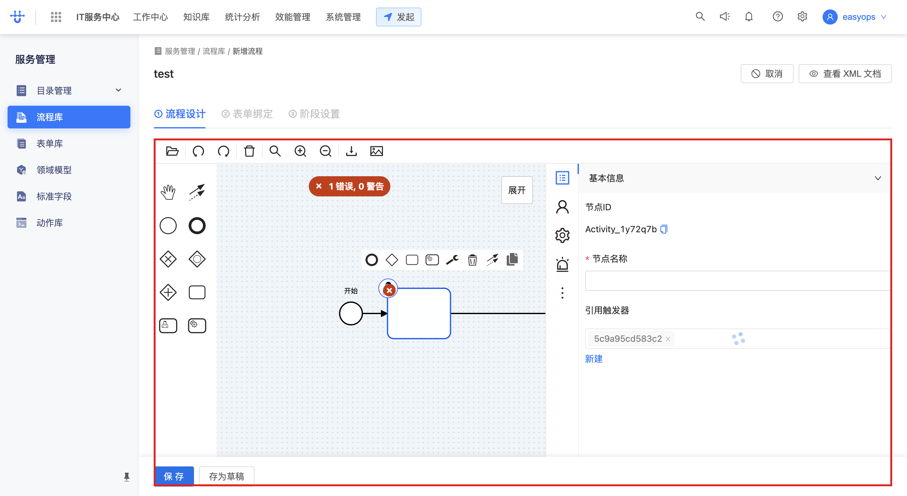
> 🔗 本步调用：`POST .../GetJumpableNodes`、`GetNextNodes`、`GetPreviousNodes`（详见 openapi.yaml 的「流程节点编排」），传 bpmnXML 与 userTaskId。

### 步骤 2：添加「发起」节点并命名
<!-- url: itsc-process-manage/process-create-v2/{processId} | step_id: 19 -->
从节点面板拖入一个节点，在节点命名处输入「发起」。
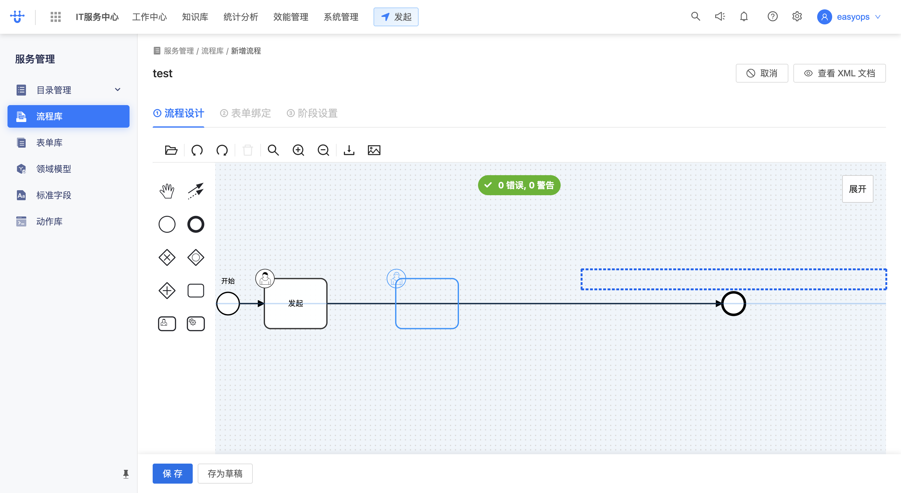

### 步骤 3：依次添加「人工处理/验收/自动处理」节点
<!-- url: itsc-process-manage/process-create-v2/{processId} | step_id: 25 -->
继续拖入人工处理、验收、自动处理节点，连线形成主流程。页面顶部「N 错误, M 警告」实时反映校验结果。
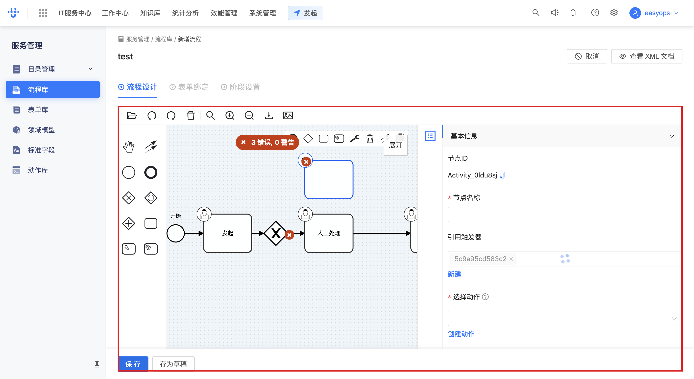
> 💡 提示：每添加一个节点都会触发 GetNextNodes/GetPreviousNodes 校验上下游连通性，需消到 0 错误才可保存。

### 步骤 4：调整节点连线
<!-- url: itsc-process-manage/process-create-v2/{processId} | step_id: 28 -->
拖拽连线调整节点顺序与分支（如自动处理后接人工处理）。
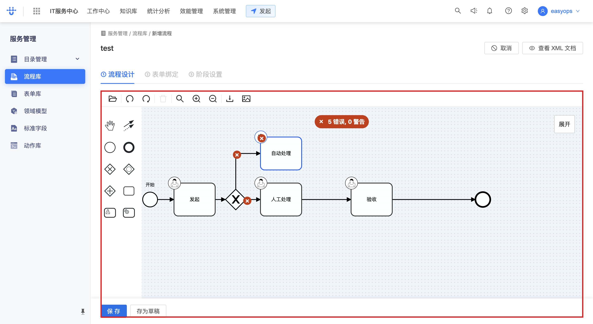

## 四、节点配置-变量与表单

为各节点配置流程变量、通知模板与表单。

### 步骤 1：为「自动处理」节点添加变量
<!-- url: itsc-process-manage/process-create-v2/{processId} | step_id: 40 -->
选中自动处理节点，在「请输入变量名」框输入变量名（如「pass」），点击「添加」。
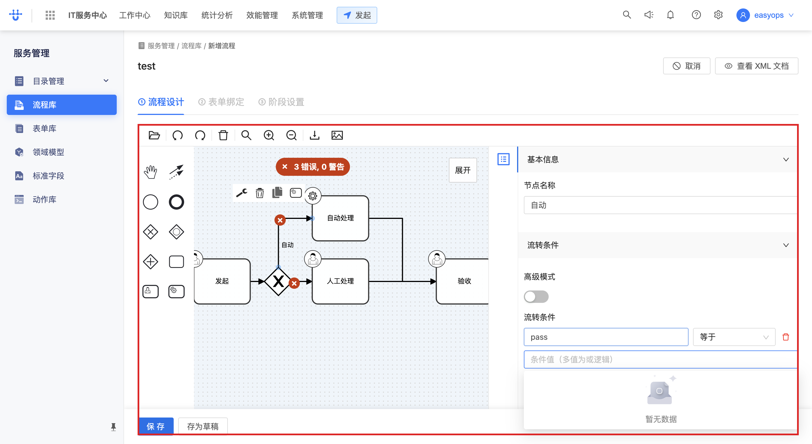

### 步骤 2：为「人工处理」节点添加变量
<!-- url: itsc-process-manage/process-create-v2/{processId} | step_id: 56 -->
选中人工处理节点，同样添加变量（如「pass」）。
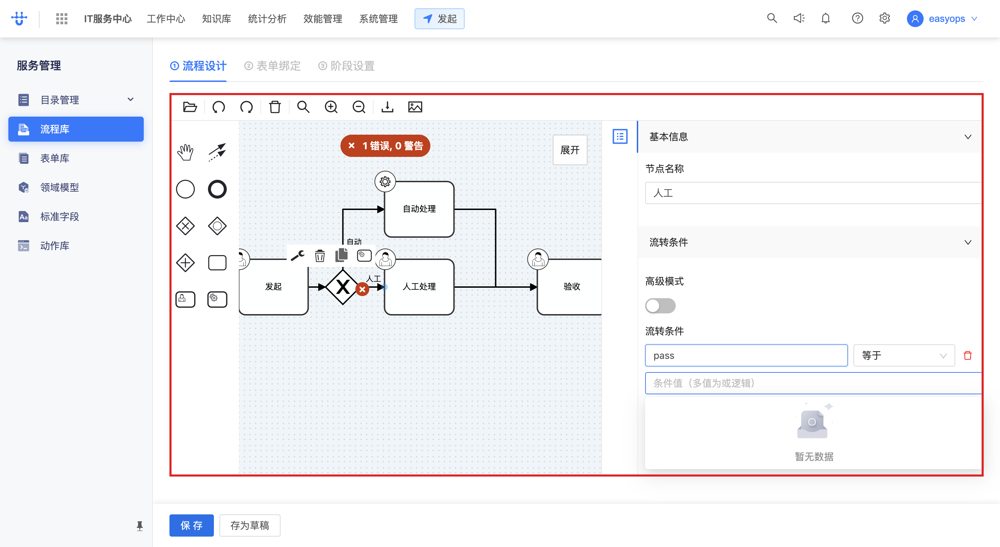

### 步骤 3：选择通知模板
<!-- url: itsc-process-manage/process-create-v2/{processId} | step_id: 63 -->
在节点通知配置中选择通知模板（如「事件管理流程-SLA升级通知」）。
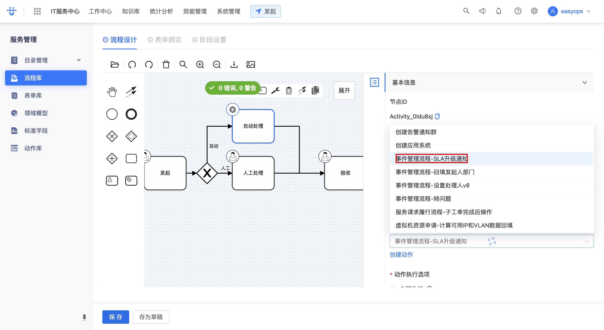

### 步骤 4：选择节点表单
<!-- url: itsc-process-manage/process-create-v2/{processId} | api: POST .../QueryCMDBInstanceV2 | tag: 用户与CMDB查询 | step_id: 65 -->
选择「使用流程表单值」并绑定表单（如 test001），触发 CMDB 实例查询。
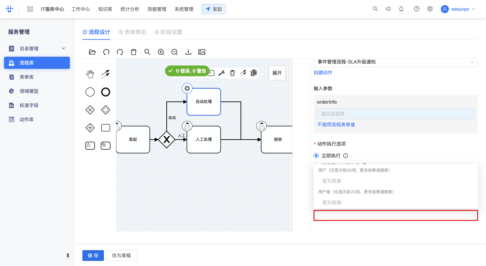
> 🔗 本步调用：`POST /next/api/gateway/flowable_service.assistant.QueryCMDBInstanceV2/api/flowable_service/v1/...`（详见 openapi.yaml 的「用户与CMDB查询」）。

## 五、节点配置-处理人

为人工节点配置处理人（指定用户/用户组）。

### 步骤 1：点击「添加人员」
<!-- url: itsc-process-manage/process-create-v2/{processId} | step_id: 70 -->
选中人工处理节点，点击「添加人员」，选择「指定用户(组)」。
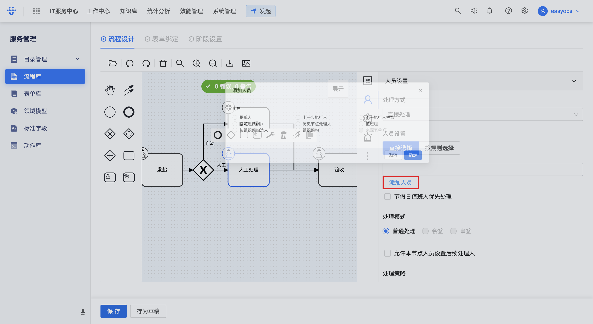

### 步骤 2：搜索并选中用户/用户组
<!-- url: itsc-process-manage/process-create-v2/{processId} | api: POST .../object/USER/_search | tag: 用户与CMDB查询 | step_id: 73 -->
在选人框中搜索用户（如 easyops、test_ping_user）并勾选。
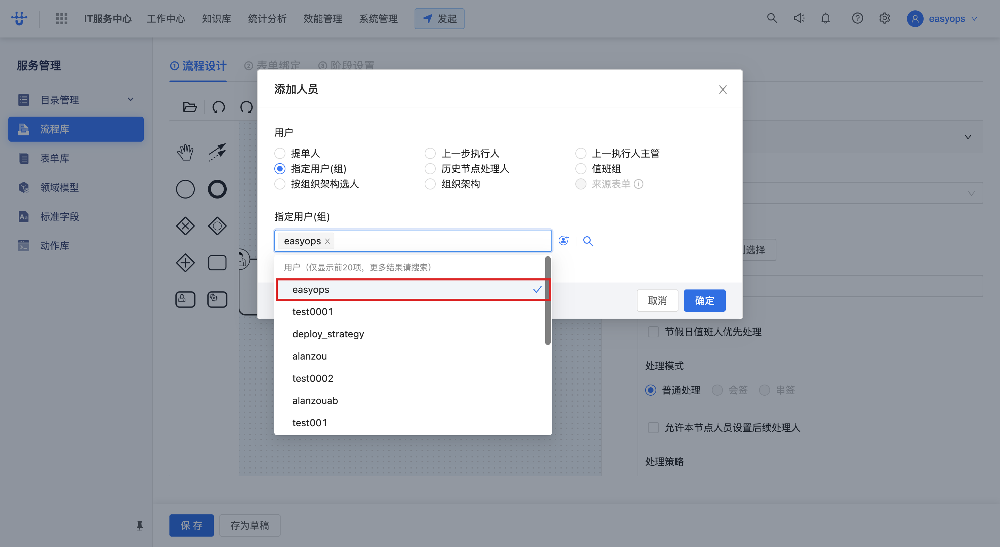
> 🔗 本步调用：`POST .../object/USER/instance/_search` 与 `.../USER_GROUP/instance/_search`（详见 openapi.yaml 的「用户与CMDB查询」）。

### 步骤 3：确认处理人范围
<!-- url: itsc-process-manage/process-create-v2/{processId} | step_id: 75 -->
在人员类型中选择「指定用户(组)」，确认处理人列表，点击「确定」。
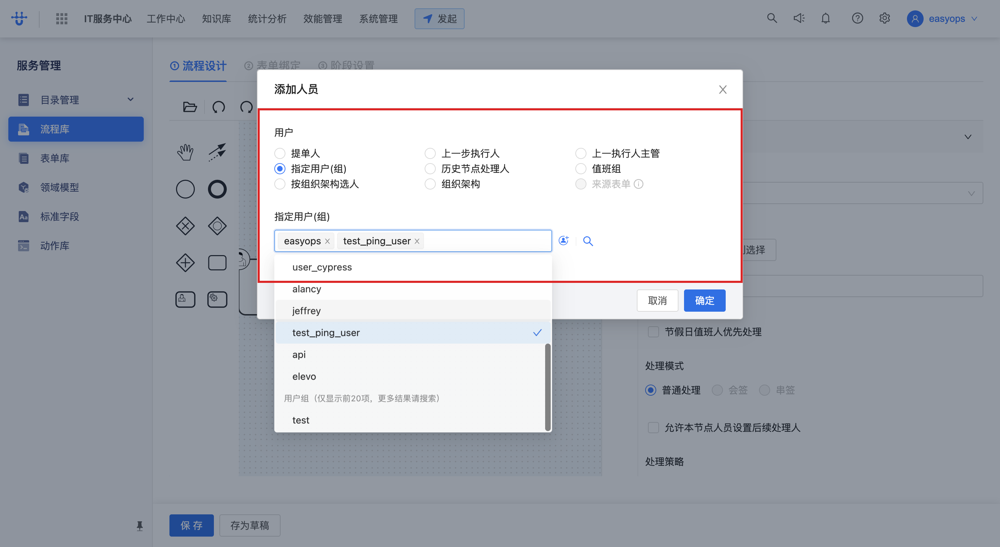

### 步骤 4：配置退回节点
<!-- url: itsc-process-manage/process-create-v2/{processId} | step_id: 78 -->
在节点属性中配置「退回」目标（如退回至「发起」节点）。
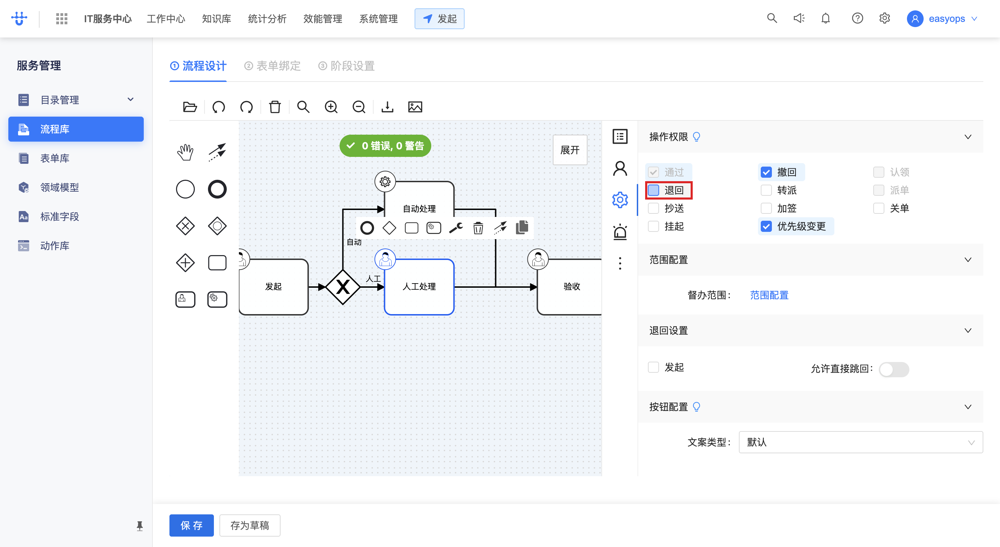

## 六、保存并发布版本

编排完成后保存并发布首个版本。

### 步骤 1：点击「保存」
<!-- url: itsc-process-manage/process-create-v2/{processId} | step_id: 88 -->
点击页面「保 存」按钮，弹出版本发布对话框。
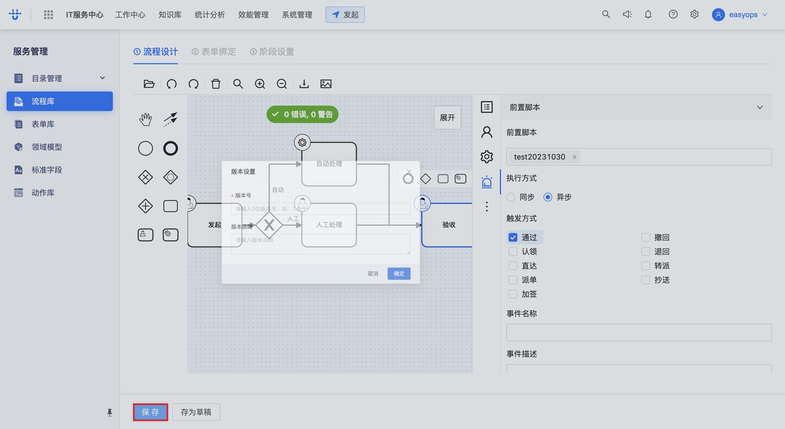

### 步骤 2：输入版本号
<!-- url: itsc-process-manage/process-create-v2/{processId} | step_id: 90 -->
在「请输入3位版本号，如：1.0.1」框输入版本号（如「1.0.0」）。
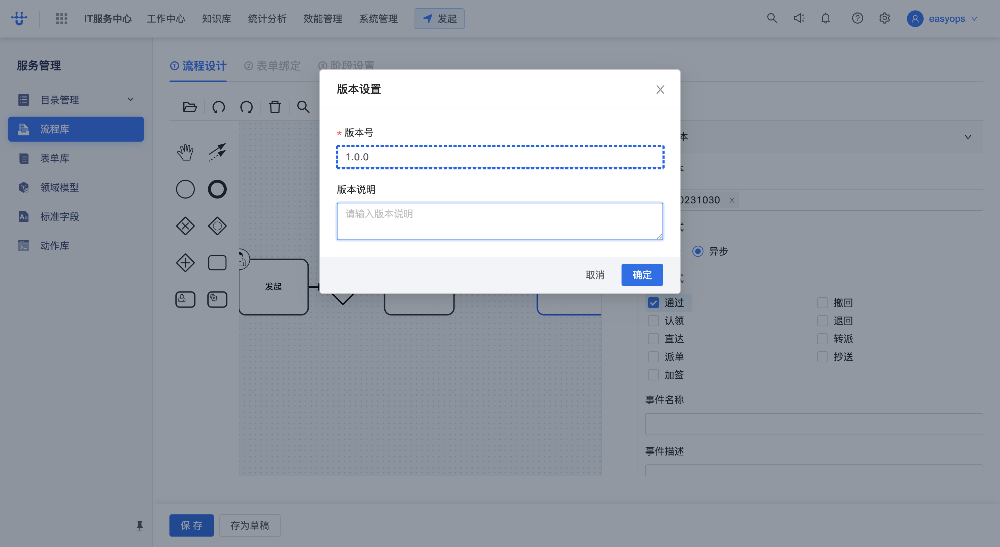
> 💡 提示：输入过程不截图，此处展示输入完成后的状态。

### 步骤 3：输入版本说明
<!-- url: itsc-process-manage/process-create-v2/{processId} | step_id: 96 -->
在「请输入版本说明」框输入说明（如「init」）。
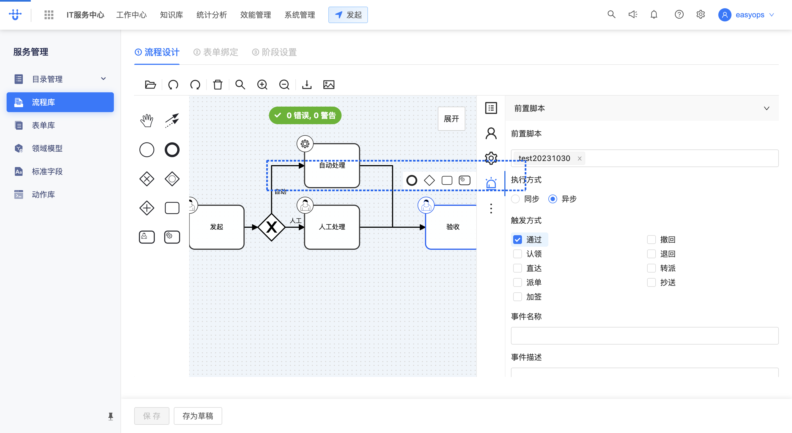

### 步骤 4：点击「确定」发布版本
<!-- url: itsc-process-manage/process-create-v2/{processId} | api: POST .../v2/process_definition_version | tag: 流程版本保存与发布 | step_id: 97 -->
点击「确定」，保存流程版本（bpmnXML + memo + state）。
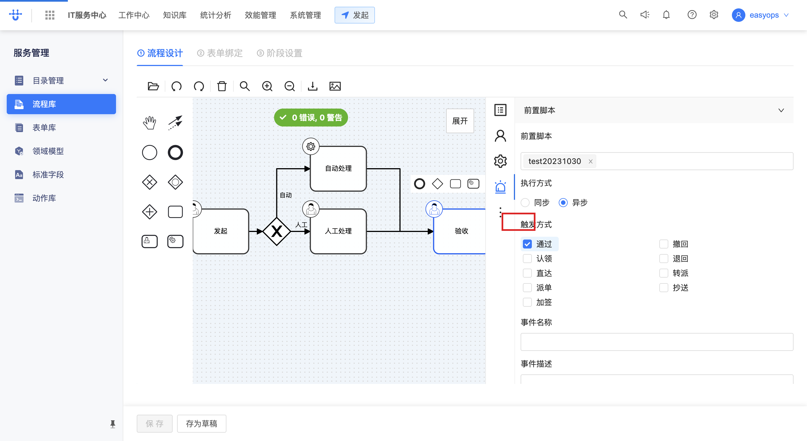
> 🔗 本步调用：`POST /next/api/gateway/logic.flowable_service/api/flowable_service/v2/process_definition_version`（详见 openapi.yaml 的「流程版本保存与发布」），提交 bpmnXML、memo、state。

## 七、流程设置-表单与阶段

发布后进入流程设置，绑定表单并配置阶段。

### 步骤 1：进入「设置」绑定表单
<!-- url: itsc-process-manage/{processId}/versionCreate-v2/{versionId} | api: GET .../ListFormSchema | tag: 触发器与表单 | step_id: 98 -->
点击「设置」页签，选择流程表单（如「自动化_表单_下拉多选」）。
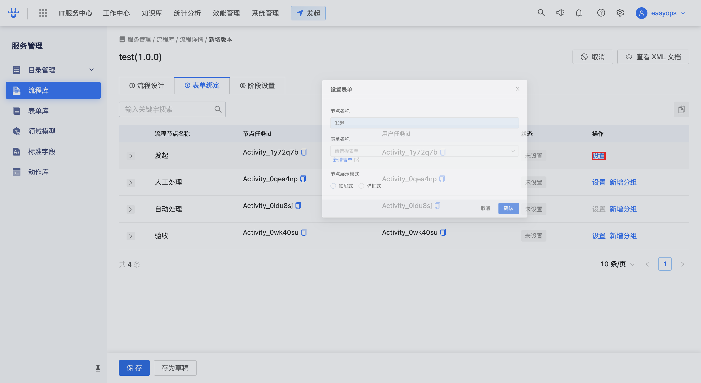
> 🔗 本步调用：`GET /next/api/gateway/flowable_service.form_schema_version.ListFormSchema/api/flowable_service/v1/...`（详见 openapi.yaml 的「触发器与表单」），加载可选表单。

### 步骤 2：确认表单绑定
<!-- url: itsc-process-manage/{processId}/versionCreate-v2/{versionId} | step_id: 100 -->
选定表单后点击「确认」。
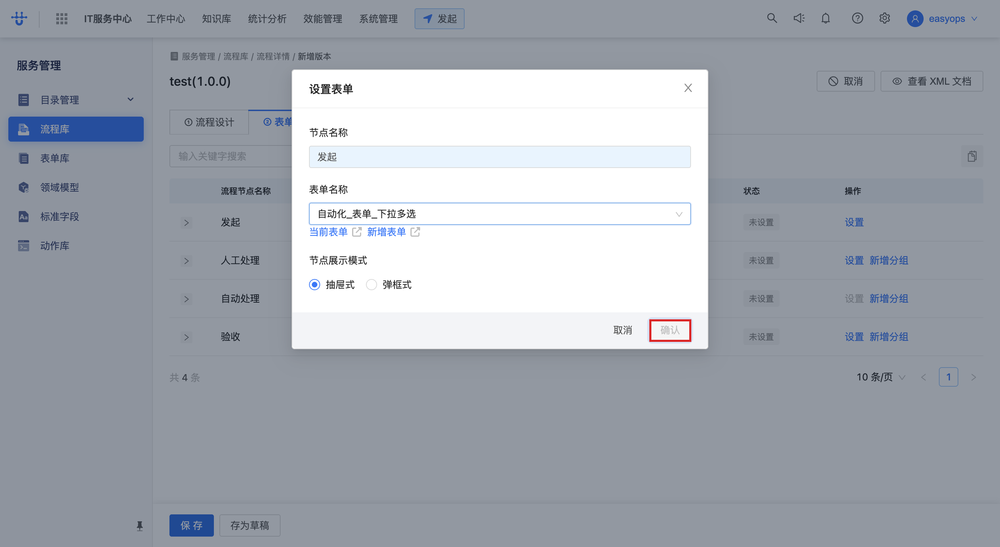

### 步骤 3：进入「阶段设置」
<!-- url: itsc-process-manage/{processId}/versionCreate-v2/{versionId} | step_id: 101 -->
点击「③ 阶段设置」页签。
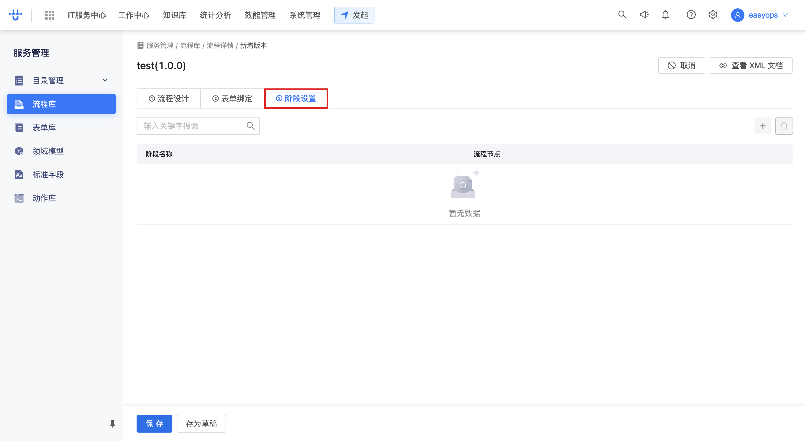

### 步骤 4：添加「处理」阶段并关联节点
<!-- url: itsc-process-manage/{processId}/versionCreate-v2/{versionId} | step_id: 105 -->
点击「添加」，输入阶段名称（如「处理」），并勾选该阶段包含的流程节点（人工处理、自动处理）。
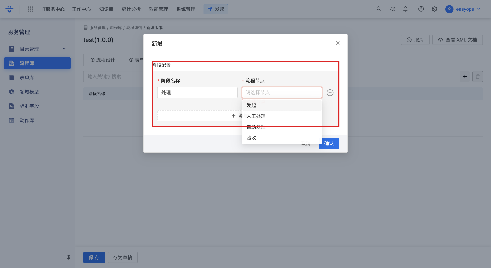

### 步骤 5：添加「验收」阶段
<!-- url: itsc-process-manage/{processId}/versionCreate-v2/{versionId} | step_id: 111 -->
继续添加阶段（如「验收」），勾选对应节点。
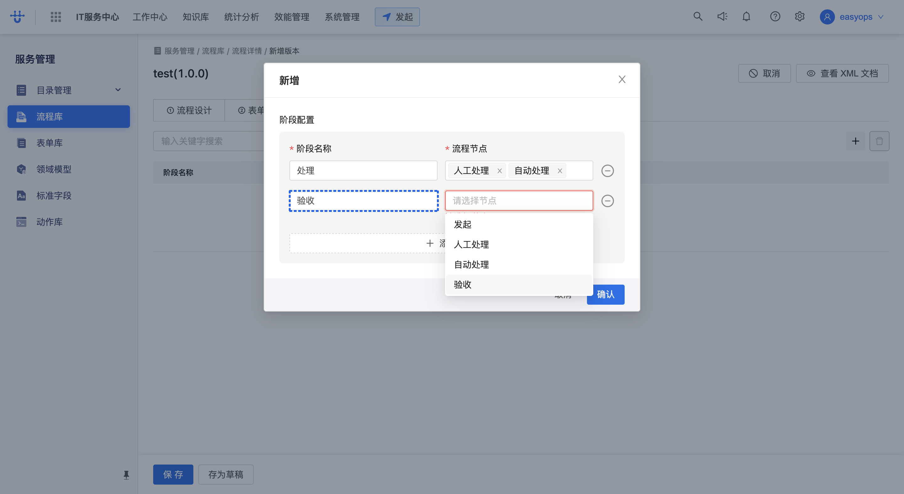

### 步骤 6：添加「发起」阶段并确认
<!-- url: itsc-process-manage/{processId}/versionCreate-v2/{versionId} | api: PUT .../process_definition_version | tag: 流程版本保存与发布 | step_id: 121 -->
添加「发起」阶段，完成后点击「确认」保存阶段配置。
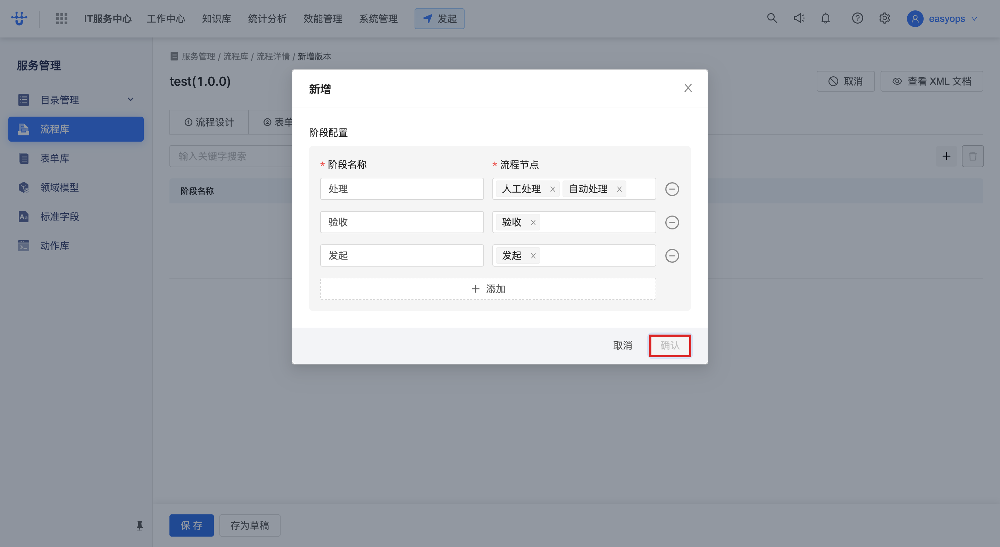
> 🔗 本步调用：`PUT /next/api/gateway/logic.flowable_service/api/flowable_service/v1/process_definition_version/...`（详见 openapi.yaml 的「流程版本保存与发布」）。

### 步骤 7：保存并输入新版本说明
<!-- url: itsc-process-manage/{processId}/versionCreate-v2/{versionId} | step_id: 122 -->
点击「保 存」，弹出版本说明输入框。
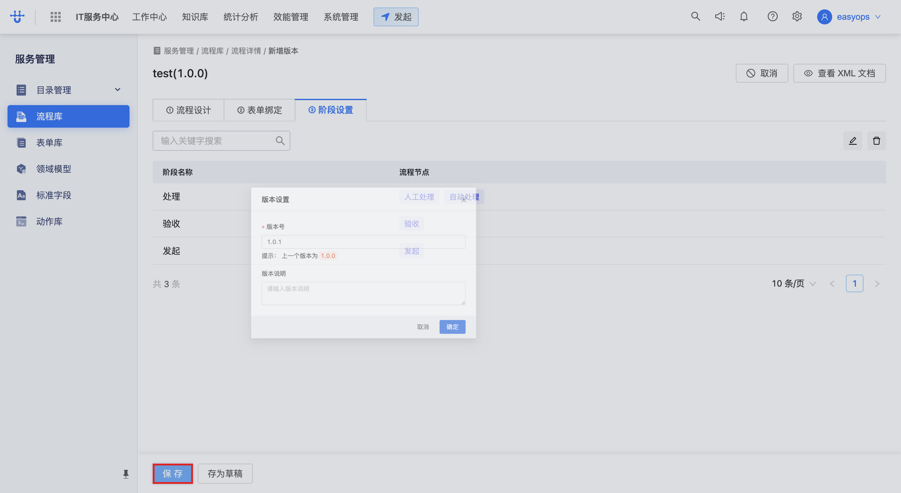

### 步骤 8：输入版本说明
<!-- url: itsc-process-manage/{processId}/versionCreate-v2/{versionId} | step_id: 147 -->
在版本说明框输入（如「设置表单\阶段」）。
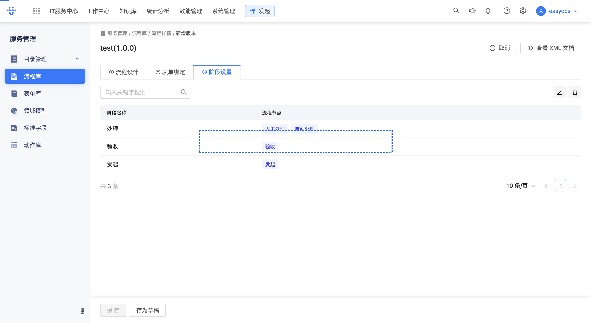

### 步骤 9：点击「确定」发布
<!-- url: itsc-process-manage/{processId}/versionCreate-v2/{versionId} | api: PUT .../SaveProcessDefinitionVersion | tag: 流程版本保存与发布 | step_id: 149 -->
点击「确定」保存为新版本。
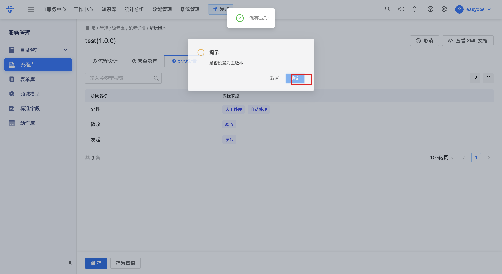
> 🔗 本步调用：`PUT /next/api/gateway/flowable_service.process_definition_version.SaveProcessDefinitionVersion/...`（详见 openapi.yaml 的「流程版本保存与发布」）。

## 八、流程列表搜索与编辑

返回列表，搜索并编辑流程基本信息。

### 步骤 1：返回流程列表
<!-- url: itsc-process-manage/process-list | step_id: 150 -->
点击面包屑（breadcrumb）返回流程列表。
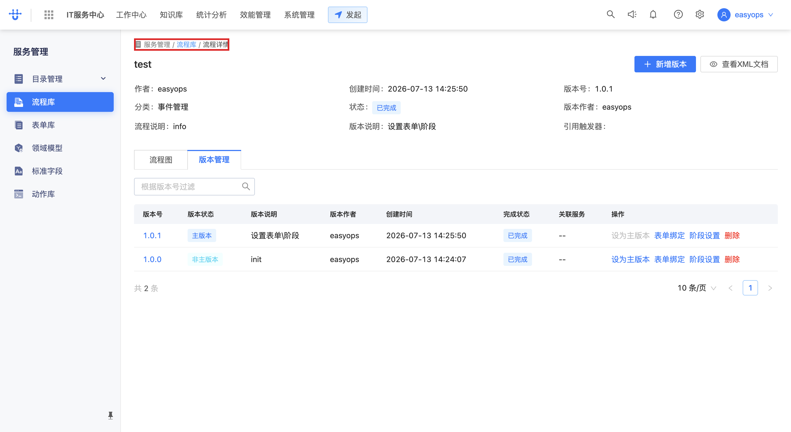

### 步骤 2：搜索流程
<!-- url: itsc-process-manage/process-list?q={关键词} | api: GET .../process_definition | tag: 流程列表与详情 | step_id: 153 -->
在「根据关键词搜索」框输入关键词（如「test」），过滤流程列表。
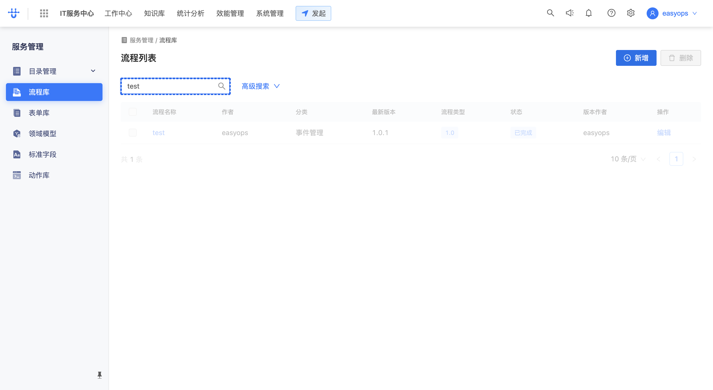
> 🔗 本步调用：`GET .../process_definition`（带 q 参数）。

### 步骤 3：高级搜索
<!-- url: itsc-process-manage/process-list?q=test&visible={true|false} | step_id: 154 -->
点击「高级搜索」，可按可见性（visible=true/false）等条件筛选。
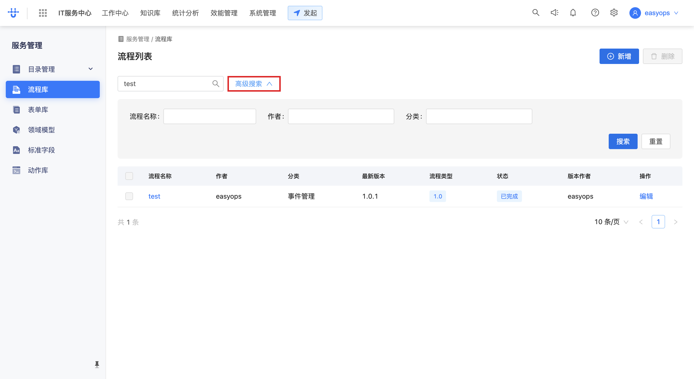

### 步骤 4：编辑流程名称并保存
<!-- url: itsc-process-manage/process-list | api: PUT .../v2/process_definition | tag: 流程创建与编辑 | step_id: 158 -->
点击流程的「编辑」，修改流程名称（如改为「test_01」）并点击「保存」。
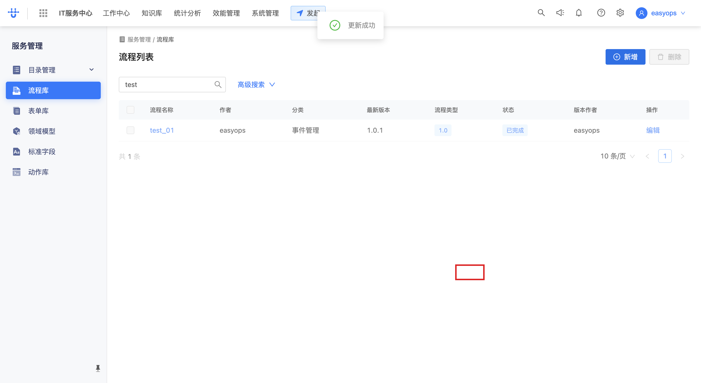
> 🔗 本步调用：`PUT /next/api/gateway/logic.flowable_service/api/flowable_service/v2/process_definition`（name/category/memo/triggerIdList 等，详见 openapi.yaml 的「流程创建与编辑」）。

## 九、复制版本与设为主版本

基于已有版本创建新版本，并设为主版本。

### 步骤 1：进入流程详情
<!-- url: itsc-process-manage/detail/{processId}/{versionId} | step_id: 159 -->
点击流程名进入详情页，查看版本列表。
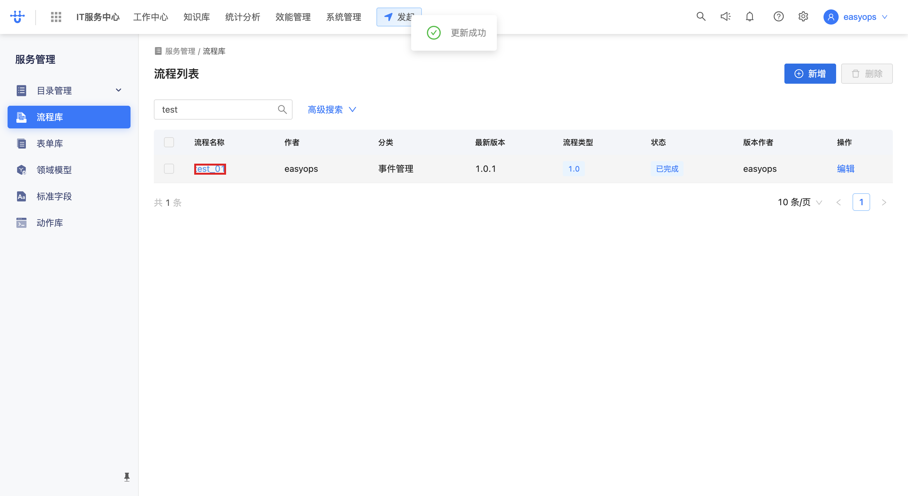

### 步骤 2：复制版本并编辑节点
<!-- url: itsc-process-manage/{processId}/versionCreate-v2/{versionId} | step_id: 164 -->
进入某版本的复制编辑页，可修改节点（如新增「提单」节点）后点击「保 存」。
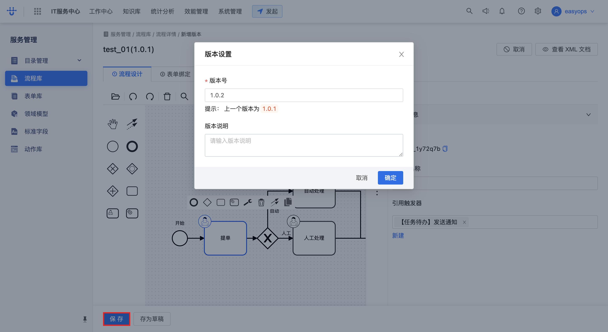

### 步骤 3：保存新版本
<!-- url: itsc-process-manage/{processId}/versionCreate-v2/{versionId} | api: POST .../process_definition_version | tag: 流程版本保存与发布 | step_id: 165 -->
输入版本说明后点击「确定」保存为新版本。
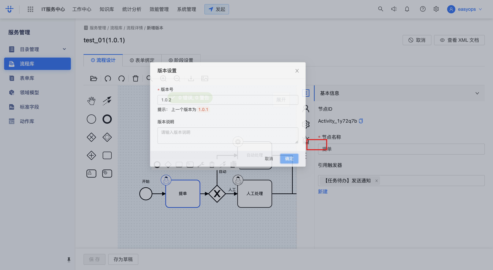
> 🔗 本步调用：`POST .../process_definition_version`（详见 openapi.yaml 的「流程版本保存与发布」）。

### 步骤 4：设为主版本
<!-- url: itsc-process-manage/{processId}/versionCreate-v2/{versionId} | api: PUT .../SaveProcessDefinitionVersion | tag: 流程版本保存与发布 | step_id: 167 -->
点击「设为主版本」，将该版本置为流程的当前生效版本。
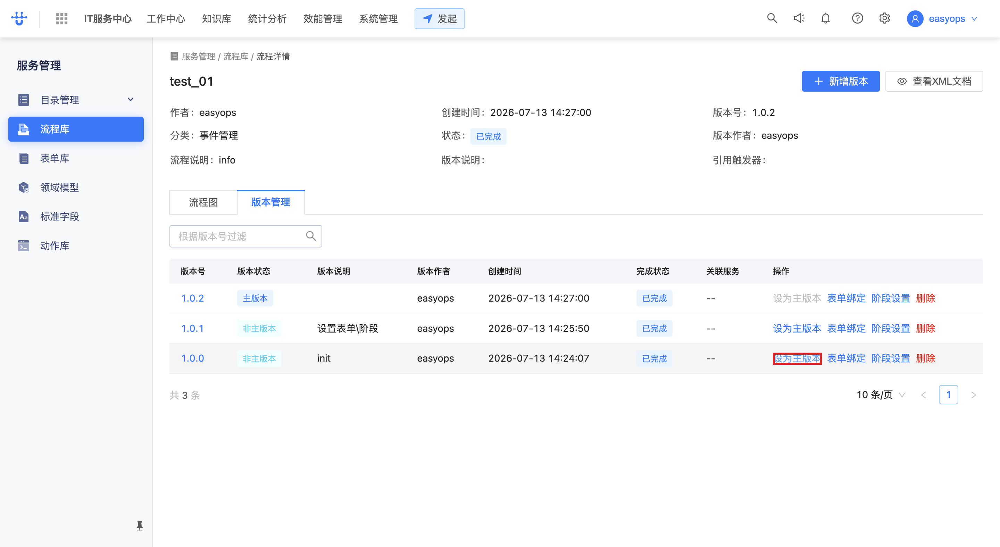
> 🔗 本步调用：`PUT /next/api/gateway/flowable_service.process_definition_version.SaveProcessDefinitionVersion/...`（详见 openapi.yaml 的「流程版本保存与发布」）。

## 十、表单绑定

为流程版本绑定表单。

### 步骤 1：进入「表单绑定」->「设置」
<!-- url: itsc-process-manage/{processId}/edit/{versionId}/binding-form-v2 | step_id: 169 -->
在详情页点击「表单绑定」->「设置」。
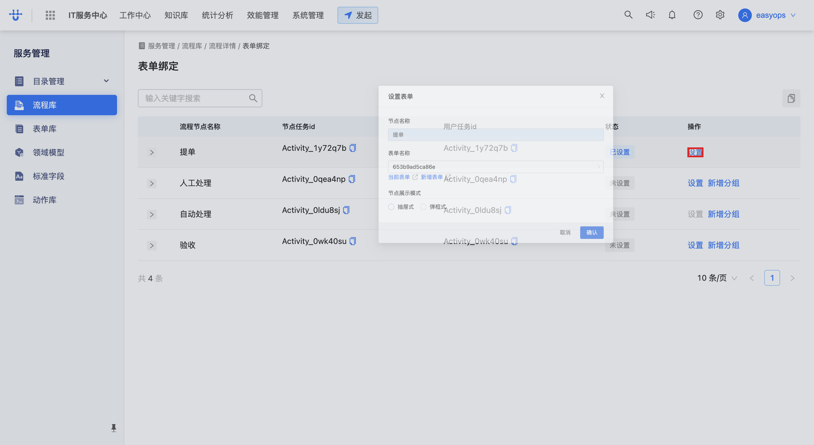

### 步骤 2：选择表单并确认
<!-- url: itsc-process-manage/{processId}/edit/{versionId}/binding-form-v2 | api: POST .../SaveProcessDefinitionVersion | tag: 流程版本保存与发布 | step_id: 170 -->
选择要绑定的表单后点击「确认」。
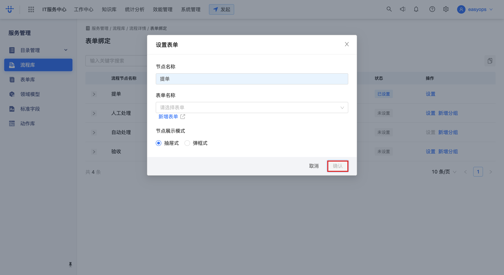
> 🔗 本步调用：`POST .../SaveProcessDefinitionVersion`（详见 openapi.yaml 的「流程版本保存与发布」）。

## 十一、版本管理与删除

在版本管理中删除某个版本。

### 步骤 1：进入「版本管理」
<!-- url: itsc-process-manage/detail/{processId}/{versionId} | step_id: 172 -->
在详情页点击「版本管理」页签，查看全部版本。
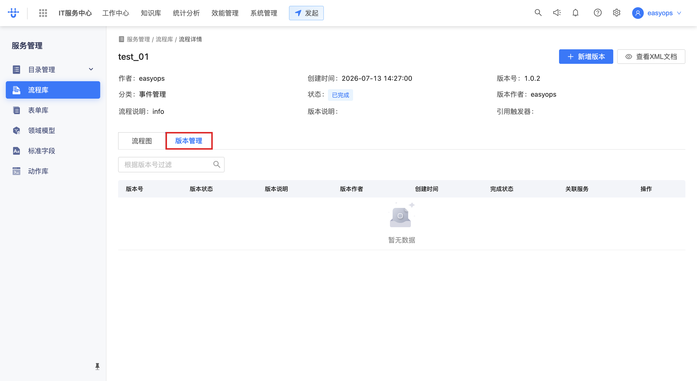

### 步骤 2：删除版本
<!-- url: itsc-process-manage/detail/{processId}/{versionId} | api: DELETE .../DeleteProcessDefinitionVersion | tag: 流程版本删除 | step_id: 174 -->
点击某版本的「删除」，在确认框点击「确定」删除该版本。
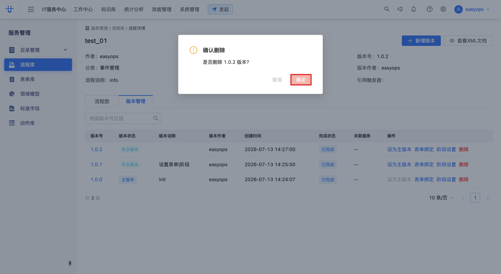
> 🔗 本步调用：`DELETE /next/api/gateway/flowable_service.process_definition_version.DeleteProcessDefinitionVersion/...`（详见 openapi.yaml 的「流程版本删除」）。

## 附：本流程接口速查

| tag | 方法 | 路径（简） | 用途 | 步骤 |
| --- | --- | --- | --- | --- |
| 流程列表与详情 | GET | `.../process_definition_version.ListProcessDefinition/.../process_definition` | 流程列表/搜索 | 一-3、八-2 |
| 流程创建与编辑 | POST | `.../logic.flowable_service/.../process_definition` | 新建流程 | 二-6 |
| 流程创建与编辑 | PUT | `.../logic.flowable_service/.../v2/process_definition` | 编辑流程基本信息 | 八-4 |
| 流程版本保存与发布 | POST | `.../logic.flowable_service/.../v2/process_definition_version` | 保存流程版本（bpmnXML） | 六-4、九-3 |
| 流程版本保存与发布 | PUT | `.../process_definition_version.SaveProcessDefinitionVersion/...` | 保存阶段/设为主版本/表单绑定 | 七-6、七-9、九-4、十-2 |
| 流程版本删除 | DELETE | `.../process_definition_version.DeleteProcessDefinitionVersion/...` | 删除流程版本 | 十一-2 |
| 流程节点编排 | POST | `.../process_definition_version.GetNextNodes/...` | 查询后继节点 | 三-1 |
| 流程节点编排 | POST | `.../process_definition_version.GetPreviousNodes/...` | 查询前置节点 | 三-1 |
| 流程节点编排 | POST | `.../process_definition_version.GetJumpableNodes/...` | 查询可跳转节点 | 三-1 |
| 触发器与表单 | GET | `.../trigger.ListTrigger/.../trigger` | 加载触发器 | 二-1 |
| 触发器与表单 | GET | `.../form_schema_version.ListFormSchema/...` | 加载可选表单 | 七-1 |
| 用户与CMDB查询 | POST | `.../assistant.QueryCMDBInstanceV2/...` | 查询 CMDB 实例（表单值） | 四-4 |
| 用户与CMDB查询 | POST | `.../cmdb.instance.PostSearch/object/USER/instance/_search` | 搜索用户（处理人） | 五-2 |
| 用户与CMDB查询 | POST | `.../cmdb.instance.PostSearch/object/USER_GROUP/instance/_search` | 搜索用户组（处理人） | 五-2 |
