# ITSM 系统管理 · 用户管理 — 操作指引

> 适用场景：在 ITSM 工作台的「系统管理 → 用户管理」中，完成用户的**搜索定位、启用/禁用、资料编辑、密码重置、角色分配**。看完即可独立管理一个用户账号的全生命周期。
> 配套接口：见同目录 [`ITSM-系统管理-用户管理-openapi.yaml`](./ITSM-系统管理-用户管理-openapi.yaml)。
>
> 截图标注图例：🔴红框=点击 / 🔵蓝虚线框=输入 / 🟠橙框+▾=下拉 / 🟣紫圈=单复选 / 🟢绿粗框=提交。

## 目录
- [一、进入用户管理](#一进入用户管理)
- [二、搜索用户](#二搜索用户)
- [三、禁用用户](#三禁用用户)
- [四、编辑用户信息](#四编辑用户信息)
- [五、修改用户密码](#五修改用户密码)
- [六、修改用户角色](#六修改用户角色)
- [七、启用用户](#七启用用户)
- [附：本流程接口速查](#附本流程接口速查)

<!-- deep-links: 本流程关键页面直达（SPA 路径，去掉 host 前缀，参数化）
  工作台:       itsc-workbench/workbench
  用户管理列表:  itsc-user-authority/user-management
  带关键词搜索:  itsc-user-authority/user-management?q={关键词}
  用户编辑页:    itsc-user-authority/user-management/user/{instanceId}/edit
-->

## 一、进入用户管理

从工作台导航到用户管理列表页。

### 步骤 1：点击顶部「系统管理」
<!-- url: itsc-workbench/workbench | step_id: 1 -->
在工作台顶部导航栏点击「系统管理」，展开系统管理子菜单。

> 💡 提示：若已直接处于用户管理页，可跳过本段。

### 步骤 2：点击「用户管理」进入列表
<!-- url: itsc-user-authority/user-management | api: GET .../permission_role/config | tag: 用户角色 | step_id: 3 -->
在展开的菜单中点击「用户管理」，进入用户列表页，默认加载全部用户。
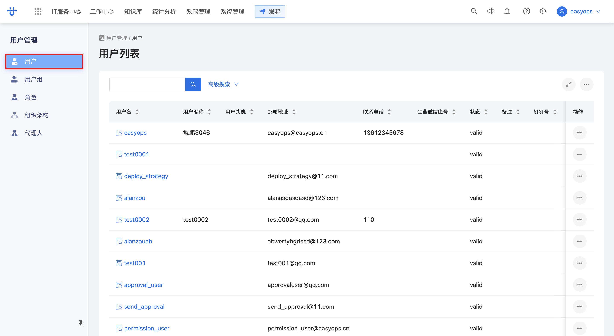
> 🔗 本步调用：`GET /next/api/gateway/permission.role.GetPermissionRoleList/api/v1/permission_role/config`（详见 openapi.yaml 的「用户角色」），同时触发用户列表查询。

## 二、搜索用户

用户量较大时，通过关键词快速定位，或多条件组合的高级搜索精准筛选。

### 步骤 1：在搜索框输入用户名关键词
<!-- url: itsc-user-authority/user-management?q={关键词} | step_id: 5 -->
在列表上方搜索框输入用户名（如 `easyops`），文本输入过程不截图，失焦时自动捕获。
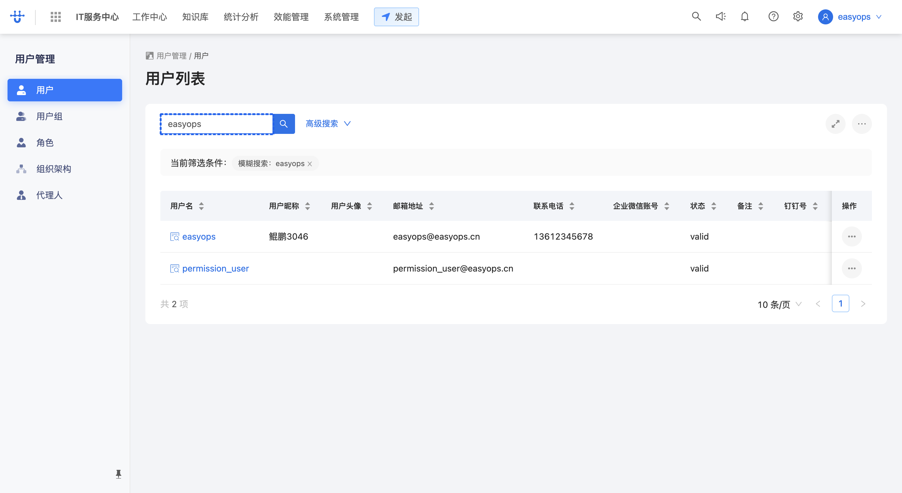
> 💡 提示：支持按用户名（name）模糊匹配。

### 步骤 2：点击「高级搜索」展开条件区
<!-- step_id: 6 -->
点击搜索框右侧的「高级搜索」，展开多字段条件配置区。
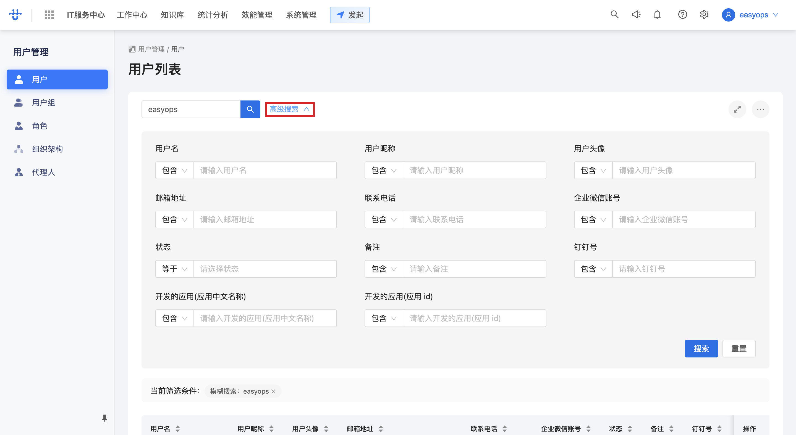

### 步骤 3：配置筛选条件（运算符 + 字段）
<!-- step_id: 7 -->
在条件区选择匹配方式（如「包含」/「不为空」），并指定字段（如「用户昵称 不为空」），可叠加多个条件。
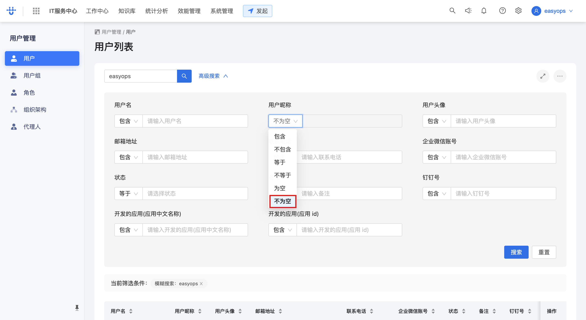

### 步骤 4：点击「搜索」执行查询
<!-- api: POST .../v3/object/USER/instance/_search | tag: 用户查询 | step_id: 9 -->
点击「搜索」按钮，列表按条件刷新出结果。
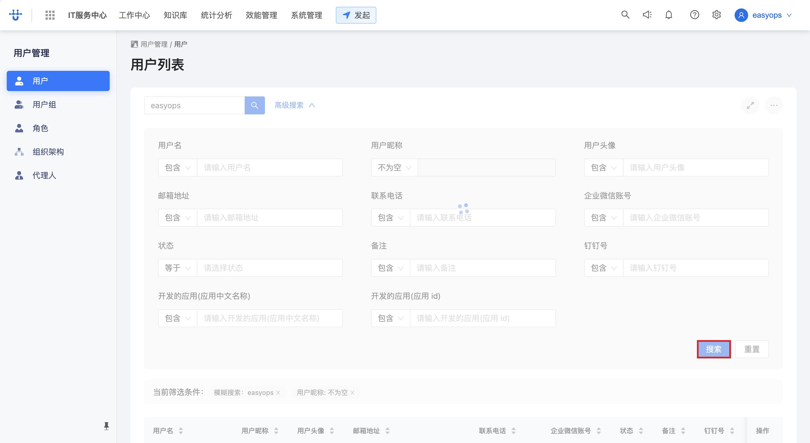
> 🔗 本步调用：`POST /next/api/gateway/cmdb.instance.PostSearchV3/v3/object/USER/instance/_search`（详见 openapi.yaml 的「用户查询」）。

### 步骤 5：点击「重置」清空条件
<!-- step_id: 15 -->
点击「重置」可清空所有搜索条件，恢复全量列表。
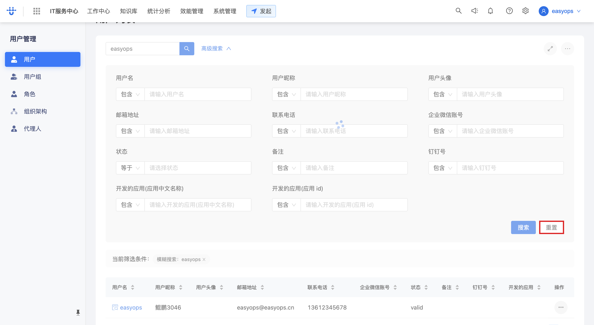

## 三、禁用用户

将某用户置为禁用态（登录失效），但保留账号数据以便后续启用。

### 步骤 1：点击目标用户行的操作下拉「⋯」
<!-- step_id: 17 -->
在用户列表中找到目标用户，点击该行右侧的操作下拉触发器（`dropdown-trigger`）。
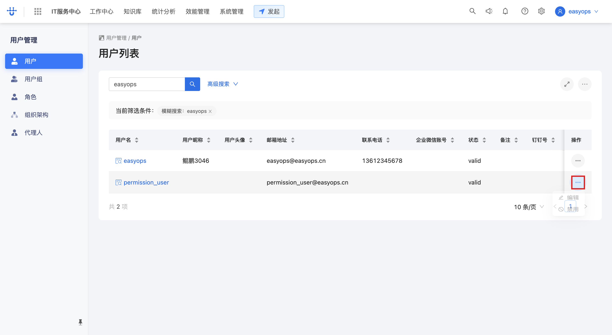

### 步骤 2：点击「禁用」
<!-- step_id: 18 -->
在下拉菜单中点击「禁用」，弹出二次确认框。
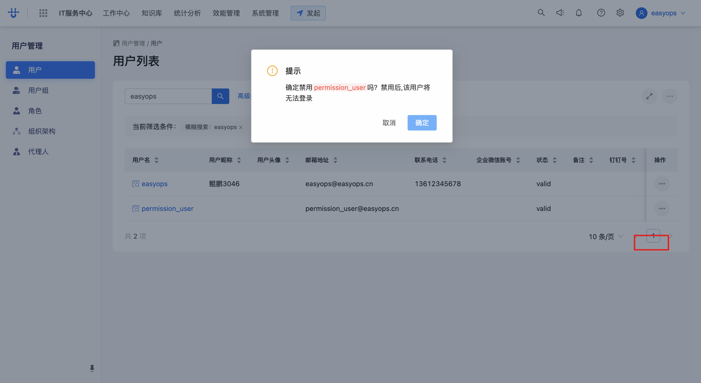

### 步骤 3：点击「确定」确认禁用
<!-- api: PUT .../object/USER/instance/{instanceId} | tag: 用户更新 | step_id: 19 -->
点击「确定」，用户状态切换为禁用（state→invalid）。
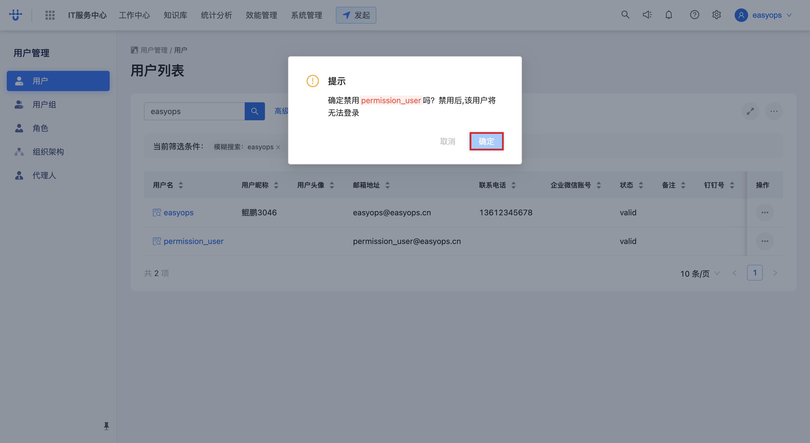
> 🔗 本步调用：`PUT /next/api/gateway/cmdb.instance.UpdateInstance/object/USER/instance/{instanceId}`（详见 openapi.yaml 的「用户更新」）。
> 💡 提示：禁用后用户无法登录，但账号信息仍保留，可随时按「七、启用用户」恢复。

## 四、编辑用户信息

修改用户的昵称、邮箱、手机号等基础资料。

### 步骤 1：点击操作下拉「⋯」
<!-- step_id: 20 -->
点击目标用户行的操作下拉触发器。
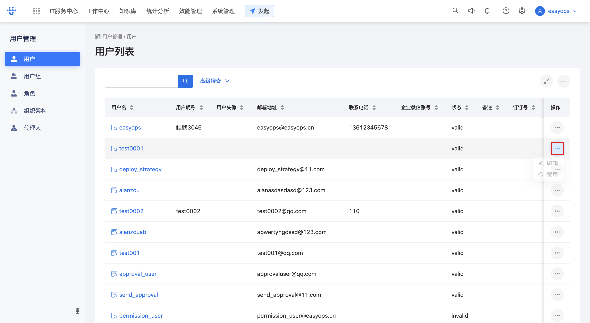

### 步骤 2：点击「编辑」进入编辑页
<!-- url: itsc-user-authority/user-management/user/{instanceId}/edit | api: GET .../object/USER/instance/{instanceId} | tag: 用户详情 | step_id: 21 -->
点击「编辑」，跳转到该用户的资料编辑页，自动回填现有信息。
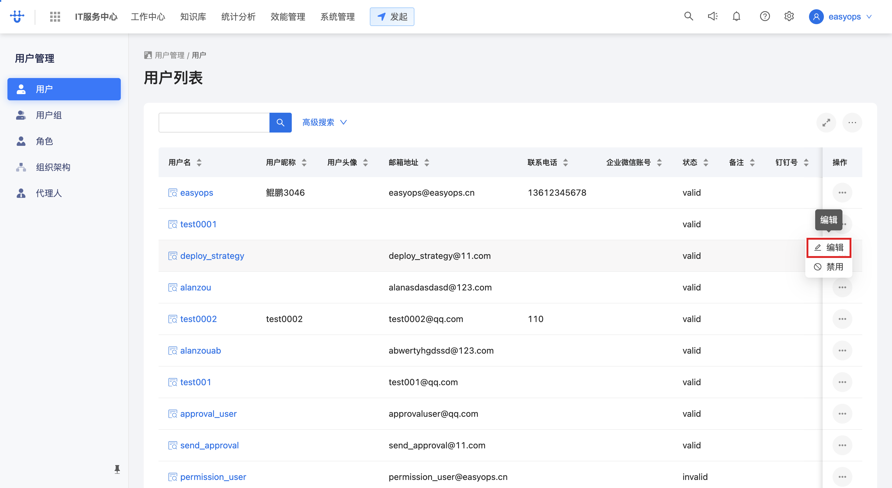
> 🔗 本步调用：`GET /next/api/gateway/cmdb.instance.GetDetail/object/USER/instance/{instanceId}`（详见 openapi.yaml 的「用户详情」）。

### 步骤 3：修改邮箱
<!-- step_id: 22 -->
在「邮箱」输入框中填入新邮箱（如 `test0001@qq.com`）。
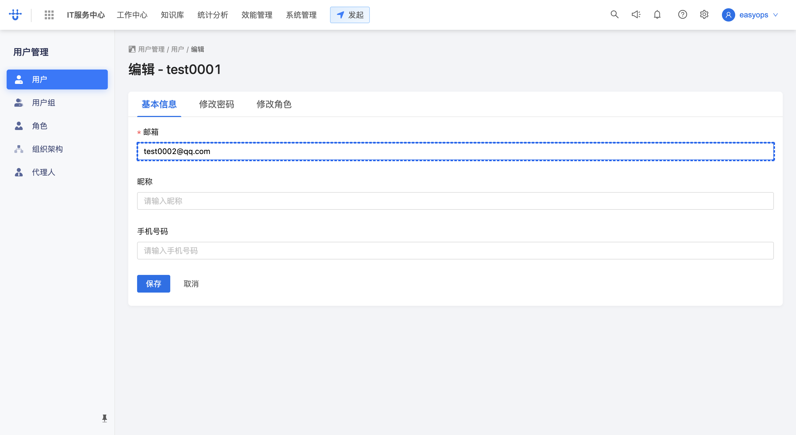

### 步骤 4：修改昵称
<!-- step_id: 26 -->
在「昵称」输入框中填入新昵称（如 `test0001`）。
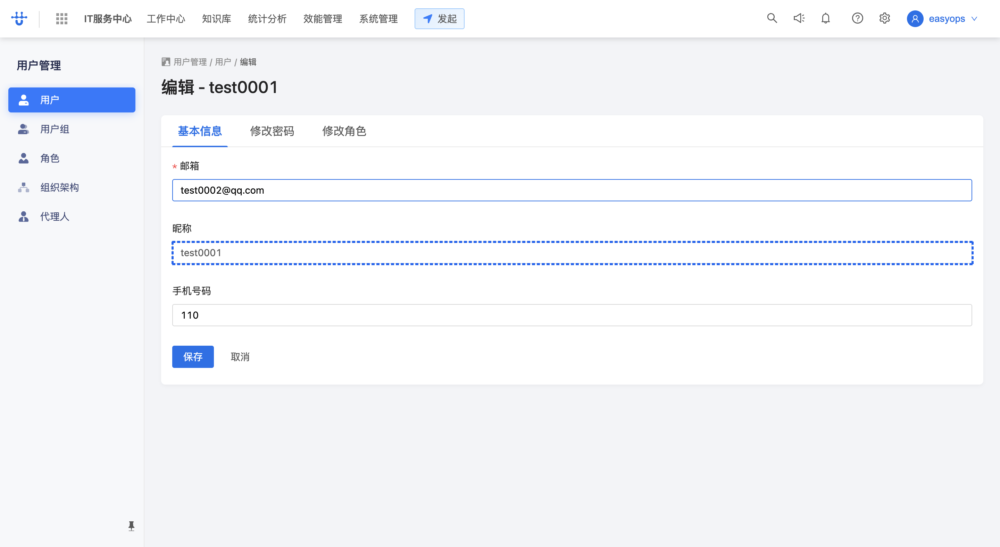

### 步骤 5：修改手机号
<!-- step_id: 24 -->
在「手机号码」输入框中填入新手机号。
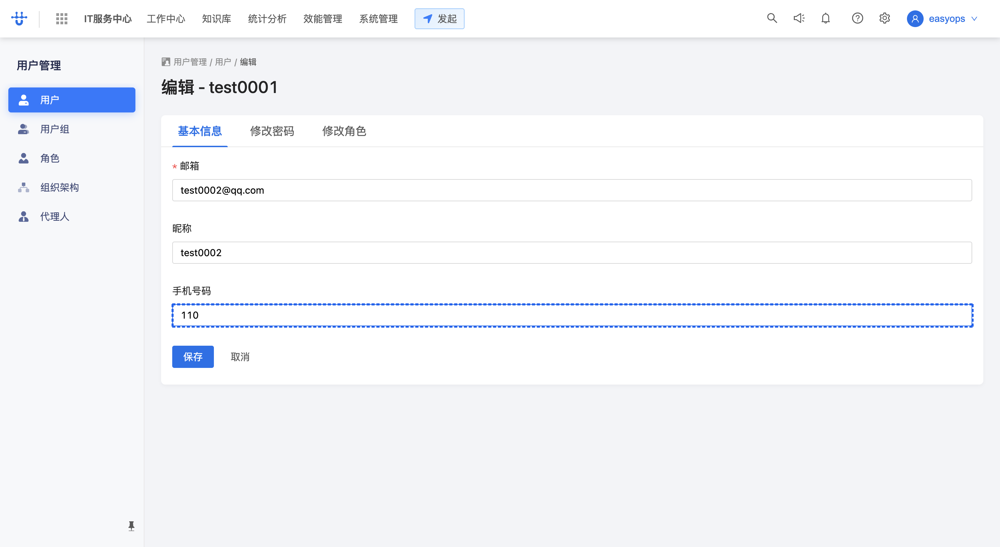

### 步骤 6：点击「保存」提交修改
<!-- api: PUT .../object/USER/instance/{instanceId} | tag: 用户更新 | step_id: 32 -->
确认无误后点击页面底部「保存」，资料写回后台。
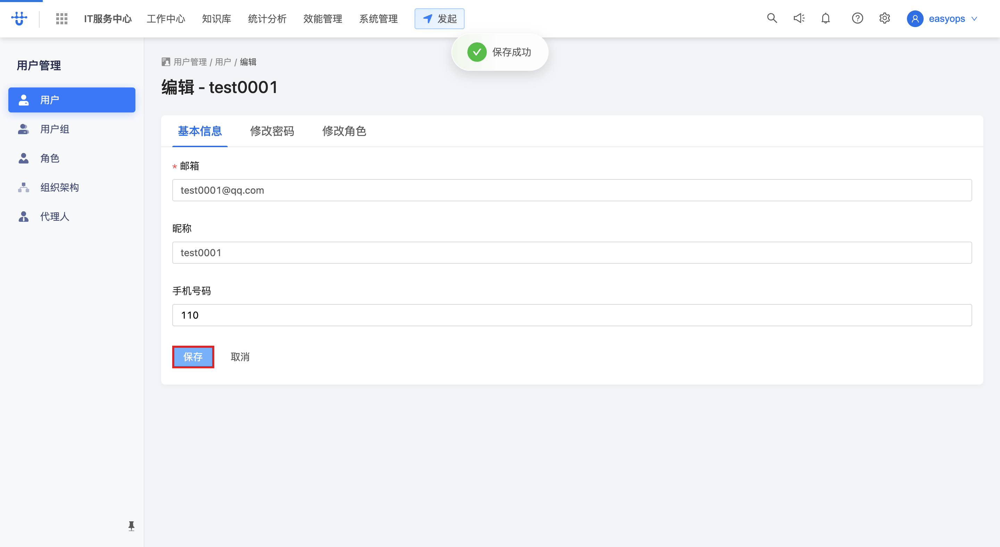
> 🔗 本步调用：`PUT /next/api/gateway/cmdb.instance.UpdateInstance/object/USER/instance/{instanceId}`（详见 openapi.yaml 的「用户更新」）。

## 五、修改用户密码

为用户重置登录密码（管理员侧操作）。

### 步骤 1：点击操作下拉「⋯」
<!-- step_id: 33 -->
在用户列表点击目标用户行的操作下拉触发器。
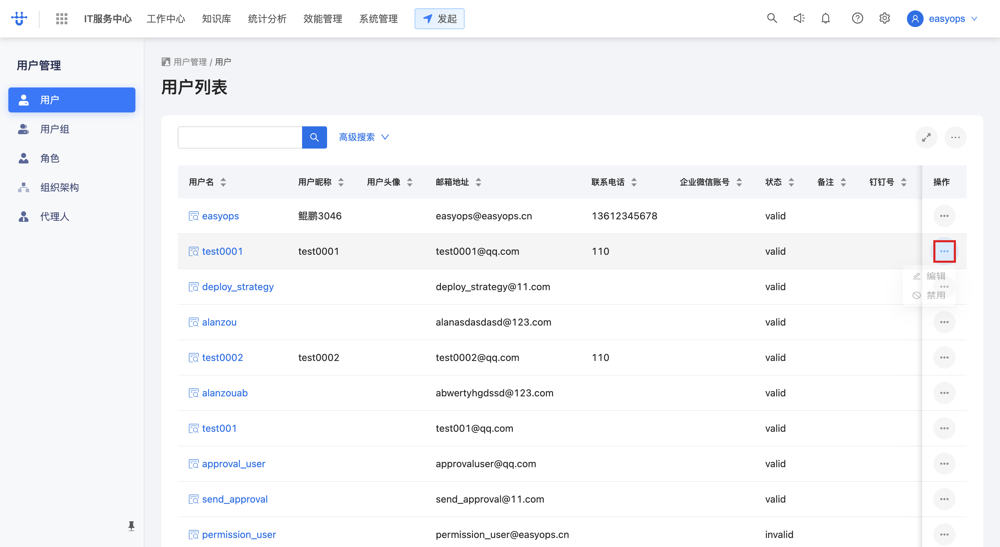
> 🔗 本步调用：`GET /next/api/gateway/cmdb.instance.GetDetail/object/USER/instance/{instanceId}`（回填用户详情）。

### 步骤 2：点击「编辑」进入编辑页
<!-- url: itsc-user-authority/user-management/user/{instanceId}/edit | api: GET .../api/v1/users/detail/{username} | tag: 用户详情 | step_id: 34 -->
点击「编辑」进入用户编辑页。
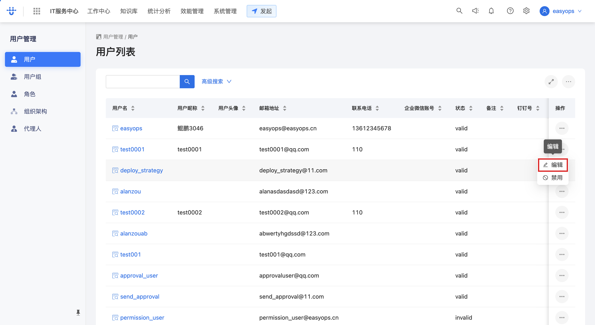
> 🔗 本步调用：`GET /next/api/gateway/logic.user_service/api/v1/users/detail/{username}`（用户服务侧详情，详见 openapi.yaml 的「用户详情」）。

### 步骤 3：点击「修改密码」打开改密弹窗
<!-- step_id: 35 -->
在编辑页点击「修改密码」，弹出密码重置框。
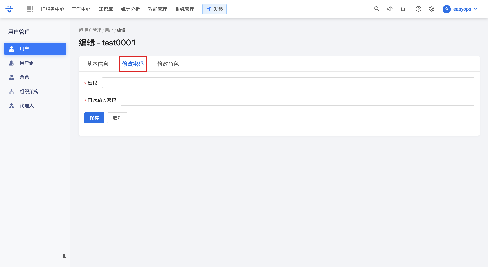

### 步骤 4：输入新密码并再次确认
<!-- step_id: 37 -->
在「密码」与「再次输入密码」两个输入框中填入相同的新密码。
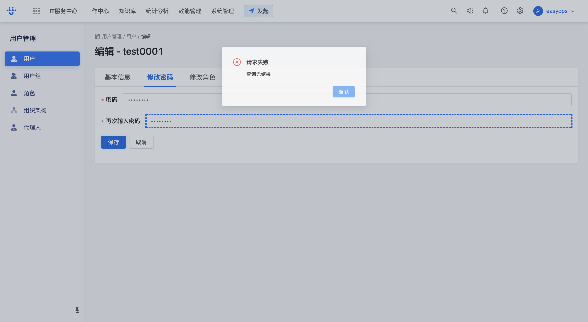
> 💡 提示：两次输入必须一致，否则保存时校验不通过。

### 步骤 5：点击「保存」提交新密码
<!-- api: POST .../api/v1/users/alter_password | tag: 用户密码 | step_id: 38 -->
点击「保存」提交密码修改请求。
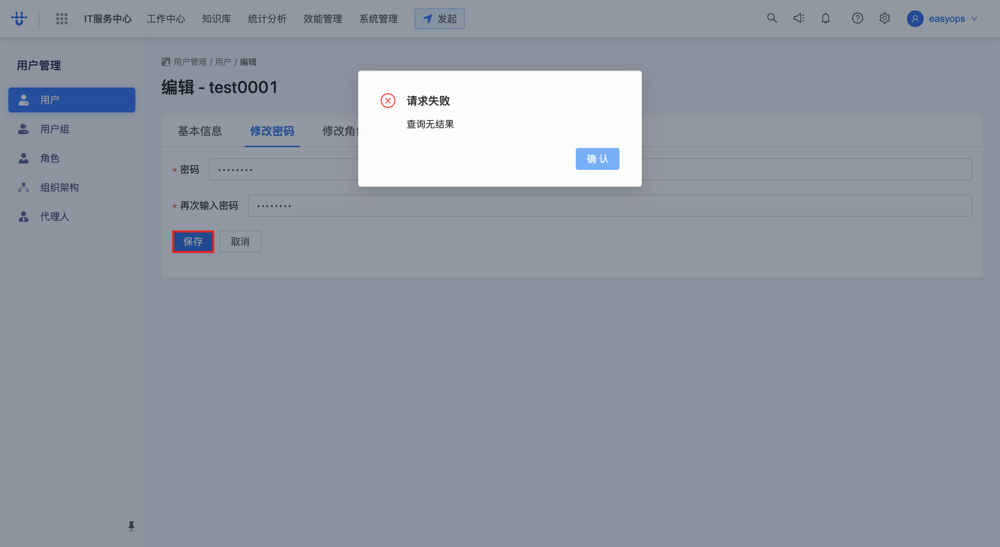
> 🔗 本步调用：`POST /next/api/gateway/user_service.user_admin.AlterPassword/api/v1/users/alter_password`（详见 openapi.yaml 的「用户密码」）。
> ⚠️ 注意：本流程录制中该接口返回了 **500（error: 查询无结果）**。实际使用时若遇此报错，请确认用户名（name）正确、且用户处于有效态（未被禁用）；密码字段为 Base64 编码传输。

## 六、修改用户角色

为用户分配或调整系统角色（决定其可见菜单与操作权限）。

### 步骤 1：点击「修改角色」
<!-- step_id: 45 -->
在用户编辑页点击「修改角色」，打开角色选择弹窗（自动加载可分配角色列表）。
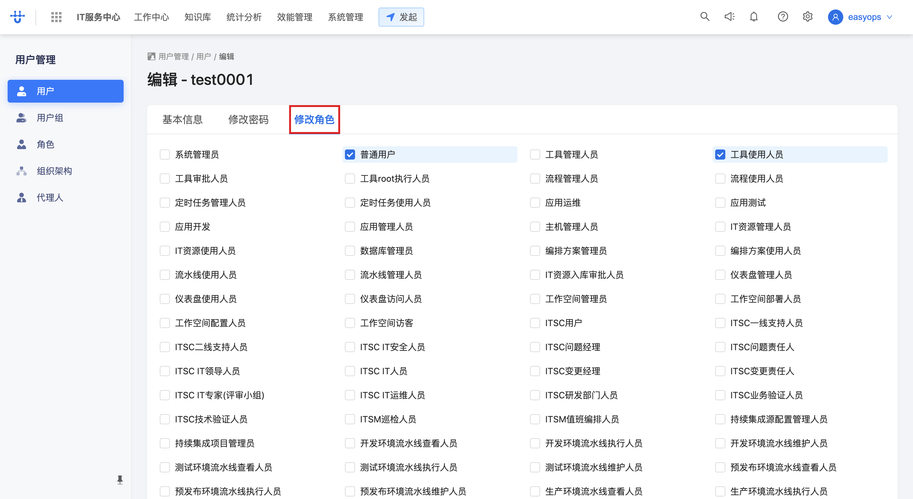
> 🔗 本步调用：`GET /next/api/gateway/permission.role.GetPermissionRoleList/api/v1/permission_role/config` 与 `GET .../permission_role/user_role/{username}`（查当前已分配角色，详见 openapi.yaml 的「用户角色」）。

### 步骤 2：勾选目标角色
<!-- step_id: 46 -->
在角色列表中勾选要分配的角色（如「工具管理人员」），可多选。
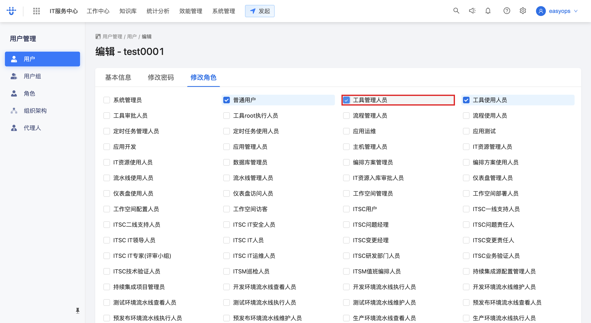

### 步骤 3：点击「保存」提交角色分配
<!-- api: PUT .../api/v1/permission_role/user_set_roles/{username} | tag: 用户角色 | step_id: 47 -->
点击「保存」，角色分配即时生效。
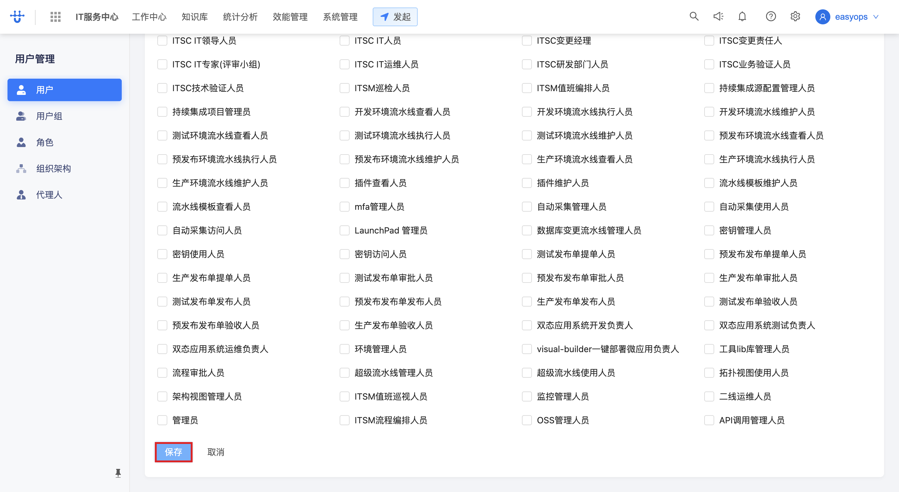
> 🔗 本步调用：`PUT /next/api/gateway/permission.role.RoleSetUser/api/v1/permission_role/user_set_roles/{username}`（详见 openapi.yaml 的「用户角色」）。

## 七、启用用户

将此前禁用的用户重新置为有效态（恢复登录）。

### 步骤 1：搜索定位到目标用户
<!-- url: itsc-user-authority/user-management?q={关键词} | step_id: 55 -->
在搜索框输入用户名关键词（如 `easyops`），定位到该用户行。
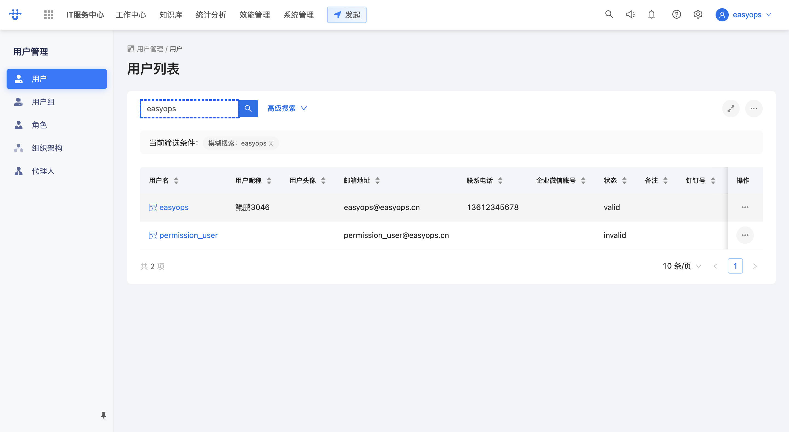

### 步骤 2：点击操作下拉「⋯」
<!-- step_id: 56 -->
点击该用户行的操作下拉触发器。

### 步骤 3：点击「启用」
<!-- step_id: 57 -->
在下拉菜单中点击「启用」，弹出确认框。
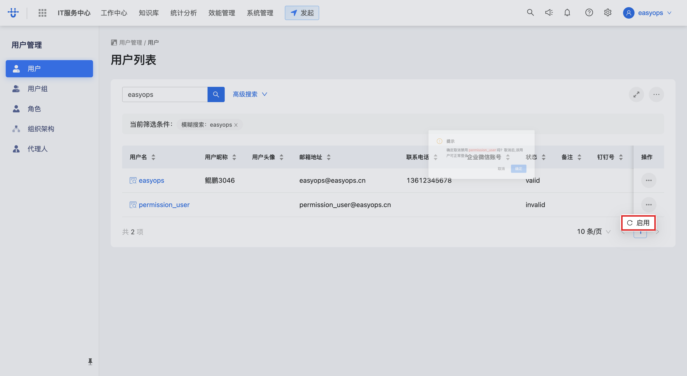

### 步骤 4：点击「确定」确认启用
<!-- api: PUT .../object/USER/instance/{instanceId} | tag: 用户更新 | step_id: 58 -->
点击「确定」，用户状态恢复为有效（state→valid）。

> 🔗 本步调用：`PUT /next/api/gateway/cmdb.instance.UpdateInstance/object/USER/instance/{instanceId}`（详见 openapi.yaml 的「用户更新」）。

## 附：本流程接口速查

| tag | 方法 | 路径（简） | 用途 | 步骤 |
| --- | --- | --- | --- | --- |
| 用户查询 | POST | `.../cmdb.instance.PostSearchV3/v3/object/USER/instance/_search` | 列表/关键词/高级搜索 | 二-4 |
| 用户详情 | GET | `.../cmdb.instance.GetDetail/object/USER/instance/{instanceId}` | 编辑页回填用户资料 | 四-2、五-1 |
| 用户详情 | GET | `.../logic.user_service/api/v1/users/detail/{username}` | 用户服务侧详情（改密/角色用） | 五-2 |
| 用户更新 | PUT | `.../cmdb.instance.UpdateInstance/object/USER/instance/{instanceId}` | 禁用 / 启用 / 编辑资料保存 | 三-3、四-6、七-4 |
| 用户密码 | POST | `.../user_service.user_admin.AlterPassword/api/v1/users/alter_password` | 管理员重置用户密码 | 五-5 |
| 用户角色 | GET | `.../permission.role.GetPermissionRoleList/api/v1/permission_role/config` | 可分配角色列表 | 一-2、六-1 |
| 用户角色 | GET | `.../permission.role.GetUserRole/api/v1/permission_role/user_role/{username}` | 查用户当前角色 | 六-1 |
| 用户角色 | PUT | `.../permission.role.RoleSetUser/api/v1/permission_role/user_set_roles/{username}` | 设置/调整用户角色 | 六-3 |
