# ITSM 系统管理 · 用户组管理 — 操作指引

> 适用场景：在 ITSM 工作台的「系统管理 → 用户组管理」中，完成用户组的**新建、查询、关联/移除成员、删除**，覆盖一个用户组的完整生命周期。
> 配套接口：见同目录 [`ITSM-系统管理-用户组管理-openapi.yaml`](./ITSM-系统管理-用户组管理-openapi.yaml)。
>
> 截图标注图例：🔴红框=点击 / 🔵蓝虚线框=输入 / 🟠橙框+▾=下拉 / 🟣紫圈=单复选 / 🟢绿粗框=提交。

## 目录
- [一、进入用户组管理](#一进入用户组管理)
- [二、新增用户组](#二新增用户组)
- [三、关联用户组成员](#三关联用户组成员)
- [四、移除成员](#四移除成员)
- [五、删除用户组](#五删除用户组)
- [附：本流程接口速查](#附本流程接口速查)

<!-- deep-links: 本流程关键页面直达（SPA 路径，去掉 host 前缀，参数化）
  工作台:       itsc-workbench/workbench
  用户组列表:    itsc-user-authority/user-group
  用户组详情页:  itsc-user-authority/user-group/{instanceId}/{groupName}
-->

## 一、进入用户组管理

从工作台导航到用户组列表页。

### 步骤 1：点击顶部「系统管理」
<!-- url: itsc-workbench/workbench | step_id: 1 -->
在工作台顶部导航栏点击「系统管理」，展开系统管理子菜单。

> 💡 提示：若已直接处于用户组管理页，可跳过本段。

### 步骤 2：点击子菜单中的「用户管理」入口
<!-- step_id: 2 -->
在展开的「系统管理」下拉菜单中点击「用户管理」分组入口，触发用户权限微应用（itsc-user-authority）加载。

### 步骤 3：点击左侧「用户组管理」菜单
<!-- url: itsc-user-authority/user-group | api: POST .../api/v1/users/group/all | tag: 用户组列表与详情 | step_id: 3 -->
进入用户权限模块后，在左侧二级菜单点击「用户组管理」，进入用户组列表页，默认加载全部用户组。
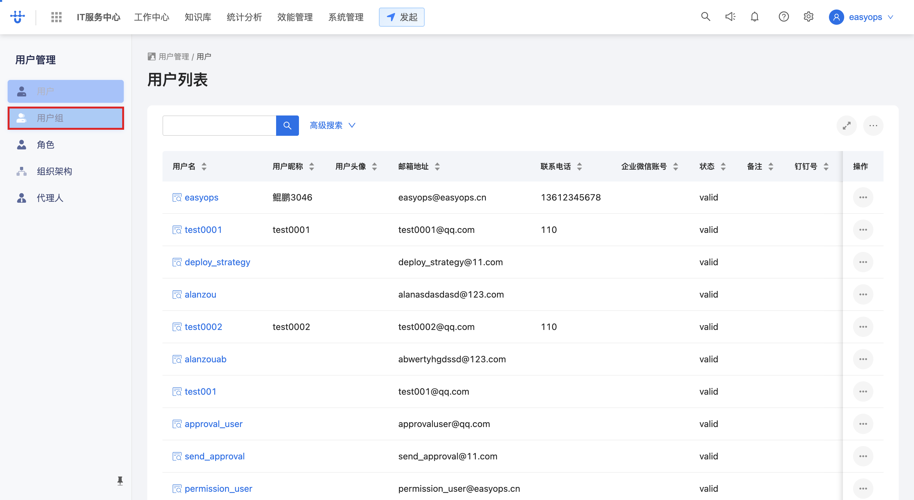
> 🔗 本步调用：`POST /next/api/gateway/user_service.user_admin.SearchAllUserGroup/api/v1/users/group/all`（详见 openapi.yaml 的「用户组列表与详情」）。

## 二、新增用户组

在用户组列表页创建一个新的用户组。

### 步骤 1：点击「新增用户组」
<!-- url: itsc-user-authority/user-group | step_id: 4 -->
在用户组列表页右上角点击「新增用户组」按钮，弹出新建用户组表单。
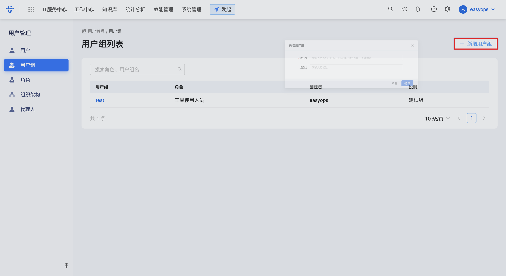

### 步骤 2：输入组名称
<!-- step_id: 5 -->
在「组名称」输入框中填入用户组名称（如 `部门2`）。
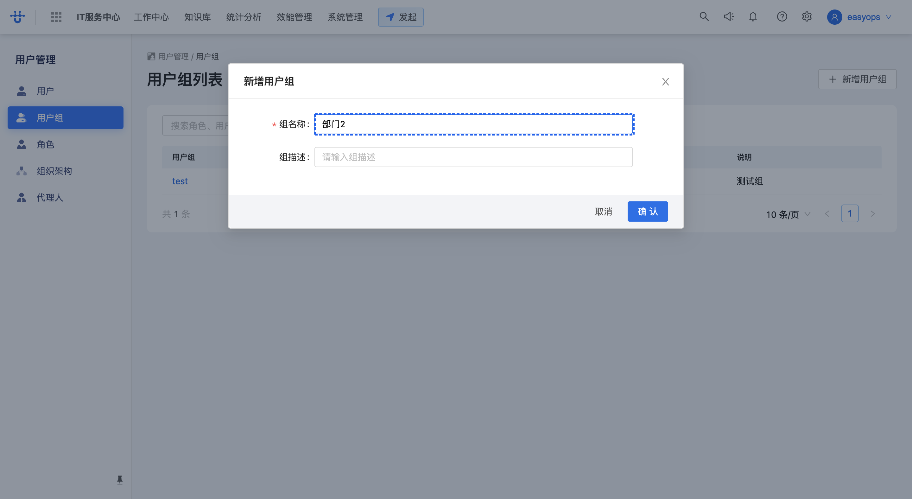
> ⚠️ 注意：组名称需唯一，不能与已有用户组重复。

### 步骤 3：输入组描述
<!-- step_id: 6 -->
在「组描述」输入框中填入该用户组的说明（如 `测试组`），便于后续识别用途。
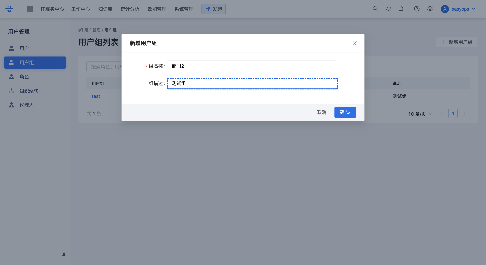

### 步骤 4：点击「确认」创建用户组
<!-- api: POST .../v2/object/USER_GROUP/instance | tag: 用户组创建与删除 | step_id: 7 -->
填写完成后点击表单底部的「确认」按钮，提交创建请求。
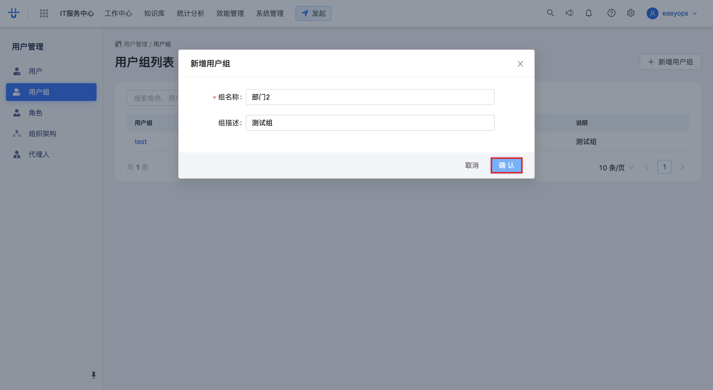
> 🔗 本步调用：`POST /next/api/gateway/cmdb.instance.CreateInstance/v2/object/USER_GROUP/instance`（详见 openapi.yaml 的「用户组创建与删除」），创建成功后列表自动刷新。

### 步骤 5：点击列表中的用户组进入详情
<!-- api: GET .../object/USER_GROUP/instance/{instanceId} | tag: 用户组列表与详情 | step_id: 8 -->
在用户组列表中点击新建的用户组名称（如「部门2」），进入该用户组的详情页，可在此管理成员。
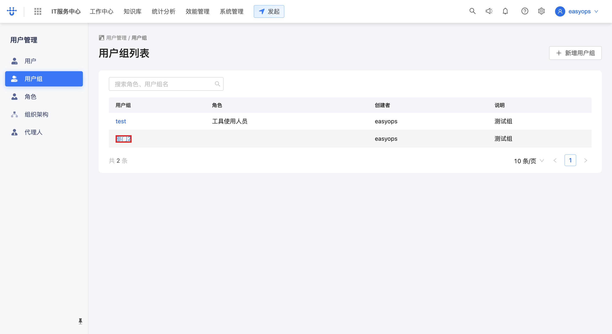
> 🔗 本步调用：`GET /next/api/gateway/cmdb.instance.GetDetail/object/USER_GROUP/instance/{instanceId}`（详见 openapi.yaml 的「用户组列表与详情」）。

## 三、关联用户组成员

将若干用户加入到该用户组中。

### 步骤 1：点击「关联用户」
<!-- url: itsc-user-authority/user-group/{instanceId}/{groupName} | api: POST .../v3/object/USER/instance/_search | tag: 用户组成员管理 | step_id: 9 -->
在用户组详情页右上角点击「关联用户」按钮，弹出用户选择对话框，默认列出尚未加入本组的可关联用户。
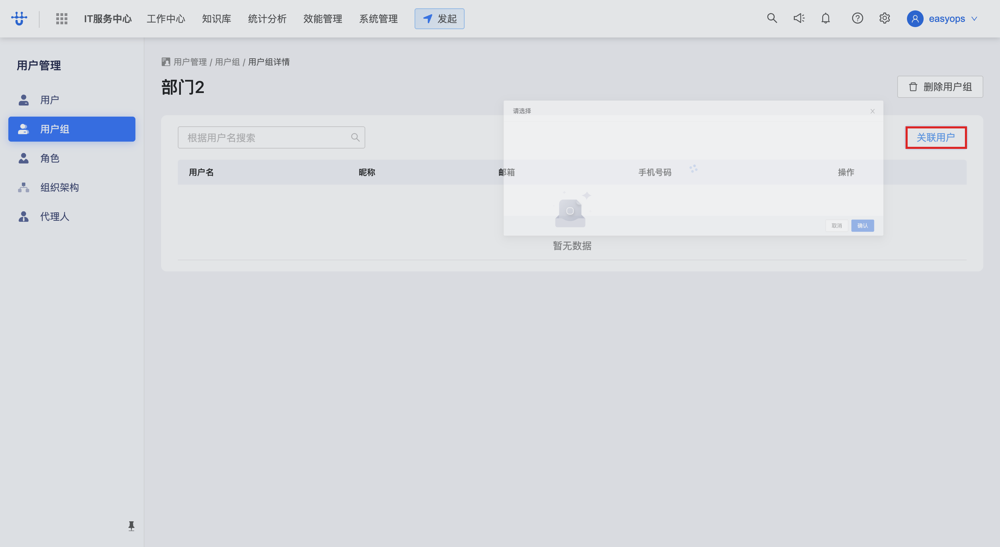
> 🔗 本步调用：`POST /next/api/gateway/cmdb.instance.PostSearchV3/v3/object/USER/instance/_search`（详见 openapi.yaml 的「用户组成员管理」），查询条件会自动排除已是本组成员的用户。

### 步骤 2：勾选用户并点击「确认」关联
<!-- api: PUT .../api/v1/groups/{groupId}/members | tag: 用户组成员管理 | step_id: 10 -->
在用户列表中勾选要加入的用户（可多选），然后点击对话框底部的「确认」按钮，将所选用户追加为本组成员。
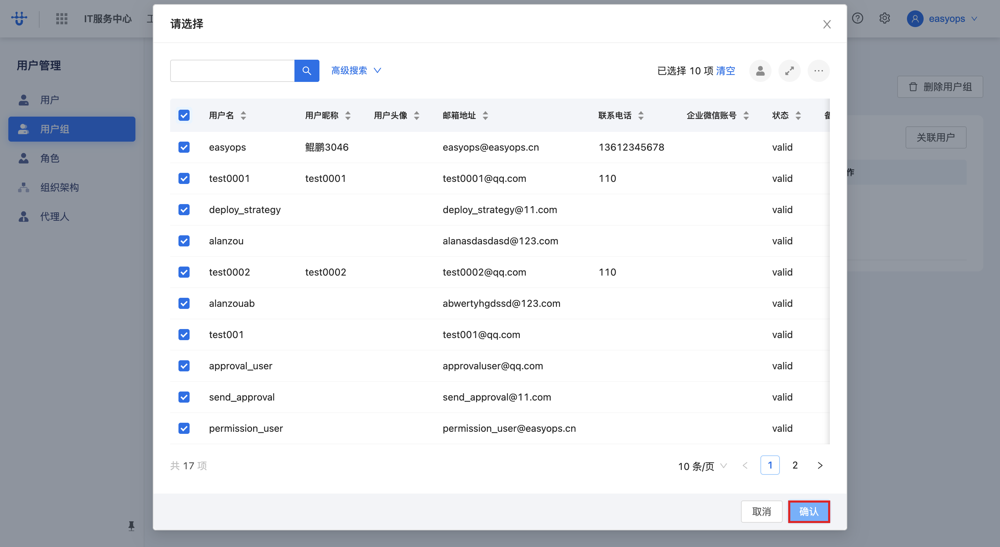
> 🔗 本步调用：`PUT /next/api/gateway/logic.user_service/api/v1/groups/{groupId}/members`（详见 openapi.yaml 的「用户组成员管理」），请求体 `op: append` 表示追加关联。

## 四、移除成员

将某个成员从用户组中移除（仅解除关联关系，不删除用户本身）。

### 步骤 1：点击目标成员行的操作按钮
<!-- step_id: 11 -->
在用户组详情页的成员列表中，找到要移除的成员（如 `test0001`），点击该行最右侧「操作」列的图标按钮，弹出移除确认框。
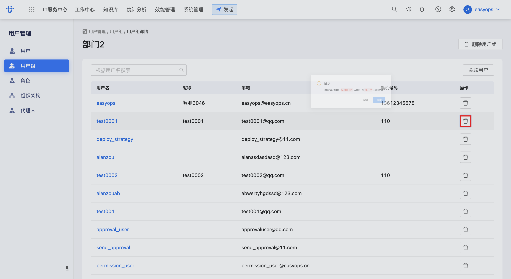
> 💡 提示：此处移除仅解除该用户与当前用户组的关联关系，用户账号本身不受影响。

### 步骤 2：点击「确定」确认移除
<!-- api: POST .../object/USER_GROUP/relation/_members/remove | tag: 用户组成员管理 | step_id: 12 -->
确认框提示「确定要将用户 xxx 从用户组中移除吗？」，点击「确定」执行移除。
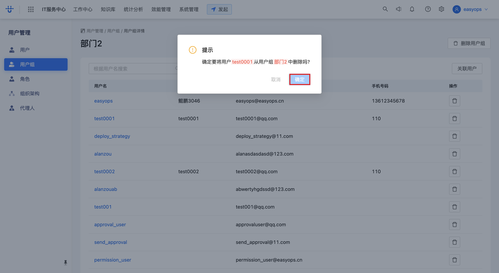
> 🔗 本步调用：`POST /next/api/gateway/cmdb.instance_relation.Remove/object/USER_GROUP/relation/_members/remove`（详见 openapi.yaml 的「用户组成员管理」）。

## 五、删除用户组

彻底删除一个不再使用的用户组。

### 步骤 1：点击「删除用户组」
<!-- step_id: 13 -->
在用户组详情页（或列表页对应行的操作菜单）点击「删除用户组」按钮，弹出删除确认框。
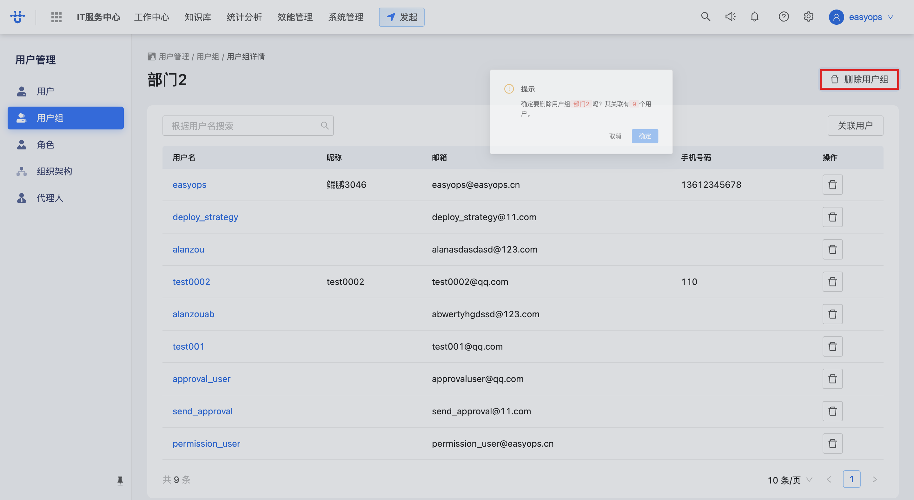
> ⚠️ 注意：删除用户组是不可逆操作，该组的成员关联关系将一并清除，请确认后再操作。

### 步骤 2：点击「确定」确认删除
<!-- api: DELETE .../object/USER_GROUP/instance/{instanceId} | tag: 用户组创建与删除 | step_id: 14 -->
确认框提示是否删除该用户组，点击「确定」执行删除，列表随之刷新。
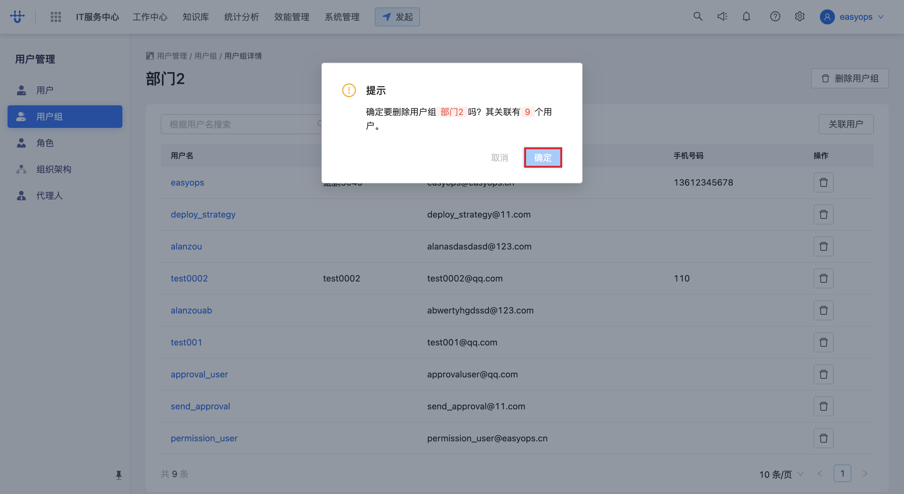
> 🔗 本步调用：`DELETE /next/api/gateway/cmdb.instance.DeleteInstance/object/USER_GROUP/instance/{instanceId}`（详见 openapi.yaml 的「用户组创建与删除」）。

## 附：本流程接口速查

| tag | 方法 | 路径（简） | 用途 | 步骤 |
| --- | --- | --- | --- | --- |
| 用户组列表与详情 | POST | `.../user_service.user_admin.SearchAllUserGroup/api/v1/users/group/all` | 查询全部用户组 | 一·3、二·4、五·2 |
| 用户组列表与详情 | GET | `.../cmdb.instance.GetDetail/object/USER_GROUP/instance/{instanceId}` | 用户组详情 | 二·5 |
| 用户组列表与详情 | GET | `.../cmdb.cmdb_object.GetDetail/object/USER_GROUP` | 用户组对象模型 | 列表/详情加载 |
| 用户组列表与详情 | GET | `.../cmdb.instance.GetDefaultValueTemplate/object/USER_GROUP/instance_default_value_template` | 新建表单默认值模板 | 新建表单加载 |
| 用户组列表与详情 | GET | `.../cmdb.cmdb_object.GetObjectRef/object_ref?ref_object=USER_GROUP` | 用户组关联关系定义 | 列表/详情加载 |
| 用户组创建与删除 | POST | `.../cmdb.instance.CreateInstance/v2/object/USER_GROUP/instance` | 新建用户组 | 二·4 |
| 用户组创建与删除 | DELETE | `.../cmdb.instance.DeleteInstance/object/USER_GROUP/instance/{instanceId}` | 删除用户组 | 五·2 |
| 用户组成员管理 | POST | `.../cmdb.instance.PostSearchV3/v3/object/USER/instance/_search` | 搜索可关联用户 | 三·1 |
| 用户组成员管理 | PUT | `.../logic.user_service/api/v1/groups/{groupId}/members` | 关联（追加）成员 | 三·2 |
| 用户组成员管理 | POST | `.../cmdb.instance_relation.Remove/object/USER_GROUP/relation/_members/remove` | 移除成员 | 四·2 |
