# ITSM 系统管理 · 知识目录管理 - 操作指引

> 适用场景：在 ITSM 工作台的「系统管理 -> 知识目录管理」中，完成知识目录（catalog）的**搜索、新建目录/子目录、编辑、移动、设置权限、删除**，以及对目录下**知识条目的发布、注销、删除**。看完即可独立管理一棵知识目录树及其下知识条目。
> 配套接口：见同目录 [`ITSM-系统管理-知识目录管理-openapi.yaml`](./ITSM-系统管理-知识目录管理-openapi.yaml)。
>
> 截图标注图例：🔴红框=点击 / 🔵蓝虚线框=输入 / 🟠橙框+▾=下拉 / 🟣紫圈=单复选 / 🟢绿粗框=提交。

## 目录
- [一、进入知识目录管理](#一进入知识目录管理)
- [二、搜索知识目录](#二搜索知识目录)
- [三、新建知识目录](#三新建知识目录)
- [四、新建子目录](#四新建子目录)
- [五、浏览目录树](#五浏览目录树)
- [六、编辑知识目录](#六编辑知识目录)
- [七、设置目录权限](#七设置目录权限)
- [八、删除知识目录](#八删除知识目录)
- [九、搜索知识条目](#九搜索知识条目)
- [十、知识条目发布/注销/删除](#十知识条目发布注销删除)
- [附：本流程接口速查](#附本流程接口速查)

<!-- deep-links: 本流程关键页面直达（SPA 路径，去掉 host 前缀，参数化）
  工作台:         itsc-workbench/workbench
  知识目录管理:     itsc-service-management/knowledge-catalog
  带关键词搜索知识:  itsc-service-management/knowledge-catalog?page=1&q={关键词}
-->

## 一、进入知识目录管理

从工作台导航到知识目录管理页。

### 步骤 1：点击顶部「系统管理」
<!-- url: itsc-workbench/workbench | step_id: 1 -->
在工作台顶部导航栏点击「系统管理」，展开系统管理子菜单。
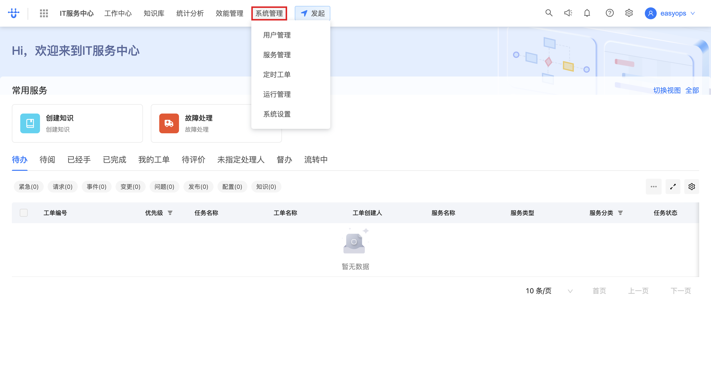
> 💡 提示：若已直接处于知识目录管理页，可跳过本段。

### 步骤 2：进入「服务管理」模块
<!-- url: itsc-service-management/setting-list | api: GET .../service_catalog | tag: 知识目录树与列表 | step_id: 2 -->
在系统管理菜单中点击进入「服务管理」模块。
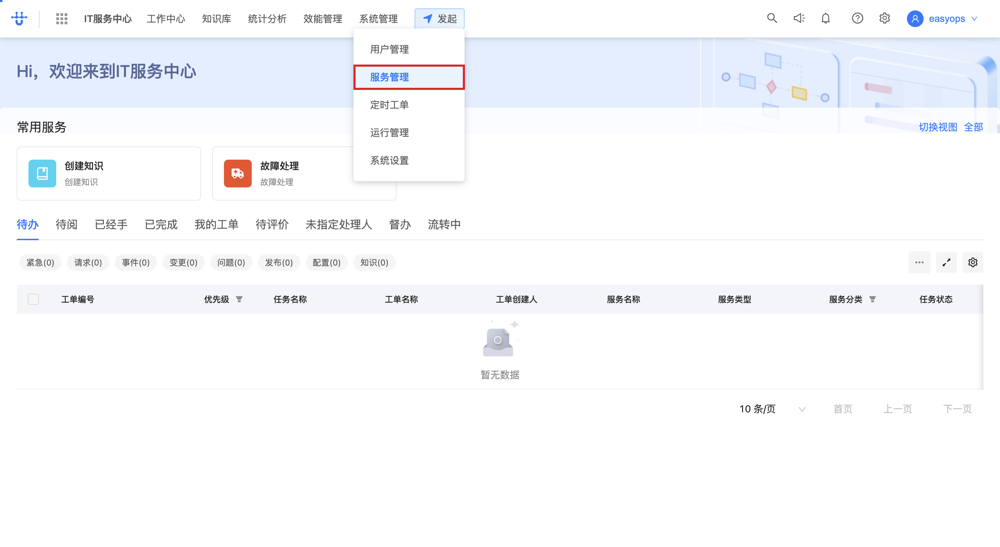

### 步骤 3：切换到「知识目录管理」页签
<!-- url: itsc-service-management/knowledge-catalog | api: GET .../knowledge_base/catalog_tree | tag: 知识目录树与列表 | step_id: 3 -->
切换到「知识目录管理」页签，左侧加载知识目录树，右侧加载知识列表。
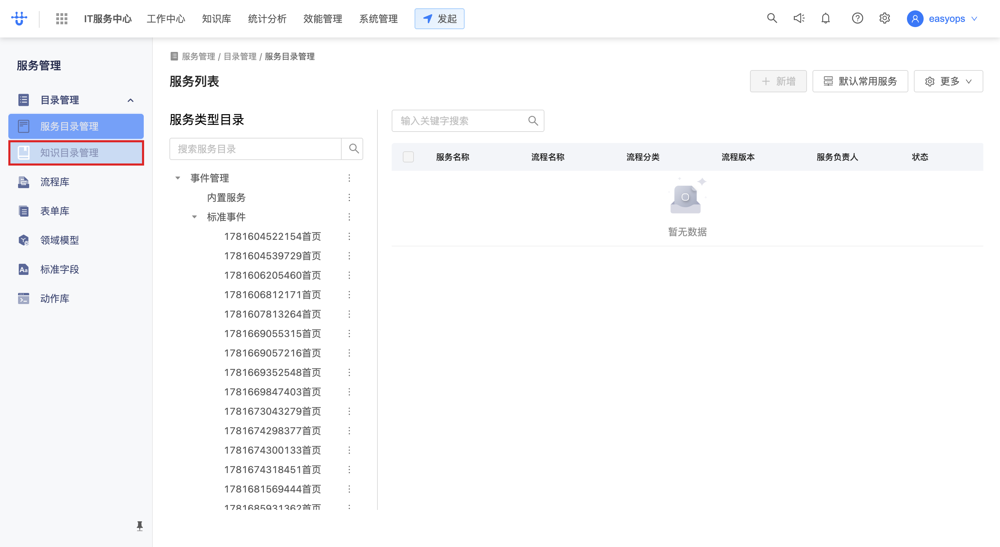
> 🔗 本步调用：`GET /next/api/gateway/flowable_service.knowledge_base.GetCatalogTree/api/flowable_service/v1/knowledge_base/catalog_tree`（详见 openapi.yaml 的「知识目录树与列表」），并 `GET .../knowledge_base/knowledge` 加载知识列表。

## 二、搜索知识目录

目录较多时，用搜索框快速定位目标目录。

### 步骤 1：在搜索框输入目录关键词
<!-- url: itsc-service-management/knowledge-catalog | step_id: 6 -->
在知识目录搜索框输入关键词（如「test」），实时过滤匹配的目录。
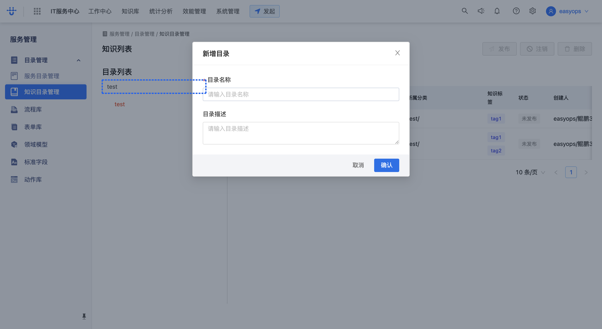
> 💡 提示：输入过程不截图，此处展示输入「test」后的过滤结果。

### 步骤 2：点击命中目录
<!-- url: itsc-service-management/knowledge-catalog | step_id: 8 -->
点击搜索结果中的目录，右侧加载其下知识列表。
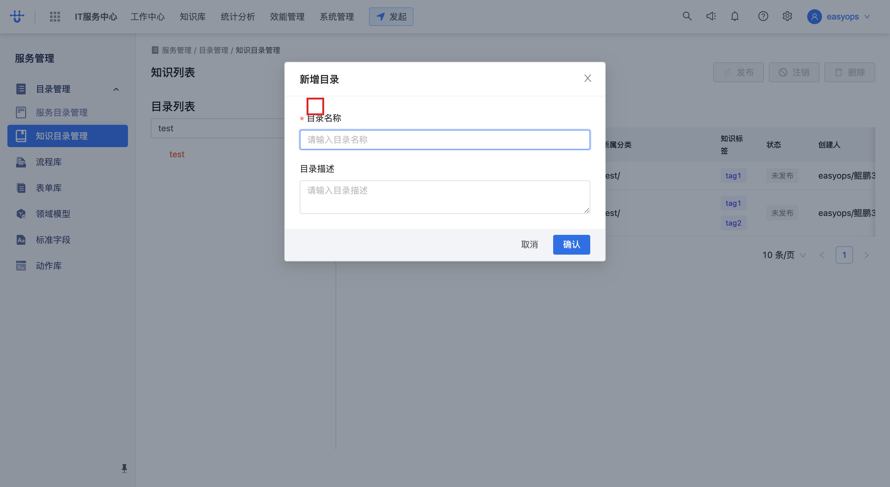

## 三、新建知识目录

新建一个顶层知识目录。

### 步骤 1：点击「新增」打开对话框
<!-- url: itsc-service-management/knowledge-catalog | step_id: 5 -->
点击「新增」按钮，弹出新建目录对话框。
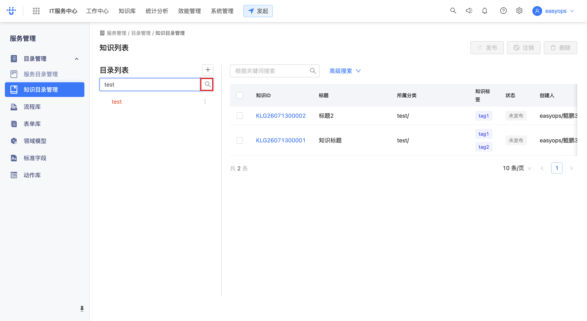

### 步骤 2：输入目录名称
<!-- url: itsc-service-management/knowledge-catalog | step_id: 9 -->
在「请输入目录名称」框中输入目录名（如「test2」）。
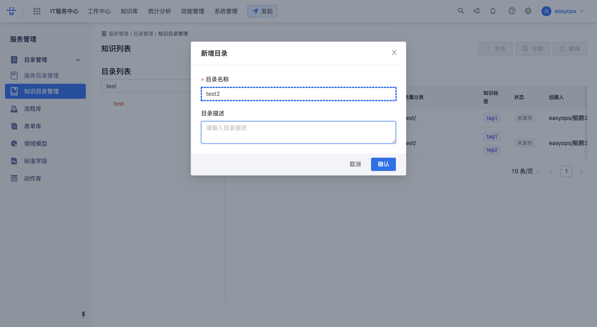

### 步骤 3：输入目录描述
<!-- url: itsc-service-management/knowledge-catalog | step_id: 14 -->
在「请输入目录描述」框中输入描述（如「desc」）。
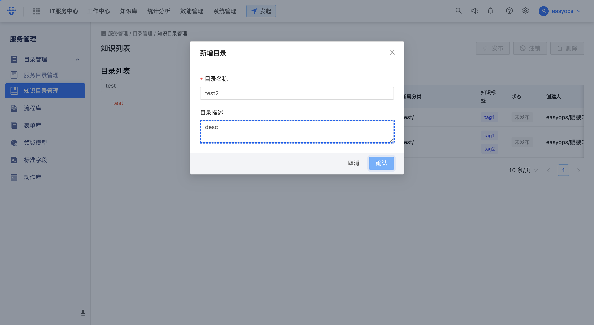

### 步骤 4：点击「确认」创建目录
<!-- url: itsc-service-management/knowledge-catalog | api: POST .../knowledge_base/catalog | tag: 知识目录增删改 | step_id: 15 -->
点击「确认」，创建顶层目录 test2，返回新目录 id。
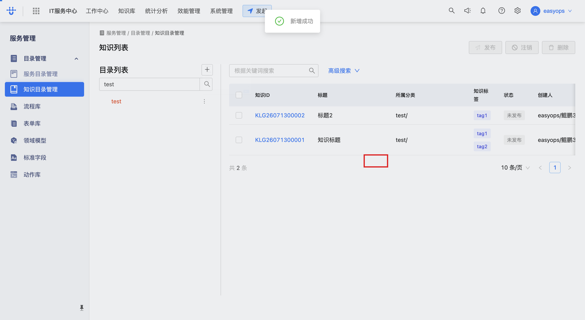
> 🔗 本步调用：`POST /next/api/gateway/logic.flowable_service/api/flowable_service/v1/knowledge_base/catalog`（无 parentId 即顶层，详见 openapi.yaml 的「知识目录增删改」），并刷新目录树与知识列表。

## 四、新建子目录

在某个目录下新建子目录。

### 步骤 1：点击父目录的「more」->「新增」
<!-- url: itsc-service-management/knowledge-catalog | step_id: 17 -->
点击父目录操作区的「more」按钮，在菜单中点击「新增」。
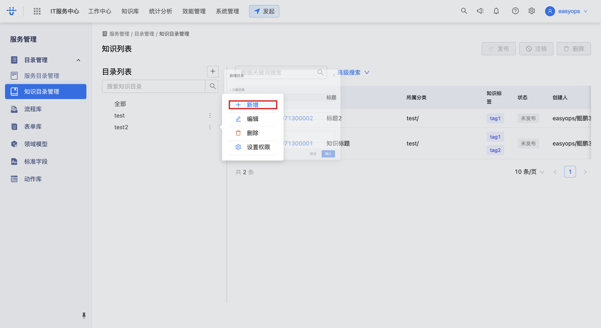

### 步骤 2：输入子目录名称
<!-- url: itsc-service-management/knowledge-catalog | step_id: 19 -->
在「请输入目录名称」框中输入子目录名（如「sub1」）。
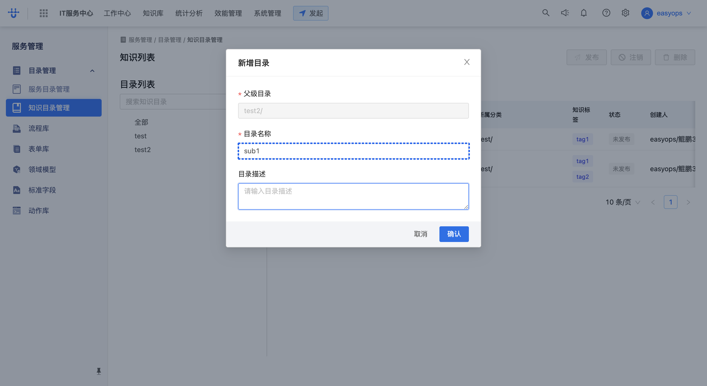

### 步骤 3：输入子目录描述
<!-- url: itsc-service-management/knowledge-catalog | step_id: 24 -->
在「请输入目录描述」框中输入描述（如「desc」）。
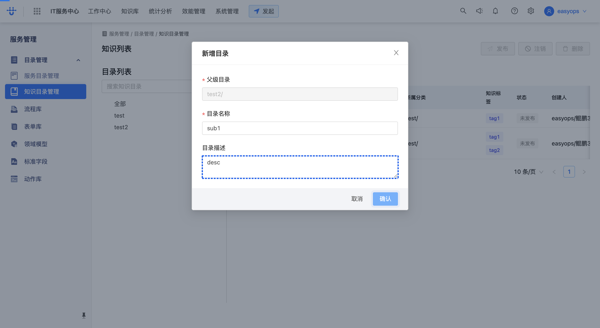

### 步骤 4：点击「确认」创建子目录
<!-- url: itsc-service-management/knowledge-catalog | api: POST .../knowledge_base/catalog | tag: 知识目录增删改 | step_id: 25 -->
点击「确认」，在父目录下创建子目录 sub1（带 parentId）。
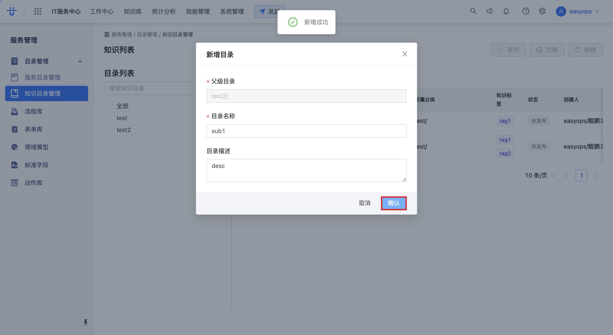
> 🔗 本步调用：`POST /next/api/gateway/logic.flowable_service/api/flowable_service/v1/knowledge_base/catalog`（parentId=父目录 id，详见 openapi.yaml 的「知识目录增删改」）。

## 五、浏览目录树

展开目录树查看层级与子目录。

### 步骤 1：点击「caret-down」展开目录
<!-- url: itsc-service-management/knowledge-catalog | step_id: 26 -->
点击目录节点的下拉箭头（caret-down），展开其下子目录。
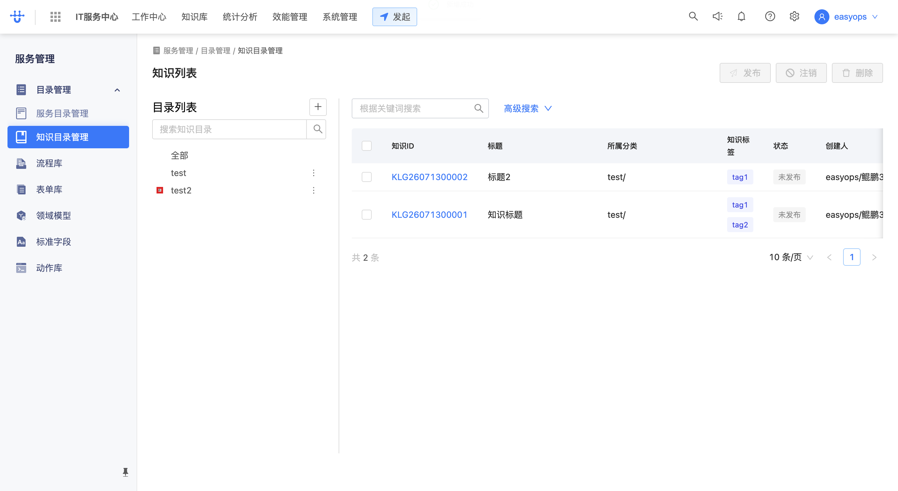

### 步骤 2：点击目录节点定位
<!-- url: itsc-service-management/knowledge-catalog | step_id: 28 -->
在目录树中点击目标目录节点（如「easyops / IT服务中心 / 发起 / 目录」），定位到该目录并查看其下知识。
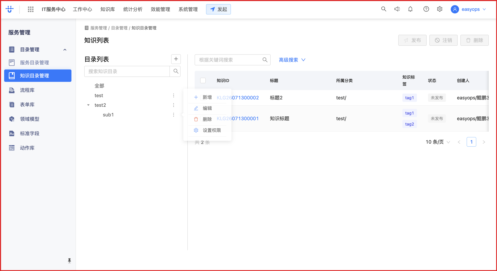
> 💡 提示：目录的层级归属（父目录）可通过「编辑」修改 parentId 实现，详见下一段。

## 六、编辑知识目录

修改目录名称、描述，或通过 parentId 改变其归属（移动）。

### 步骤 1：点击「more」->「编辑」
<!-- url: itsc-service-management/knowledge-catalog | step_id: 30 -->
点击目标目录的「more」->「编辑」，弹出编辑对话框。
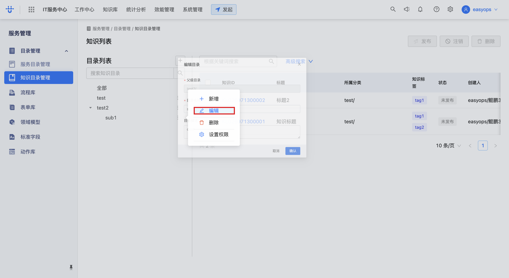

### 步骤 2：修改目录名称
<!-- url: itsc-service-management/knowledge-catalog | step_id: 32 -->
在「请输入目录名称」框中修改名称（如改为「sub01」）。

### 步骤 3：点击「确认」保存
<!-- url: itsc-service-management/knowledge-catalog | api: PUT .../knowledge_base/catalog/{id} | tag: 知识目录增删改 | step_id: 33 -->
点击「确认」保存修改（含 name / description / parentId）。

> 🔗 本步调用：`PUT /next/api/gateway/logic.flowable_service/api/flowable_service/v1/knowledge_base/catalog/{catalogId}`（详见 openapi.yaml 的「知识目录增删改」），提交 name、description、parentId。

## 七、设置目录权限

配置哪些用户/用户组可访问该知识目录。

### 步骤 1：点击「more」->「设置权限」
<!-- url: itsc-service-management/knowledge-catalog | api: GET .../knowledge_base/catalog/{id}/perm | tag: 知识目录权限 | step_id: 35 -->
点击目录的「more」->「设置权限」，打开权限面板并加载当前权限。
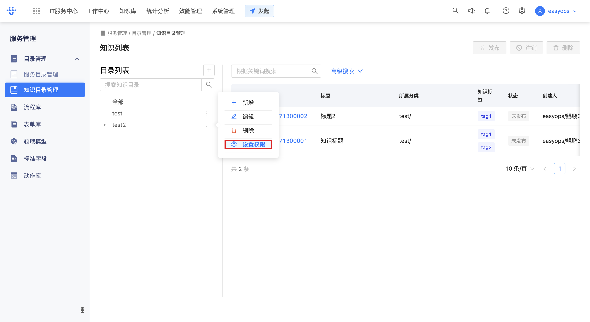
> 🔗 本步调用：`GET /next/api/gateway/logic.flowable_service/api/flowable_service/v1/knowledge_base/catalog/{catalogId}/perm`（详见 openapi.yaml 的「知识目录权限」），回填当前 visitor。

### 步骤 2：点击「请选择用户」
<!-- url: itsc-service-management/knowledge-catalog | api: POST .../object/USER/_search | tag: 用户与用户组搜索 | step_id: 36 -->
点击「请选择用户」，弹出选人框并搜索用户/用户组。
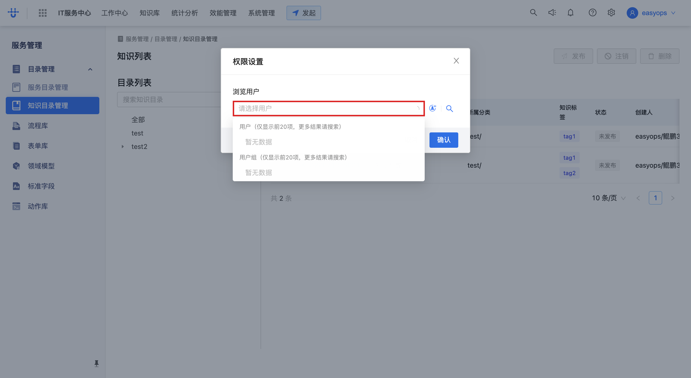
> 🔗 本步调用：`POST .../object/USER/instance/_search` 与 `.../USER_GROUP/instance/_search`（详见 openapi.yaml 的「用户与用户组搜索」）。

### 步骤 3：选中用户与用户组
<!-- url: itsc-service-management/knowledge-catalog | step_id: 38 -->
在搜索结果中勾选用户（如 test0001）与用户组（如 test）。
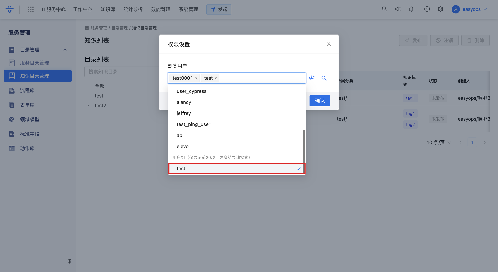

### 步骤 4：点击「确认」保存权限
<!-- url: itsc-service-management/knowledge-catalog | api: POST .../knowledge_base/catalog/{id}/perm | tag: 知识目录权限 | step_id: 39 -->
点击「确认」，保存目录的访问权限（visitor 列表）。
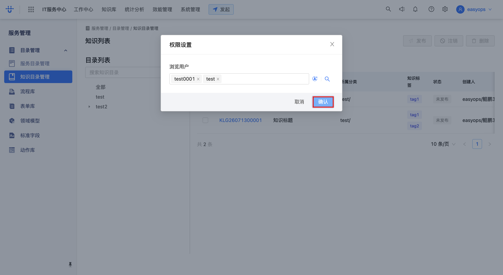
> 🔗 本步调用：`POST /next/api/gateway/logic.flowable_service/api/flowable_service/v1/knowledge_base/catalog/{catalogId}/perm`（visitor=用户与用户组列表，详见 openapi.yaml 的「知识目录权限」）。

## 八、删除知识目录

删除一个知识目录。

### 步骤 1：点击「more」->「删除」
<!-- url: itsc-service-management/knowledge-catalog | step_id: 41 -->
点击目录的「more」->「删除」，弹出确认框。
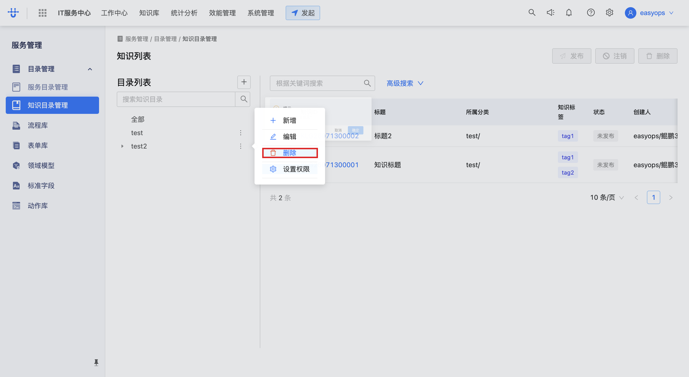

### 步骤 2：点击「确定」确认删除
<!-- url: itsc-service-management/knowledge-catalog | api: DELETE .../knowledge_base/catalog/{id} | tag: 知识目录增删改 | step_id: 42 -->
点击「确定」，删除该目录。
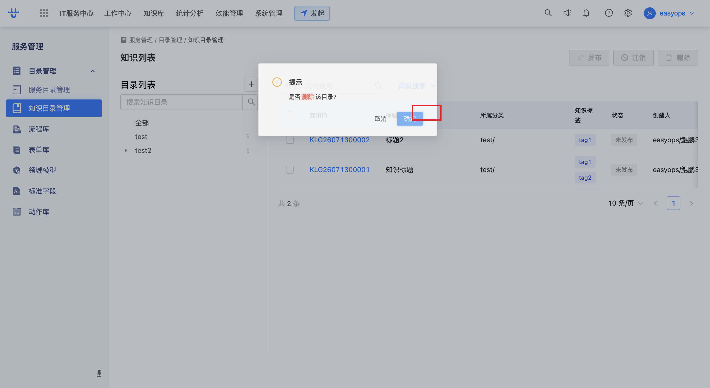
> 🔗 本步调用：`DELETE /next/api/gateway/logic.flowable_service/api/flowable_service/v1/knowledge_base/catalog/{catalogId}`（详见 openapi.yaml 的「知识目录增删改」）。

## 九、搜索知识条目

在知识列表中按关键词搜索知识条目。

### 步骤 1：输入知识关键词
<!-- url: itsc-service-management/knowledge-catalog?page=1&q={关键词} | step_id: 43 -->
在「根据关键词搜索」框中输入关键词（如「知识」），过滤知识列表。
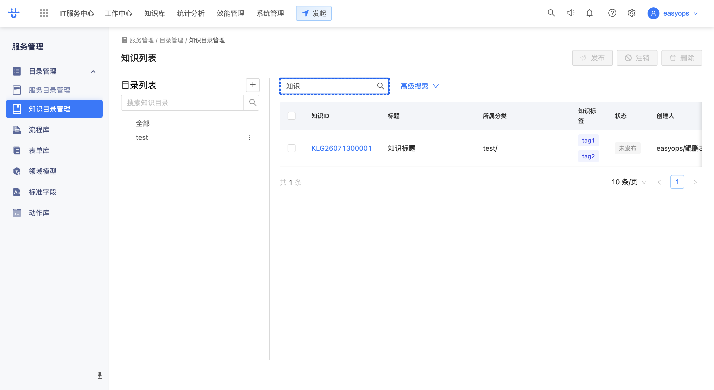
> 💡 提示：输入过程不截图，此处展示输入「知识」后的过滤结果。

### 步骤 2：点击搜索
<!-- url: itsc-service-management/knowledge-catalog?page=1&q={关键词} | step_id: 44 -->
点击搜索按钮（或回车），加载匹配的知识条目。
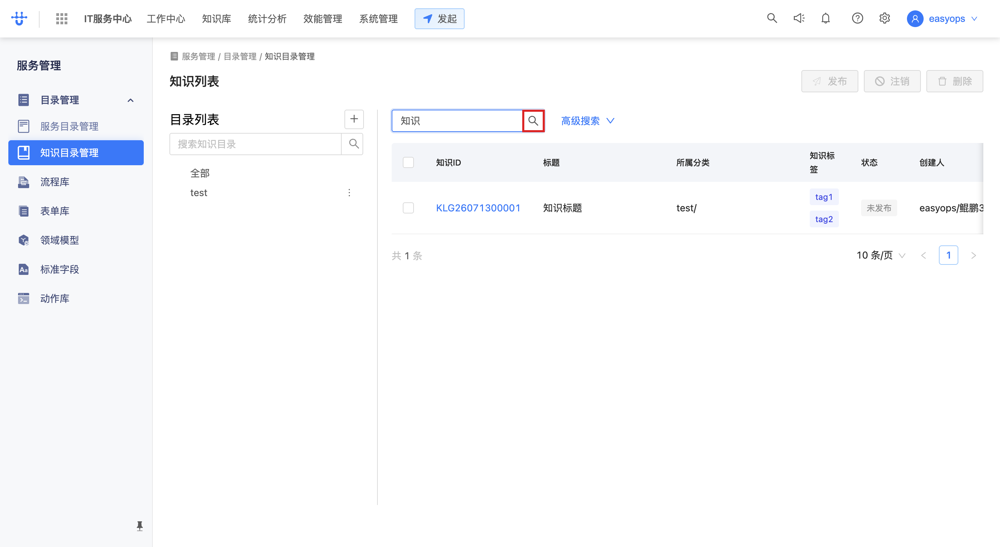

## 十、知识条目发布/注销/删除

对知识条目执行批量状态变更或删除。

### 步骤 1：点击「发布」
<!-- url: itsc-service-management/knowledge-catalog | api: PUT .../knowledge_base/bulk/status/knowledge | tag: 知识条目状态管理 | step_id: 45 -->
选中知识条目后点击「发布」，将草稿知识发布为已发布（status=published）。
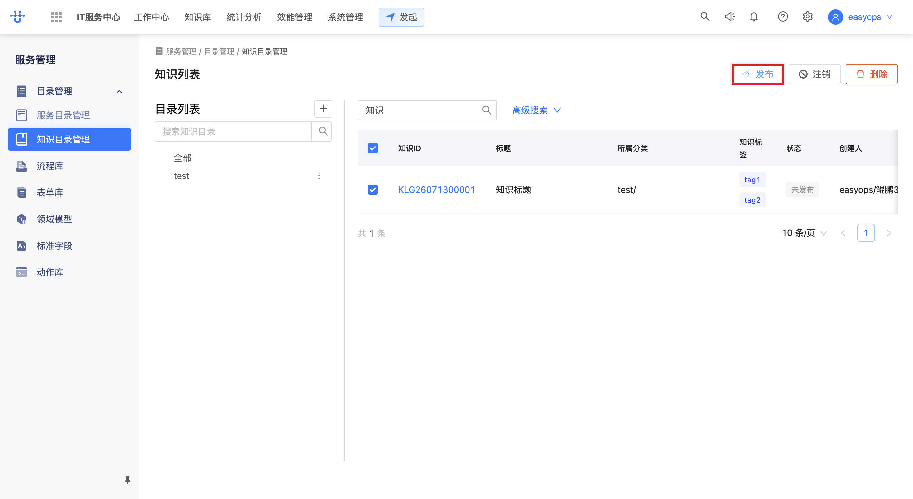
> 🔗 本步调用：`PUT /next/api/gateway/logic.flowable_service/api/flowable_service/v1/knowledge_base/bulk/status/knowledge`（status=published，详见 openapi.yaml 的「知识条目状态管理」）。

### 步骤 2：点击「注销」
<!-- url: itsc-service-management/knowledge-catalog | api: PUT .../knowledge_base/bulk/status/knowledge | tag: 知识条目状态管理 | step_id: 46 -->
选中已发布知识后点击「注销」，将知识置为已注销（status=cancelled）。
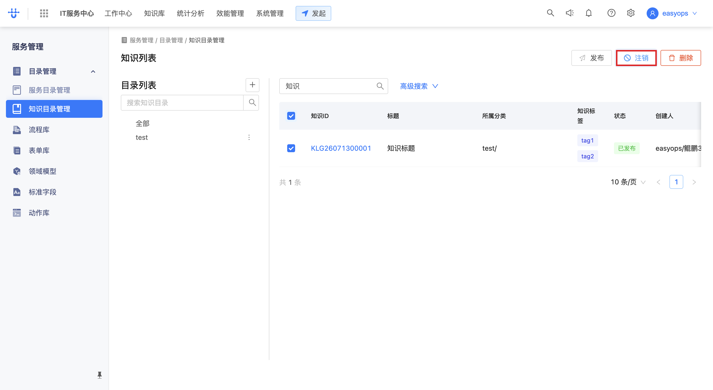
> 🔗 本步调用：同上 `PUT .../bulk/status/knowledge`（status=cancelled）。

### 步骤 3：点击「删除」->「确定」
<!-- url: itsc-service-management/knowledge-catalog | api: POST .../knowledge_base/bulk/delete/knowledge | tag: 知识条目状态管理 | step_id: 48 -->
选中知识后点击「删除」，在确认框点击「确定」，永久删除该知识条目。
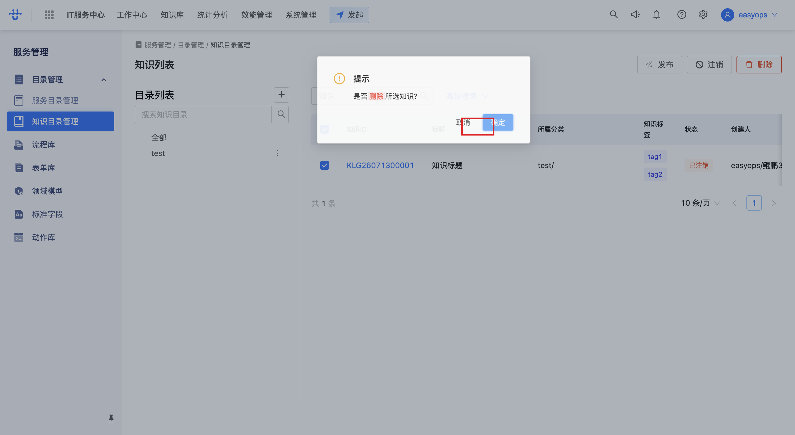
> 🔗 本步调用：`POST /next/api/gateway/logic.flowable_service/api/flowable_service/v1/knowledge_base/bulk/delete/knowledge`（knowledgeIds 列表，详见 openapi.yaml 的「知识条目状态管理」）。

## 附：本流程接口速查

| tag | 方法 | 路径（简） | 用途 | 步骤 |
| --- | --- | --- | --- | --- |
| 知识目录树与列表 | GET | `.../knowledge_base.GetCatalogTree/.../knowledge_base/catalog_tree` | 加载知识目录树 | 一-3 |
| 知识目录树与列表 | GET | `.../knowledge_base.ListKnowledge/.../knowledge_base/knowledge` | 加载知识列表 | 一-3 |
| 知识目录增删改 | POST | `.../logic.flowable_service/.../knowledge_base/catalog` | 新建目录/子目录（parentId 区分） | 三-4、四-4 |
| 知识目录增删改 | PUT | `.../logic.flowable_service/.../knowledge_base/catalog/{id}` | 编辑目录（name/description/parentId） | 六-3 |
| 知识目录增删改 | DELETE | `.../logic.flowable_service/.../knowledge_base/catalog/{id}` | 删除目录 | 八-2 |
| 知识目录权限 | GET | `.../logic.flowable_service/.../knowledge_base/catalog/{id}/perm` | 查询目录权限 | 七-1 |
| 知识目录权限 | POST | `.../logic.flowable_service/.../knowledge_base/catalog/{id}/perm` | 设置目录权限（visitor） | 七-4 |
| 知识条目状态管理 | PUT | `.../logic.flowable_service/.../knowledge_base/bulk/status/knowledge` | 发布/注销知识（status=published/cancelled） | 十-1、十-2 |
| 知识条目状态管理 | POST | `.../logic.flowable_service/.../knowledge_base/bulk/delete/knowledge` | 批量删除知识 | 十-3 |
| 用户与用户组搜索 | POST | `.../cmdb.instance.PostSearch/object/USER/instance/_search` | 搜索用户 | 七-2 |
| 用户与用户组搜索 | POST | `.../cmdb.instance.PostSearch/object/USER_GROUP/instance/_search` | 搜索用户组 | 七-2 |
