# ITSM 系统管理 · 组织架构管理 - 操作指引

> 适用场景：在 ITSM 工作台的「系统管理 -> 组织架构管理」中，完成科室（部门）的**搜索定位、新增子科室、编辑、删除**，以及对科室**添加/移除成员、设置主管**，最后**下载导入模板、导出**组织数据。看完即可独立管理一棵组织科室树。
> 配套接口：见同目录 [`ITSM-系统管理-组织架构管理-openapi.yaml`](./ITSM-系统管理-组织架构管理-openapi.yaml)。
>
> 截图标注图例：🔴红框=点击 / 🔵蓝虚线框=输入 / 🟠橙框+▾=下拉 / 🟣紫圈=单复选 / 🟢绿粗框=提交。

## 目录
- [一、进入组织架构管理](#一进入组织架构管理)
- [二、搜索并选中科室](#二搜索并选中科室)
- [三、科室添加成员](#三科室添加成员)
- [四、移除科室成员](#四移除科室成员)
- [五、设置科室主管](#五设置科室主管)
- [六、新增子科室](#六新增子科室)
- [七、编辑科室](#七编辑科室)
- [八、删除科室](#八删除科室)
- [九、下载导入模板](#九下载导入模板)
- [十、导出科室数据](#十导出科室数据)
- [附：本流程接口速查](#附本流程接口速查)

<!-- deep-links: 本流程关键页面直达（SPA 路径，去掉 host 前缀，参数化）
  工作台:           itsc-workbench/workbench
  组织架构管理(全部):  itsc-user-authority/organize-management?department=all
  指定科室详情:       itsc-user-authority/organize-management?department={departmentId}&page=1
-->

## 一、进入组织架构管理

从工作台导航到组织架构管理页，左侧展示整棵科室树。

### 步骤 1：点击顶部「系统管理」
<!-- url: itsc-workbench/workbench | step_id: 1 -->
在工作台顶部导航栏点击「系统管理」，展开系统管理子菜单。

> 💡 提示：若已直接处于组织架构管理页，可跳过本段。

### 步骤 2：进入「用户权限」模块
<!-- url: itsc-workbench/workbench | step_id: 2 -->
在系统管理菜单中点击进入「用户权限」模块，页面加载用户与组织相关数据。

> 🔗 本步调用：`GET /next/api/gateway/logic.user_service/api/v1/users/orgs`（当前用户可见组织）等多项初始化查询（详见 openapi.yaml 的「科室树与详情」）。

### 步骤 3：进入「组织架构管理」
<!-- url: itsc-user-authority/organize-management?department=all | api: GET .../organization/department_tree | tag: 科室树与详情 | step_id: 3 -->
切换到「组织架构管理」页签，左侧加载完整科室树（含父子层级）。
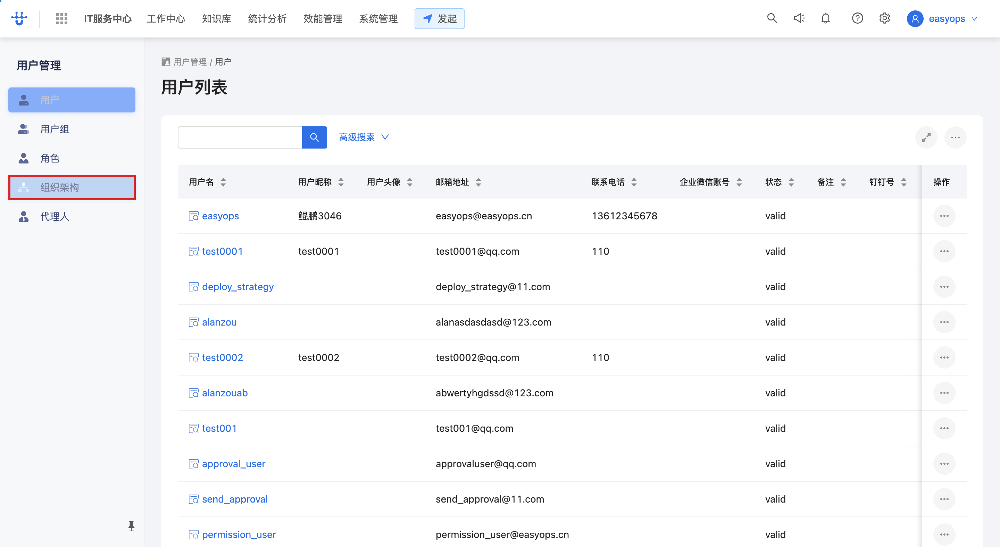
> 🔗 本步调用：`GET /next/api/gateway/logic.sys_setting/api/sys_setting/v1/organization/department_tree`（详见 openapi.yaml 的「科室树与详情」），并触发全部用户检索。

## 二、搜索并选中科室

科室树层级较深时，用搜索框快速定位到目标科室并进入其详情。

### 步骤 1：在搜索框输入科室名关键词
<!-- url: itsc-user-authority/organize-management?department=all | step_id: 4 -->
在科室树上方搜索框输入关键词（如「科室1」），实时过滤匹配的科室。
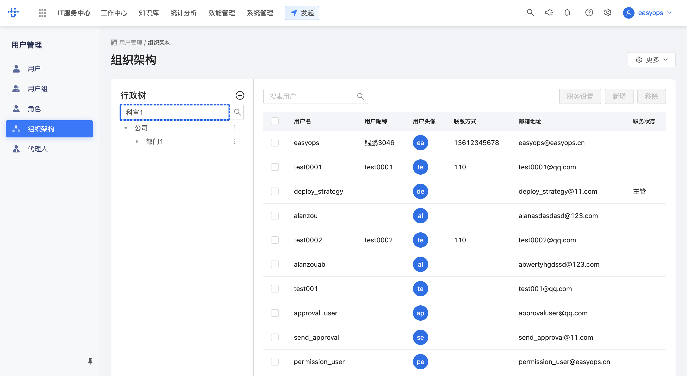
> 💡 提示：输入过程不截图，失焦/确认时才截屏；此处展示输入完成后的状态。

### 步骤 2：点击搜索结果展开下拉
<!-- url: itsc-user-authority/organize-management?department=all | step_id: 6 -->
点击下拉箭头（caret-down）展开命中的科室候选列表。
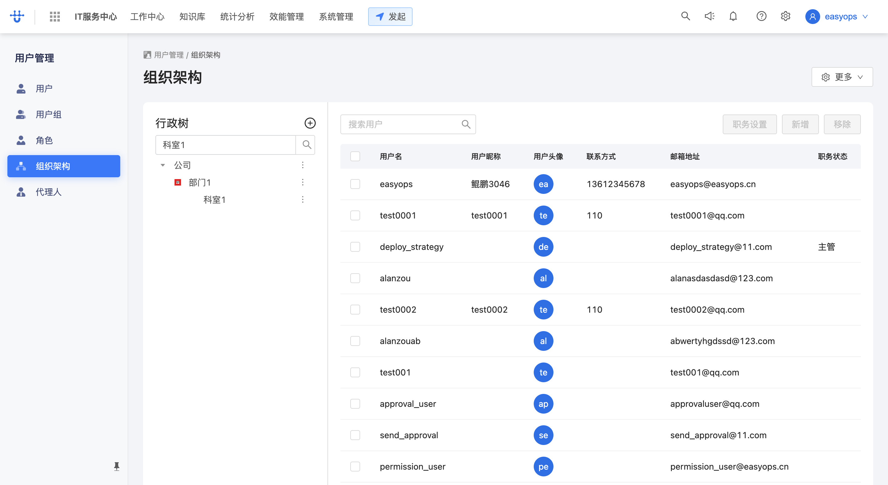

### 步骤 3：选中目标科室
<!-- url: itsc-user-authority/organize-management?department={departmentId}&page=1 | api: GET .../organization/department/{id}/staff | tag: 科室树与详情 | step_id: 7 -->
在候选列表中点击「科室1」进入该科室详情，右侧加载其成员列表。
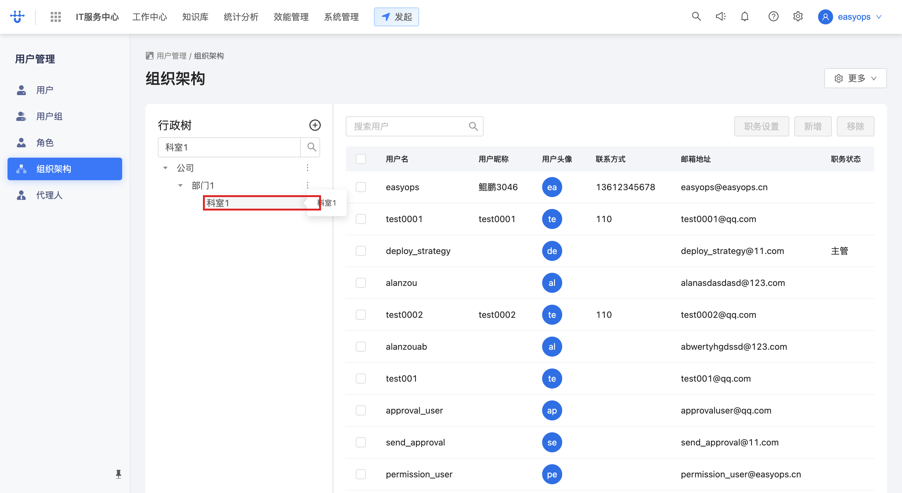
> 🔗 本步调用：`GET /next/api/gateway/logic.sys_setting/api/sys_setting/v1/organization/department/{departmentId}/staff`（详见 openapi.yaml 的「科室成员管理」），并刷新科室树。

## 三、科室添加成员

把已有用户加入到当前科室，作为其成员。

### 步骤 1：点击「新增」打开选人框
<!-- url: itsc-user-authority/organize-management?department={departmentId}&page=1 | api: POST .../object/USER/instance/_search | tag: 用户搜索 | step_id: 8 -->
在成员列表上方点击「新增」按钮，弹出用户选择对话框，并加载可选用户。
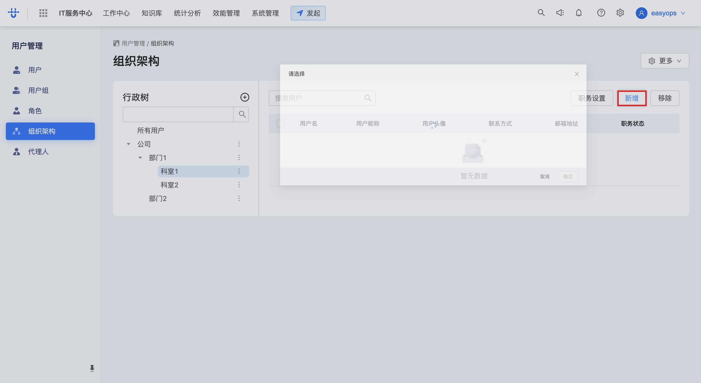
> 🔗 本步调用：`POST /next/api/gateway/cmdb.instance.PostSearchV3/v3/object/USER/instance/_search`（详见 openapi.yaml 的「用户搜索」），检索可添加的用户。

### 步骤 2：选择用户并「确定」
<!-- url: itsc-user-authority/organize-management?department={departmentId}&page=1 | api: POST .../organization/department/{id}/staff | tag: 科室成员管理 | step_id: 9 -->
勾选目标用户后点击「确定」，将所选用户加入当前科室。
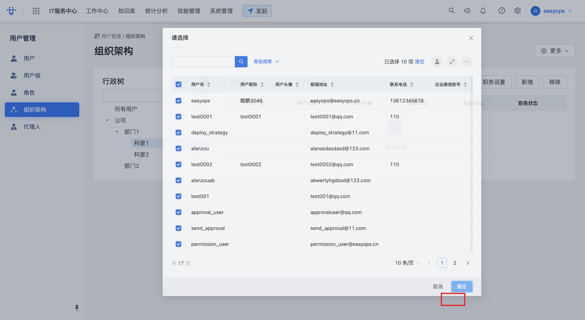
> 🔗 本步调用：`POST /next/api/gateway/logic.sys_setting/api/sys_setting/v1/organization/department/{departmentId}/staff`（action=add，详见 openapi.yaml 的「科室成员管理」），并刷新成员列表与科室树。

## 四、移除科室成员

将成员从当前科室移除。

### 步骤 1：点击成员行的「移除」
<!-- url: itsc-user-authority/organize-management?department={departmentId}&page=1 | step_id: 10 -->
在成员列表中找到要移除的成员，点击其操作列的「移除」按钮，弹出确认框。
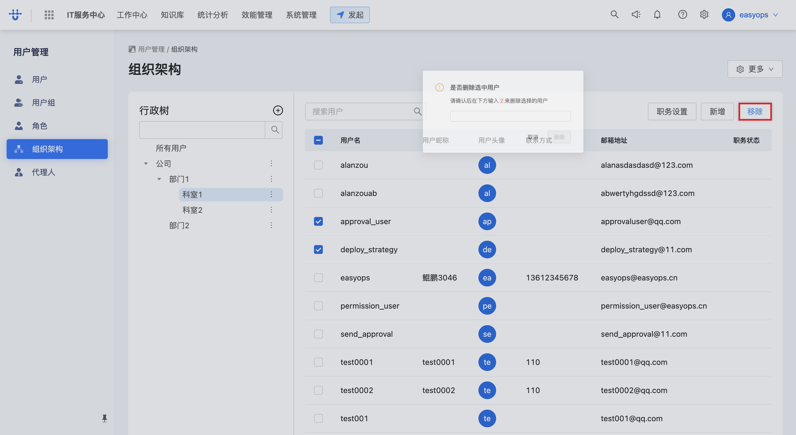

### 步骤 2：输入确认信息
<!-- url: itsc-user-authority/organize-management?department={departmentId}&page=1 | step_id: 11 -->
按页面提示在确认框中输入对应信息（如数量/标识），以二次确认移除操作。
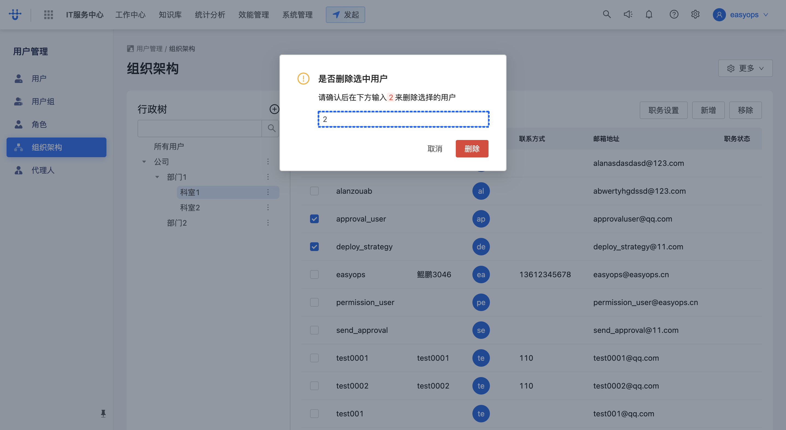
> ⚠️ 提示：此步为危险操作的二次确认输入，请按页面实际提示填写，避免误删。

### 步骤 3：点击「删除」确认移除
<!-- url: itsc-user-authority/organize-management?department={departmentId}&page=1 | api: POST .../organization/department/{id}/staff | tag: 科室成员管理 | step_id: 12 -->
点击「删除」完成移除，所选成员从当前科室移出。
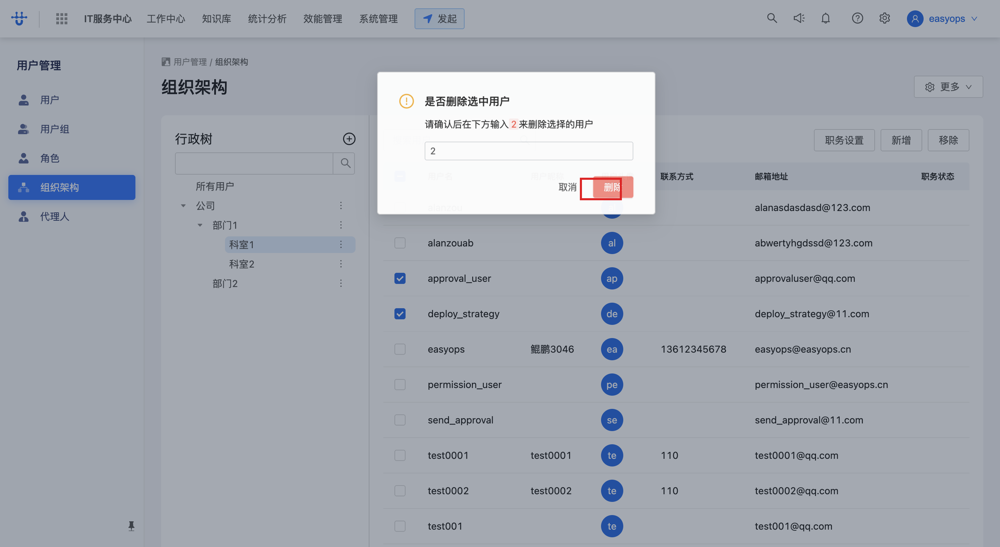
> 🔗 本步调用：`POST /next/api/gateway/logic.sys_setting/api/sys_setting/v1/organization/department/{departmentId}/staff`（action=remove，详见 openapi.yaml 的「科室成员管理」）。

## 五、设置科室主管

为科室设置主管（leader），由其负责该科室事务。

### 步骤 1：点击「职务设置」
<!-- url: itsc-user-authority/organize-management?department={departmentId}&page=1 | api: GET .../organization/department/{id}/staff | tag: 科室成员管理 | step_id: 13 -->
在成员列表上方点击「职务设置」，打开职务分配面板。
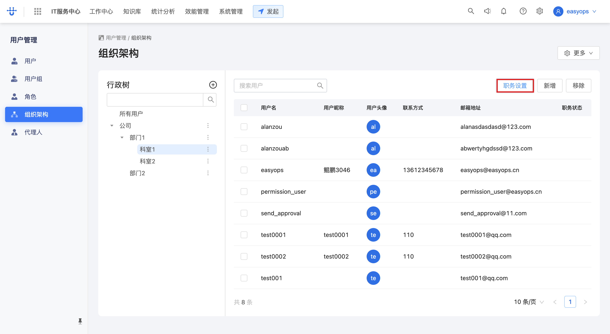
> 🔗 本步调用：`GET /next/api/gateway/logic.sys_setting/api/sys_setting/v1/organization/department/{departmentId}/staff`（详见 openapi.yaml 的「科室成员管理」），重新加载成员。

### 步骤 2：选择职务「主管」
<!-- url: itsc-user-authority/organize-management?department={departmentId}&page=1 | step_id: 14 -->
在职务选择中选取「主管」岗位。
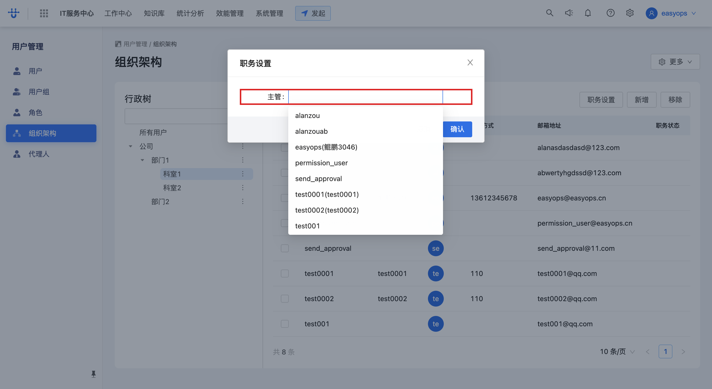

### 步骤 3：选择担任主管的用户
<!-- url: itsc-user-authority/organize-management?department={departmentId}&page=1 | step_id: 15 -->
在候选用户中点选要设为主管的人员（如 alanzou）。
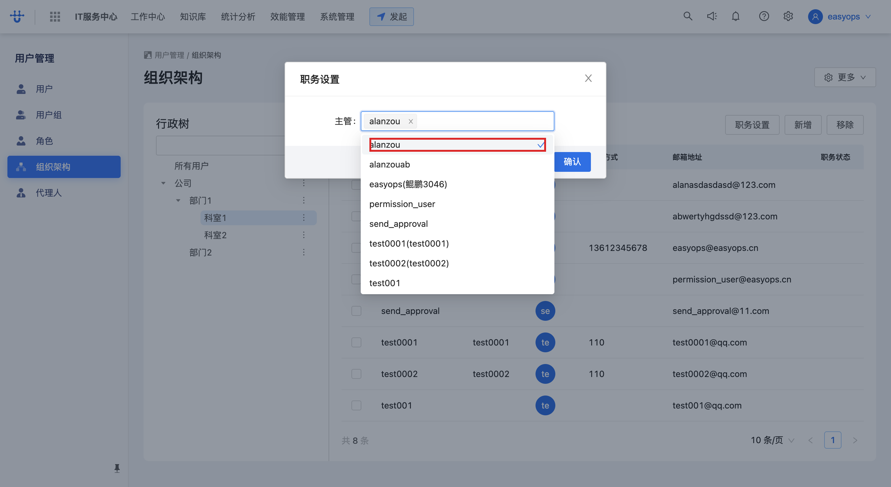

### 步骤 4：点击「确认」设置主管
<!-- url: itsc-user-authority/organize-management?department={departmentId}&page=1 | api: POST .../organization/bulk/{id}/staff_position | tag: 科室职务设置 | step_id: 16 -->
点击「确认」，将所选用户设为该科室主管。
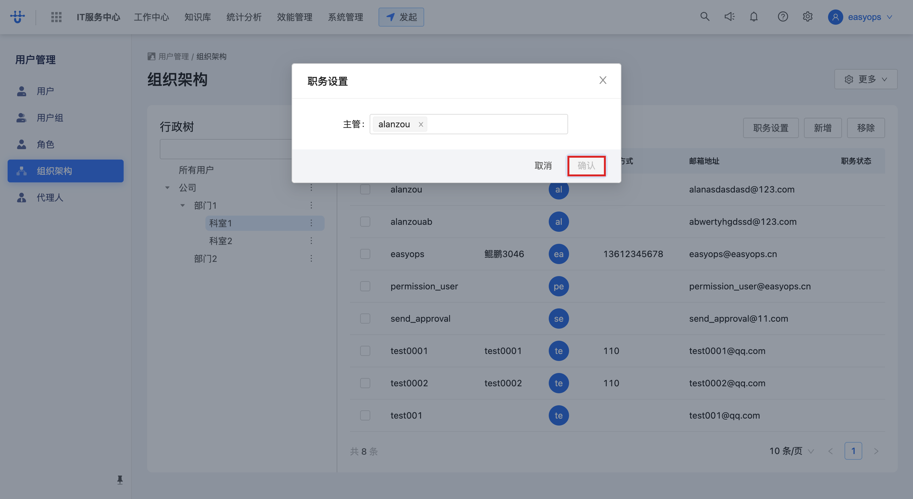
> 🔗 本步调用：`POST /next/api/gateway/logic.sys_setting/api/sys_setting/v1/organization/bulk/{departmentId}/staff_position`（position=leader，详见 openapi.yaml 的「科室职务设置」）。

## 六、新增子科室

在当前科室下新建一个子科室。

### 步骤 1：点击「more」展开操作菜单
<!-- url: itsc-user-authority/organize-management?department={departmentId}&page=1 | step_id: 17 -->
点击科室操作区的「more」按钮，展开更多操作菜单。
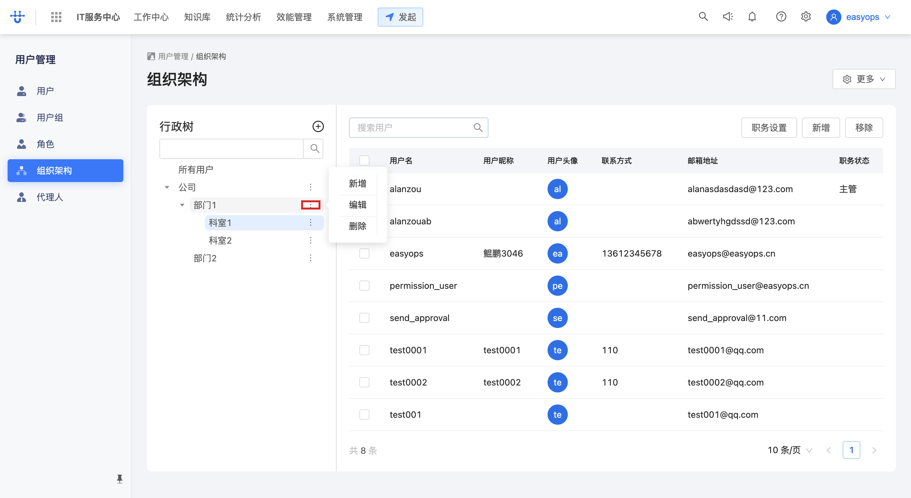

### 步骤 2：点击「新增」
<!-- url: itsc-user-authority/organize-management?department={departmentId}&page=1 | step_id: 18 -->
在 more 菜单中点击「新增」，弹出新增子科室对话框。
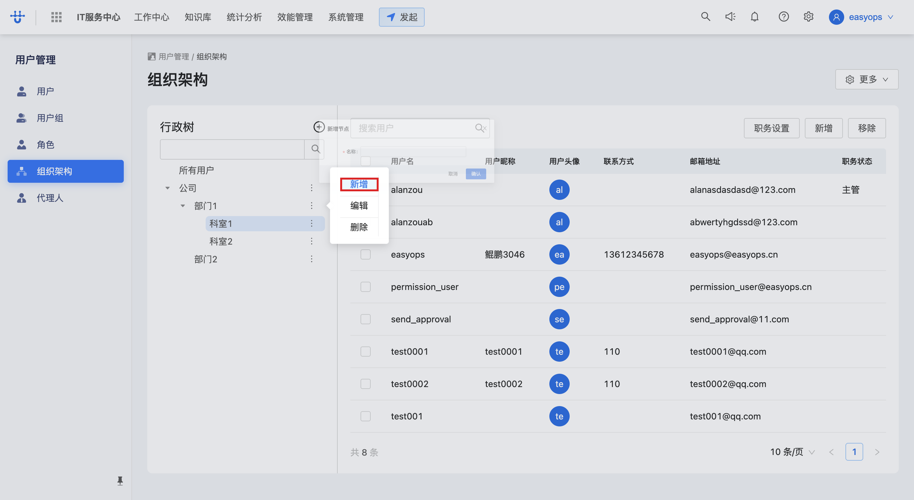

### 步骤 3：输入新科室名称
<!-- url: itsc-user-authority/organize-management?department={departmentId}&page=1 | step_id: 19 -->
在对话框中输入新科室名称（如「科室3」）。
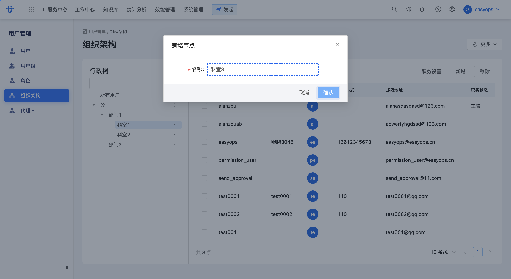

### 步骤 4：点击「确认」创建
<!-- url: itsc-user-authority/organize-management?department={departmentId}&page=1 | api: POST .../organization/department | tag: 科室增删改 | step_id: 20 -->
点击「确认」，在当前科室下创建子科室。
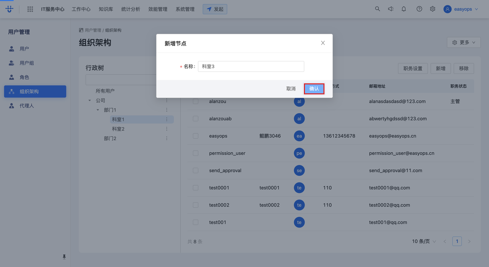
> 🔗 本步调用：`POST /next/api/gateway/logic.sys_setting/api/sys_setting/v1/organization/department`（详见 openapi.yaml 的「科室增删改」），返回新科室 departmentId。

## 七、编辑科室

修改科室名称等信息。

### 步骤 1：点击「more」展开操作菜单
<!-- url: itsc-user-authority/organize-management?department={departmentId}&page=1 | step_id: 21 -->
点击目标科室操作区的「more」按钮。
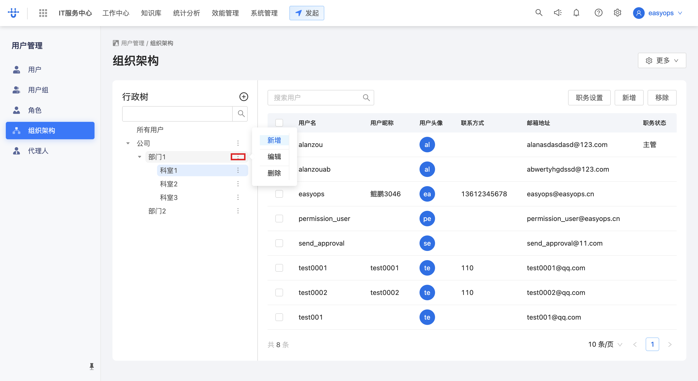

### 步骤 2：点击「编辑」
<!-- url: itsc-user-authority/organize-management?department={departmentId}&page=1 | step_id: 22 -->
在 more 菜单中点击「编辑」，弹出编辑对话框。
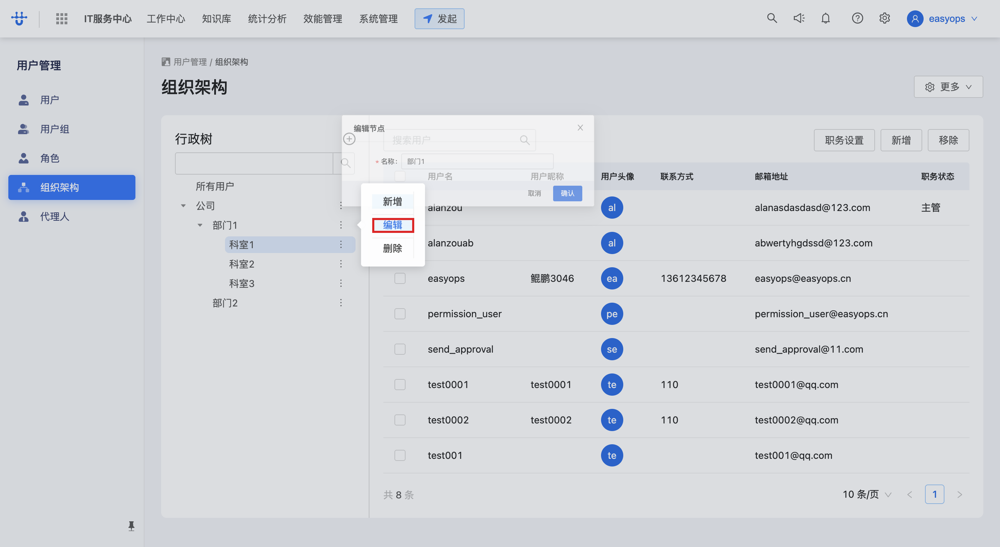

### 步骤 3：输入新名称
<!-- url: itsc-user-authority/organize-management?department={departmentId}&page=1 | step_id: 23 -->
在对话框中修改科室名称（如改为「部门01」）。
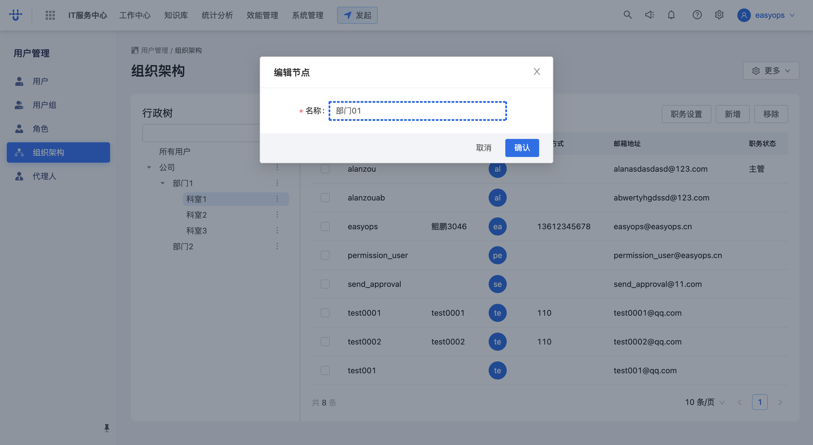

### 步骤 4：点击「确认」保存
<!-- url: itsc-user-authority/organize-management?department={departmentId}&page=1 | api: PUT .../organization/department/{id} | tag: 科室增删改 | step_id: 24 -->
点击「确认」保存修改。
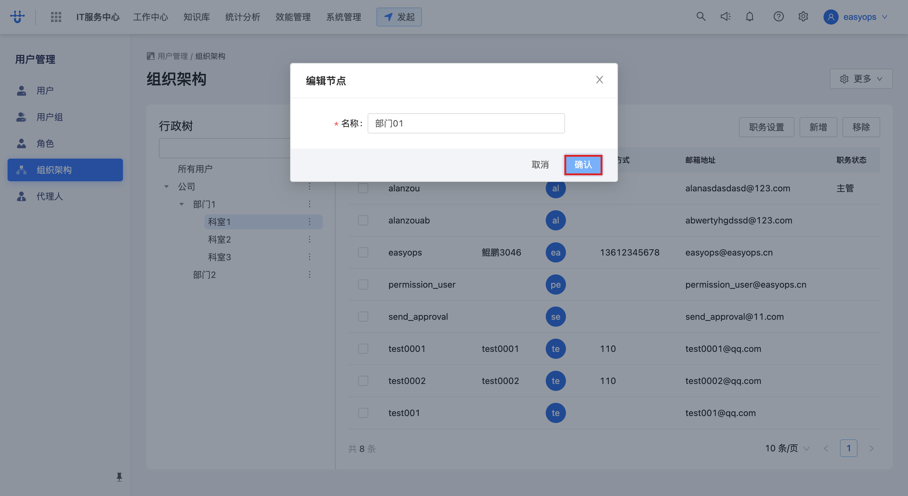
> 🔗 本步调用：`PUT /next/api/gateway/logic.sys_setting/api/sys_setting/v1/organization/department/{departmentId}`（详见 openapi.yaml 的「科室增删改」）。

## 八、删除科室

删除一个科室，需输入科室名二次确认。

### 步骤 1：点击「more」展开操作菜单
<!-- url: itsc-user-authority/organize-management?department={departmentId}&page=1 | step_id: 25 -->
点击待删科室操作区的「more」按钮。
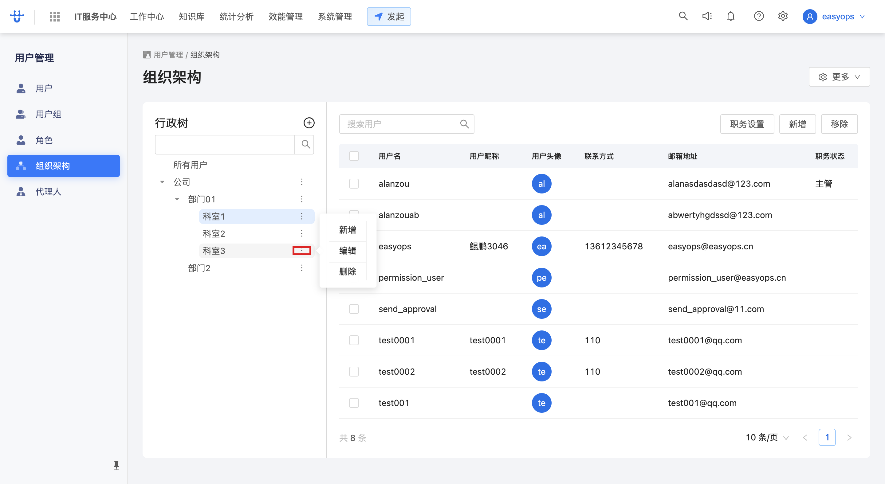

### 步骤 2：点击「删除」
<!-- url: itsc-user-authority/organize-management?department={departmentId}&page=1 | step_id: 26 -->
在 more 菜单中点击「删除」，弹出删除确认框。
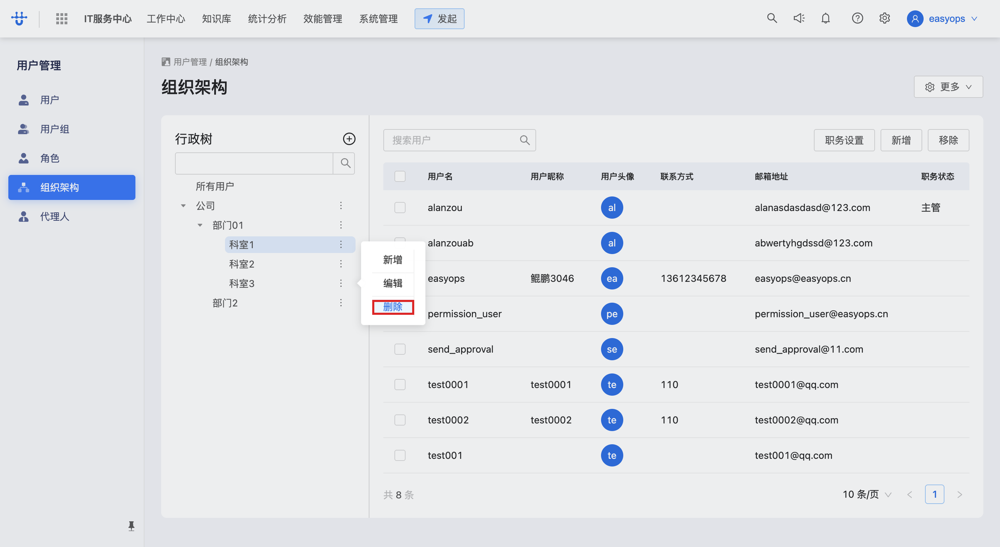

### 步骤 3：选中待删科室
<!-- url: itsc-user-authority/organize-management?department={departmentId}&page=1 | step_id: 27 -->
在确认框中选中/确认要删除的科室（如「科室3」）。
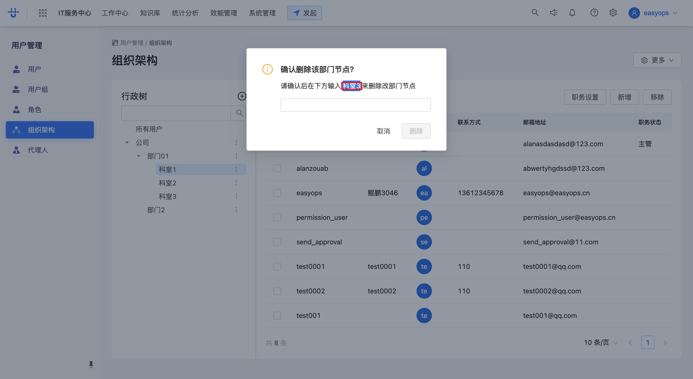

### 步骤 4：输入科室名确认
<!-- url: itsc-user-authority/organize-management?department={departmentId}&page=1 | step_id: 28 -->
按提示输入待删科室名称（如「科室3」）以二次确认，防止误删。
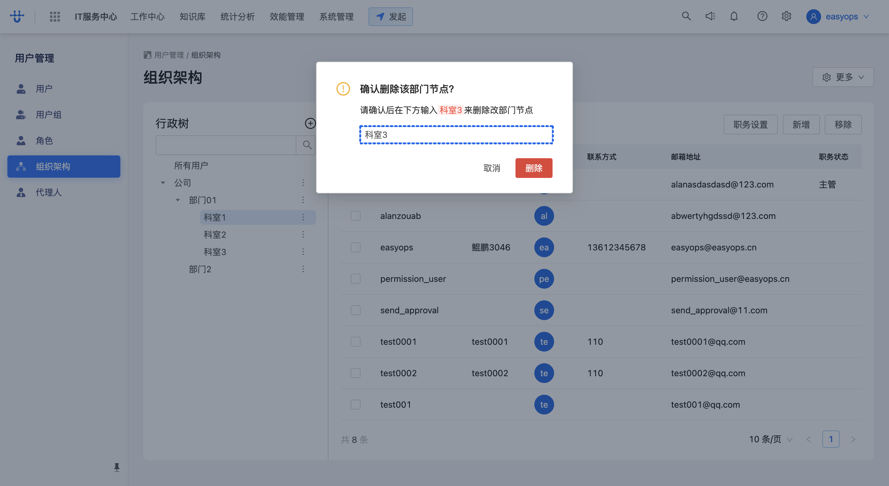
> ⚠️ 提示：输入的名称必须与待删科室完全一致，否则「删除」按钮不可点击。

### 步骤 5：点击「删除」完成
<!-- url: itsc-user-authority/organize-management?department={departmentId}&page=1 | api: DELETE .../organization/department/{id} | tag: 科室增删改 | step_id: 29 -->
点击「删除」，删除该科室。
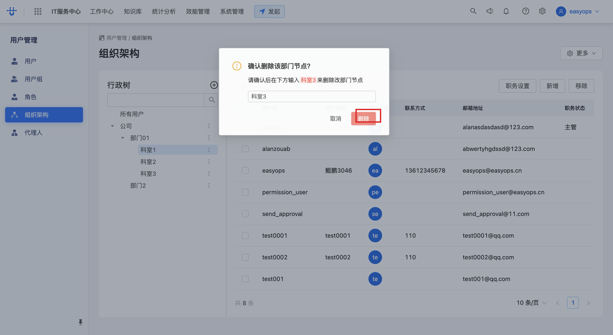
> 🔗 本步调用：`DELETE /next/api/gateway/logic.sys_setting/api/sys_setting/v1/organization/department/{departmentId}`（详见 openapi.yaml 的「科室增删改」）。

## 九、下载导入模板

批量导入科室前，先下载 Excel 导入模板。

### 步骤 1：点击「更多」
<!-- url: itsc-user-authority/organize-management?department={departmentId}&page=1 | step_id: 30 -->
点击页面右上角的「更多」按钮，展开批量操作菜单。
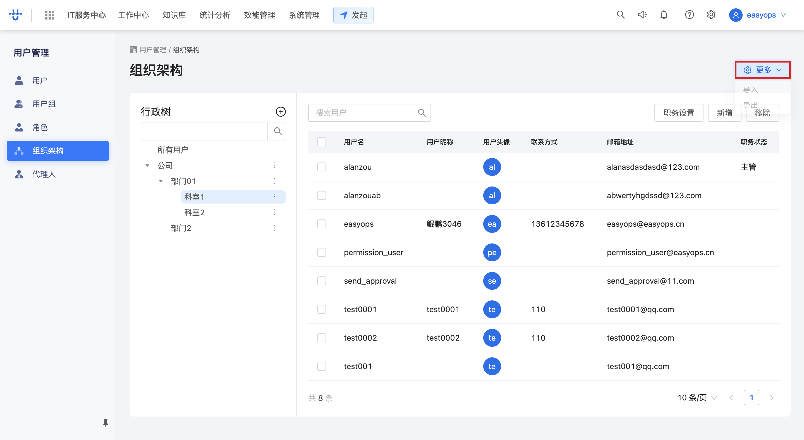

### 步骤 2：点击「导入」
<!-- url: itsc-user-authority/organize-management?department={departmentId}&page=1 | step_id: 31 -->
在更多菜单中点击「导入」，打开导入面板。
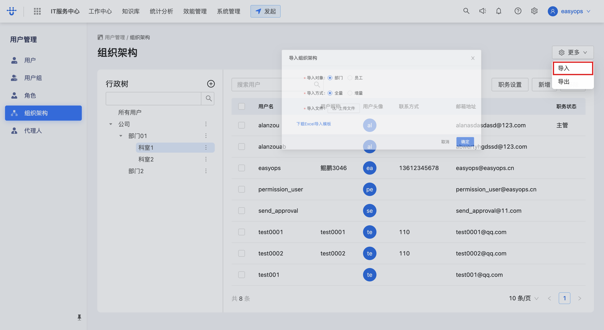

### 步骤 3：点击「下载Excel导入模板」
<!-- url: itsc-user-authority/organize-management?department={departmentId}&page=1 | step_id: 32 -->
点击「下载Excel导入模板」，浏览器开始下载模板文件。
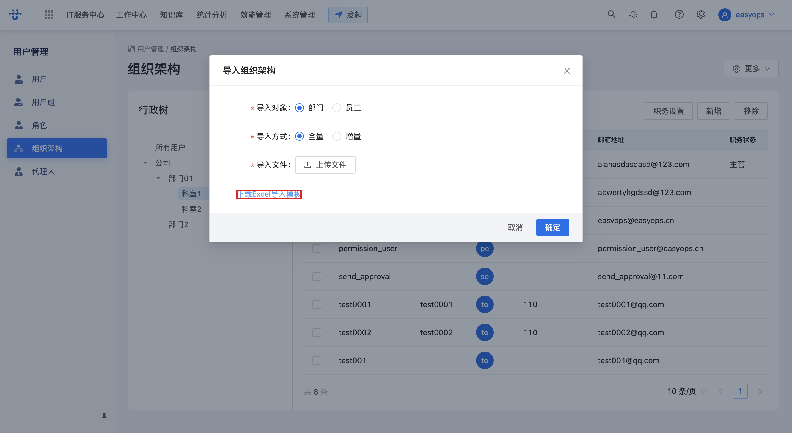
> 💡 提示：下载为浏览器原生下载行为（无业务 API），下载完成后可在浏览器下载页查看。

### 步骤 4：在下载页确认并关闭
<!-- url: chrome://downloads/ | step_id: 35 -->
浏览器跳转到下载页确认文件已下载，点击「Close」返回。
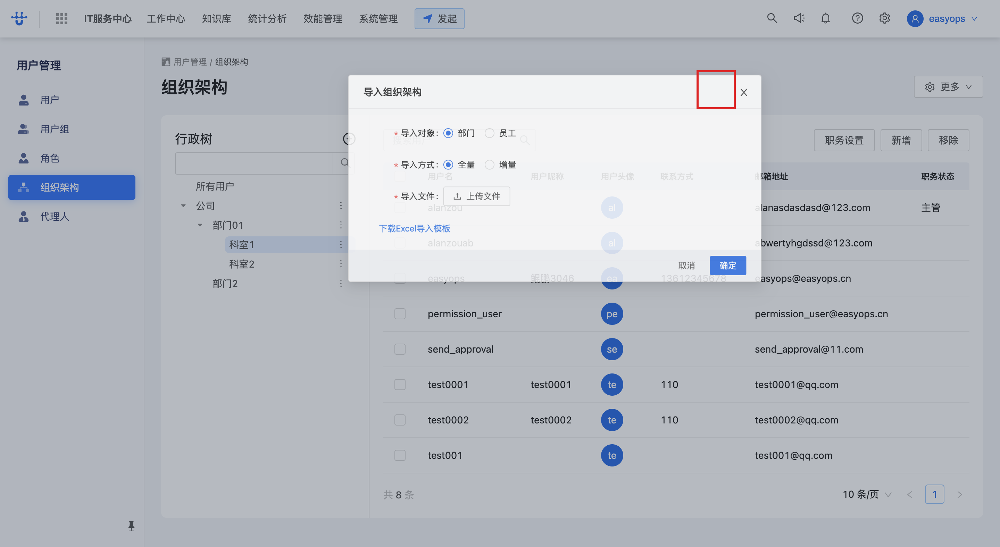
> 💡 提示：步骤 33-34 为浏览器下载页内部操作（文件 ID 列表），无业务接口。

## 十、导出科室数据

将当前科室数据导出为文件。

### 步骤 1：点击「更多」
<!-- url: itsc-user-authority/organize-management?department={departmentId}&page=1 | step_id: 36 -->
点击页面右上角的「更多」按钮，展开批量操作菜单。

### 步骤 2：点击「导出」
<!-- url: itsc-user-authority/organize-management?department={departmentId}&page=1 | step_id: 37 -->
在更多菜单中点击「导出」，弹出导出确认框。
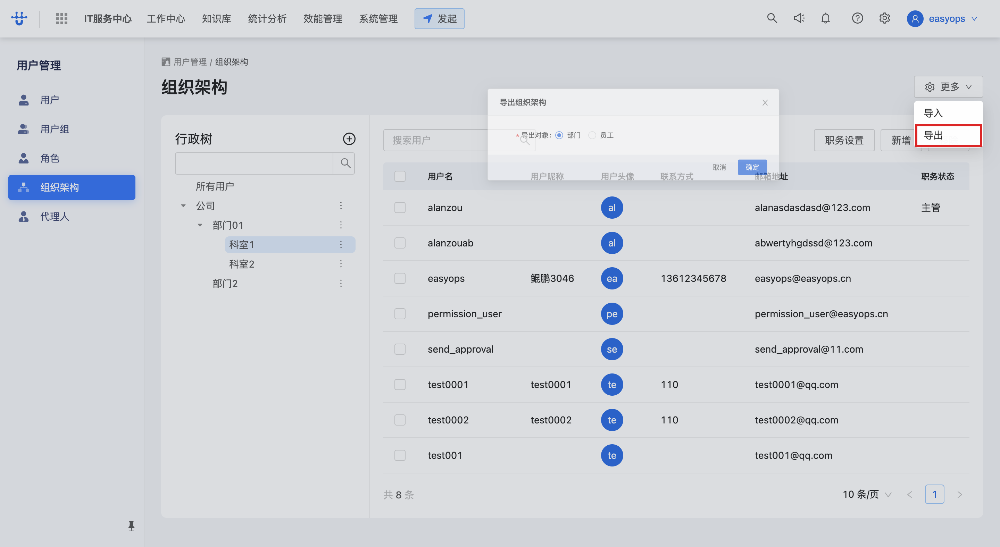

### 步骤 3：点击「确定」开始导出
<!-- url: itsc-user-authority/organize-management?department={departmentId}&page=1 | step_id: 38 -->
点击「确定」，浏览器下载导出文件。
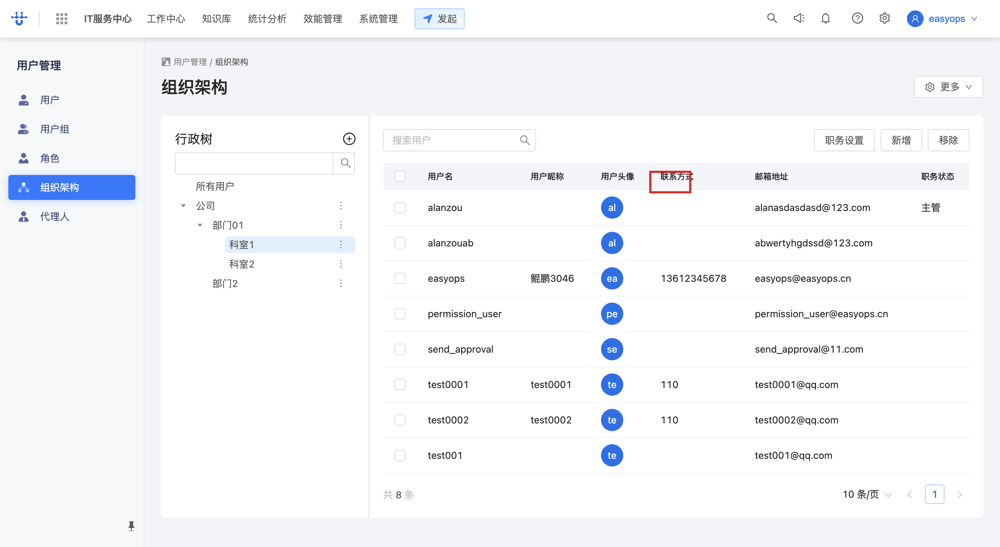
> 💡 提示：导出为浏览器原生下载行为（无业务 API），完成后在下载页查看导出文件。

## 附：本流程接口速查

| tag | 方法 | 路径（简） | 用途 | 步骤 |
| --- | --- | --- | --- | --- |
| 科室树与详情 | GET | `.../logic.sys_setting/api/sys_setting/v1/organization/department_tree` | 加载完整科室树（含父子层级） | 一-3、二-3 |
| 科室成员管理 | GET | `.../logic.sys_setting/api/sys_setting/v1/organization/department/{id}/staff` | 查询科室成员列表 | 二-3、五-1 |
| 科室成员管理 | POST | `.../logic.sys_setting/api/sys_setting/v1/organization/department/{id}/staff` | 添加/移除成员（action=add/remove） | 三-2、四-3 |
| 科室职务设置 | POST | `.../logic.sys_setting/api/sys_setting/v1/organization/bulk/{id}/staff_position` | 设置科室职务（position=leader 主管） | 五-4 |
| 科室增删改 | POST | `.../logic.sys_setting/api/sys_setting/v1/organization/department` | 新增子科室 | 六-4 |
| 科室增删改 | PUT | `.../logic.sys_setting/api/sys_setting/v1/organization/department/{id}` | 编辑科室名称 | 七-4 |
| 科室增删改 | DELETE | `.../logic.sys_setting/api/sys_setting/v1/organization/department/{id}` | 删除科室 | 八-5 |
| 用户搜索 | POST | `.../cmdb.instance.PostSearchV3/v3/object/USER/instance/_search` | 检索可添加的用户（CMDB USER 实例） | 三-1 |
| 用户搜索 | POST | `.../user_service.user_admin.SearchAllUsersInfo/api/v1/users/all` | 检索全部用户（选主管/初始化） | 一-3 |
