# ITSM 系统管理 · 表单管理 - 操作指引

> 适用场景：在 ITSM 工作台的「系统管理 -> 表单管理」中，完成表单的**新建、表单设计（添加/配置字段）、搜索、编辑（新建版本）、版本删除**全流程。表单定义了工单填报表单的结构，支持多版本管理。
> 配套接口：见同目录 [`ITSM-系统管理-表单管理-openapi.yaml`](./ITSM-系统管理-表单管理-openapi.yaml)。
>
> 截图标注图例：🔴红框=点击 / 🔵蓝虚线框=输入 / 🟠橙框+▾=下拉 / 🟣紫圈=单复选 / 🟢绿粗框=提交。

## 目录
- [一、进入表单管理](#一进入表单管理)
- [二、新建表单](#二新建表单)
- [三、表单设计-添加字段](#三表单设计-添加字段)
- [四、搜索表单](#四搜索表单)
- [五、编辑表单-新建版本](#五编辑表单-新建版本)
- [六、删除表单版本](#六删除表单版本)
- [附：本流程接口速查](#附本流程接口速查)

<!-- deep-links: 本流程关键页面直达（SPA 路径，去掉 host 前缀，参数化）
  工作台:        itsc-workbench/workbench
  表单管理列表:   itsc-form-management/form-list
  带关键词搜索:   itsc-form-management/form-list?q={关键词}
  新建表单页:     itsc-form-management/create
  表单版本编辑:   itsc-form-management/{formId}/{versionId}
  新建版本页:     itsc-form-management/{formId}/{versionId}/versionCreate
  版本详情:       itsc-form-management/form-list/{formId}/{versionId}
-->

## 一、进入表单管理

从工作台导航到表单管理列表页，默认加载全部表单。

### 步骤 1：点击顶部「系统管理」
<!-- url: itsc-workbench/workbench | step_id: 1 -->
在工作台顶部导航栏点击「系统管理」，展开系统管理子菜单。

> 💡 提示：步骤 2 为二次点击确认展开菜单。

### 步骤 2：在菜单中点击进入「表单管理」
<!-- url: itsc-form-management/form-list | api: GET .../v1/form, GET .../form_schema_category | tag: 表单列表查询 | step_id: 4 -->
在展开的系统管理菜单中找到并点击「表单管理」，进入表单列表页，自动加载表单列表与分类。
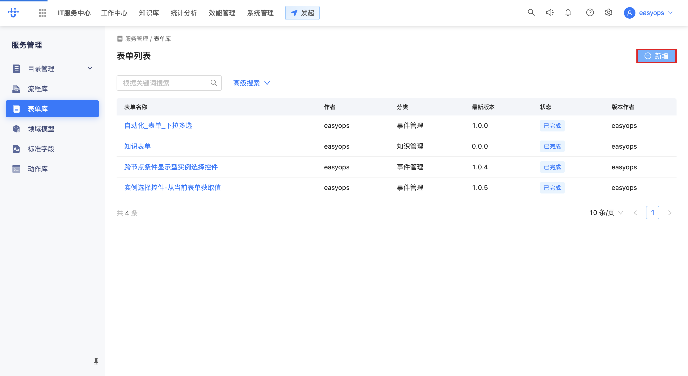
> 🔗 本步调用：`GET /next/api/gateway/logic.flowable_service/api/flowable_service/v1/form`（详见 openapi.yaml 的「表单列表查询」），同时拉取分类 `GET .../form_schema_category`、数据源 `GET .../form_data_source`。

## 二、新建表单

在表单列表页点击「新建」，进入新建表单页填写基本信息（名称、分类、说明、版本号、版本说明）。

### 步骤 1：点击「新建」进入新建表单页
<!-- url: itsc-form-management/create | step_id: 6 -->
在表单列表页点击「新建」按钮，进入新建表单页（含「基本信息」「表单设计」两个 Tab）。
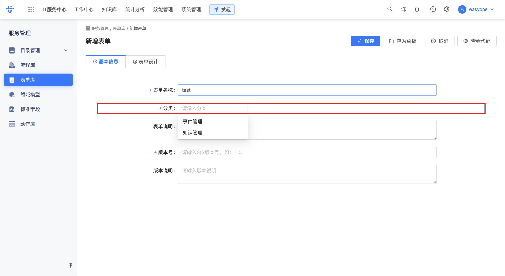

### 步骤 2：填写「表单名称」
<!-- step_id: 7 -->
在「表单名称」输入框填写名称（如 `test`），文本输入不截图，失焦时捕获。
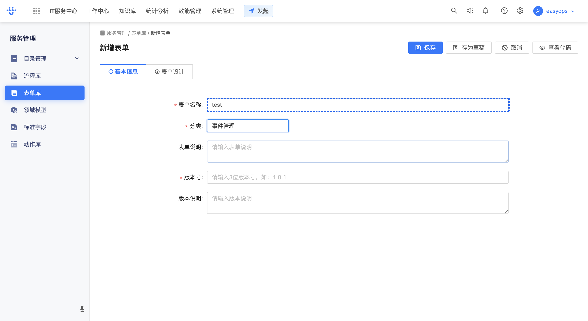

### 步骤 3：选择「分类」
<!-- step_id: 9 -->
点击「分类」下拉，选择表单所属分类（如「事件管理」）。
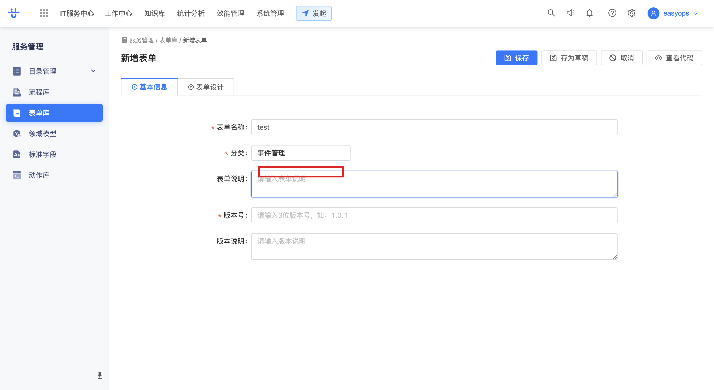
> 💡 提示：分类来源于 `form_schema_category`（如事件管理、知识管理）。

### 步骤 4：填写「表单说明」与「版本号」「版本说明」
<!-- step_id: 14 -->
依次填写：表单说明（如 `init`）、版本号（如 `1.0.0`，需 3 位）、版本说明（如 `init`）。文本输入不截图。
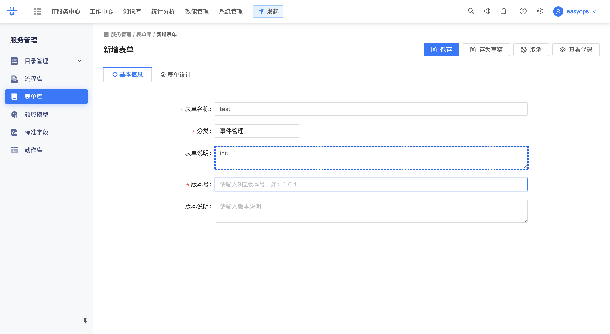
> 💡 提示：版本号格式为 `X.Y.Z` 三位（如 1.0.0）；步骤 15-40 为各字段的逐字符输入过程。

### 步骤 5：完成基本信息填写
<!-- step_id: 41 -->
基本信息（名称、分类、说明、版本号、版本说明）填写完成后，表单进入待设计状态。此时尚未提交后端，需切到「表单设计」配置字段后一并保存。
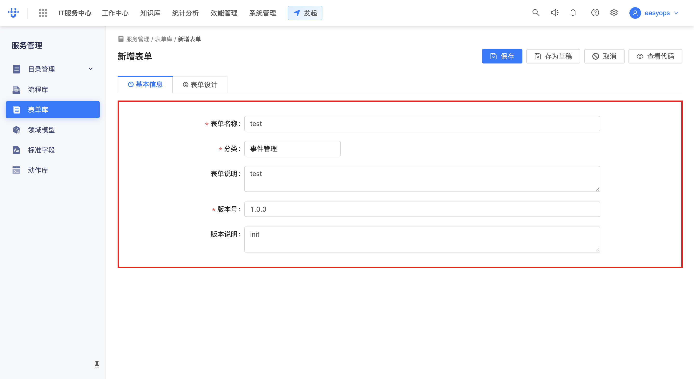
> 💡 提示：步骤 41 为基本信息填写完成的提交动作（前端暂存），真正的表单创建请求在「表单设计」保存时触发（见第三章步骤 6）。

## 三、表单设计-添加字段

保存基本信息后切换到「表单设计」Tab，从控件区拖入字段并配置属性。

### 步骤 1：切换到「表单设计」Tab
<!-- step_id: 42 -->
点击页面上方的「② 表单设计」Tab，进入表单设计器（左侧控件区 + 中间画布 + 右侧属性面板）。
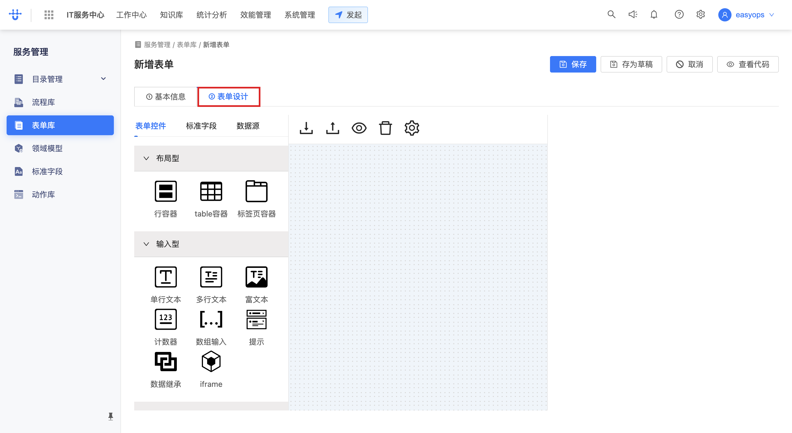
> 🔗 本步调用：`POST /next/api/gateway/flowable_service.standard_field.ListStandardField/...`（加载标准字段），同时 `GET .../object_all` 拉取对象定义。

### 步骤 2：添加「行容器」布局
<!-- step_id: 43 -->
在左侧控件区「布局型」下点击「行容器」，向画布添加一个行容器（用于承载字段）。
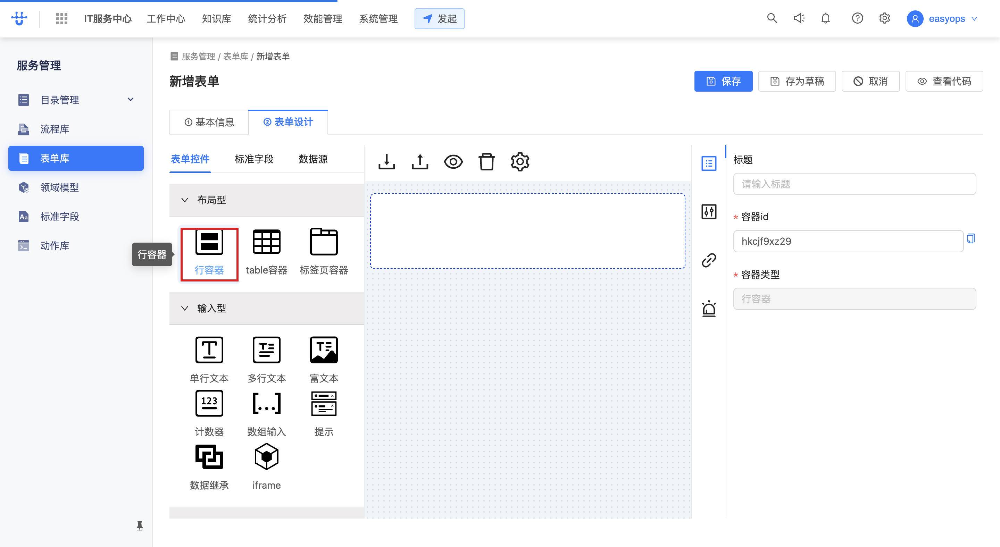

### 步骤 3：添加「单行文本」字段并配置
<!-- step_id: 45 -->
在控件区「标准字段」下点击「单行文本」，向行容器添加一个单行文本字段。
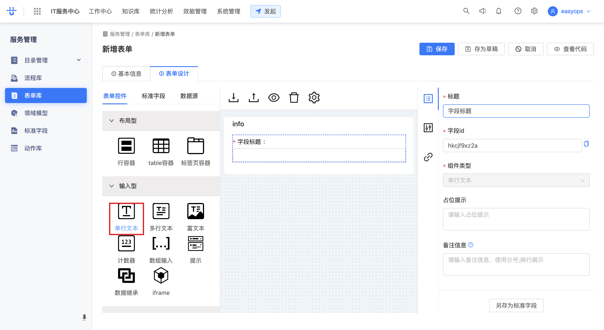

### 步骤 4：配置字段属性（标题/占位提示/默认值）
<!-- step_id: 44 -->
在右侧属性面板配置该字段：标题（如 `info`）、占位提示（如 `标题`）、默认值（如 `defalt`）。
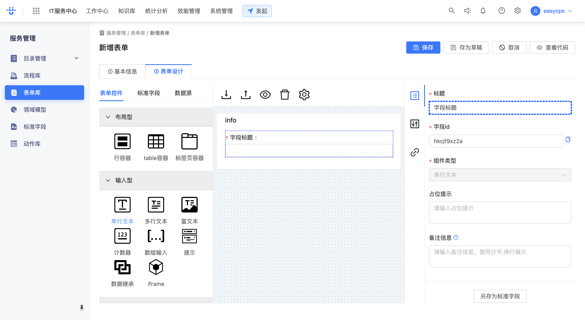
> 💡 提示：步骤 46-67 为标题/占位提示的逐字符输入过程（含中文输入法选拼音），最终值见各步 value。占位提示最终为 `标题`，默认值为 `defalt`。

### 步骤 5：预览并关闭属性面板
<!-- step_id: 70 -->
点击属性面板的「eye」图标可预览字段效果，配置完成后点「Close」收起属性面板。
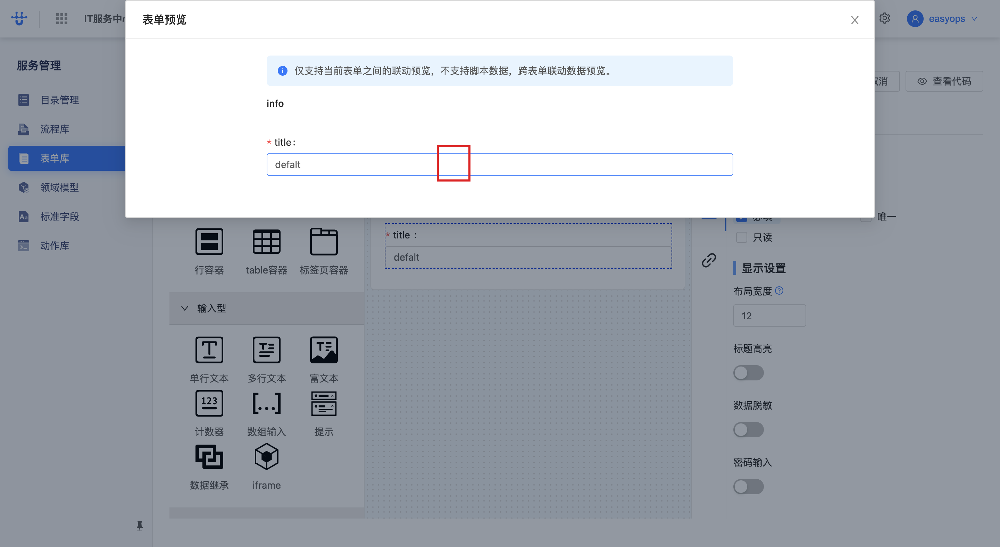

### 步骤 6：点击「保存」提交表单（创建）
<!-- api: POST .../v2/form | tag: 表单创建 | step_id: 72 -->
字段配置完成后点击页面底部「保存」按钮，提交创建表单（含基本信息 + formDefinition 字段定义）。
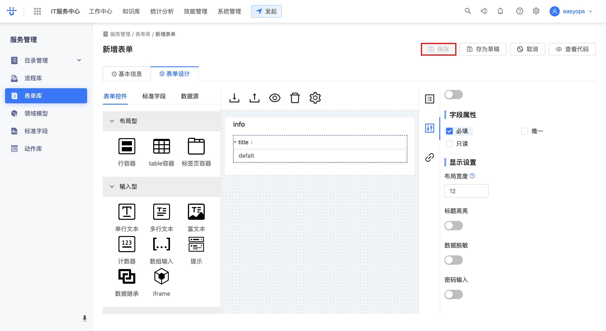
> 🔗 本步调用：`POST /next/api/gateway/logic.flowable_service/api/flowable_service/v2/form`（详见 openapi.yaml 的「表单创建」），body 含 name/category/versionName/versionMemo/memo/state/formDefinition。保存成功后返回版本 instanceId，并刷新表单列表。

## 四、搜索表单

表单较多时，通过关键词快速定位，或用高级搜索按状态、作者、分类组合筛选。

### 步骤 1：在搜索框输入关键词
<!-- url: itsc-form-management/form-list?q={关键词} | step_id: 74 -->
在列表上方搜索框输入关键词（如 `test`），失焦时捕获。
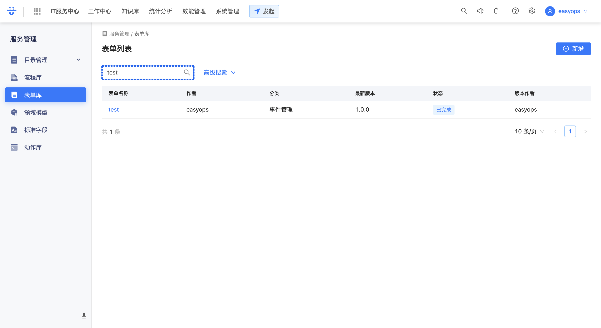

### 步骤 2：点击「高级搜索」展开条件区
<!-- step_id: 75 -->
点击搜索框右侧的「高级搜索」，展开多字段条件配置区。
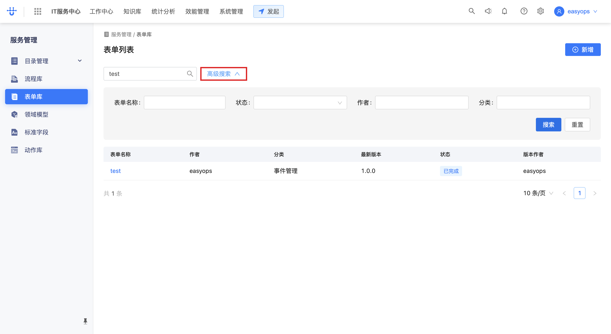

### 步骤 3：配置筛选条件
<!-- step_id: 77 -->
在条件区设置筛选项，如「状态」选「已完成」、「作者」输入 `easyops`。
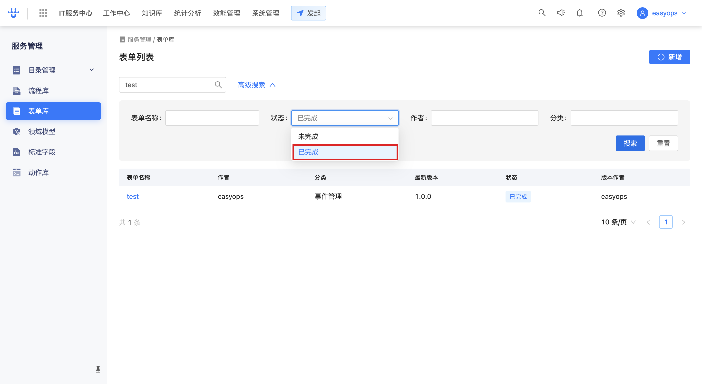

### 步骤 4：点击「搜索」执行查询
<!-- api: GET .../v1/form | tag: 表单列表查询 | step_id: 79 -->
配置完条件后点击「搜索」按钮，列表按条件刷新出结果。
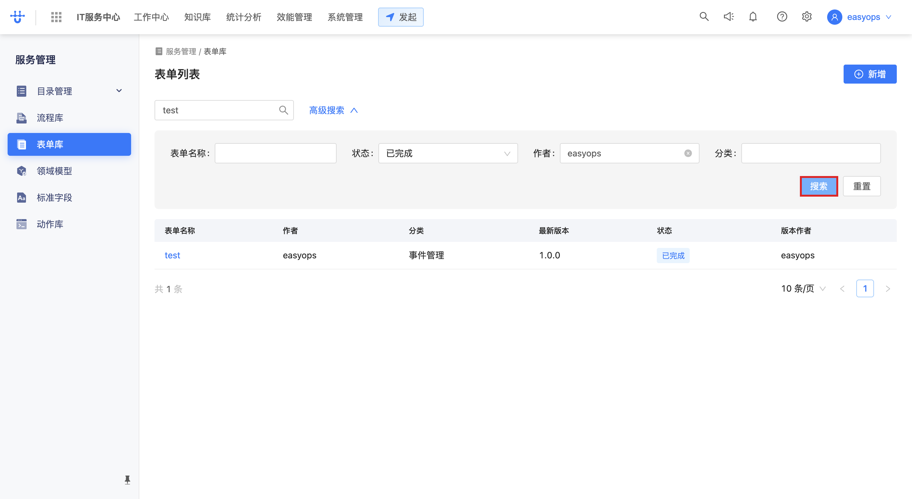
> 🔗 本步调用：`GET /next/api/gateway/logic.flowable_service/api/flowable_service/v1/form?state=done&creator=easyops&...`（详见 openapi.yaml 的「表单列表查询」）。

## 五、编辑表单-新建版本

在列表中点击表单进入版本详情，可基于现有版本新建版本，在设计器中追加字段后保存。

### 步骤 1：在列表点击表单名称进入版本详情
<!-- url: itsc-form-management/form-list/{formId}/{versionId} | api: GET .../v1/form/{id}/version/{verId} | tag: 表单版本详情 | step_id: 86 -->
在表单列表中点击目标表单名称（如 `test`），进入其版本详情页。
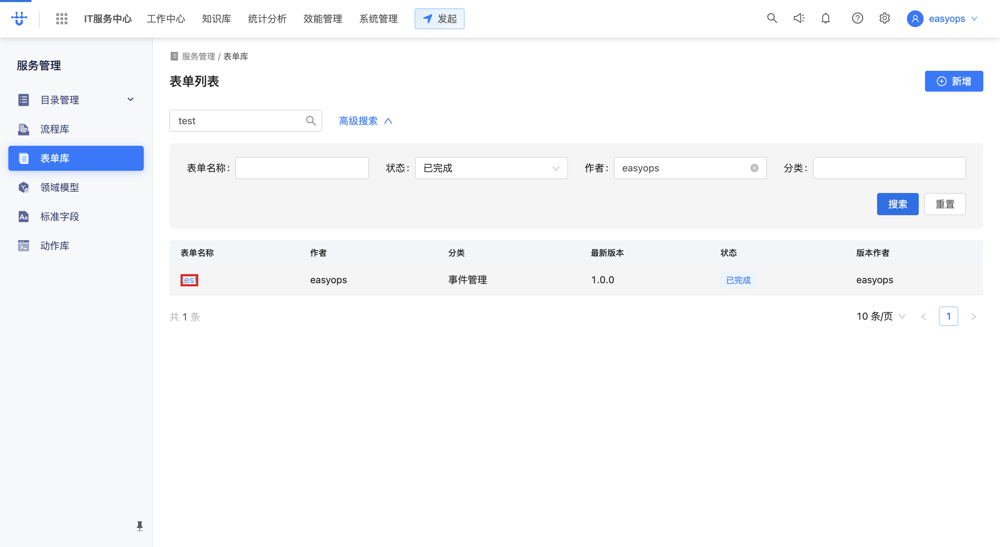
> 🔗 本步调用：`GET /next/api/gateway/logic.flowable_service/api/flowable_service/v1/form/{formId}/version/{versionId}`（详见 openapi.yaml 的「表单版本详情」），返回 formSchema/domainModel。

### 步骤 2：点击「新建版本」进入版本编辑
<!-- url: itsc-form-management/{formId}/{versionId}/versionCreate | api: GET .../v2/form/{id}/version/{verId} | tag: 表单版本详情 | step_id: 87 -->
在版本详情页点击「新建版本」（或编辑入口），进入基于当前版本的新版本编辑页，自动拉取 v2 详情用于编辑。
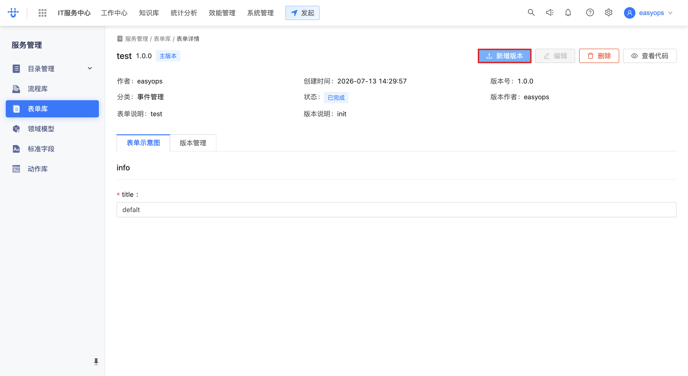
> 🔗 本步调用：`GET /next/api/gateway/logic.flowable_service/api/flowable_service/v2/form/{formId}/version/{versionId}`（详见 openapi.yaml 的「表单版本详情」）。

### 步骤 3：切换到「表单设计」并添加「下拉选择」字段
<!-- step_id: 90 -->
点击「② 表单设计」Tab，在控件区「标准字段」下点击「下拉选择」，向画布添加一个下拉选择字段。
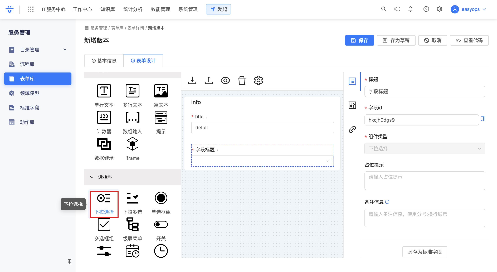

### 步骤 4：配置下拉字段标题与选项
<!-- step_id: 91 -->
在右侧属性面板：标题填 `type`；点击「添加选项」依次添加选项（label/value，如选项 1、选项 2）。
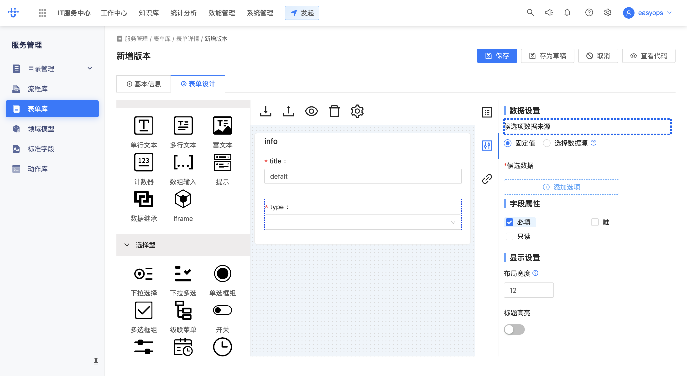
> 💡 提示：步骤 93-103 为添加选项与填写 label/value 的过程，共添加 2 个选项（1、2）。

### 步骤 5：预览、关闭属性面板
<!-- step_id: 104 -->
配置完成后点「eye」预览，点「Close」收起属性面板。
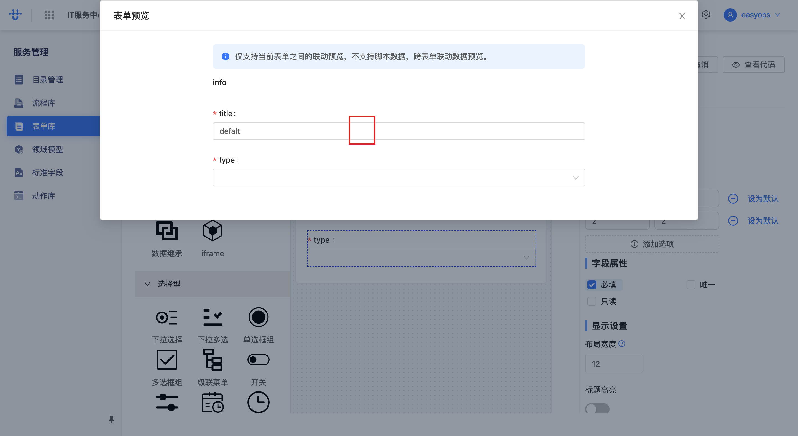

### 步骤 6：点击「保存」并「确定」提交新版本
<!-- api: PUT .../v2/form/{id}/version/{verId} | tag: 表单更新 | step_id: 106 -->
点击页面底部「保存」提交新版本（versionName 升至 1.0.1），弹出确认框点「确定」。
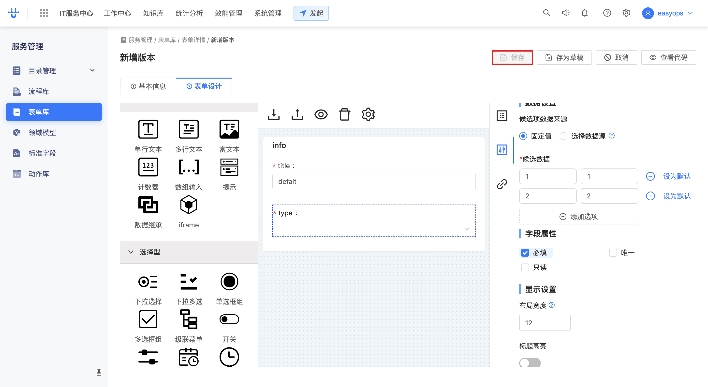
> 🔗 本步调用：`PUT /next/api/gateway/logic.flowable_service/api/flowable_service/v2/form/{formId}/version/{versionId}`（详见 openapi.yaml 的「表单更新」），body 含新 versionName 与 formDefinition。保存后 `POST .../v1/form/{formId}/version/{newVerId}` 设为主版本，并 `GET .../version` 刷新版本列表。

## 六、删除表单版本

对不再需要的表单版本执行删除，需输入版本号解锁删除按钮二次确认。

### 步骤 1：点击「删除」
<!-- step_id: 108 -->
在表单版本详情/列表页，点击目标版本的「删除」按钮。
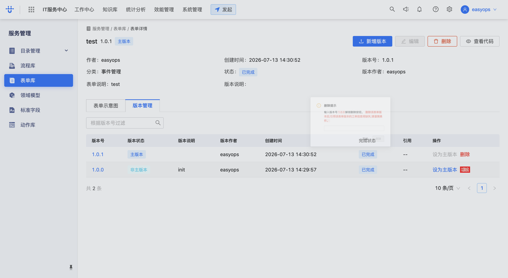

### 步骤 2：选择要删除的版本
<!-- step_id: 109 -->
在弹出的删除框中点击目标版本号（如 `1.0.0`）。
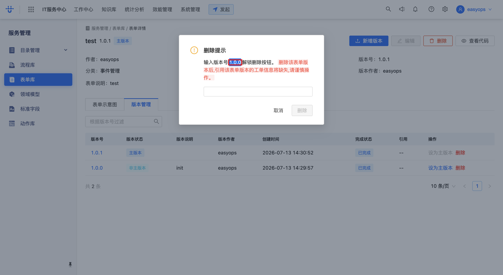

### 步骤 3：输入版本号解锁删除按钮
<!-- api: DELETE .../v1/form/{id}/version/{verId} | tag: 表单删除 | step_id: 110 -->
按提示输入版本号（如 `1.0.0`）以解锁删除按钮。
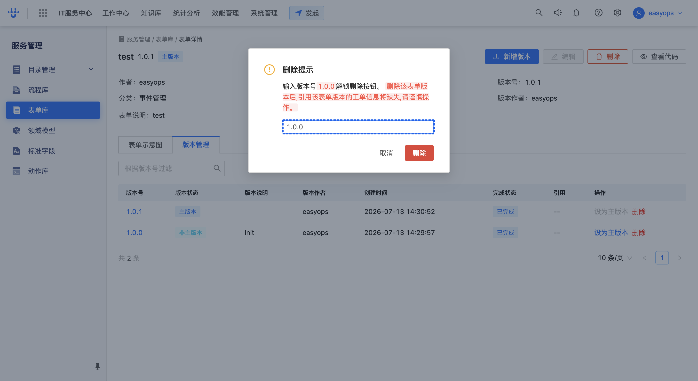
> 🔗 本步调用：`DELETE /next/api/gateway/logic.flowable_service/api/flowable_service/v1/form/{formId}/version/{versionId}`（详见 openapi.yaml 的「表单删除」）。录制中此处先删除了 1.0.0 版本。

### 步骤 4：点击「删除」确认
<!-- step_id: 111 -->
输入正确版本号后，「删除」按钮解锁，点击它执行删除。
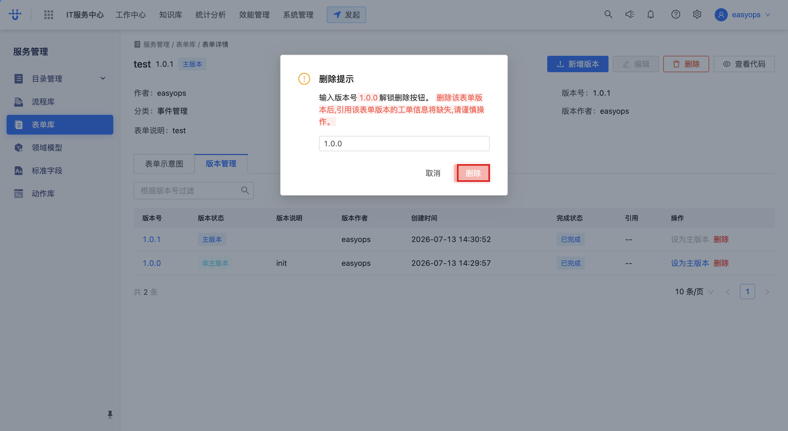

### 步骤 5：删除提示确认（影响工单渲染）
<!-- step_id: 113 -->
弹出「输入版本号 1.0.1 解锁删除按钮，删除会影响已有工单的前端渲染」提示，确认风险后继续。
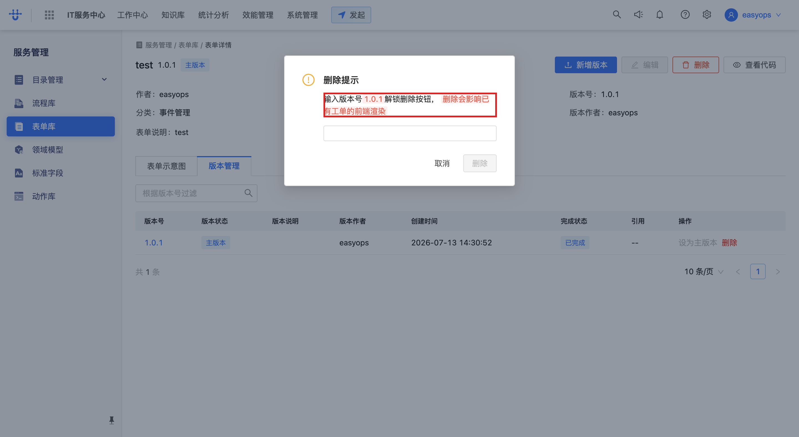
> ⚠️ 提示：删除表单版本会影响已使用该版本渲染的工单，操作前务必确认。步骤 115 输入 `1.0.1` 解锁，步骤 116 点击「删除」确认删除 1.0.1 版本（`DELETE .../version/{verId}`）。

## 附：本流程接口速查

| 接口 | 方法 | 路径 | 说明 | 触发步骤 |
| --- | --- | --- | --- | --- |
| 表单列表查询 | GET | `/next/api/gateway/logic.flowable_service/api/flowable_service/v1/form` | 按关键词/状态/作者/分类查询表单列表 | 步骤一·2、四·4 |
| 表单分类 | GET | `/next/api/gateway/logic.flowable_service/api/flowable_service/v1/form_schema_category` | 拉取表单分类列表（事件管理等） | 步骤一·2 |
| 表单数据源 | GET | `/next/api/gateway/logic.flowable_service/api/v1/flowable_service/form_data_source` | 拉取表单数据源 | 步骤一·2 |
| 表单创建 | POST | `/next/api/gateway/logic.flowable_service/api/flowable_service/v2/form` | 新建表单（含初始版本 + formDefinition） | 步骤三·6 |
| 表单版本详情 | GET | `/next/api/gateway/logic.flowable_service/api/flowable_service/v1/form/{formId}/version/{versionId}` | 查询表单版本详情（formSchema/domainModel） | 步骤五·1 |
| 表单版本详情(v2) | GET | `/next/api/gateway/logic.flowable_service/api/flowable_service/v2/form/{formId}/version/{versionId}` | 编辑用表单版本详情（含 standardFields） | 步骤五·2 |
| 表单更新 | PUT | `/next/api/gateway/logic.flowable_service/api/flowable_service/v2/form/{formId}/version/{versionId}` | 更新表单（新建版本/改字段），body 含 formDefinition | 步骤五·6 |
| 表单版本列表 | GET | `/next/api/gateway/logic.flowable_service/api/flowable_service/v1/form/{formId}/version` | 查询表单的全部版本列表 | 步骤五·6 |
| 设为主版本 | POST | `/next/api/gateway/logic.flowable_service/api/flowable_service/v1/form/{formId}/version/{versionId}` | 将指定版本设为主版本 | 步骤五·6 |
| 表单删除 | DELETE | `/next/api/gateway/logic.flowable_service/api/flowable_service/v1/form/{formId}/version/{versionId}` | 删除表单版本 | 步骤六·3、六·5 |
| 用户对象引用 | GET | `/next/api/gateway/cmdb.cmdb_object.GetObjectRef/object_ref` | 获取 USER/USER_GROUP 对象引用（字段配置用） | 步骤一·2 |
