# ITSM 系统管理 · 领域模型管理 - 操作指引

> 适用场景：在 ITSM 工作台的「系统管理 → 领域模型管理」中，完成领域模型的**搜索、新建（含关联标准字段）、编辑、删除**全流程。领域模型是关联标准字段的业务模型定义，用于在工单表单中复用字段组合。
> 配套接口：见同目录 [`ITSM-领域模型管理-openapi.yaml`](./ITSM-领域模型管理-openapi.yaml)。
>
> 截图标注图例：🔴红框=点击 / 🔵蓝虚线框=输入 / 🟠橙框+▾=下拉 / 🟣紫圈=单复选 / 🟢绿粗框=提交。

## 目录
- [一、进入领域模型管理](#一进入领域模型管理)
- [二、搜索领域模型](#二搜索领域模型)
- [三、新建领域模型](#三新建领域模型)
- [四、编辑领域模型](#四编辑领域模型)
- [五、删除领域模型](#五删除领域模型)
- [附：本流程接口速查](#附本流程接口速查)

<!-- deep-links: 本流程关键页面直达（SPA 路径，去掉 host 前缀，参数化）
  工作台:            itsc-workbench/workbench
  领域模型列表:       itsc-advanced-settings/domain-model
  带关键词搜索:       itsc-advanced-settings/domain-model?q={关键词}
  高级搜索:           itsc-advanced-settings/domain-model?q={关键词}&visible=true&creator={创建人}
  新建领域模型页:     itsc-advanced-settings/domain-model/domain-model-create
  编辑领域模型页:     itsc-advanced-settings/domain-model/{modelId}/editting
-->

---

## 一、进入领域模型管理

从工作台导航到领域模型管理列表页。

### 步骤 1：点击顶部「系统管理」
<!-- url: itsc-workbench/workbench | step_id: 1 -->
在工作台顶部导航栏点击「系统管理」，展开系统管理菜单。
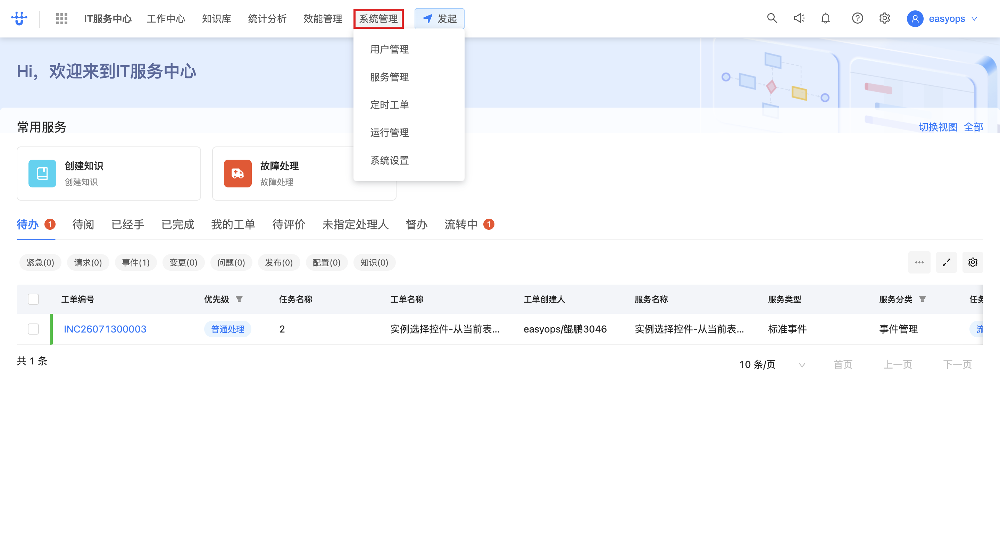

### 步骤 2：点击进入系统管理设置页
<!-- url: itsc-workbench/workbench | step_id: 2 -->
在弹出的系统管理菜单中，点击进入系统管理设置页面。
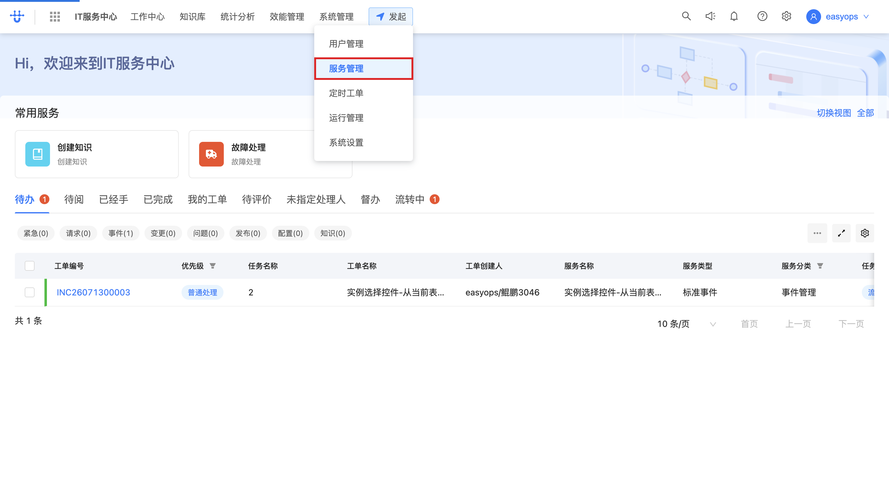

### 步骤 3：在左侧菜单点击「领域模型」
<!-- url: itsc-service-management/setting-list → itsc-advanced-settings/domain-model | step_id: 3 -->
在系统管理左侧导航中，找到并点击「领域模型」菜单项（蓝色高亮），进入领域模型列表页。
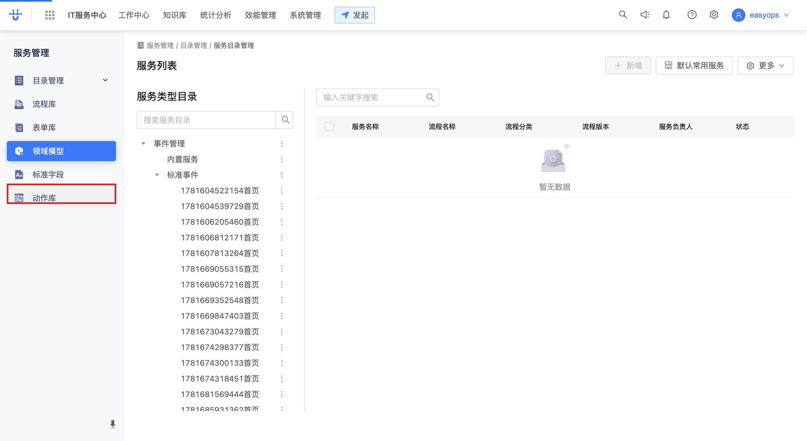

---

## 二、搜索领域模型

通过关键词搜索定位模型，或用高级搜索按创建人等条件筛选。

### 步骤 1：在搜索框输入关键词
<!-- url: itsc-advanced-settings/domain-model | step_id: 4 -->
在列表上方搜索框中输入关键词（如 `test`），按唯一标识、模型名称、说明、创建人模糊匹配。
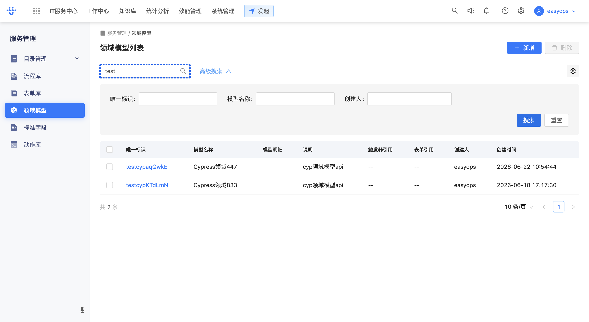

### 步骤 2：点击搜索
<!-- url: itsc-advanced-settings/domain-model | step_id: 5 -->
输入关键词后，点击搜索图标（🔍）执行搜索。
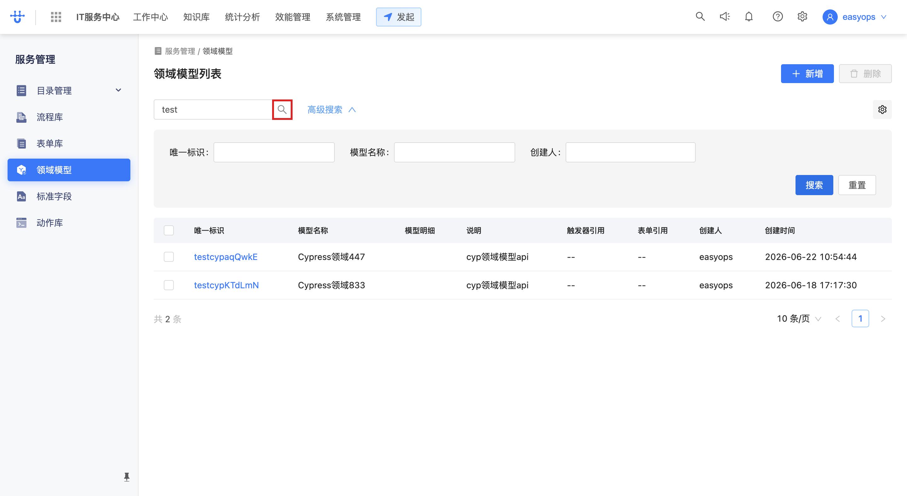

### 步骤 3：点击「高级搜索」展开高级筛选面板
<!-- url: itsc-advanced-settings/domain-model?q={关键词} | step_id: 6 -->
点击搜索栏右侧的「高级搜索」链接，展开高级搜索表单，可按唯一标识、模型名称、创建人等条件组合筛选。
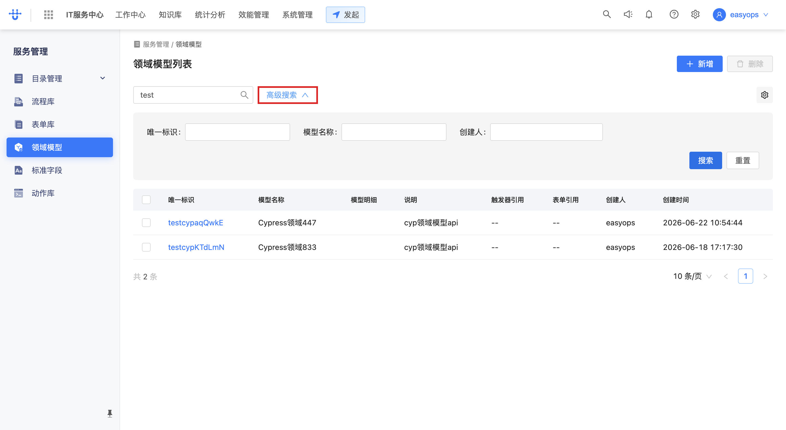

### 步骤 4：在高级搜索中输入筛选条件
<!-- url: itsc-advanced-settings/domain-model?q={关键词}&visible=true | step_id: 7 -->
在高级搜索表单的「创建人」等字段中输入筛选值（如 `easyops`）。
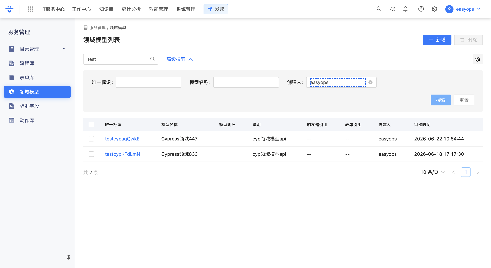

### 步骤 5：执行高级搜索
<!-- url: itsc-advanced-settings/domain-model?q={关键词}&visible=true | step_id: 8 -->
点击「搜索」按钮执行高级搜索，列表展示匹配结果。
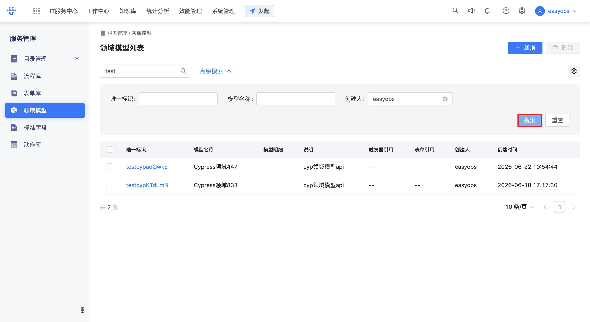

---

## 三、新建领域模型

新建一个领域模型并关联标准字段，完成后在列表可看到新模型。

### 步骤 1：点击列表页右上角的「新建」按钮（⚠️ 未单独截图）
<!-- url: itsc-advanced-settings/domain-model/domain-model-create | step_id: 15~16 之间 -->
在领域模型列表页右上角，点击「新建」按钮，进入新建领域模型页面。

### 步骤 2：填写唯一标识
<!-- url: itsc-advanced-settings/domain-model/domain-model-create | step_id: 16 -->
在「唯一标识」输入框中填入模型的 key（如 `handler`），这是模型的英文唯一标识，不可重复。
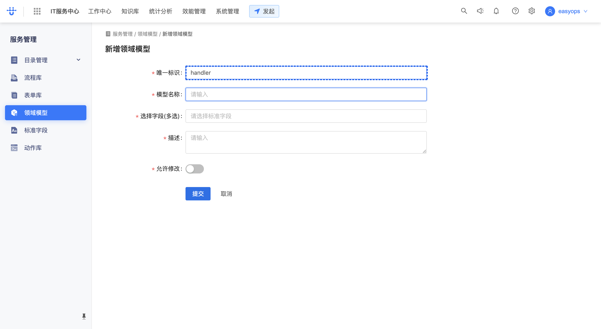

### 步骤 3：填写模型名称
<!-- url: itsc-advanced-settings/domain-model/domain-model-create | step_id: 17 -->
⚠️ 未截图——在「模型名称」输入框中填入模型的中文名称（如 `工单处理信息`）。

### 步骤 4：点击「选择字段」下拉框关联标准字段
<!-- url: itsc-advanced-settings/domain-model/domain-model-create | step_id: 18 -->
点击「选择字段（多选）」下拉框，展开标准字段列表供选择。
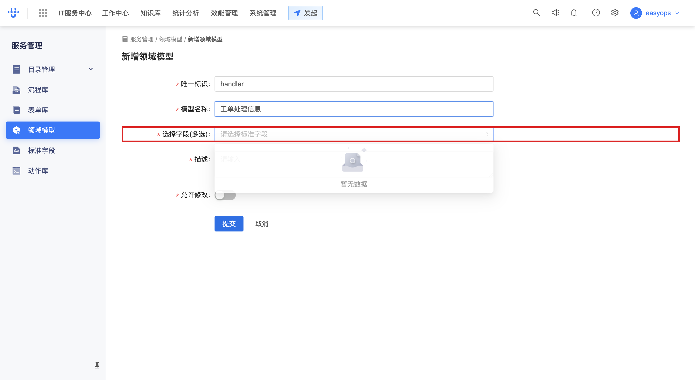

### 步骤 5：在下拉框中输入关键词搜索并选择标准字段
<!-- url: itsc-advanced-settings/domain-model/domain-model-create | step_id: 19~20 -->
在下拉框的输入区域输入关键词（如 `工单处理信息`），搜索并勾选需要关联的标准字段（如「处理人(ITSC_handler)」）。
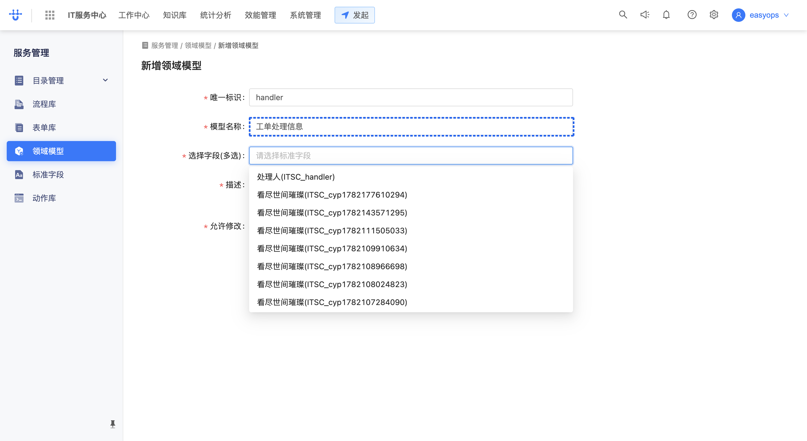

### 步骤 6：确认选中字段并关闭下拉框
<!-- url: itsc-advanced-settings/domain-model/domain-model-create | step_id: 20~21 -->
点击已选中的标准字段确认选择，下拉框关闭，表单展示已选中的字段标签。
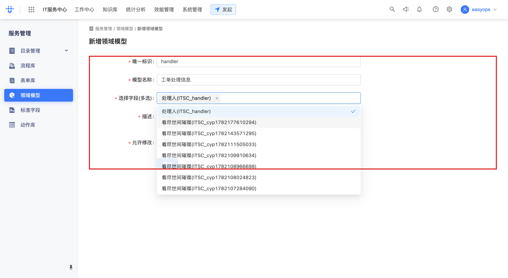

### 步骤 7：填写模型描述
<!-- url: itsc-advanced-settings/domain-model/domain-model-create | step_id: 22~26 -->
⚠️ 未逐字截图——在「描述」输入框中输入模型说明信息（如 `info`）。

### 步骤 8：开启「允许修改」开关
<!-- url: itsc-advanced-settings/domain-model/domain-model-create | step_id: 27 -->
点击「允许修改」旁边的开关，开启后允许后续对模型字段进行编辑。
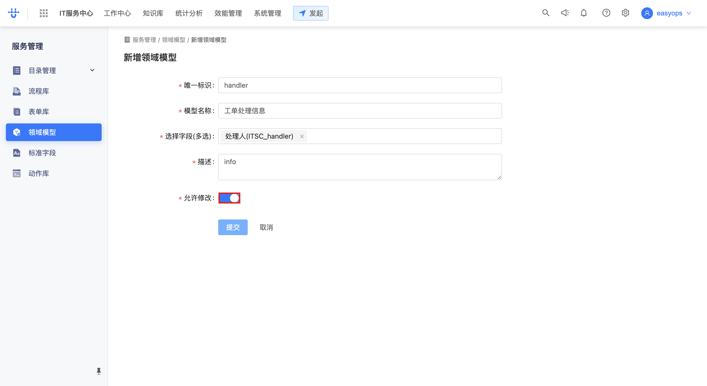

### 步骤 9：确认表单信息
<!-- url: itsc-advanced-settings/domain-model/domain-model-create | step_id: 28 -->
提交前再次确认表单所有字段填写正确。
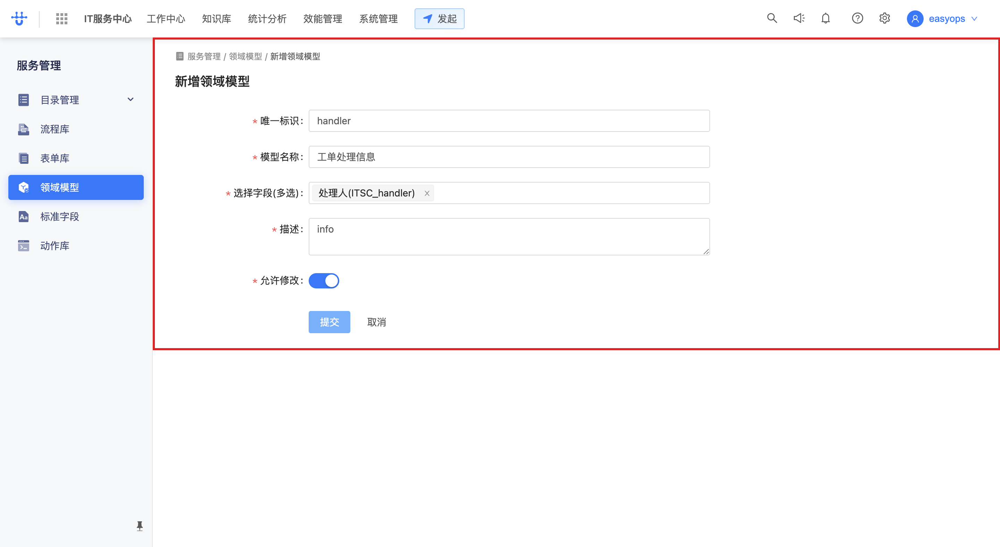

### 步骤 10：点击「提交」
<!-- url: itsc-advanced-settings/domain-model/domain-model-create | api: POST .../domain_model | tag: 领域模型创建 | step_id: 29 -->
确认无误后，点击「提交」按钮完成新建，页面自动跳转回领域模型列表页。
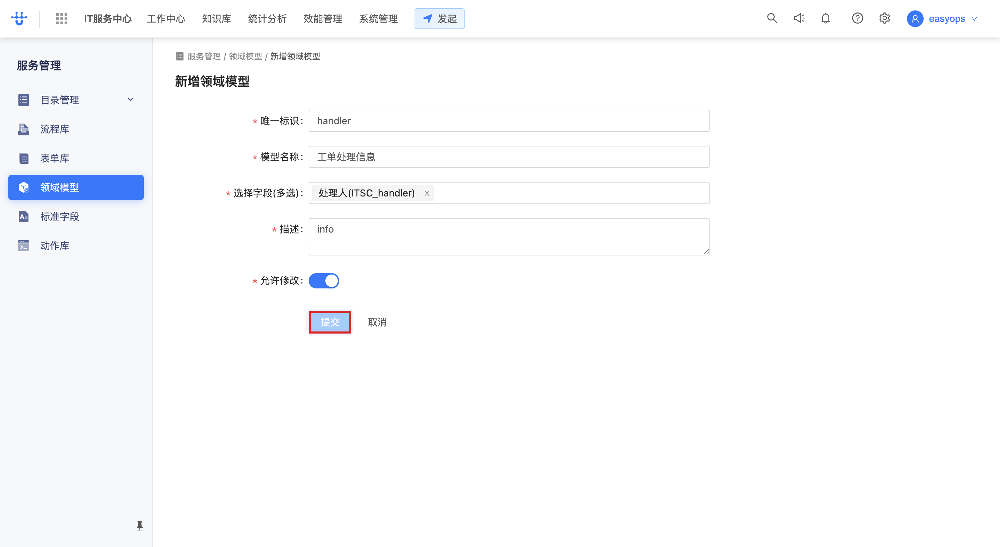
> 🔗 本步调用：`POST /next/api/gateway/logic.flowable_service/api/flowable_service/v1/domain_model`（详见 openapi.yaml 的「领域模型创建」）。

---

## 四、编辑领域模型

对已有模型的描述、关联字段等进行修改。

### 步骤 1：点击列表中目标模型进入详情/编辑
<!-- url: itsc-advanced-settings/domain-model → .../editting | api: GET .../domain_model/{id} | tag: 领域模型详情 | step_id: 30 -->
在领域模型列表中，点击目标模型的名称（如 `handler`），进入模型详情/编辑页面。
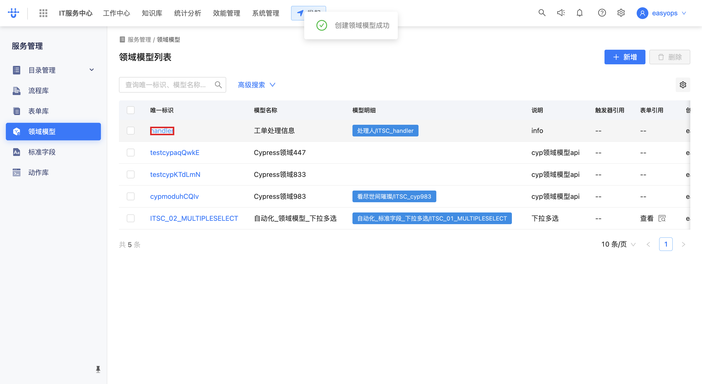
> 🔗 本步调用：`GET /next/api/gateway/logic.flowable_service/api/flowable_service/v1/domain_model/{modelId}`（详见 openapi.yaml 的「领域模型详情」）。

### 步骤 2：点击「选择字段」下拉框修改关联字段
<!-- url: .../editting | step_id: 31 -->
点击「选择字段（多选）」下拉框，展开字段列表可新增或取消关联字段。
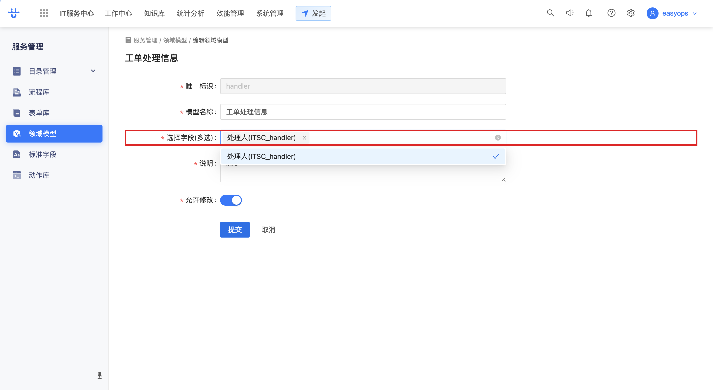

### 步骤 3：选择要新增的标准字段
<!-- url: .../editting | step_id: 32 -->
在下拉列表中点击勾选需要新增关联的标准字段（如「看尽世间璀璨(ITSC_cyp...)」）。
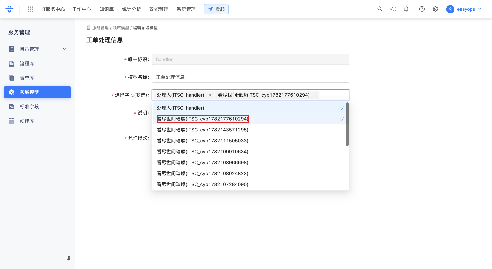

### 步骤 4：确认字段选择
<!-- url: .../editting | step_id: 33 -->
确认字段选择完成，下拉框关闭。
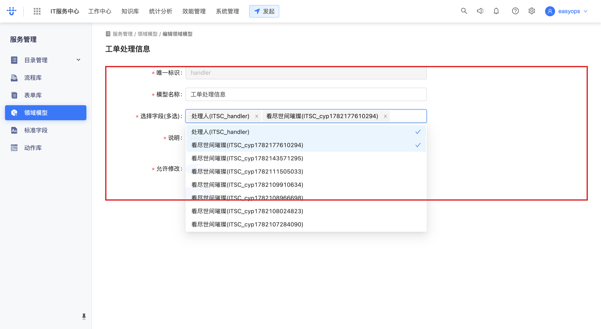

### 步骤 5：修改模型描述
<!-- url: .../editting | step_id: 34~35 -->
⚠️ 未逐字截图——在「描述」字段中修改内容（如将 `info` 改为 `info1`）。
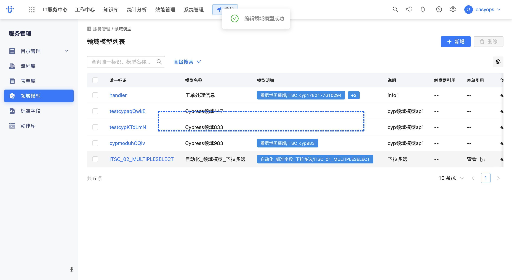

### 步骤 6：点击「提交」保存修改
<!-- url: .../editting | api: PUT .../domain_model/{id} | tag: 领域模型更新 | step_id: 36 -->
确认修改内容后，点击「提交」按钮保存，页面跳转回列表页。
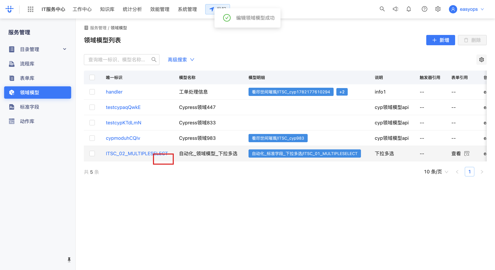
> 🔗 本步调用：`PUT /next/api/gateway/logic.flowable_service/api/flowable_service/v1/domain_model/{modelId}`（详见 openapi.yaml 的「领域模型更新」）。

---

## 五、删除领域模型

从列表中勾选目标模型并执行批量删除。

### 步骤 1：勾选要删除的模型
<!-- url: itsc-advanced-settings/domain-model | step_id: 37~38 -->
在领域模型列表中，勾选目标模型左侧的复选框（可多选）。
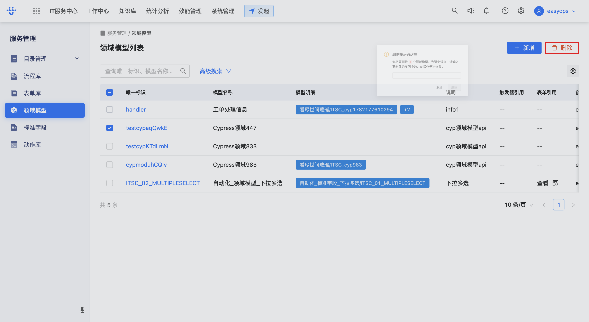
> ⚠️ 注意：勾选操作后列表会显示已选数量（如 `1`）。
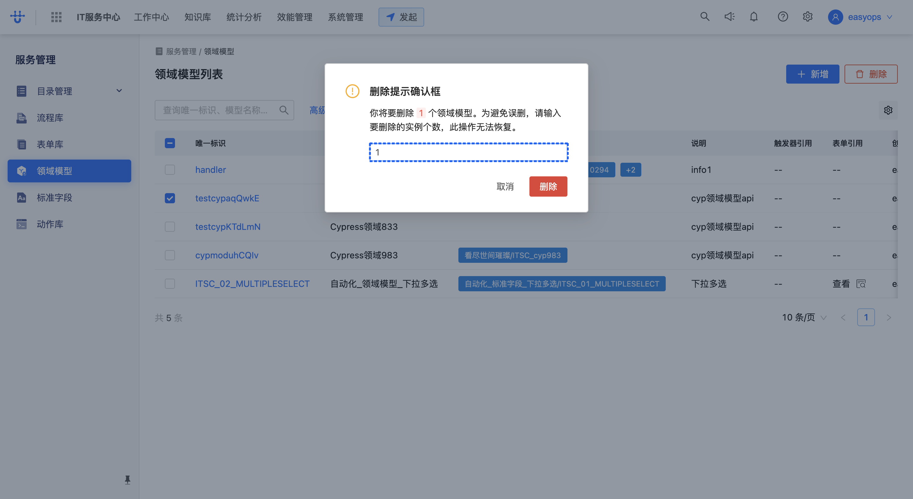

### 步骤 2：点击「删除」按钮
<!-- url: itsc-advanced-settings/domain-model | api: DELETE .../domain_model/_batch/{id} | tag: 领域模型删除 | step_id: 39 -->
确认选择正确后，点击「删除」按钮执行批量删除，模型从列表中移除。
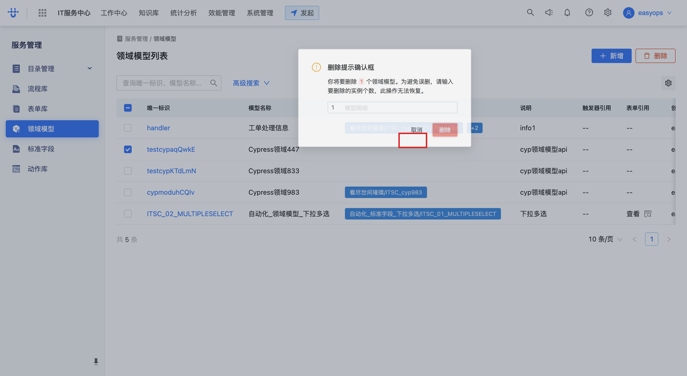
> 🔗 本步调用：`DELETE /next/api/gateway/logic.flowable_service/api/flowable_service/v1/domain_model/_batch/{modelId}`（详见 openapi.yaml 的「领域模型删除」）。

---

## 附：本流程接口速查

| 接口 | Method | Path | 触发场景 |
| --- | --- | --- | --- |
| 领域模型列表查询 | `POST` | `/next/api/gateway/logic.flowable_service/api/flowable_service/v1/domain_model/_search` | 进入列表、搜索、新建/编辑/删除后刷新 |
| 领域模型创建 | `POST` | `/next/api/gateway/logic.flowable_service/api/flowable_service/v1/domain_model` | 新建模型提交 |
| 领域模型详情 | `GET` | `/next/api/gateway/logic.flowable_service/api/flowable_service/v1/domain_model/{modelId}` | 点击模型进入详情/编辑页 |
| 领域模型更新 | `PUT` | `/next/api/gateway/logic.flowable_service/api/flowable_service/v1/domain_model/{modelId}` | 编辑模型提交 |
| 领域模型删除 | `DELETE` | `/next/api/gateway/logic.flowable_service/api/flowable_service/v1/domain_model/_batch/{modelId}` | 勾选后批量删除 |
| 标准字段查询 | `POST` | `/next/api/gateway/logic.flowable_service/api/flowable_service/v1/standard_field/_search` | 新建/编辑时下拉选择标准字段 |
