# Markdown 全语法测试文档

> 本文档用于测试 Markdown → Word / PDF 的转换效果。覆盖：标题层级、文本格式、引用、列表、代码块、表格、链接图片、分隔线、转义、脚注、数学公式，以及 **15 种 Mermaid 图表**。转换后请逐节对照，检查样式、中文、代码高亮、表格、图表是否正确渲染。

**测试日期**：2026-08-05　　**作者**：doc-converter 自动生成　　**版本**：v1.0

---

## 目录

1. [标题层级](#1-标题层级)
2. [文本格式](#2-文本格式)
3. [段落与换行](#3-段落与换行)
4. [引用块](#4-引用块)
5. [列表](#5-列表)
6. [代码块](#6-代码块)
7. [表格](#7-表格)
8. [链接与图片](#8-链接与图片)
9. [分隔线与转义](#9-分隔线与转义)
10. [脚注](#10-脚注)
11. [数学公式](#11-数学公式)
12. [Mermaid 图表合集](#12-mermaid-图表合集)

---

## 1. 标题层级

测试 6 级标题的字号层级与目录生成。

# 一级标题（H1）
## 二级标题（H2）
### 三级标题（H3）
#### 四级标题（H4）
##### 五级标题（H5）
###### 六级标题（H6）

---

## 2. 文本格式

测试各类行内样式。

- **粗体文本**　__另一种粗体__
- *斜体文本*　_另一种斜体_
- ***粗斜体混合***
- ~~删除线文本~~
- `行内代码`
- **粗体里嵌 *斜体* 和 `代码`**
- 上标：H~2~O　（若支持）　　下标：X^2^　（若支持）
- Emoji 表情：🎉 🚀 ✅ ❌ 📄 🔧 💡 ⚠️
- 高亮（部分方言）：==高亮文本==

这是一段**混合**样式的正文，里面有 *各种* 强调、~~删除~~、`code`，以及一个混合嵌套的 **粗 *斜* 体** 用例。

---

## 3. 段落与换行

第一段：这是普通段落。Markdown 中段落之间需要用空行分隔。本段测试中文长文本的自动换行与对齐效果，确保在 Word/PDF 中正常折行、无溢出、中英文混排间距合理。The quick brown fox jumps over the lazy dog. 1234567890.

第二段：换行测试。  
上面这行用了两个空格 + 回车的软换行（`<br>`），转换后应保持换行而非合并成一段。

> 段落间用空行隔开。

---

## 4. 引用块

测试单层与多层嵌套引用。

> 这是一级引用块。
>
> 引用块内部也可以有 **粗体**、`代码`、[链接](https://example.com)。

> 外层引用开始
>
> > 二层嵌套引用
> >
> > > 三层嵌套引用
>
> 回到外层。

> 引用里嵌列表：
>
> 1. 列表项一
> 2. 列表项二
>
> 还有代码：
>
> ```
> echo "hello"
> ```

---

## 5. 列表

### 5.1 无序列表

- 项目一
- 项目二
  - 二级缩进项 A
    - 三级缩进项 a
  - 二级缩进项 B
- 项目三
  - 子项里有 **粗体** 和 `代码`

### 5.2 有序列表

1. 第一步
2. 第二步
   1. 子步骤 2.1
   2. 子步骤 2.2
3. 第三步
4. 第四步

### 5.3 任务列表

- [x] 已完成的任务
- [x] 另一个已完成
- [ ] 未完成的任务
- [ ] 带嵌套的未完成
  - [x] 嵌套已完成
  - [ ] 嵌套未完成

### 5.4 定义列表风格（部分方言）

术语
: 该术语的解释说明。

---

## 6. 代码块

测试多语言代码块的语法高亮。

### 6.1 Python

```python
from dataclasses import dataclass
from typing import List


@dataclass
class Greeter:
    name: str

    def greet(self, times: int = 1) -> List[str]:
        """生成多次问候。"""
        return [f"Hello, {self.name}! #{i}" for i in range(times)]


if __name__ == "__main__":
    g = Greeter("世界")
    for line in g.greet(3):
        print(line)
```

### 6.2 JavaScript

```javascript
async function fetchUser(id) {
  const res = await fetch(`/api/users/${id}`);
  if (!res.ok) throw new Error(`HTTP ${res.status}`);
  return res.json();
}

const users = await Promise.all([1, 2, 3].map(fetchUser));
console.log(users);
```

### 6.3 Bash / Shell

```bash
#!/usr/bin/env bash
set -euo pipefail

PROJECT="doc-converter"

# 创建虚拟环境并安装
uv venv
uv sync

# 运行测试
cd "projects/${PROJECT}" && uv run pytest -v
```

### 6.4 SQL

```sql
SELECT
    u.id,
    u.name,
    COUNT(o.id) AS order_count,
    SUM(o.amount) AS total
FROM users u
LEFT JOIN orders o ON o.user_id = u.id
WHERE u.created_at >= '2026-01-01'
GROUP BY u.id, u.name
HAVING SUM(o.amount) > 1000
ORDER BY total DESC
LIMIT 10;
```

### 6.5 JSON

```json
{
  "name": "doc-converter",
  "version": "1.0.0",
  "supports": ["pdf", "docx", "html", "png", "xlsx"],
  "options": {
    "theme": "dark",
    "landscape": false,
    "encoding": "utf-8"
  },
  "mermaid": true
}
```

### 6.6 YAML

```yaml
name: doc-converter
version: 1.0.0
dependencies:
  - markdown
  - pymupdf
jobs:
  build:
    runs-on: ubuntu-latest
    steps:
      - run: uv build
```

### 6.7 HTML

```html
<!DOCTYPE html>
<html lang="zh-CN">
<head>
  <meta charset="UTF-8" />
  <title>示例</title>
</head>
<body>
  <h1 style="color: #c00;">标题</h1>
  <button onclick="alert('点击')">点我</button>
</body>
</html>
```

### 6.8 CSS

```css
.card {
  border-radius: 8px;
  padding: 16px;
  box-shadow: 0 2px 8px rgba(0, 0, 0, 0.1);
  transition: transform 0.2s ease;
}
.card:hover { transform: translateY(-4px); }
```

### 6.9 Go

```go
package main

import "fmt"

func fib(n int) int {
    if n < 2 {
        return n
    }
    return fib(n-1) + fib(n-2)
}

func main() {
    for i := 0; i < 10; i++ {
        fmt.Printf("fib(%d) = %d\n", i, fib(i))
    }
}
```

### 6.10 Java

```java
public class Fibonacci {
    public static int fib(int n) {
        if (n < 2) return n;
        return fib(n - 1) + fib(n - 2);
    }

    public static void main(String[] args) {
        for (int i = 0; i < 10; i++) {
            System.out.printf("fib(%d) = %d%n", i, fib(i));
        }
    }
}
```

### 6.11 C++

```cpp
#include <iostream>
#include <vector>

int main() {
    std::vector<int> v{1, 2, 3, 4, 5};
    int sum = 0;
    for (int x : v) sum += x;
    std::cout << "sum = " << sum << std::endl;
    return 0;
}
```

### 6.12 纯文本 / 无语言标注

```
这是一个没有指定语言的代码块。
保留原样空格    与制表符	对齐。
Special chars: < > & " ' / \ |
```

---

## 7. 表格

### 7.1 普通表格

| 格式 | 扩展名 | 说明 |
|------|--------|------|
| Markdown | .md | 源格式 |
| PDF | .pdf | 适合打印分发 |
| Word | .docx | 可编辑 |
| HTML | .html | 浏览器查看 |
| 图片 | .png/.svg | 嵌入文档 |

### 7.2 列对齐表格

| 左对齐 | 居中对齐 | 右对齐 |
|:-------|:--------:|-------:|
| L1 | C1 | R1 |
| 左 | 中 | 右 |
| Markdown 表格支持冒号语法控制对齐 | 居中文本 | 右侧数值 |

### 7.3 较复杂表格

| 序号 | 名称 | 状态 | 优先级 | 负责人 | 预计工时(h) |
|:----:|------|:----:|:------:|--------|------------:|
| 1 | 需求评审 | ✅ 完成 | 高 | 张三 | 4 |
| 2 | 接口设计 | ✅ 完成 | 高 | 李四 | 8 |
| 3 | 前端开发 | 🔄 进行中 | 中 | 王五 | 32 |
| 4 | 后端开发 | ⏳ 待开始 | 高 | 赵六 | 40 |
| 5 | 联调测试 | ⏳ 待开始 | 高 | 全员 | 16 |

---

## 8. 链接与图片

### 8.1 链接

- 行内链接：[Anthropic 官网](https://www.anthropic.com)
- 带标题的链接：[Claude 文档](https://docs.anthropic.com "鼠标悬停提示")
- 引用式链接：[GitHub][gh]
- 自动链接：<https://github.com>
- 邮箱链接：<mailto@example.com>

[gh]: https://github.com "GitHub 主站"

### 8.2 图片

占位图（测试图片是否正确嵌入 Word/PDF）：


---

## 9. 分隔线与转义

下面是三条分隔线，转换后应渲染为水平线。

---

***

___

### 转义字符测试

下列符号原样显示（不被解释为 Markdown 语法）：

\* 星号　\_ 下划线　\` 反引号　\# 井号　\+ 加号　\- 减号　\. 句点　\! 感叹号
\{ \} \[ \] \( \) \\ \< \> \| 

---

## 10. 脚注

这是一段带脚注的正文[^1]，文中引用了相关资料。这里还有第二个脚注[^note2]。

[^1]: 这是第一个脚注的具体说明内容。
[^note2]: 这是第二个脚注，使用命名标识引用。

---

## 11. 数学公式

> 测试公式是否能渲染（取决于转换器是否启用 LaTeX/数学支持）。

行内公式：质能方程 $E = mc^2$，欧拉公式 $e^{i\pi} + 1 = 0$。

块级公式：

$$
\int_{a}^{b} f(x)\, dx = F(b) - F(a)
$$

矩阵：

$$
A = \begin{bmatrix} 1 & 2 & 3 \\ 4 & 5 & 6 \\ 7 & 8 & 9 \end{bmatrix}
$$

求和与极限：

$$
\sum_{n=1}^{\infty} \frac{1}{n^2} = \frac{\pi^2}{6}, \qquad \lim_{x \to 0} \frac{\sin x}{x} = 1
$$

---

## 12. Mermaid 图表合集

> 以下为 15 种 Mermaid 图表，用于测试图表渲染（PNG/SVG 嵌入）效果。每种一个代码块。

### 12.1 Flowchart 流程图（含子图）

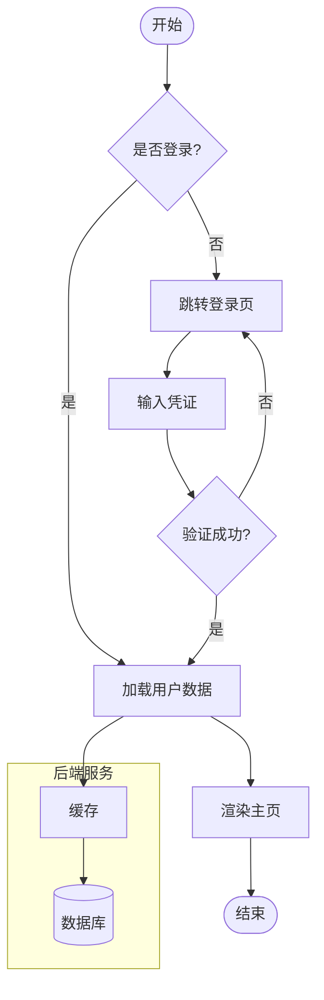

### 12.2 Sequence 时序图

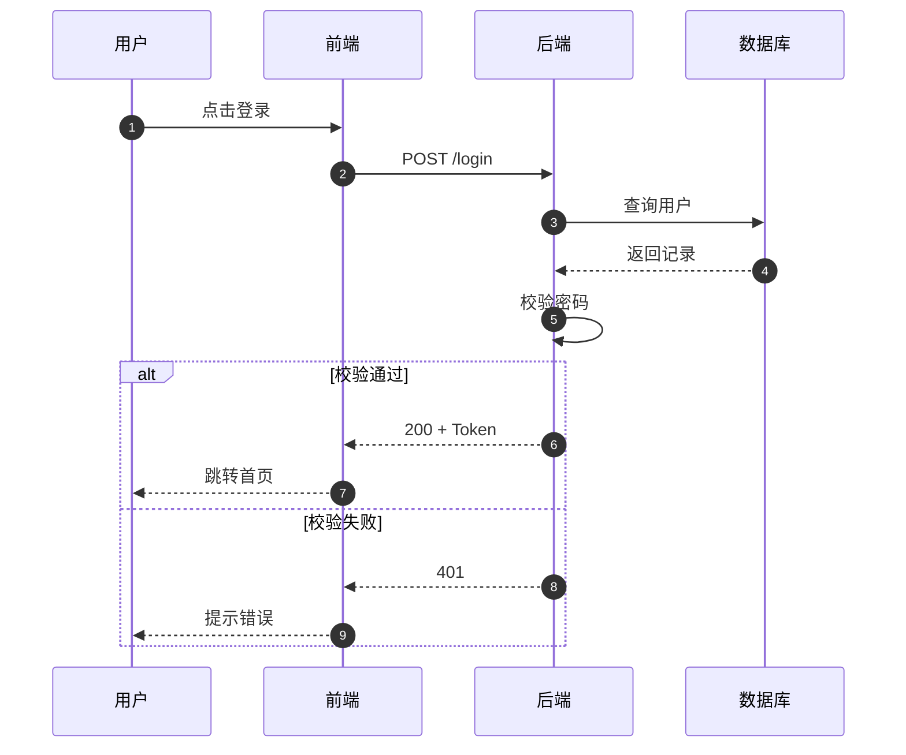

### 12.3 Class 类图

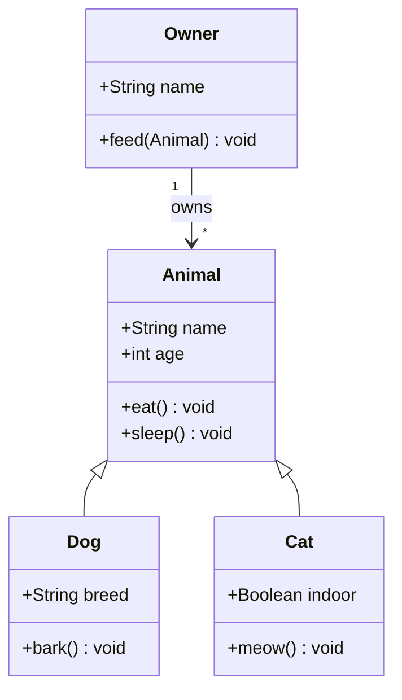

### 12.4 State 状态图

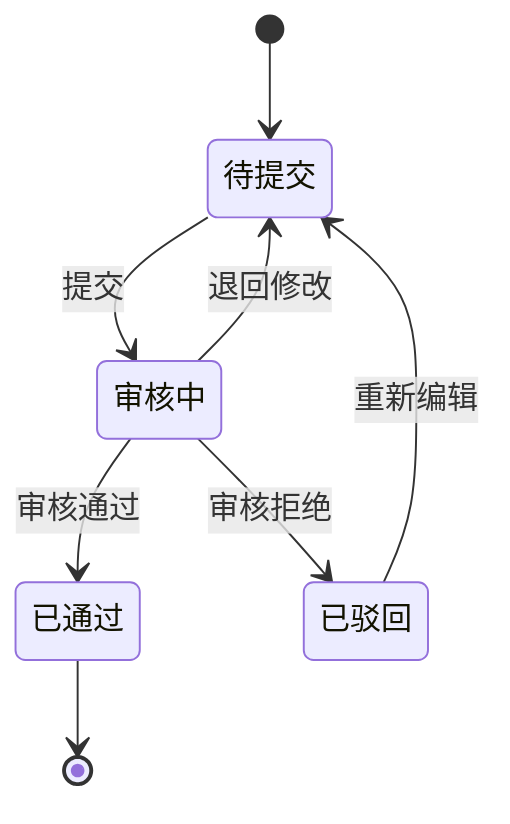

### 12.5 ER 实体关系图

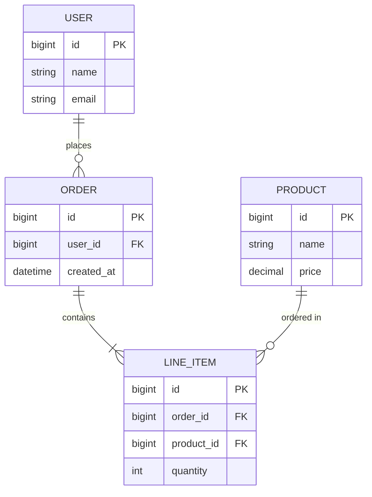

### 12.6 Gantt 甘特图

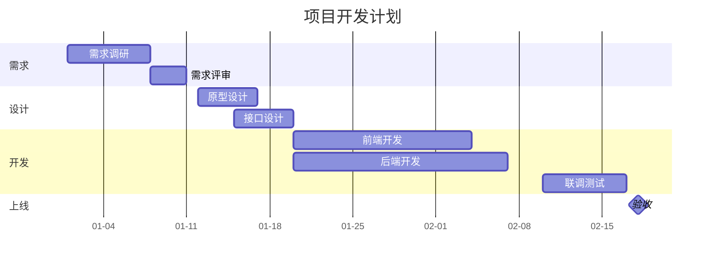

### 12.7 Pie 饼图

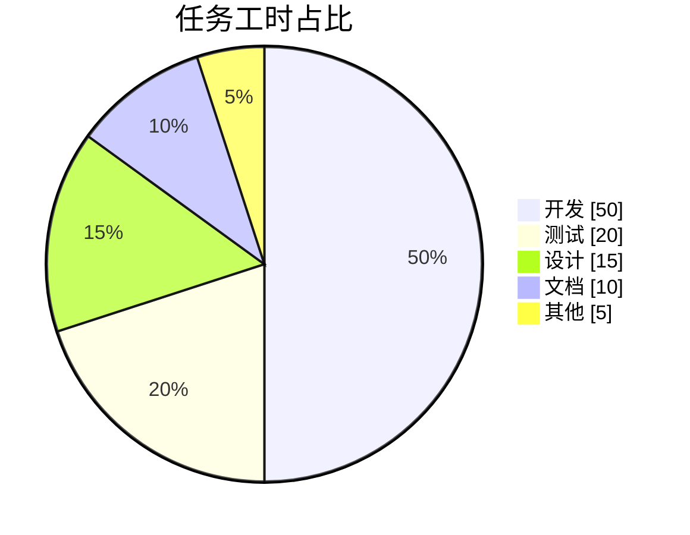

### 12.8 Git Graph 提交图

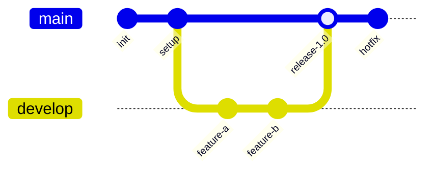

### 12.9 User Journey 用户旅程图

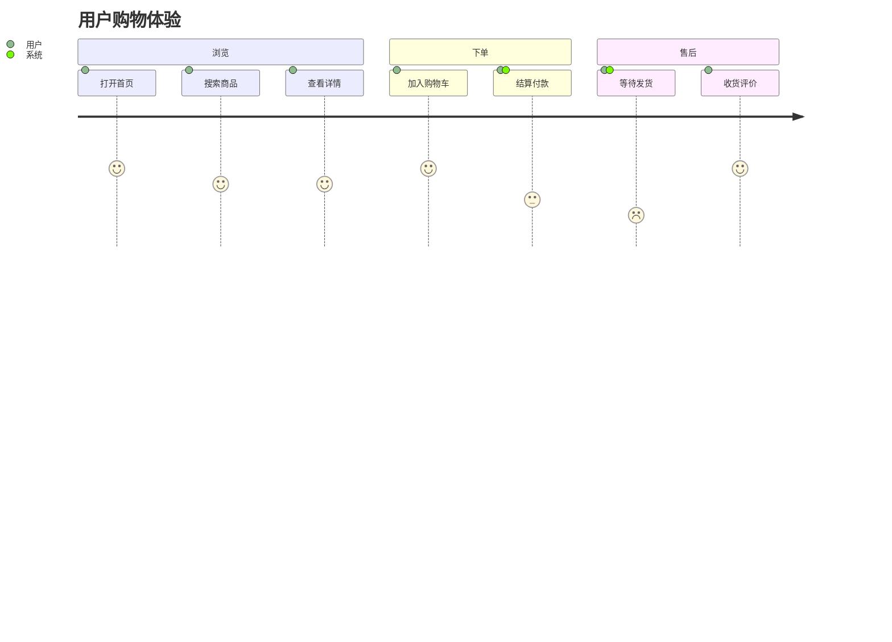

### 12.10 C4 架构图（Context）

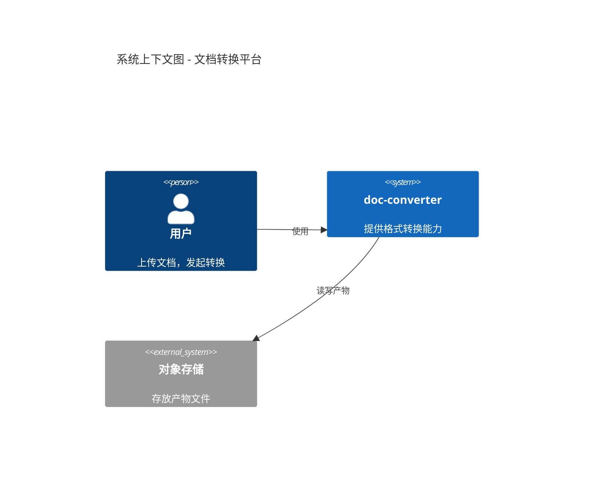

### 12.11 Mindmap 思维导图

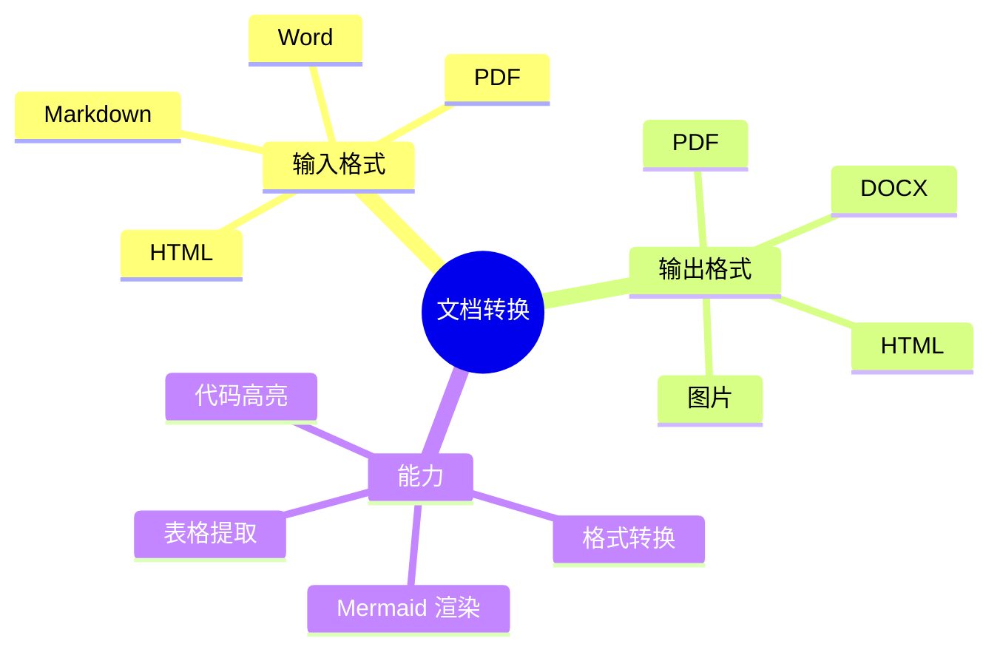

### 12.12 Timeline 时间线

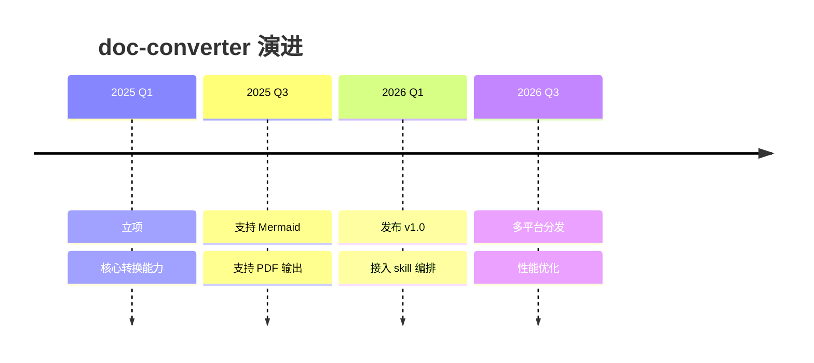

### 12.13 Quadrant 象限图

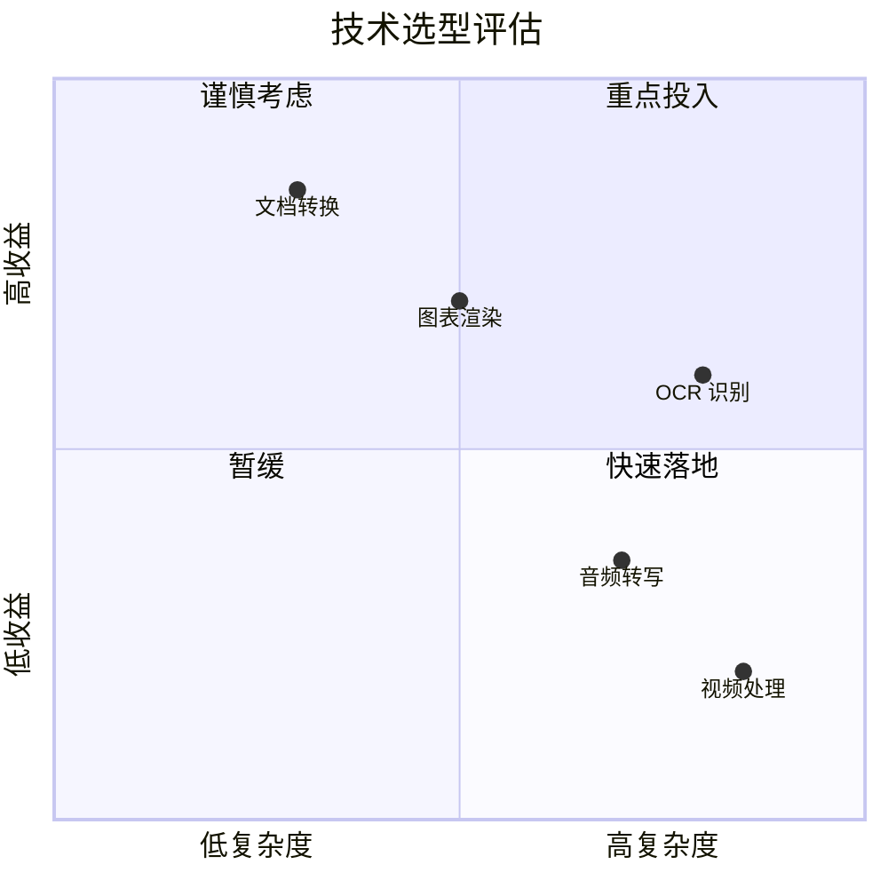

### 12.14 Requirement 需求图

```mermaid
requirementDiagram
    requirement 测试需求 {
        id: 1
        text: 支持中文 Markdown 转 PDF
        risk: 高
        verifymethod: 测试
    }

    element 文档转换器 {
        type: software
        docref: doc-converter
    }

    文档转换器 - satisfies -> 测试需求
```

### 12.15 Block 块图


---

## 附录：检查清单

转换后逐项核对：

- [ ] 6 级标题层级、字号递减
- [ ] 行内格式（粗/斜/删除线/代码）正确
- [ ] 引用块多层缩进
- [ ] 有序/无序/任务列表及嵌套
- [ ] 多语言代码块语法高亮
- [ ] 表格边框、列对齐
- [ ] 图片嵌入、链接可点
- [ ] 分隔线、转义字符
- [ ] 脚注
- [ ] 数学公式（若启用）
- [ ] **15 种 Mermaid 图表全部渲染为图片**
- [ ] 中文无乱码、字体正常

> 文档结束。
